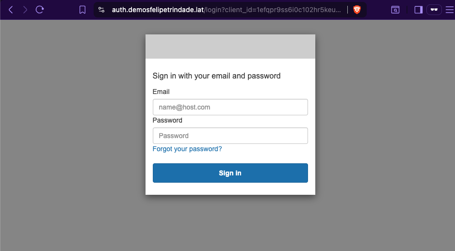
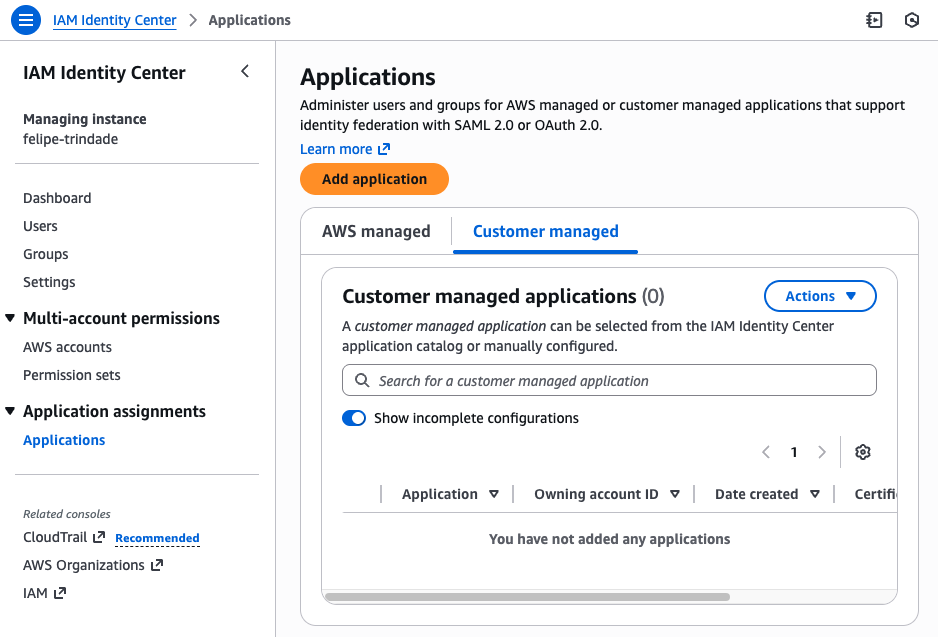
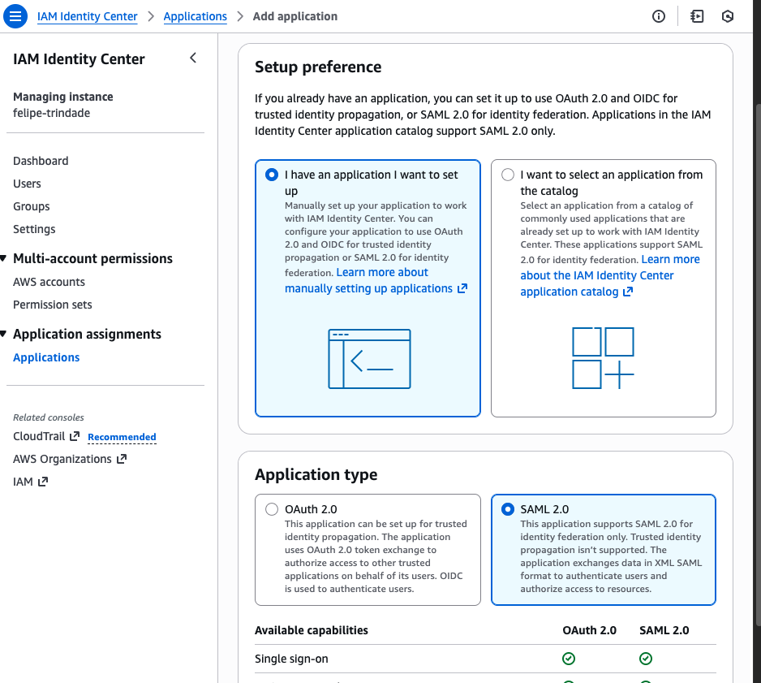
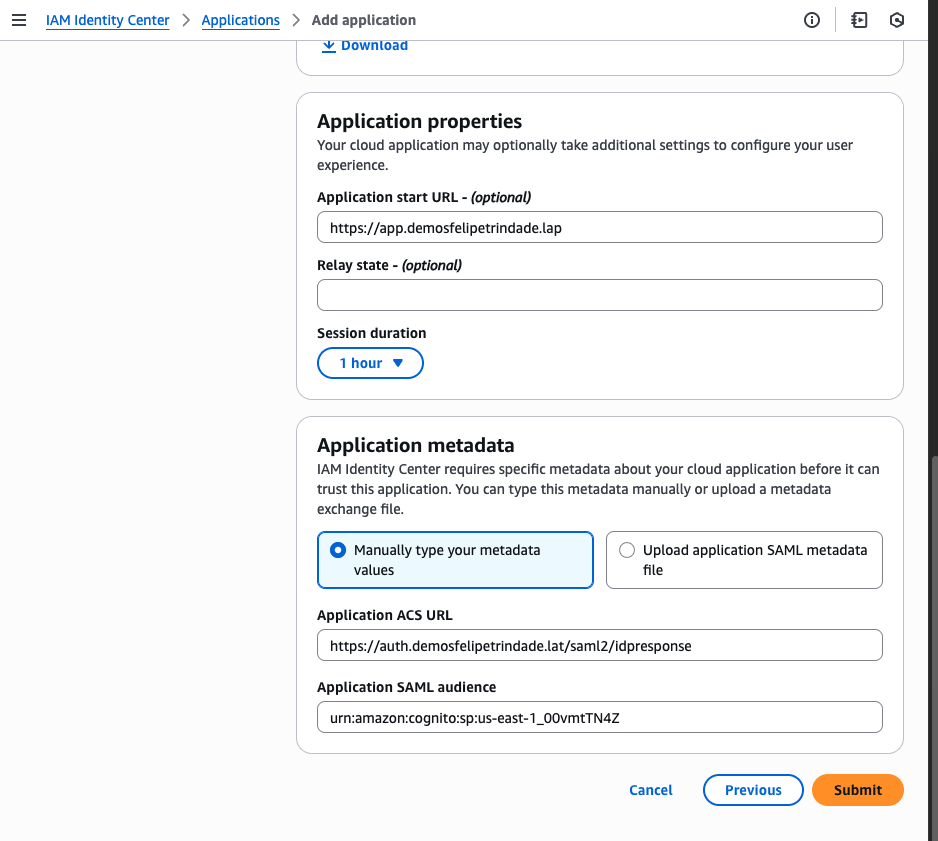
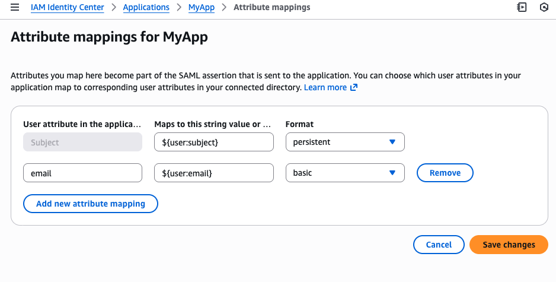
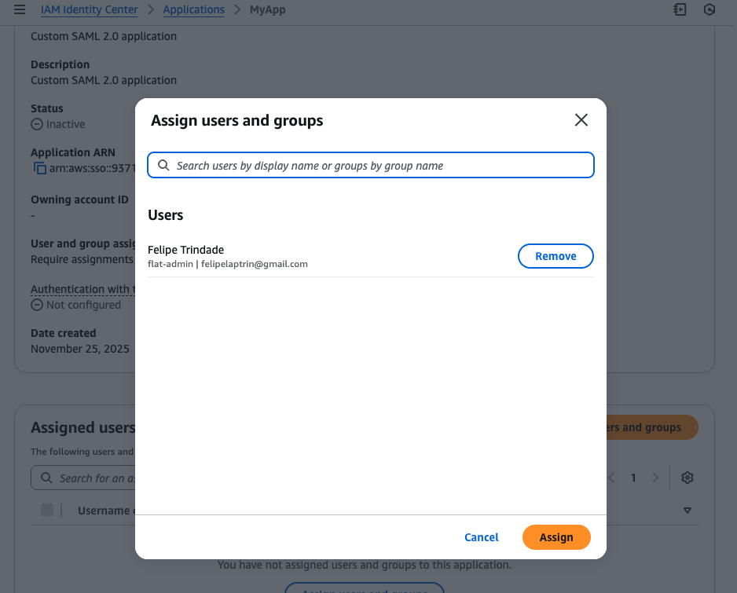
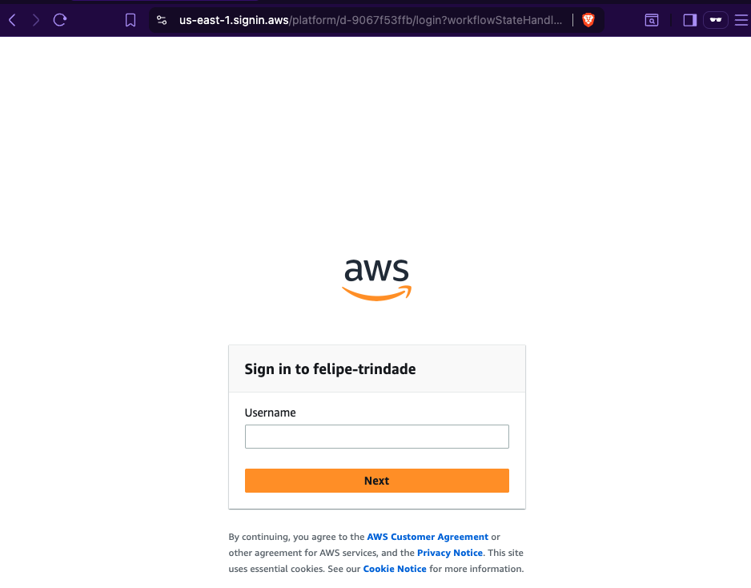
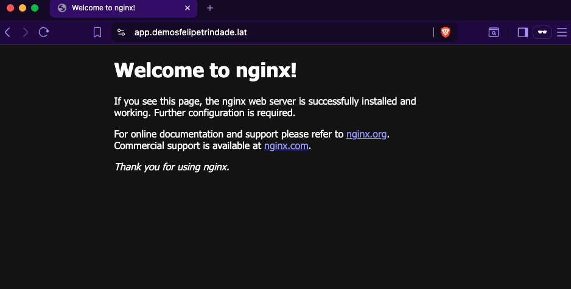

As a DevOps, the security should always be a concern when deploying applications and for that reason you should add a minimum layer of authentication in front of authless applications before deploying publicly (specially if they are internal tools). A good "hyped" example of application that does not implement authentation and forces you to manage it is [MLflow Tracking Server](https://mlflow.org/docs/3.6.0/self-hosting/architecture/tracking-server/) that recommends you to add authentication using a reverse proxy (e.g. NGINX) via proxy authentication headers. In other words, instead of authentication being handled by the application, we should handle it on the infrastructure side.

The AWS-native way of implementing authentication on the infrastructure side is [checking if the user is authenticaticate on the Load Balancer (ALB)](https://docs.aws.amazon.com/elasticloadbalancing/latest/application/listener-authenticate-users.html). A common strategy is to link a Cognito User Pool on the ALB actions that redirects unauthenticated users (i.e. cookie is not present) to the Cognito hosted UI to the user perform authentication. In this scenario, the Cognito act as the IdP (if these terms are scary to you I recommend reading the [SSO blog post](https://www.felipetrindade.com/sso/)) and the ALB act as the OIDC client.

It's important to mention that since we are using Cognito as the IdP we can leverage Cognito capabilities and use the [federated sign-in](https://docs.aws.amazon.com/cognito/latest/developerguide/cognito-user-pools-identity-federation.html) of Cognito to allow users to perform login using external providers, such as Google, Okta or even AWS [IAM Identity Center](https://docs.aws.amazon.com/singlesignon/latest/userguide/what-is.html). The later is specially interesting for us when the application that you would like to deploy should be internal, i.e. used only by the internal/development team. Since, AWS Identity Center is considered the best practice for managing user access in AWS environment and it's a [free](https://aws.amazon.com/iam/identity-center/faqs/) service, it is very handy to use it as an SSO panel for AWS and internal applications.

The main goal of this blog post is to set up a public application (I will use Nginx for simplicity, but it could be any other public application) using AWS Fargate (deployed in an ECS cluster) exposed by an ALB and add authentication via Cognito (either via Cognito User Pool or federated SAML with AWS IAM Identity).


All the code used is available in the [GitHub repository](https://github.com/felipelaptrin/alb-cognito-auth).

## CDK code

For simplicity a single Stack will be used to deploy the entire infrastructure: VPC, ALB, Cognito, Fargate, ECS Cluster... Here we go:

```typescript
// main.ts
import * as cdk from "aws-cdk-lib";
import { WorkloadStack } from "./stack/workload";
import { devWorkloadConfig } from "./config";

const app = new cdk.App();

new WorkloadStack(app, "DevWorkloadStack", { env: devWorkloadConfig.env, config: devWorkloadConfig });
```

Our workload stack is defined as:

```typescript
import * as cdk from "aws-cdk-lib";
import * as ec2 from "aws-cdk-lib/aws-ec2";
import { Construct } from "constructs";
import { WorkloadConfig } from "../config";
import * as ecs from "aws-cdk-lib/aws-ecs";
import * as alb from "aws-cdk-lib/aws-elasticloadbalancingv2";
import * as acm from "aws-cdk-lib/aws-certificatemanager";
import * as route53 from "aws-cdk-lib/aws-route53";
import * as route53Targets from "aws-cdk-lib/aws-route53-targets";
import * as iam from "aws-cdk-lib/aws-iam";
import * as cognito from "aws-cdk-lib/aws-cognito";
import * as albActions from "aws-cdk-lib/aws-elasticloadbalancingv2-actions";

export interface NetworkStackProps extends cdk.StackProps {
  config: WorkloadConfig;
}

interface IUserPool {
  userPool: cognito.UserPool;
  userPoolClient: cognito.UserPoolClient;
  userPoolDomain: cognito.UserPoolDomain;
}

export class WorkloadStack extends cdk.Stack {
  config: WorkloadConfig;
  domain: route53.IPublicHostedZone;
  certificate: acm.Certificate;

  constructor(scope: Construct, id: string, props: NetworkStackProps) {
    super(scope, id, props);

    this.config = props.config;
    this.domain = route53.PublicHostedZone.fromLookup(this, "PublicHostedZone", {
      domainName: props.config.domainName,
    });
    this.certificate = new acm.Certificate(this, "WildcardCertificate", {
      domainName: this.config.domainName,
      subjectAlternativeNames: [`*.${this.config.domainName}`],
      validation: acm.CertificateValidation.fromDns(this.domain),
    });

    const vpc = this.createVpc();

    const cluster = this.createEcsCluster(vpc);
    const { publicAlb, httpsListener } = this.createPublicAlb(vpc);
    const userPool = this.createCognitoAuth();
    this.createAuthlessFargateApp(vpc, cluster, publicAlb, httpsListener, userPool);
  }

  createVpc(): ec2.Vpc {
    const vpc = new ec2.Vpc(this, "Vpc", {
      subnetConfiguration: [
        {
          cidrMask: 24,
          name: "public",
          subnetType: ec2.SubnetType.PUBLIC,
        },
        {
          cidrMask: 24,
          name: "private",
          subnetType: ec2.SubnetType.PRIVATE_WITH_EGRESS,
        },
        {
          cidrMask: 28,
          name: "isolated",
          subnetType: ec2.SubnetType.PRIVATE_ISOLATED,
        },
      ],
      natGateways: 1, // It reduces costs but also reduces HA
      maxAzs: this.config.maxAzs,
    });
    return vpc;
  }

  createEcsCluster(vpc: ec2.Vpc): ecs.Cluster {
    return new ecs.Cluster(this, "EcsCluster", {
      vpc,
      enableFargateCapacityProviders: true,
    });
  }

  createPublicAlb(vpc: ec2.Vpc): {
    publicAlb: alb.ApplicationLoadBalancer;
    httpsListener: alb.ApplicationListener;
  } {
    const publicAlb = new alb.ApplicationLoadBalancer(this, "PublicAlb", {
      vpc,
      vpcSubnets: vpc.selectSubnets({
        subnetType: ec2.SubnetType.PUBLIC,
      }),
      internetFacing: true,
    });
    publicAlb.addRedirect();
    const httpsListener = publicAlb.addListener("HttpsListener", {
      protocol: alb.ApplicationProtocol.HTTPS,
      sslPolicy: alb.SslPolicy.RECOMMENDED_TLS,
      port: 443,
      defaultAction: alb.ListenerAction.fixedResponse(404, {
        messageBody: "No services configured",
      }),
      certificates: [this.certificate],
    });

    return {
      publicAlb,
      httpsListener,
    };
  }

  createCognitoAuth(): IUserPool {
    const COGNITO_DOMAIN = `auth.${this.config.domainName}`;

    // Reference: https://repost.aws/knowledge-center/cognito-custom-domain-errors
    const dummyARecordParentDomain = new route53.ARecord(this, "CognitoAuthDummyARecord", {
      zone: this.domain,
      recordName: "",
      target: route53.RecordTarget.fromIpAddresses("8.8.8.8"),
    });

    const userPool = new cognito.UserPool(this, "CognitoAuthUserPool", {
      selfSignUpEnabled: false,
      passwordPolicy: {
        minLength: 8,
        requireDigits: true,
        requireLowercase: true,
        requireUppercase: true,
        requireSymbols: false,
      },
      signInAliases: {
        email: true,
      },
      removalPolicy: cdk.RemovalPolicy.DESTROY,
    });
    userPool.node.addDependency(dummyARecordParentDomain);

    const userPoolDomain = new cognito.UserPoolDomain(this, "CognitoAuthUserPoolDomain", {
      userPool,
      customDomain: {
        certificate: this.certificate,
        domainName: COGNITO_DOMAIN,
      },
      managedLoginVersion: cognito.ManagedLoginVersion.CLASSIC_HOSTED_UI,
    });
    userPoolDomain.node.addDependency(dummyARecordParentDomain);

    const samlProviderName = "AuthlessFargateApp";
    let supportedIdentityProviders;
    if (this.config.samlMetadataUrl) {
      supportedIdentityProviders = [cognito.UserPoolClientIdentityProvider.custom(samlProviderName)];
    } else {
      supportedIdentityProviders = [cognito.UserPoolClientIdentityProvider.COGNITO];
    }

    const userPoolClient = new cognito.UserPoolClient(this, "CognitoAuthClient", {
      userPool,
      supportedIdentityProviders,
      oAuth: {
        flows: {
          authorizationCodeGrant: true,
          implicitCodeGrant: true,
        },
        scopes: [cognito.OAuthScope.OPENID],
        callbackUrls: [
          `https://${this.config.appSubdomain}.${this.config.domainName}/oauth2/idpresponse`,
          `https://${this.config.appSubdomain}.${this.config.domainName}`,
        ],
        logoutUrls: [`https://${this.config.appSubdomain}.${this.config.domainName}`],
      },
      generateSecret: true,
    });

    new route53.ARecord(this, "CognitoAuthAliasRecord", {
      zone: this.domain,
      recordName: COGNITO_DOMAIN,
      target: route53.RecordTarget.fromAlias(new route53Targets.UserPoolDomainTarget(userPoolDomain)),
    });

    if (this.config.samlMetadataUrl) {
      new cognito.UserPoolIdentityProviderSaml(this, "SamlProvider", {
        userPool,
        name: samlProviderName,
        metadata: cognito.UserPoolIdentityProviderSamlMetadata.url(this.config.samlMetadataUrl),
        attributeMapping: {
          email: cognito.ProviderAttribute.other("email"),
        },
      });
    }

    return {
      userPool,
      userPoolClient,
      userPoolDomain,
    };
  }

  createAuthlessFargateApp(
    vpc: ec2.Vpc,
    cluster: ecs.Cluster,
    publicAlb: alb.ApplicationLoadBalancer,
    httpsListener: alb.ApplicationListener,
    userPool: IUserPool,
  ) {
    const FULL_APP_HOST = `${this.config.appSubdomain}.${this.config.domainName}`;

    const taskDefinition = new ecs.TaskDefinition(this, "AuthlessAppTaskDefinition", {
      cpu: "512",
      memoryMiB: "1024",
      compatibility: ecs.Compatibility.FARGATE,
    });
    taskDefinition.addContainer("nginx", {
      portMappings: [{ containerPort: 80 }],
      image: ecs.ContainerImage.fromRegistry("nginx:latest"),
      logging: ecs.LogDriver.awsLogs({
        streamPrefix: "nginx",
      }),
    });

    const fargateService = new ecs.FargateService(this, "AuthlessFargateService", {
      cluster,
      taskDefinition: taskDefinition,
      desiredCount: 1,
      assignPublicIp: false,
      vpcSubnets: vpc.selectSubnets({
        subnetType: ec2.SubnetType.PRIVATE_WITH_EGRESS,
      }),
    });
    fargateService.taskDefinition.executionRole?.addManagedPolicy(
      iam.ManagedPolicy.fromAwsManagedPolicyName("service-role/AmazonECSTaskExecutionRolePolicy"),
    );

    const targetGroup = new alb.ApplicationTargetGroup(this, "AppTargetGroup", {
      vpc,
      targetType: alb.TargetType.IP,
      protocol: alb.ApplicationProtocol.HTTP,
      port: 80,
      targets: [fargateService],
      deregistrationDelay: cdk.Duration.seconds(10),
    });

    const action = new albActions.AuthenticateCognitoAction({
      userPool: userPool.userPool,
      userPoolClient: userPool.userPoolClient,
      userPoolDomain: userPool.userPoolDomain,
      next: alb.ListenerAction.forward([targetGroup]),
    });
    httpsListener.addAction("AppRule", {
      priority: 1,
      action,
      conditions: [alb.ListenerCondition.hostHeaders([FULL_APP_HOST])],
    });

    new route53.ARecord(this, "AuthlessAppRecord", {
      target: route53.RecordTarget.fromAlias(new route53Targets.LoadBalancerTarget(publicAlb)),
      zone: this.domain,
      recordName: FULL_APP_HOST,
    });
  }
}
```

And `WorkloadConfig` is defined as:

```typescript
export type WorkloadConfig = {
  env: {
    account: string;
    region: string;
  };
  vpcCidrBlock: string;
  maxAzs: number;
  domainName: string;
  appSubdomain: string;
  samlMetadataUrl?: string;
};
```

And real values, should look like:

```typescript
import { WorkloadConfig } from "./types";

export const config: WorkloadConfig = {
  env: {
    account: "937168356724",
    region: "us-east-1",
  },
  vpcCidrBlock: "10.5.0.0/16",
  maxAzs: 2,
  domainName: "demosfelipetrindade.lat",
  appSubdomain: "app",
  samlMetadataUrl:
    "https://portal.sso.us-east-1.amazonaws.com/saml/metadata/OTM3MTY4MzU2NzI0X2lucy03MjIzMGJjNWY5MDQzYzVj",
};
```

## Hands-on

Ok! Now that you know how the code looks like, let's deploy this! I'd recommend you to clone my [GitHub repository](https://github.com/felipelaptrin/alb-cognito-auth) and follow along.


1) Install dependencies

You can use [mise](https://mise.jdx.dev/) to install all developer dependencies.

```sh
mise install
```

Then, install NodeJS dependencies:

```sh
yarn
```

2) Export AWS credentials to connect to the Shared Assets account in our console

3) Change the config values to fit your use-case

Change the `src/config/config.dev.ts` to fit your use case. The parameter `samlMetadataUrl` is optional, and if not provided, the authentication will be via Cognito User Pool; otherwise, if the parameter is passed, the authentication will be via SAML 2.0 using IAM Identity Center as IdP.

⚠️ The AWS [does not support creating Identity Center applications](https://docs.aws.amazon.com/AWSCloudFormation/latest/TemplateReference/aws-resource-sso-application.html) programatically, meaning that the application should be created manually. I suggest first deploying the application without the `samlMetadataUrl` parameter, then proceeding to add it. This will be explained in the following steps.

4) Go to your application endpoint and check if it's redirecting you to log in via Cognito User Pool.



You can create a user in the user pool and validate that this user can actually log in to the application.

5) Deploy the `DevWorkloadStack`

```sh
yarn cdk deploy DevWorkloadStack
```

After the deployment, go to the `AWS Console` > `CloudFormation` > `DevWorkloadStack` > `Resources` > Copy the Physical ID of the `CognitoAuthUserPool` resource. We are going to use it on step 8.

6) Go to the AWS Identity Center



7) Select Application of type SAML 2.0



8) Configure the SAML 2.0 Application



- The `Application Start URL` should be set to: `https://{appSubdomain}.{domainName}`
- The `Application ACS URL` should be set to: `https://{appSubdomain}.{domainName}/saml2/idpresponse`. The Cognito [documentation](https://docs.aws.amazon.com/cognito/latest/developerguide/saml2-idpresponse-endpoint.html) specificies the `/saml2/idpresponse` path.
- The `Application SAML audience` should be set to: `urn:amazon:cognito:sp:{awsRegion}:{userPoolId}` based on the Cognito [documentation](https://docs.aws.amazon.com/cognito/latest/developerguide/cognito-user-pools-integrating-3rd-party-saml-providers.html).

Make sure to substitute the variable in the brackets with the correct value:
- `{appSubdomain}`: The value used in your `src/config/config.dev.ts` file
- `{domainName}`: The value used in your `src/config/config.dev.ts` file
- `{awsRegion}`: The value used in your `src/config/config.dev.ts` file (env.region).
- `{userPoolId}`: The value you copied on step 4.

Copy the `IAM Identity Center SAML metadata URL` to use in the following step.

9) Edit attribute mapping



Map:
- `Subject` to `${user:subject}` with `persistent` format.
- `email` to `${user:email}` with `basic` format.

10) Deploy the stack with the `samlMetadataUrl`

Add the `samlMetadataUrl` parameter to the `src/config/config.dev.ts` and then deploy the stack again:

```sh
yarn cdk deploy DevWorkloadStack
```

11) Assign the Application to the identity center user



12) Go to your application endpoint and check if it's redirecting you to log in via Identity Center.

⚠️ Even after the deployment is successful, it might take a couple of minutes for Cognito to redirect to Identity Center.



13) Check if the application is accessible after the login




## Cya!
I hope you liked this new blog post! ArgoCD is an amazing tool that allows us to achieve pure GitOps principles and it's extremely used in the DevOps world.

See you around! 👋
