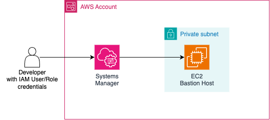
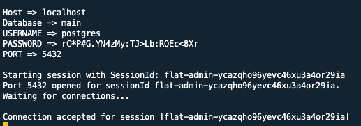
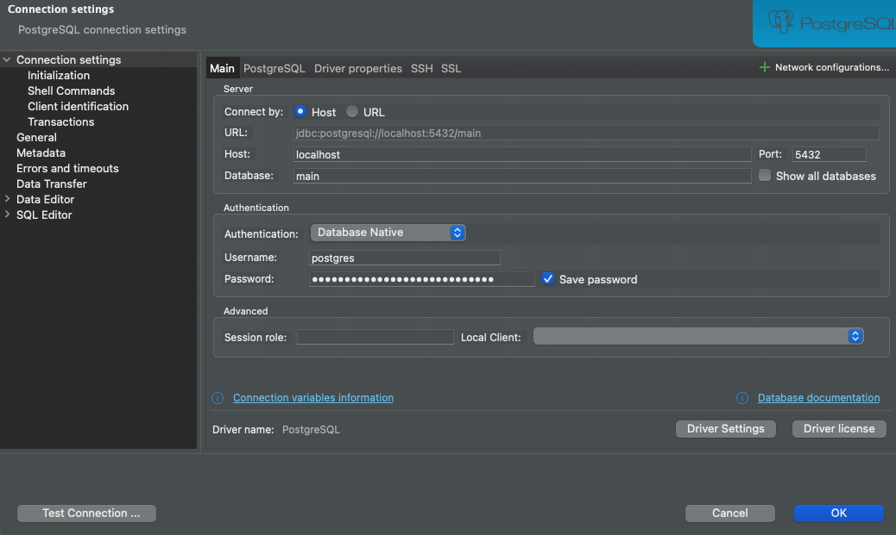
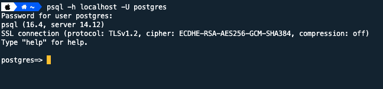
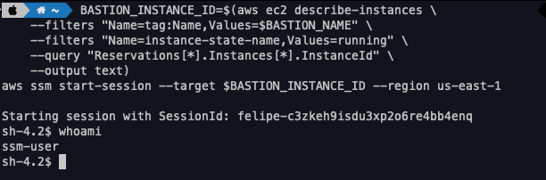

As you probably know the best practice is to deploy resources (such as databases and servers) within a private network and if they need to be exposed you should expose them using Load Balancer to handle the requests and traffic distribution.

Some resources, such as databases, you don't want ever to expose publicly. A common request in tech companies is to allow developers to connect to development databases deployed in the cloud provider. Some companies also create processes for allowing access in production in case of an urgent need!

The problem is that since databases are deployed within a private network, the developers won't be able to connect to the database. There are two common options here:
- Use a VPN to connect the developers to the private network
- Use a bastion host to connect to the private resources

This blog post aims at the latter and you will see how easy and simple it is to deploy a bastion host securely! All the source code used in this repository is available in my [GitHub Repository](http://github.com/felipelaptrin/bastion).

## Bastion Host and Systems Manager
A bastion Host (also known as jump box) is simply a server that has access to a private network but it's exposed publicly in a way that users (usually developers) can connect to it. The connectivity is usually done using SSH for Linux-based instances or RDP if it's a Windows instance. You would also need to configure the firewall of the instance correctly to allow inbound traffic from developers' IPs (and change this constantly, since internet providers usually offer dynamic IP) or from anywhere (too permissive - turning your bastion into a possible source of attacks). This is the standard way to deploy a bastion host in a VPS.

In AWS we can deploy bastion hosts using the approach mentioned above or in a different way, that relies on a service called [AWS Systems Manager](https://docs.aws.amazon.com/systems-manager/latest/userguide/what-is-systems-manager.html) (as known as SSM). It is a big AWS service used to manage servers (e.g. EC2, edge devices, on-premise servers): execute scripts, perform updates, install tools... It is a great service to manage nodes at scale!

For this blog post, the only thing we need to know about SSM is:
- **Systems Manager Agent**: A node can only be managed by SSM if it has an agent (a piece of software that runs as a daemon) installed and running in the machine. This agent is called [Systems Manager Agent](https://docs.aws.amazon.com/systems-manager/latest/userguide/ssm-agent.html) and its source code is open and available on [GitHub](https://github.com/aws/amazon-ssm-agent). This agent can be installed in EC2, Virtual Machines, edge devices... When using EC2 machines you can use AMIs that already have this agent [preinstalled](https://docs.aws.amazon.com/systems-manager/latest/userguide/ami-preinstalled-agent.html) or [install](https://docs.aws.amazon.com/systems-manager/latest/userguide/manually-install-ssm-agent-linux.html) it yourself (commonly done using the EC2 [UserData](https://docs.aws.amazon.com/AWSEC2/latest/UserGuide/user-data.html) script). Notice that the agent needs to access the SSM Endpoint (publicly or via VPC Endpoint) to be able to communicate with the service, so make sure the EC2 instance is in a public subnet with Internet Gateway configured properly or in a private subnet with access to NAT Gateway or VPC Endpoint configured.
- **Session Manager**: As mentioned, SSM allows us to run several different actions in a machine that contains the SSM Agent installed. These actions are called [Documents](https://docs.aws.amazon.com/systems-manager/latest/userguide/documents.html), and we are interested in the `AWS-StartPortForwardingSessionToRemoteHost` document that is part of the [Session Manager](https://docs.aws.amazon.com/systems-manager/latest/userguide/session-manager.html) tool. The Session Manager is a secure way to manage/access your servers via web-based sessions (via AWS Console) or AWS CLI (but you will need to install a [plugin](https://docs.aws.amazon.com/systems-manager/latest/userguide/session-manager-working-with-install-plugin.html)), in other words, it's a "replacement" for using pure SSH connection, which means that now you can rely on SSM to handle security and traffic (no need to manage firewall rules anymore). Notice that this is only possible because the SSM Agent is handling all of that, so it's a must-have. Instead of managing firewall and SSH keys, the way we manage/control who will have access to the instance is via IAM policies on two fronts: permission of the EC2/On-prem instance to allow usage of SSM service (on-premise servers use a [hybrid activation method](https://docs.aws.amazon.com/systems-manager/latest/userguide/hybrid-activation-managed-nodes.html)) and permission of the IAM User/Role that will access the instance.



## Demo time!
Let's demo the Bastion Host deployment using Terraform and CDK! To test that the bastion host is working I will also deploy an RDS instance (I will use Postgres) in a private subnet. Our goal is to deploy a bastion instance in a private subnet, be able to connect to it using SSM Session Manager, and connect to the RDS using a GUI (such as DBeaver) and CLI (psql). The following resources will be created in Terraform and CDK:
- VPC
- EC2 to serve as Bastion
- IAM Roles
- Single instance RDS (Postgres)

### Terraform
For simplicity, I will rely on Terraform community modules to deploy the needed resources. Let's check the variables of our code:

```hcl
// variables.tf
variable "aws_region" {
  description = "Region that AWS resources will be deployed"
  type        = string
  default     = "us-east-1"
}

variable "vpc_cidr" {
  description = "VPC CIDR to use"
  type        = string
  default     = "10.123.0.0/16"
}

variable "azs" {
  description = "Number of AZs to use in the VPC"
  type        = number
  default     = 3
}

variable "instance_type" {
  description = "Defines the instance type of the EC2 bastion host"
  type        = string
  default     = "t3.nano"
}
```

And then the data sources:

```hcl
// data.tf
data "aws_availability_zones" "available" {}

data "aws_ec2_instance_type" "this" {
  instance_type = var.instance_type
}

data "aws_ami" "ubuntu_latest" {
  most_recent = true
  owners      = ["099720109477"] # Canonical's AWS account ID (maintainer of Ubuntu)

  filter {
    name   = "name"
    values = ["ubuntu/images/hvm-ssd/ubuntu-*-*-${local.instance_architecture == "x86_64" ? "amd64" : "arm64"}-server-*"]
  }

  filter {
    name   = "architecture"
    values = ["${local.instance_architecture}"]
  }
}
```

And now the constants file:

```hcl
// locals.tf
locals {
  azs                   = slice(data.aws_availability_zones.available.names, 0, var.azs)
  instance_architecture = contains(data.aws_ec2_instance_type.this.supported_architectures, "arm64") ? "arm64" : "x86_64"
}
```

Finally, here is the creation of the resources:

```hcl
// main.tf
module "vpc" {
  source          = "terraform-aws-modules/vpc/aws"
  version         = "5.16.0"
  name            = "bastion-terraform"
  azs             = local.azs
  cidr            = var.vpc_cidr
  private_subnets = [for k, v in local.azs : cidrsubnet(var.vpc_cidr, 8, k)]
  public_subnets  = [for k, v in local.azs : cidrsubnet(var.vpc_cidr, 8, k + 4)]

  database_subnets                   = [for k, v in local.azs : cidrsubnet(var.vpc_cidr, 8, k + 8)]
  create_database_subnet_route_table = true
  create_database_nat_gateway_route  = true

  enable_nat_gateway = true
  single_nat_gateway = true
}

module "bastion_sg" {
  source  = "terraform-aws-modules/security-group/aws"
  version = "5.3.0"

  name = "bastion-terraform-sg"

  vpc_id = module.vpc.vpc_id
  egress_with_cidr_blocks = [
    {
      from_port   = 0
      to_port     = 65535
      protocol    = "tcp"
      description = "Allow all outbound traffic"
      cidr_blocks = "0.0.0.0/0"
    },
  ]
}

module "bastion" {
  source  = "terraform-aws-modules/ec2-instance/aws"
  version = "5.7.1"

  name                   = "bastion-terraform"
  instance_type          = var.instance_type
  vpc_security_group_ids = [module.bastion_sg.security_group_id]
  subnet_id              = module.vpc.private_subnets[0]
  ignore_ami_changes     = false
  ami                    = data.aws_ami.ubuntu_latest.id

  create_iam_instance_profile = true
  iam_role_policies = {
    AmazonSSMManagedInstanceCore = "arn:aws:iam::aws:policy/AmazonSSMManagedInstanceCore"
  }

  user_data = <<EOF
#!/bin/bash

echo "Installing SSM Agent"
sudo snap install amazon-ssm-agent --classic
sudo snap list amazon-ssm-agent
sudo snap start amazon-ssm-agent
sudo snap services amazon-ssm-agent
EOF
}


module "database_sg" {
  source  = "terraform-aws-modules/security-group/aws"
  version = "5.3.0"

  name = "database-terraform-sg"

  vpc_id = module.vpc.vpc_id
  ingress_with_source_security_group_id = [
    {
      from_port                = 5432
      to_port                  = 5432
      protocol                 = "tcp"
      description              = "Allow inbound traffic on default Postgres port"
      source_security_group_id = module.bastion_sg.security_group_id
    },
  ]
  egress_with_cidr_blocks = [
    {
      from_port   = 0
      to_port     = 65535
      protocol    = "tcp"
      description = "Allow all outbound traffic"
      cidr_blocks = "0.0.0.0/0"
    },
  ]
}

module "database" {
  source  = "terraform-aws-modules/rds/aws"
  version = "6.10.0"

  identifier = "database-terraform"
  db_name    = "main"

  engine               = "postgres"
  engine_version       = "14"
  family               = "postgres14"
  major_engine_version = "14"
  instance_class       = "db.t4g.large"
  allocated_storage    = 5

  username = "postgres"

  db_subnet_group_name   = module.vpc.database_subnet_group
  vpc_security_group_ids = [module.database_sg.security_group_id]

  skip_final_snapshot = true
  deletion_protection = false
}
```

Notice that we are getting the AMI image from `data.tf` and based on the `var.instance_type` we are getting the correct Ubuntu AMI for the bastion instance. Also, we are manually installing the SSM Agent via EC2 User Data script.

Deploying that is as easy as running `terraform apply` (or `tofu apply`).

Now, after the infrastructure is deployed we can create a simple script to automatically:
- Get EC2 Instance ID based on the Bastion name
- Get RDS Endpoint, master Username/Password (in Secrets Manager), Port
- Use `AWS-StartPortForwardingSessionToRemoteHost` document to connect to RDS

```sh
export BASTION_NAME="bastion-terraform"
export DATABASE_NAME="database-terraform"
export AWS_REGION="us-east-1"

SECRET_ARN=$(aws rds describe-db-instances --db-instance-identifier \
  $DATABASE_NAME --query 'DBInstances[0].MasterUserSecret.SecretArn' --output text)
SECRET_VALUE_RAW=$(aws secretsmanager get-secret-value --secret-id $SECRET_ARN | jq '.SecretString')
DB_USERNAME=$(echo $SECRET_VALUE_RAW | jq -r | jq -r ".username")
DB_PASSWORD=$(echo $SECRET_VALUE_RAW | jq -r | jq -r ".password")
DB_PORT=$(aws rds describe-db-instances --db-instance-identifier \
  $DATABASE_NAME --query 'DBInstances[0].Endpoint.Port' --output text)
DB_DATABASE=$(aws rds describe-db-instances \
  --db-instance-identifier $DATABASE_NAME \
  --query 'DBInstances[0].DBName' --output text)
echo "Connect to the database using the following inputs:"
echo "\n\nHost => localhost\nDatabase => $DB_DATABASE\nUSERNAME => $DB_USERNAME\nPASSWORD => $DB_PASSWORD\nPORT => $DB_PORT"

CLUSTER_HOST=$(aws rds describe-db-instances \
  --db-instance-identifier $DATABASE_NAME \
  --query 'DBInstances[0].Endpoint.Address' --output text)
BASTION_INSTANCE_ID=$(aws ec2 describe-instances \
  --filters "Name=tag:Name,Values=$BASTION_NAME" \
  --filters "Name=instance-state-name,Values=running" \
  --query "Reservations[*].Instances[*].InstanceId" --output text)
aws --region=us-east-1 ssm start-session \
  --target $BASTION_INSTANCE_ID \
  --document-name AWS-StartPortForwardingSessionToRemoteHost \
  --parameters "{\"host\":[\"$CLUSTER_HOST\"],\"portNumber\":[\"5432\"], \"localPortNumber\":[\"$DB_PORT\"]}"
```

This script will output the following:



You can then use DBeaver or PSQL to connect to the database. Notice that your terminal will be "blocked" with a pending session with the bastion host. If you close or cancel the command the connection is lost and you won't be able to reach the database. This makes possible to access the database as it was running locally.

Connecting via GUI is as simple as inputing the information that came from the script output.



It's also simple to connect via PSQL.



We can also connect to the instance terminal using SSM Session Manager:

```sh
BASTION_INSTANCE_ID=$(aws ec2 describe-instances \
    --filters "Name=tag:Name,Values=$BASTION_NAME" \
    --filters "Name=instance-state-name,Values=running" \
    --query "Reservations[*].Instances[*].InstanceId" \
    --output text)
aws ssm start-session --target $BASTION_INSTANCE_ID --region us-east-1
```



Notice that we didn't specify a document to be used. This is because if no document is given it will launch the shell to manage the node by default.

### CDK
For CDK a single Stack will be created using Typescript.

```typescript
// mais.ts
import "source-map-support/register";
import * as cdk from "aws-cdk-lib";
import { Stack } from "./stack";
import { InstanceClass, InstanceSize, InstanceType } from "aws-cdk-lib/aws-ec2";

const app = new cdk.App();

new Stack(app, "BastionStack", {
  env: {
    region: "us-east-1",
  },
  instanceType: InstanceType.of(InstanceClass.T3, InstanceSize.SMALL),
  vpcCidrBlock: "10.130.0.0/16",
});
```

The main code instantiate the Stack that was created in a separate file.

```typescript
import * as cdk from "aws-cdk-lib";
import {
  BastionHostLinux,
  InstanceClass,
  InstanceSize,
  IpAddresses,
  Port,
  SubnetType,
  Vpc,
} from "aws-cdk-lib/aws-ec2";
import { Construct } from "constructs";
import { InstanceType } from "aws-cdk-lib/aws-ec2";
import {
  Credentials,
  DatabaseInstance,
  DatabaseInstanceEngine,
  PostgresEngineVersion,
} from "aws-cdk-lib/aws-rds";

export interface BastionProps extends cdk.StackProps {
  vpcCidrBlock: string;
  instanceType: InstanceType;
}

export class Stack extends cdk.Stack {
  public readonly vpc: Vpc;

  constructor(scope: Construct, id: string, props: BastionProps) {
    super(scope, id, props);

    this.vpc = new Vpc(this, "Vpc", {
      ipAddresses: IpAddresses.cidr(props.vpcCidrBlock),
      subnetConfiguration: [
        {
          cidrMask: 22,
          name: "Private",
          subnetType: SubnetType.PRIVATE_WITH_EGRESS,
        },
        {
          cidrMask: 22,
          name: "PrivateForDB",
          subnetType: SubnetType.PRIVATE_ISOLATED,
        },
        {
          cidrMask: 22,
          name: "Public",
          subnetType: SubnetType.PUBLIC,
        },
      ],
      natGateways: 1,
    });

    const database = new DatabaseInstance(this, "Database", {
      vpc: this.vpc,
      engine: DatabaseInstanceEngine.postgres({
        version: PostgresEngineVersion.VER_14,
      }),
      instanceType: InstanceType.of(InstanceClass.T4G, InstanceSize.LARGE),
      multiAz: false,
      allocatedStorage: 5,
      vpcSubnets: {
        subnetType: SubnetType.PRIVATE_ISOLATED,
      },
      credentials: Credentials.fromGeneratedSecret("postgres"),
      removalPolicy: cdk.RemovalPolicy.DESTROY,
      databaseName: "main",
      instanceIdentifier: "database-cdk",
    });

    const bastion = new BastionHostLinux(this, "BastionEc2", {
      vpc: this.vpc,
      instanceName: "bastion-cdk",
      instanceType: props.instanceType,
      subnetSelection: {
        subnetType: SubnetType.PRIVATE_WITH_EGRESS,
      },
    });
    bastion.connections.allowTo(database, Port.tcp(5432));
  }
}
```

## Cya!

Well, I hope you liked this blog post. See you around! 👋