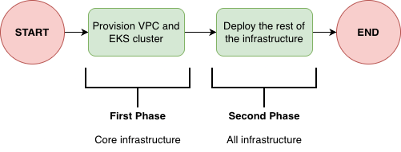

Hi there! Around 2 months ago I published the following blog post: [Bridging the gap between IaC and GitOps with FluxCD and Terraform](https://felipetrindade.com/bridge-the-gap-flux/). Now I'm continuing the "Bridge the Gap" saga but this time using Terraform and ArgoCD instead.

As always, the entire code used in this post can be accessed in my [GitHub Repository](https://github.com/felipelaptrin/kubernetes-gitops-flux)

## Bridge the Gap between IaC and ArgoCD

I'll skip all the explanation about what I mean by "bridge the gap between IaC and GitOps" since this was fully covered in the: [Bridging the gap between IaC and GitOps with FluxCD and Terraform](https://felipetrindade.com/bridge-the-gap-flux/) blog post. For this reason, I won't repeate myself and rather jump directly into the technical explanation!

## Scenario
Our infrastructure goal is to have a new Kubernetes cluster deployed from scratch and bootstrap it with some good-to-have addons:
- **ALB Controller:** To provision and manage Network Load Balance to expose Kubernetes apps.
- **External-DNS**: To automatically create records in Route53 to expose our apps (domain level).
- **External-Secrets**: To create Kubernetes secrets based on secrets in AWS Secrets Manager.
- **Istio**: Implements the Gateway API controller.
- **Karpenter**: Handles cluster node scalability.
- **Metrics-Server**: Collects metrics of the pods and allows us to scale them based on these metrics (e.g. CPU and Memory).

## Deploying the Infrastructure
The infrastructure needs to be deployed in a two-phase process when using Terraform. This is a limitation of the Kubernetes provider for Terraform, since [it's required to have an EKS cluster provisioned before using the provider](https://registry.terraform.io/providers/hashicorp/kubernetes/latest/docs#stacking-with-managed-kubernetes-cluster-resources).

Based on that, first we need to deploy the **core** infrastructure (usually network related and EKS cluster) before moving to the Kubernetes cluster bootstrap.

So basically we should:
- Fist deploy only core infrastructure (this can be easily achieved by using the `--target` flag in `terraform apply` CLI)
- Then deploy the rest of the infrastructure.

It's important to mention that after the core infrastructure is deploy there is no need to deploy the infrastructure in a two-phase approach, since the EKS cluster is already in place, we are good to deploy the infrastructure entirely.

## ArgoCD Bootstrap
ArgoCD will be installed by the cluster using the [helm_release](https://github.com/felipelaptrin/kubernetes-gitops-argocd/blob/f604794fce91e8f691cf74f00b0ee23649f13c6b/src/k8s.tf#L7) resource from the Helm provider for Terraform. After the ArgoCD is installed into the cluster, Terraform will never manage ArgoCD version anymore, since we can create an ArgoCD Application that will [manage ArgoCD installation](https://sofianedjerbi.com/en/blog/argocd-manage-itself/). We will get there...

Ok, ArgoCD installed, now what? Well, we can deploy an [ArgoCD Application](https://github.com/felipelaptrin/kubernetes-gitops-argocd/blob/f604794fce91e8f691cf74f00b0ee23649f13c6b/src/k8s.tf#L41) that will deploy other Applications. That's the [App of Apps](https://argo-cd.readthedocs.io/en/latest/operator-manual/cluster-bootstrapping/#app-of-apps-pattern-alternative) pattern, used to bootstrap the cluster installation. In this case, this Application will [deploy all manifests inside 'k8s/bootstrap' folder](https://github.com/felipelaptrin/kubernetes-gitops-argocd/blob/f604794fce91e8f691cf74f00b0ee23649f13c6b/src/k8s.tf#L56). This [folder](https://github.com/felipelaptrin/kubernetes-gitops-argocd/tree/f604794fce91e8f691cf74f00b0ee23649f13c6b/k8s/bootstrap) contains basically three manifest:
- App-of-Apps ArgoCD ApplicationSet to manage installation of `addons` (e.g. external-dns, karpenter...)
- App-of-Apps ArgoCD ApplicationSet to manage installation of `apps` (e.g. your enterprise workloads...)
- ArgoCD ApplicationSet to manage ArgoCD own installation, so we completely remove Terraform responsability to manage ArgoCD installation! So, the [helm_release](https://github.com/felipelaptrin/kubernetes-gitops-argocd/blob/f604794fce91e8f691cf74f00b0ee23649f13c6b/src/k8s.tf#L7) will become a "ghost" resource, only used during the first execution of the second phase `terraform apply`.

## Bridging the gap with ArgoCD ApplicationSet
So far we covered the ArgoCD bootstrap part but what about the part that really matters? How can we pass values that comes from infrastructure to the manifests.

ArgoCD offers a custom resource called [ApplicationSet](https://argo-cd.readthedocs.io/en/stable/operator-manual/applicationset/#the-applicationset-resource) that can be used to deploy a custom resource `Application` (that is templated) in a specific cluster given inputs in the `spec.generators` field. The magical part is that, because the `Application` is templated, we can use values that comes from the `spec.generators` part. So, if we can somehow control what goes into the generators we can dynamically inject values into the `Application` custom resource.

The `ApplicationSet` custom resource is usually used to, with a single manifest, deploy an `Application` into different Kubernetes clusters (remember that ArgoCD can manage [multiple clusters](https://argo-cd.readthedocs.io/en/stable/operator-manual/cluster-management/)!). We can manually register these cluster, but as DevOps we avoid manual steps, so we can [declaratively](https://argo-cd.readthedocs.io/en/stable/operator-manual/declarative-setup/#clusters) create a Kubernetes secret that contains information about this Kubernetes cluster (endpoint, name, tls configuration). Within this secret we can also add metadata (labels and annotations).

Given that, bridging the gap became simple, since we can [create this Kubernetes secret using Terraform](https://github.com/felipelaptrin/kubernetes-gitops-argocd/blob/f604794fce91e8f691cf74f00b0ee23649f13c6b/src/k8s.tf#L95) to reference the cluster and inject metadata (within the annotations, for example) with values about our infrastructure: Vpc ID, SQS ARN, ACM Certificate ARN...

Let's take two scenarios into consideration: deploy a Helm Chart that needs infrastructure information and deploy Kustomize manifests that needs infrastructure information.

### Scenario 1: Helm Chart
Let's take for example the [AWS ALB Controller](https://kubernetes-sigs.github.io/aws-load-balancer-controller/latest/) that requires information about the infrastructure: cluster name, vpc id and AWS region.

We can create an [ApplicationSet](https://github.com/felipelaptrin/kubernetes-gitops-argocd/blob/f604794fce91e8f691cf74f00b0ee23649f13c6b/k8s/addons/aws-load-balancer-controller.yaml) (remember that this ApplicationSet will be deployed automatically by the Addons App-of-Apps). This ApplicationSet will use [information](https://github.com/felipelaptrin/kubernetes-gitops-argocd/blob/f604794fce91e8f691cf74f00b0ee23649f13c6b/k8s/addons/aws-load-balancer-controller.yaml#L40) that comes from the metadata (annotations) of the Kubernetes Secret containing the cluster information. These metadata were added by the [kubernetes_secret_v1](https://github.com/felipelaptrin/kubernetes-gitops-argocd/blob/f604794fce91e8f691cf74f00b0ee23649f13c6b/src/k8s.tf#L107) resource.

### Scenario 2: Kustomize
Let's take as example the [EC2NodeClass](EC2NodeClass) resource of Karpenter. Suppose we already deployed Karpenter using Helm Chart, but now we would like to deploy the specific custom resources of Karpenter (such as EC2NodeClass and NodePool). We would like to pass to the EC2NodeClass the IAM Role that the EC2 craeted by Karpenter should use, so let's bridge the gap!

First, we create an [ApplicationSet](https://github.com/felipelaptrin/kubernetes-gitops-argocd/blob/f604794fce91e8f691cf74f00b0ee23649f13c6b/k8s/addons/karpenter-resources.yaml) that will deploy the kustomize resources. Then, we use Kustomize feature to [patch the manifests](https://github.com/felipelaptrin/kubernetes-gitops-argocd/blob/f604794fce91e8f691cf74f00b0ee23649f13c6b/k8s/addons/karpenter-resources.yaml#L37) with the values that comes from the metadata of the Kubernetes cluster Secret, that was created by [Terraform](https://github.com/felipelaptrin/kubernetes-gitops-argocd/blob/main/src/k8s.tf#L117).

## Try it!
These is one of the things that explaining won't help much, you must try and see it for yourself. Demo it! The repository is ready to be used. Take your time to read the manifests and understand how things are connected!

## Cya
Hope you enjoyed this blog post! See you in the next post! 👋