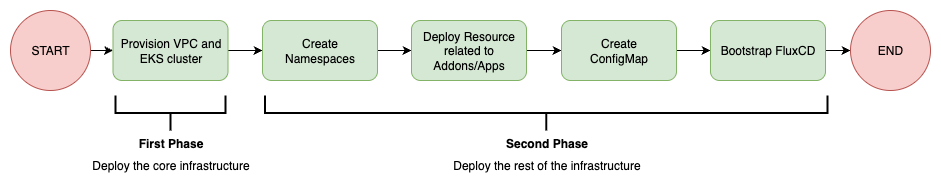
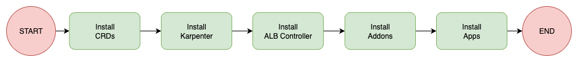
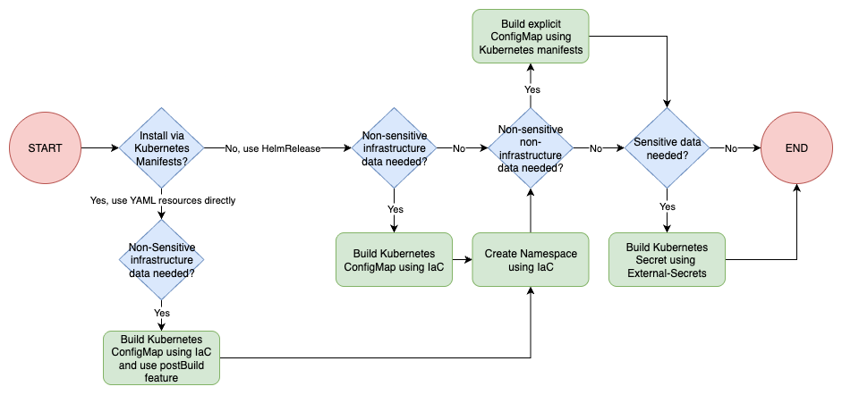
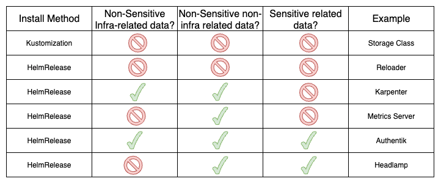

This blog post is a very special one for two main reasons:
- It marks two full years of my blog posts! On average, I delivered one technical blog post per month (some months I posted two!).
- This post tackles a real problem that I’ve faced for years, and never really liked how others addressed this issue… I’m really proud of the proposed solution that will be described here, and I’m pretty sure it has room for improvement, but it’s a good start.

As always, the entire code used in this post can be accessed in my [GitHub Repository](https://github.com/felipelaptrin/kubernetes-gitops-flux)

## Bridge the Gap between IaC and FluxCD

Let’s explain a bit about the problem. Cloud resources are created with the IaC tool, and they need to be referenced in Kubernetes (e.g., Bucket name, Certificate ARN, Subnet IDs, SQS Queue ARN…). But how can these values be passed to the Kubernetes resources (e.g., Deployments, Helm Chart Values…)?

The "classic" solution for this is to store these in AWS Secrets Manager or Parameter Store and use External Secrets to create Kubernetes Secrets that will be consumed by your application as environment variables. The reality is that this pattern does not work in all cases, since it's very common the need to pass the value directly to a Helm Chart custom values, to manifests that do not support reading the value from a secret (e.g. ALB Controller needs VPC ID that is passed as `args` to the controller pod) or even in annotations/labels of resources.

The solution proposed here allows us to perform substitution on placeholder values using our GitOps Tool (in this case, FluxCD), and it works by:
- Creating a ConfigMap that will substitute Kustomize values using the [postBuild](https://fluxcd.io/flux/components/kustomize/kustomizations/#post-build-variable-substitution) feature of FluxCD.
- Create a specific ConfigMap per service that will be applied as [custom values](https://fluxcd.io/flux/components/helm/helmreleases/#values-references) for the Helm Chart.

This way, we are able to bridge the gap between IaC and GitOps by replacing the values in Kubernetes YAML manifests (created with Kustomize) and custom values for Helm Charts.

I bet you are still very confused with the summary of the explanation above, so let's deep dive with real examples and explain this step by step.


## Scenario
Our infrastructure goal is to have a new Kubernetes cluster deployed from scratch and bootstrap it with some good-to-have addons:
- **ALB Controller:** To provision and manage Network Load Balance to expose Kubernetes apps.
- **Authentik**: A complete IdP platform to set up SSO. I've already talked about SSO and Authentik in the [Hands-on SSO with Terraform and Authentik](https://www.felipetrindade.com/sso/) blog post!
- **External-DNS**: To automatically create records in Route53 to expose our apps (domain level).
- **External-Secrets**: To create Kubernetes secrets based on secrets in AWS Secrets Manager.
- **Headlamp**: A dashboard for monitoring our cluster.
- **Istio**: Implements the Gateway API controller.
- **Karpenter**: Handles cluster node scalability.
- **Metrics-Server**: Collects metrics of the pods and allows us to scale them based on these metrics (e.g. CPU and Memory).
- **Reloader**: A controller to watch changes in ConfigMap and Secrets and do rolling updates on pods.

## Deploying the Infrastructure
The infrastructure needs to be deployed in a two-phase process when using Terraform. This is a limitation of the Kubernetes provider for Terraform, since [it's required to have an EKS cluster provisioned before using the provider](https://registry.terraform.io/providers/hashicorp/kubernetes/latest/docs#stacking-with-managed-kubernetes-cluster-resources).

Based on that, first we need to deploy the **core** infrastructure (usually network related and EKS cluster) before moving to the Kubernetes cluster bootstrap.



You might be surprised that, based on the flow above, the creation of Kubernetes Namespaces is being managed by Terraform, but we will get there. For now, you just need to understand that the Terraform deployment should be performed in a two-phase approach:
- Deploy only core infrastructure (this can be easily achieved by using the `--target` flag in `terraform apply` CLI)
- Deploy the rest of the infrastructure

## FluxCD Bootstrap
FluxCD Documentation suggests several ways for [bootstrapping](https://v2-7.docs.fluxcd.io/flux/installation/) FluxCD. I personally like the Terraform approach, and I'll stick with it. The [flux_bootstrap_git](https://registry.terraform.io/providers/fluxcd/flux/latest/docs/resources/bootstrap_git) resource of the FluxCD provider is responsible for installing FluxCD in the Kubernetes cluster and push the manifests related to FluxCD installation to your git repository, which is aligned with a GitOps approach.

Our GitOps Controller (FluxCD) will be responsible for installing all the tools in the Kubernetes cluster using a GitOps approach. Based on our scenario, FluxCD should install the resources in the following order:



Some important comments:
- I think it's a best practice to manage CRDs separately, since this avoids some racing conditions (e.g. application tries to use `ExternalSecret` CR but the CRDs were not installed yet).
- Karpenter should be the first addon to be installed in a Kubernetes cluster, since it will guarantee cluster scalability. If you try to deploy Karpenter and several others addons at the same time, it is not guaranteed that the initial nodes of the cluster will have enough memory to install all addons and Karpenter, so it's better to be safe and make sure Karpenter is installed first and can guarantee the cluster scalability.
- Based on my experience, if you try to deploy ALB Controller and several other services at the same time, the deployments might be stuck because of the following error:
```
Internal error occurred: failed calling webhook "mservice.elbv2.k8s.aws":
failed to call webhook:
Post "https://aws-load-balancer-webhook-service.kube-system.svc:443/mutate-v1-service?timeout=10s":
no endpoints available for service "aws-load-balancer-webhook-service"
```
When installing it first, I saw no errors.
- I'm considering `addons` all services that are "internal" to Kubernetes, i.e. tools that handle monitoring, scalability, automation... and `apps` as real apps that will be used by your clients (e.g. APIs, Webservers...).

## Addons/Apps installation

I have a preference for installing external tools (i.e. tools that I don’t manage, such as open-source projects) using Helm Chart instead of managing each Kubernetes YAML Manifest individually (Deployment, PDB, Service, ConfigMap...). Because of that, I'll use the [HelmRelease](https://fluxcd.io/flux/components/helm/helmreleases/) Flux's Custom Resource to install these resources. But, there is always a need to manage some pure YAML manifests (e.g. `ExternalSecret`, `HttpRoute` - some Helm Charts only support Ingress...), for these, I will use the [Kustomization](https://fluxcd.io/flux/components/kustomize/kustomizations/) Flux's Custom Resource. Also, some of these addons need to install CRDs and the best practice is to install and manage these separately. The flow chart below explains the order of deployments I'd like FluxCD to run when creating a new cluster from scratch.

The following flow summarizes the main idea of how to Bridge the Gap between IaC and GitOps:



Notice that we can create the namespace with FluxCD, but there is a race condition problem. From the moment you FluxCD bootstrap fisishes, Terraform will try to create a ConfigMap in a namespace that does not exist yet (it takes time for FluxCD to deploy stuff). So if we move the namespace creation to Terraform we won't have this problem! Sure, we still add some hacky stuff (e.g. null_resource with "sleep") or retry the Terraform execution after FluxCD has correctly provisioned the namespace, but I personally don't like this idea much.

Let's take real examples to explain this.



If you REALLY want to understand how this was done, take your time to check these 6 examples:
- [Storage Class](https://github.com/felipelaptrin/kubernetes-gitops-flux/tree/main/k8s/addons/base/storage-class): Single manifest.
- [Reloader](https://github.com/felipelaptrin/kubernetes-gitops-flux/tree/main/k8s/addons/base/reloader): Installation via `HelmRelease` without custom values.
- [Karpenter](https://github.com/felipelaptrin/kubernetes-gitops-flux/tree/main/k8s/addons/base/karpenter): Installation via `HelmRelease`. It needs non-sensitive custom values [non-related to infra](https://github.com/felipelaptrin/kubernetes-gitops-flux/blob/main/k8s/addons/base/karpenter/values.yaml) and [related to infra](https://github.com/felipelaptrin/kubernetes-gitops-flux/blob/main/k8s/addons/base/karpenter/ec2-node-class.yaml#L11) (that are created by [Terraform General ConfigMap](https://github.com/felipelaptrin/kubernetes-gitops-flux/blob/main/src/k8s.tf#L159) and [Terraform specific ConfigMap](https://github.com/felipelaptrin/kubernetes-gitops-flux/blob/main/src/k8s.tf#L381)).
- [Metrics Server](https://github.com/felipelaptrin/kubernetes-gitops-flux/tree/main/k8s/addons/base/metrics-server): Installation via `HelmRelease`. It needs non-sensitive custom values [non-related to infra](https://github.com/felipelaptrin/kubernetes-gitops-flux/blob/main/k8s/addons/base/metrics-server/values.yaml).
- [Authentik](https://github.com/felipelaptrin/kubernetes-gitops-flux/tree/main/k8s/addons/base/authentik): Installation via `HelmRelease`. It needs non-sensitive custom values [non-related to infra](https://github.com/felipelaptrin/kubernetes-gitops-flux/blob/main/k8s/addons/base/authentik/values.yaml) and [related to infra](https://github.com/felipelaptrin/kubernetes-gitops-flux/blob/main/src/k8s.tf#L447). It also needs [sensitive data](https://github.com/felipelaptrin/kubernetes-gitops-flux/blob/main/k8s/addons/base/authentik/external-secrets.yaml).
- [Headlamp](https://github.com/felipelaptrin/kubernetes-gitops-flux/tree/main/k8s/addons/base/headlamp): Installation via `HelmRelease`. It needs non-sensitive custom values [non-related to infra](https://github.com/felipelaptrin/kubernetes-gitops-flux/blob/main/k8s/addons/base/headlamp/values.yaml) and [sensitive data](https://github.com/felipelaptrin/kubernetes-gitops-flux/blob/main/k8s/addons/base/headlamp/external-secrets.yaml).


## Cya
Hope you enjoyed this blog post! Happy New Year, and see you in the next post! 👋