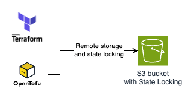
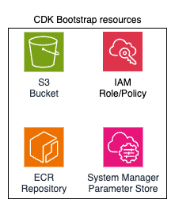
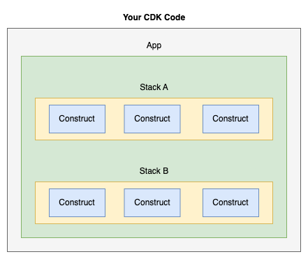

This one is going to be a very short blog post since it's a high-level guide on how to understand CDK from a Terraform user perspective. This is the guide I would like to have read the first time I worked with CDK.

I think a good thing when learning a new tool is to bring concepts, ideas, and mindset of similar tools you've worked with before. This helps you understand the pros and cons of each tool and how they handle the same problem. So for this guide, I'm expecting you to have experience with Terraform. I'm assuming you have no experience with Pulumi, CDK for Terraform, or tools that use programming languages to create infrastructure.

## AWS CDK
AWS CDK (AWS Cloud Developer Kit) is a framework that allows you to define code in your favorite programming language (e.g. Typescript, Python - check the full list of supported languages in the [documentation](https://docs.aws.amazon.com/cdk/v2/guide/languages.html)). Behind the scenes, CDK uses an AWS service called CloudFormation, that allows you to provision infrastructure using templates written in JSON/YAML.

Because CDK uses programming languages instead of a DSL (domain-specific language) like Terraform, you have way more flexibility to define your infrastructure: create functions, classes, methods, custom logic, apply DRY concepts, code patterns... This is great, especially if the DevOps has a developer background.

It's not required to know CloudFormation in order to use CDK. If you know it it's amazing since the learning curve will be smoother, but I wrote this post supposing you have no idea what CloudFormation is. For now, what you need to know is that when using CDK you write code in your favorite (and supported) programming language and then this code is transformed into a YAML/JSON that will be used by CloudFormation to deploy your infrastructure.

### Bootstrapping
We refer to "bootstrap" as the process of preparing the environment before actual work begins. The idea is that certain setup steps are needed in advance to ensure everything is ready for productive work.

You might be thinking that in Terraform there is no such thing as "bootstrapping" and you are right. Well, partially. If you want to have a professional Terraform code you need to:
- Store state remotely (when using AWS we use S3 Bucket)
- Support state locking (when using AWS we used to use DynamoDB Table but this is now deprecated and you should use [S3 State Locking](https://developer.hashicorp.com/terraform/language/backend/s3#state-locking))

Terraform calls this [backend](https://developer.hashicorp.com/terraform/language/backend), but it practice it's a bootstrap proccess: need to have something in place (S3 Bucket with State Locking) before actually starting your Terraform code. This is bootstrapping. I know that some of you might say "hey, but I can start to work locally and only then migrate my state to S3 bucket"... Yes, that's true but if you start your Terraform code from day one following best practices you can treat the S3 Bucket creation as a "bootstrap" proccess.



Differently from Terraform, bootstrapping in CDK is a pre requisite: you MUST bootstrap your AWS environment in order to use CDK. When I say environment I'm talking about an AWS Region in a specific AWS Account. So the bootstrapping process must be performed in EVERY AWS environment that you plan to use CDK. This process is usually a manual process (or in a pipeline) and it's easily done using [aws cli](https://docs.aws.amazon.com/cdk/v2/guide/bootstrapping-env.html#bootstrapping-howto).

The bootstrap process will create a CloudFormation stack (named `CDKToolkit`) to deploy resources that are needed by CDK: S3 bucket (to store files assets - such as inline lambda functions, website files, CloudFormation stacks), Parameter Store (tracks bootstrap environment metadata - used internally by CDK), ECR repository (to build and deploy images locally), IAM Role/policy (Role to perform deployments, upload files/assets to S3, push image to ECR)... In case you are confused, don't worry. You probably won't need to use these resources. Just think these are needed resources in order to have CDK working in your AWS environment. In reality, some of these resources might not even be used by CDK, it will depend on how your code will be written.



The process of bootstrapping, as mentioned, is as easy as running a single AWS CLI command:

```sh
cdk bootstrap aws://<AWS_ACCOUNT_NUMBER>/<AWS_REGION>
```

Well, this is actually the simplest way to bootstrap an AWS Environment but you can use several other flags.

### State
When using Infrastructure as Code (IaC), our goal is **idempotency**, i.e. running the same code multiple times should consistently produce the same infrastructure. In other words, applying the same code should always result in the same outcome. Behind the scenes, the IaC tool should compare the desired state (defined in code) with the current state (what's deployed), detect any differences (drift), and make the necessary changes to align them.

In Terraform, this process is managed through state files stored in S3 Bucket. A state file is a JSON-formatted file that stores metadata about the resources Terraform has deployed, including a one-to-one mapping between each deployed resource and the corresponding resource instance defined in the code.

This file is crucial because it enables Terraform to track what it created, how it was configured, and how it relates to the desired configuration. In short, Terraform uses three things to deploy infrastructure correctly:
- The state file (current known state)
- The desired configuration (your code)
- The actual deployed state (what's in your cloud provider).

By comparing these, Terraform can determine what needs to change and apply only the necessary updates.

As already mentioned, CDK uses CloudFormation, which is an AWS-managed service, meaning that we are not responsible for managing the state (e.g. storing in an S3 bucket) because this is completely managed by CloudFormation. All you need to worry about is your CDK code and CloudFormation will be responsible for managing the resources.

## CDK Concepts

We are getting somewhere! Now, let's understand CDK core concepts and how it's related to the code. I will use Typescript for this demo.



The core idea of AWS CDK is to define an application (`App`) that contains one or more stacks, and each stack is composed of constructs (reusable building blocks that define AWS resources). Since CDK translates your code into a CloudFormation template, so many terms used in CDK, like stack, originate from CloudFormation itself.

### App
The entry point of CDK is the `App`, which provides a context for all the resources that will be instantiated by the app.

```typescript
const app = new cdk.App();
```

The `app` will be used to create a stack.

### Constructs
A construct is the building block of CDK, i.e. what is really gonna be used to create resources inside stacks.

A construct in Typescript is simply a class that expects three main arguments:
- **scope**: The construct's parent or owner, either a stack or another construct. It decides where this construct lives in the construct tree. For example, you can create a custom construct to set up a common API using API Gateway and Lambda, and inside it, you’d use the API GW and Lambda constructs. Most of the time, you’ll just pass `this` (or `self` in Python), which refers to the current construct.
- **id**: A unique ID for the construct within its scope. This helps CDK and CloudFormation keep track of resources. Be careful with this. If you change the ID, CloudFormation will think it’s a new resource and replace the old one.
- **props**: These are the settings or options you pass to configure the construct. For example, in an L2 (keep reading and I will explain this!) S3 construct, you could set a versioned flag to true if you want the bucket to keep versions of files.

A construct represents one - or more - AWS resources, depending on the level of abstraction of the construct. There are three levels of abstraction for the constructs:

- **L1** (`Cfn`): The lower level of abstraction is using the CloudFormation resource directly (e.g. [S3 bucket](https://docs.aws.amazon.com/AWSCloudFormation/latest/TemplateReference/aws-resource-s3-bucket.html)). The L1 constructs are also known as `Cfn` and are usually avoided when a higher level construct is available because they are lower level components with no validation, default values (beyond what is default what CloudFront already has), no best practices, hard to maintain.

```typescript
import * as cdk from 'aws-cdk-lib';

class HelloCdkStack extends Stack {
  constructor(scope: App, id: string, props?: cdk.StackProps) {
    super(scope, id, props);

    const bucket = new s3.CfnBucket(this, "MyBucket", {
        bucketName: "MyBucket"
    });
  }
}
```

- **L2**: Most times you are going to use L2 constructs because they are L1 constructs with default values, best practices, and methods for easily using the resource. Let's take for example the [S3 Bucket](https://docs.aws.amazon.com/cdk/api/v2/docs/aws-cdk-lib.aws_s3.Bucket.html) L2 construct. It applies best practice by default and allows you to use several methods for managing lifecycle, and access (read/write access to Roles)... You can think of them as Terraform community modules for simple resources (e.g. [S3](https://registry.terraform.io/modules/terraform-aws-modules/s3-bucket/aws/latest), [KMS](https://registry.terraform.io/modules/terraform-aws-modules/kms/aws/latest)).

```typescript
import * as cdk from 'aws-cdk-lib';
import * as s3 from 'aws-cdk-lib/aws-s3';

class HelloCdkStack extends Stack {
  constructor(scope: App, id: string, props?: cdk.StackProps) {
    super(scope, id, props);

    new s3.Bucket(this, 'MyBucket', {
        versioned: true
    });
  }
}
```

- **L3**: The highest level of abstraction. L3 constructs implements common AWS patterns (API Gateway with Lambda, ECS with Fargate Service and Load Balancer, S3 with CloudFront...). Usually creates several resources and are also equivalent to Terraform complex modules (e.g. [CloudFront S3 CDN](https://registry.terraform.io/modules/cloudposse/cloudfront-s3-cdn/aws/latest)). But nothing stops you from building your own construct (e.g. an S3 bucket with compliance that should be used as a "default" bucket in your CDK code). You can find several L3 constructs in the [Construct Hub](https://constructs.dev/).

## CDK Deployment
There are several methods to deploy your infrastructure, such as:

- **Manual Deployment**: Easiest and simplest to start working with CDK. You simply run `cdk deploy` and that's it. Well, you shouldn't use this approach when working in a team. Ideally, you want to make sure everyone has visibility of the changes so usually a CI/CD system is the way to go.
- **CI/CD Deployment**: You can use your favorite CI/CD tools (e.g. GitHub Actions, CircleCI, GitLab) to set up pipelines to deploy your CID code.
- **CDK Pipelines Deployment**: I've made an entire [blog post](https://www.felipetrindade.com/cdk-multi-account/) to talk only about this method. We can use CDK to define our CI/CD using AWS Codepipeline. This allows us to have CDK as the truly single source of truth in our infrastructure!

## Cya
Hope you enjoyed this blog post! It was very short but this would definitely save me hours from reading the HUGE CDK documentation. From now on I expect you to have the essential CDK knowledge to get started with CDK. See you in the next post! 👋