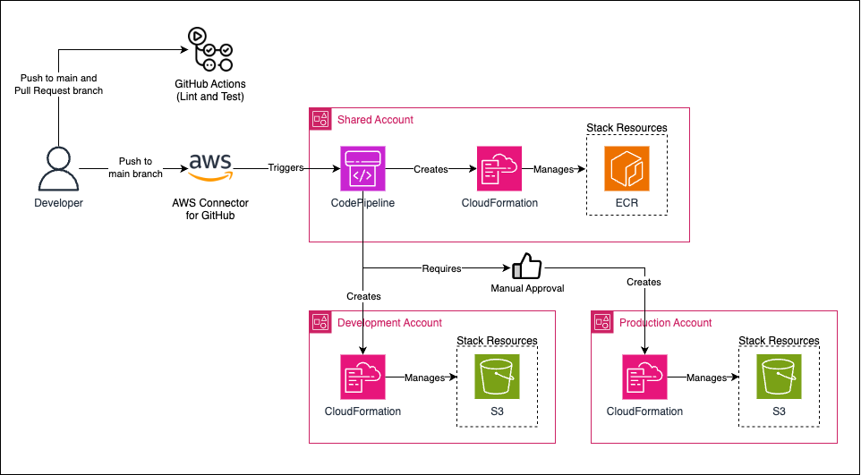
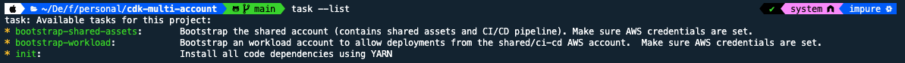

AWS CDK is a great tool to deploy infrastructure in AWS using your favorite programming language but deploying to multiple accounts using AWS CodePipeline can be tricky. In this blog post, we will cover the idea behind it and we are going to implement this solution using AWS CDK and AWS CodePipeline. All the code used in this blog post is available in my [GitHub repository](https://github.com/felipelaptrin/cdk-multi-account).

## Multi Account Architecture
The goal of this blog post is to use AWS best practices and separate AWS accounts based on their functionality and deploy infrastructure from a single AWS account to several AWS accounts. To summarize, the below architecture will be created in this blog post:



Let's comment about it:

- **GitHub Actions**: GitHub Actions will be used only for CI purposes: check the linting and run tests of our AWS CDK code.
- **AWS Accounts**: We will use two AWS accounts for workloads (development and production) and one account that will contain the CD pipeline to deploy to the workload accounts and resources shared by every account (shared assets). The workload accounts usually contain services like RDS, EC2, EKS, Lambda, S3, and so on, while the shared assets accounts will contain the Pipelines for deploying to the workload account and common resources to the workload accounts (e.g. images in ECR to allow artifact promotion, common scripts in S3 buckets...).
- **CodePipeline**: It will deploy services in the desired AWS account based on the AWS CDK code created.
- **AWS Connector for GitHub**: A CodeStar connection will be created between GitHub repository and AWS, this will install a GitHub App that will trigger a CodePipeline execution based on commits pushed to the GitHub repository.
- **CloudFormation**: AWS CDK is an abstraction over CloudFormation, in the end, all the AWS CDK code will be transformed (synth) into CloudFormation stacks.

Notice that the ECR and S3 created are just for exemplifying in the code how to create resources in these accounts.

## AWS CDK
This is not an AWS CDK tutorial but I need to comment some important things before diving into the code. CDK, as mentioned, relies on the CloudFormation service, so the more you know about CloudFormation the better will be to understand how it works, although it's not necessary.

For CDK to work you need some resources in your account (such as IAM Roles that CloudFormation will use to deploy/lookup resources and publish files). The step of creating these resources before start to work on the CDK code is called `bootstrap`. This is a manual step that will provision a CloudFormation Stack (called CDKToolkit) in the region you are bootstrapping.

You can use any programming language supported by AWS CDK my recommendation is Typescript, which is the default programming language used to write AWS CDK code, and this is the programming language that I will use in this demo.

In our code we will create 4 stacks:
- **Pipeline stack**: This will be responsible for creating the CodePipeline resources to cross-account deploy to all environments (shared-assets and workload). This will be deployed in the shared-assets account.
- **Shared Assets stack**: Resources deployed in the shared assets account.
- **Workload (Development) stack**: Resources deployed in the development account.
- **Workload (Production) stack**: Resources deployed in the production account.

Notice that this is just one possible way of deploying things, in reality, you could have divided this in several different ways, multiple stacks per account, and so on. The idea here is to present only the solution and the idea that makes this deployment possible.

Most of the time when creating CDK resources we will use [L2 constructs](https://docs.aws.amazon.com/cdk/v2/guide/constructs.html) that can be found in the API Reference [documentation](https://docs.aws.amazon.com/cdk/api/v2/docs/aws-construct-library.html). What makes AWS CDK deployment easy is the existence of the [pipelines](https://docs.aws.amazon.com/cdk/api/v2/docs/aws-cdk-lib.pipelines-readme.html) module (do not confuse with the [CodePipeline](https://docs.aws.amazon.com/cdk/api/v2/docs/aws-cdk-lib.aws_codepipeline-readme.html) module) that is an abstraction over CI/CD AWS Services to create a deployment pipeline for your own AWS CDK (notice, this means that AWS CDK will be responsible for creating its own CD deployment pipeline!). We will see it in action.

## Hands-on!

Let's discuss all tools used in this project (the latter will be CDK and the code of this demo).

### Devbox
I always use [Devbox](https://www.jetify.com/devbox) in my projects. I HATE when I on-board a project that it's not clear the dependencies (and their version) that I need to have installed to contribute to the project and make it work locally. That's why I love Devbox: an abstraction of Nix Packages that installs locally (in a folder called `.devbox`) all the dependencies of the project in an explicit way. I've used the following devbox file (`devbox.json`):

```json
{
  "$schema": "https://raw.githubusercontent.com/jetify-com/devbox/0.12.0/.schema/devbox.schema.json",
  "packages": [
    "nodejs@22.8.0",
    "awscli2@2.17.42",
    "yarn@1.22.22",
    "go-task@3.38.0"
  ],
  "shell": {
    "init_hook": [
      "echo 'Please use Taskfile scripts.'"
    ]
  }
}
```

As you can see, I'm using NodeJS, AWS CLI, Yarn, and Task. The first three dependencies are obvious why we are using, but you might wondering about Task...

### Task
Task is a modern approach to Makefiles written in Go. It supports a declarative YAML manifest (called `Taskfile`) which you specify the scripts and commands that you would like to use. I'm using Task here to make it easier the [CDK bootstrap](https://docs.aws.amazon.com/cdk/v2/guide/bootstrapping.html) process. Indeed, this will only be done once, but I highly recommend this to be documented or even scripted to make it repeatable in case it's needed in the future. What we want here is to bootstrap all the three AWS accounts (shared assets, development, and production) but there is one thing: we need to allow the shared assets account to assume a role with Administrator access to be assumed in the workload accounts. To simplify all of this, the following Taskfile was created:

```yaml
version: '3'

archors:
  check_aws_credentials: &check_aws_credentials
     sh: 'aws sts get-caller-identity'
     msg: "AWS credentials are not valid or are expired!"

env:
  AWS_REGION: us-east-2 # Modify this!
  AWS_SHARED_ACCOUNT: "730335516527" # Modify this!

tasks:
  init:
    desc: Install all code dependencies using YARN
    silent: true
    cmds:
      - yarn
  bootstrap-shared-assets:
    desc: Bootstrap the shared account (contains shared assets and CI/CD pipeline). Make sure AWS credentials are set.
    silent: true
    preconditions:
      - *check_aws_credentials
    cmds:
      - echo "Bootstrapping the {{.AWS_SHARED_ACCOUNT}} account in the {{.AWS_REGION}} region..."
      - yarn cdk bootstrap aws://{{.AWS_SHARED_ACCOUNT}}/{{.AWS_REGION}}
  bootstrap-workload:
    desc: Bootstrap an workload account to allow deployments from the shared/ci-cd AWS account.  Make sure AWS credentials are set.
    silent: true
    preconditions:
      - *check_aws_credentials
    vars:
      AWS_ACCOUNT:
        sh: aws sts get-caller-identity --query Account --output text
    cmds:
      - echo "Bootstrapping the {{.AWS_ACCOUNT}} account in the {{.AWS_REGION}} region..."
      - |
 yarn cdk bootstrap aws://{{.AWS_ACCOUNT}}/{{.AWS_REGION}} \
 --trust {{.AWS_SHARED_ACCOUNT}} --trust-for-lookup {{.AWS_SHARED_ACCOUNT}} \
 --cloudformation-execution-policies "arn:aws:iam::aws:policy/AdministratorAccess"
```

When running `task --list` we have the following output (that summarizes well the tasks we have defined in the Taskfile).



So, with the AWS Accounts in place, we need to perform:

1) Export the credentials of the Shared Assets account and run `task bootstrap-shared-assets`.
2) Export the credentials of the Development account and run `task bootstrap-workload`.
3) Export the credentials of the Production account and run `task bootstrap-workload`.

I encourage you to check the Taskfile code to notice that the `cdk bootstrap` command used in the workload account have extra parameters that allow the cross-account access!

### AWS CodeStar connection
Follow the [AWS Documentation](https://docs.aws.amazon.com/dtconsole/latest/userguide/connections-create-github.html). This must be performed in the CI-CD/Shared account. You must be the owner of the GitHub repository/organization.

This is a step that must be performed via the console, even the CLI option provided by the documentation mentions that you still need to go to the console to activate the connection, so I think it's easier to simply create everything manually.

### CDK
I'm going to divide the source code into three parts:
- Pipeline: Pipeline configuration and stack to create the CodePipeline that will deploy CDK code.
- Stacks: Creates resources
- Configuration: Values used to configure the stacks.

Let's check our code.

```typescript
// main.ts
import "source-map-support/register";
import * as cdk from "aws-cdk-lib";
import { CodePipelineStack } from "./pipeline/codepipeline";
import { pipelineProps } from "./config/pipeline";

const app = new cdk.App();

new CodePipelineStack(app, "MultiAccountStack", pipelineProps);
```

The entry point of our project defines a stack called `MultiAccountStack`. This stack is the codepipeline stack that will deploy CDK and will also deploy the other stack in the corresponding accounts.

```typescript
// pipeline/codepipeline.ts
import { Stack, StackProps, Stage, StageProps, Tags } from "aws-cdk-lib";
import { CodePipeline, CodePipelineSource, ManualApprovalStep, ShellStep } from "aws-cdk-lib/pipelines";
import { Construct } from "constructs";
import { SharedAssetsProps, SharedAssetsStack } from "../stack/shared-assets";
import { WorkflowStack, WorkloadProps } from "../stack/workload";
import { developmentProps } from "../config/development";
import { productionProps } from "../config/production";
import { sharedAssetsProps } from "../config/shared-assets";

export interface PipelineProps extends StackProps {
  gitBranch: string;
  githubOwner: string;
  githubRepository: string;
  codeStarConnectionArn: string;
}

export class SharedAssetsPipelineStage extends Stage {
  constructor(scope: Construct, id: string, sharedAssetsProps: SharedAssetsProps, props?: StageProps) {
    super(scope, id, props);

    new SharedAssetsStack(this, "StageStack", sharedAssetsProps);
  }
}

export class WorkloadPipelineStage extends Stage {
  constructor(scope: Construct, id: string, workloadProps: WorkloadProps, props?: StageProps) {
    super(scope, id, props);

    new WorkflowStack(this, "WorkflowStack", workloadProps);
  }
}

export class CodePipelineStack extends Stack {
  constructor(scope: Construct, id: string, props: PipelineProps) {
    super(scope, id, props);

    const branch = props.gitBranch;
    const githubRepository = `${props.githubOwner}/${props.githubRepository}`;
    const githubConnection = CodePipelineSource.connection(githubRepository, branch, {
 connectionArn: props.codeStarConnectionArn,
    });

    const pipeline = new CodePipeline(this, "PipelineStack", {
 pipelineName: "MultiAccountPipeline",
 synth: new ShellStep("Synth", {
 input: githubConnection,
 commands: ["yarn", "yarn run cdk synth"],
 primaryOutputDirectory: "cdk.out",
      }),
 selfMutation: true,
 crossAccountKeys: true,
    });

    pipeline.addStage(new SharedAssetsPipelineStage(this, "SharedAssetsStage", sharedAssetsProps));
    pipeline.addStage(new WorkloadPipelineStage(this, "DevelopmentStage", developmentProps));
    pipeline.addStage(new WorkloadPipelineStage(this, "ProductionStage", productionProps), {
 pre: [new ManualApprovalStep("Release to production")],
    });

    Tags.of(this).add("CreatedBy", "CDK");
  }
}
```

In the end, this code defines a class (`CodePipelineStack`) that extends a stack and defines a pipeline with stages to deploy to shared assets account (using shared-assets stack), development account, and production account (using workload stack).


```typescript
// stack/shared-assets.ts
import { RemovalPolicy, Stack, StackProps, Tags } from "aws-cdk-lib";
import { Repository, TagMutability } from "aws-cdk-lib/aws-ecr";
import { Construct } from "constructs";
import { AccountPrincipal, CompositePrincipal } from "aws-cdk-lib/aws-iam";
import { AwsAccount } from "../config/types";

export interface SharedAssetsProps extends StackProps {
  ecrRepository: string[];
}

export class SharedAssetsStack extends Stack {
  constructor(scope: Construct, id: string, props: SharedAssetsProps) {
    super(scope, id, props);

    const allAwsAccounts = Object.values(AwsAccount).map((accountId) => new AccountPrincipal(accountId));

    for (const repositoryName of props.ecrRepository) {
      const repository = new Repository(this, repositoryName, {
 repositoryName: repositoryName,
 removalPolicy: RemovalPolicy.DESTROY,
 imageTagMutability: TagMutability.IMMUTABLE,
 imageScanOnPush: true,
      });
      const principals = new CompositePrincipal(...allAwsAccounts);
      repository.grantPullPush(principals);
    }

    Tags.of(this).add("CreatedBy", "CDK");
  }
}
```

This is a "dummy" stack that creates ECR repositories.

```typescript
// stack/workload.ts
import { RemovalPolicy, Stack, StackProps, Tags } from "aws-cdk-lib";
import { Construct } from "constructs";
import { BlockPublicAccess, Bucket } from "aws-cdk-lib/aws-s3";
import { Environment } from "../config/types";

export interface WorkloadProps extends StackProps {
  environment: Environment;
}

export class WorkflowStack extends Stack {
  constructor(scope: Construct, id: string, props: WorkloadProps) {
    super(scope, id, props);

    new Bucket(this, `${props.environment}-bucket-ingestion`, {
 enforceSSL: true,
 blockPublicAccess: BlockPublicAccess.BLOCK_ALL,
 removalPolicy: RemovalPolicy.DESTROY,
    });

    Tags.of(this).add("CreatedBy", "CDK");
  }
}
```

This is a "dummy" stack that creates an S3 bucket.

It's important to understand that in the `pipeline/codepipeline.ts` file, the configs are being passed to the stack, controlling where (environment) the stack will be deployed. Let's check, for example, the development config values.

```typescript
// config/development.ts
import { WorkloadProps } from "../stack/workload";
import { AwsAccount } from "./types";

export const developmentProps: WorkloadProps = {
 environment: "development",
 env: {
 account: AwsAccount.Development,
 region: "us-east-2",
  },
};
```

Basically, it add values to the props of the stack. The same will happen to ALL the other environments: we are defining our infrastructure via code.

Commenting and pasting all the code here doesn't make sense, since at this point the idea of the code, how it works, and the CDK deployment in multi-account was already explained. I highly encourage you to check the [source code](https://github.com/felipelaptrin/cdk-multi-account).

### The chicken and the egg problem
Notice one thing, we are defining the stack that creates the Codepipeline to create the code. But it won't deploy the CDK code if the stack does not exist. We are facing the chicken and egg problem. To solve this, we should deploy (only this time) manually the codepipeline stack.

After this is done, all the pushes of the code in the main branch will trigger Codepipeline execution and the CDK code will be deployed. We can easily do that by exporting the credentials to the shared-assets account and running `yarn cdk deploy MultiAccountStack`.

## Cya
Hope you enjoyed this blog post! See you in the next post! 👋