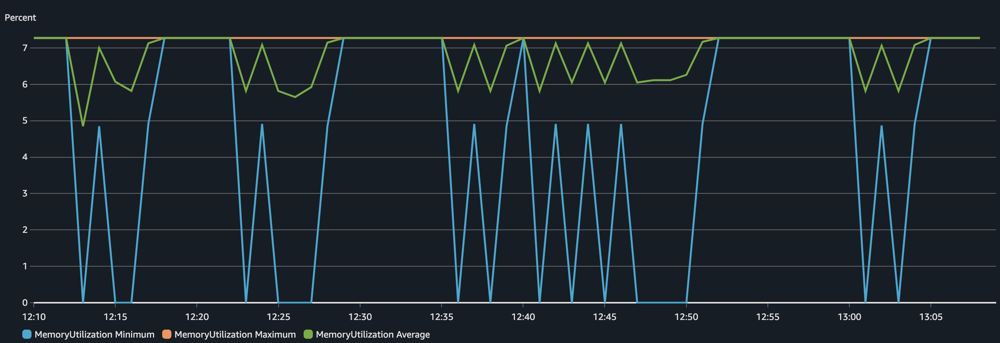
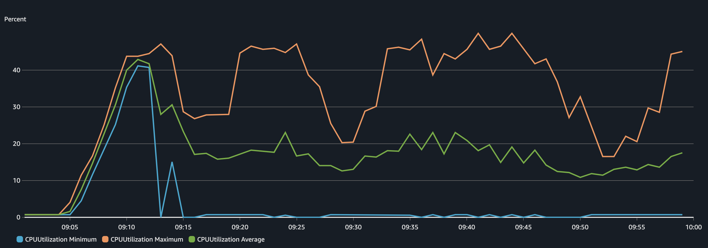
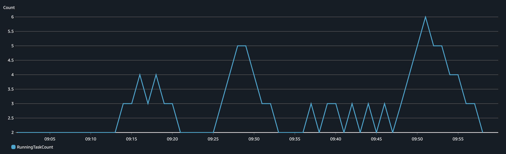

In this blog post we are going to deploy an API using ECS and enable auto-scaling using AWS CDK. We will load test our application using Locust and validate in the AWS Console that our application is able to scale. In reality, a bunch of services and components will be created along the way!

As always, the code used here is available in my [GitHub Repository](http://github.com/felipelaptrin/ecs-load-test).

## Proposed Architecture
For this demo I will use a very similar architecture that I proposed on my [Multi-account deployment using AWS CDK](https://www.felipetrindade.com/cdk-multi-account/) blog post. For simplicity I will skip the CodePipeline deployment and deploy everything manually, but you can easily modify the provided code here to deploy using CodePipeline if you followed the Multi-Account with CDK blog post.


Some important points to mention about the proposed architecture:
- **Expose application using ALB**: The API will be deployed in a private subnet and the service will be exposed via Application Load Balancer (ALB). The Security Group of the API needs to allow inbound traffic from the ALB.
- **Cross Account Image Registry**: The artifacts (docker images) will be deployed in a centralized account that can be used by other workload accounts (e.g. Dev, Staging, Prod...). This is important to assure artifact promotion and was already discussed in the [Consistent deployments - a real-world case scenario](https://www.felipetrindade.com/consistent-deployments/) blog post. Since the API is deployed in a private subnet it required to deploy a [VPC Endpoint](https://docs.aws.amazon.com/AmazonECR/latest/userguide/vpc-endpoints.html) or NAT Gateway (I will use this!) to reach ECR service to pull the docker image.
- **HTTPs handled by ALB**: The users of the API will communicate over HTTPs with the load balancer which is responsible for handling the HTTPs (using a certificate issued by AWS Certificate Manager) connection, while HTTP will be used in the communication between ALB and API (SSL termination at ALB).
- **Route53 should be created in advance**: I will consider that a Route53 hosted zone is already in place and ready to use. If you do not have a domain I highly recommend you to buy a cheap one for testing and experimenting (you can easily find it for under 2 dollars per year!).

## API
I will develop a super simple API that has two routes:
- `GET /api/health`: A simple health check. It's a must-have route to allow the ALB to check if the task is healthy.
- `GET /api/count-prime/{limit}`: Calculates the number of prime numbers lower than a given value. This route is enough to consume some CPU and it will work great during our load test.

Let's check our simple API code:

```py
import time
import os
from typing import Optional

from fastapi import FastAPI, HTTPException
from fastapi.responses import JSONResponse

import random

app = FastAPI(
    title="Backend",
    description="An API with endpoints designed to simulate CPU and memory load.",
    version="1.0.0",
    root_path="/api",
)


@app.get("/health", summary="Healthcheck Endpoint")
async def healthcheck() -> dict:
    return {"status": "ok"}


def is_prime(n):
    """Check if a number is prime."""
    if n < 2:
        return False
    # Only test up to the square root of n for efficiency
    for i in range(2, int(n**0.5) + 1):
        if n % i == 0:
            return False
    return True


def count_primes(limit):
    """Count the number of prime numbers below the given limit."""
    count = 0
    for num in range(2, limit):
        if is_prime(num):
            count += 1
    return count


@app.get("/count-prime/{limit}", summary="Simulate CPU Load")
async def simulate_cpu(limit: int) -> dict:
    start_time = time.time()
    result = count_primes(limit)
    duration = time.time() - start_time

    return {"limit": limit, "result": result, "durationSeconds": duration}


if __name__ == "__main__":
    import uvicorn

    uvicorn.run(
        "main:app", host="0.0.0.0", port=8000, workers=os.getenv("NUMBER_OF_WORKERS", 3)
    )
```

The github repository containing this code also contains some other pieces, such as `requirements.txt` (dependencies) and `Dockerfile`.

## Load Test
Since you are already familiar with the API code, we are ready to understand the load testing. We are going to use one of the most widely used frameworks to load test: [locust](https://locust.io/). The documentation is great and it's simple to use. If you have never used it, don't worry, you will see how easy it is now:

```py
import json

import logging
from locust import HttpUser, task, between
import random

logger = logging.getLogger("logger")
logging.basicConfig(
    level=getattr(logging, "INFO", logging.INFO),
    format="%(asctime)s - %(levelname)s - %(message)s",
)


class Test(HttpUser):
    wait_time = between(1, 3)

    @task
    def prime(self):
        limit = random.randint(10_000, 20_000)
        logger.info(f"Calculating the number of prime number below {limit}...")
        response = self.client.get(f"/api/count-prime/{limit}", name="count-prime")
        response.raise_for_status()
```

When running locust we should specify the max number of users to simulate and the spawn rate (i.e. how fast new users will be created). The load test starts with 0 users and goes up to the maximum number of users defined in the test using the spawn rate defined (e.g. 1 new user per second).

Each user in our load test waits between 1 and 3 before sending an HTTP request to our API (and this will keep repeating until the end of the load test). The limit number to calculate the number of prime is a random number between 10,000 and 20,000.


## IaaC with CDK
We are going to create two stacks in our CDK code:
- `EcrStack`: Created ECR repository that will contain the API image. Should be deployed in the Shared Assets account.
- `EcsStack`: Create the entire ECS infrastructure, VPC, Certificates, Route53 record... Should be deployed in the Development account.

```typescript
// main.ts
#!/usr/bin/env node
import * as cdk from "aws-cdk-lib";
import { EcsStack } from "./stack/ecs";
import { EcrStack } from "./stack/ecr";
import { devConfig, sharedAssetsConfig } from "./config";

const app = new cdk.App();
new EcsStack(app, "EcsStack", devConfig);
new EcrStack(app, "EcrStack", sharedAssetsConfig);
```

The main code basically instantiate both stacks. Let's check in depth the `EcrStack`:

```typescript
// stack/ecr.ts
import * as cdk from "aws-cdk-lib";
import {
  Repository,
  RepositoryEncryption,
  TagMutability,
  TagStatus,
} from "aws-cdk-lib/aws-ecr";
import { Construct } from "constructs";
import { AwsAccount } from "../config";
import { AccountPrincipal, CompositePrincipal } from "aws-cdk-lib/aws-iam";

export interface EcrProps extends cdk.StackProps {
  ecrRepository: string[];
  maxAgeOtherTagsInDays: number;
}

export class EcrStack extends cdk.Stack {
  constructor(scope: Construct, id: string, props: EcrProps) {
    super(scope, id, props);

    const awsAccount = [AwsAccount.Development];
    const allAwsAccounts = awsAccount.map(
      (accountId) => new AccountPrincipal(accountId),
    );
    const principals = new CompositePrincipal(...allAwsAccounts);

    for (const repositoryName of props.ecrRepository) {
      const repository = new Repository(this, repositoryName, {
        repositoryName: repositoryName,
        removalPolicy: cdk.RemovalPolicy.DESTROY,
        imageTagMutability: TagMutability.MUTABLE,
        encryption: RepositoryEncryption.KMS,
      });
      repository.grantPull(principals);
      repository.addLifecycleRule({
        tagPrefixList: ["dev"],
        maxImageCount: 1,
        rulePriority: 1,
      });
      repository.addLifecycleRule({
        description: `Delete images with other tags after ${props.maxAgeOtherTagsInDays} days`,
        tagStatus: TagStatus.TAGGED,
        maxImageAge: cdk.Duration.days(props.maxAgeOtherTagsInDays),
        tagPatternList: ["*"],
        rulePriority: 4,
      });
    }
    cdk.Tags.of(this).add("CreatedBy", "CDK");
  }
}
```

The stack is simple, it basically creates ECR repositories (in our case we will create only a single repository) and allows cross-account pull from the Development account. Some lifecycle rule policies were also created to reduce costs. The tagging strategy used here is tag based on the environment name, i.e. tag named `dev` will be used by the Development environment while a tag named `prod` should be used in the Production environment.

Now, let's check how the `EcsStack` looks in depth:

```typescript
// stack/ecs.ts
import * as cdk from "aws-cdk-lib";
import {
  Certificate,
  CertificateValidation,
  KeyAlgorithm,
} from "aws-cdk-lib/aws-certificatemanager";
import { IpAddresses, Port, SubnetType, Vpc } from "aws-cdk-lib/aws-ec2";
import {
  Cluster,
  Compatibility,
  ContainerImage,
  ContainerInsights,
  EcrImage,
  FargateService,
  LogDriver,
  TaskDefinition,
} from "aws-cdk-lib/aws-ecs";
import {
  ApplicationListener,
  ApplicationLoadBalancer,
  ApplicationProtocol,
  ApplicationTargetGroup,
  HealthCheck,
  ListenerAction,
  ListenerCondition,
  SslPolicy,
} from "aws-cdk-lib/aws-elasticloadbalancingv2";
import {
  ARecord,
  HostedZone,
  IPublicHostedZone,
  RecordTarget,
} from "aws-cdk-lib/aws-route53";
import { Construct } from "constructs";
import { AwsAccount, Environment } from "../config";
import { Repository } from "aws-cdk-lib/aws-ecr";
import { TaskRole } from "aws-cdk-lib/aws-stepfunctions";
import { ManagedPolicy } from "aws-cdk-lib/aws-iam";
import { LoadBalancerTarget } from "aws-cdk-lib/aws-route53-targets";

export interface EcsProps extends cdk.StackProps {
  envName: Environment;
  vpcCidrBlock: string;
  maxAzs: number;
  domain: string;
  backendConfig: EcsFargateServiceDefinition;
}

export interface EcsFargateServiceDefinition {
  name: string;
  cpu: string;
  memoryMiB: string;
  scalability: {
    minCapacity: number;
    maxCapacity: number;
    cpuThresholdPercentage?: number;
  };
  port: number;
  healthCheck: HealthCheck;
  listenerRules: {
    priority: number;
    pathPattern: string;
  };
}

export class EcsStack extends cdk.Stack {
  props: EcsProps;
  hostedZone: IPublicHostedZone;
  vpc: Vpc;

  constructor(scope: Construct, id: string, props: EcsProps) {
    super(scope, id, props);
    this.props = props;

    this.vpc = this.setVpc();

    this.hostedZone = HostedZone.fromLookup(this, "Zone", {
      domainName: props.domain,
    });

    const cluster = new Cluster(this, "EcsCluster", {
      vpc: this.vpc,
      containerInsightsV2: ContainerInsights.ENABLED,
    });
    const { alb, httpsListener } = this.createAlb(this.vpc);

    const backendRepositoryArn = `arn:aws:ecr:${this.props.env?.region}:${AwsAccount.SharedAssets}:repository/${props.backendConfig.name}`;
    const backendImage = ContainerImage.fromEcrRepository(
      Repository.fromRepositoryArn(
        this,
        props.backendConfig.name,
        backendRepositoryArn,
      ),
      this.props.envName,
    );
    this.createFargateService(
      cluster,
      backendImage,
      alb,
      httpsListener,
      this.props.backendConfig,
    );
  }

  setVpc(): Vpc {
    const vpc = new Vpc(this, "Vpc", {
      ipAddresses: IpAddresses.cidr(this.props.vpcCidrBlock),
      maxAzs: this.props.maxAzs,
      subnetConfiguration: [
        {
          cidrMask: 22,
          name: "PrivateForServices",
          subnetType: SubnetType.PRIVATE_WITH_EGRESS,
        },
        {
          cidrMask: 22,
          name: "PublicForServices",
          subnetType: SubnetType.PUBLIC,
        },
      ],
      natGateways: 1,
    });

    return vpc;
  }

  createAlb(vpc: Vpc) {
    const certificate = new Certificate(this, "EcsCertificate", {
      domainName: this.props.domain,
      keyAlgorithm: KeyAlgorithm.RSA_2048,
      validation: CertificateValidation.fromDns(this.hostedZone),
    });

    const alb = new ApplicationLoadBalancer(
      this,
      "EcsApplicationLoadBalancer",
      {
        vpc,
        internetFacing: true,
      },
    );
    alb.connections.allowToAnyIpv4(Port.tcp(80));
    alb.connections.allowToAnyIpv4(Port.tcp(443));
    alb.addListener("Http", {
      protocol: ApplicationProtocol.HTTP,
      port: 80,
      open: true,
      defaultAction: ListenerAction.redirect({
        port: "443",
        protocol: "HTTPS",
        permanent: true,
      }),
    });
    const httpsListener = alb.addListener("Https", {
      protocol: ApplicationProtocol.HTTPS,
      port: 443,
      open: true,
      certificates: [certificate],
      defaultAction: ListenerAction.fixedResponse(404, {
        messageBody:
          "Please configure services to redicted to the ALB correctly",
      }),
      sslPolicy: SslPolicy.RECOMMENDED_TLS,
    });

    return { alb, httpsListener };
  }

  createFargateService(
    cluster: Cluster,
    image: EcrImage,
    loadBalancer: ApplicationLoadBalancer,
    listener: ApplicationListener,
    definition: EcsFargateServiceDefinition,
  ): FargateService {
    const taskDefinition = new TaskDefinition(
      this,
      `EcsServiceTaskDefinition${definition.name}`,
      {
        cpu: definition.cpu,
        compatibility: Compatibility.FARGATE,
        memoryMiB: definition.memoryMiB,
      },
    );
    taskDefinition.addContainer(definition.name, {
      image: image,
      portMappings: [{ containerPort: definition.port }],
      logging: LogDriver.awsLogs({
        streamPrefix: definition.name,
      }),
    });
    taskDefinition.executionRole?.addManagedPolicy(
      ManagedPolicy.fromAwsManagedPolicyName(
        "service-role/AmazonECSTaskExecutionRolePolicy",
      ),
    );

    const service = new FargateService(this, `EcsService${definition.name}`, {
      cluster,
      taskDefinition: taskDefinition,
    });
    loadBalancer.connections.allowTo(service, Port.tcp(definition.port));

    const scaling = service.autoScaleTaskCount({
      maxCapacity: definition.scalability.maxCapacity,
      minCapacity: definition.scalability.minCapacity,
    });
    const cpuMaxMetric = service.metricCpuUtilization({
      statistic: "Maximum",
      period: cdk.Duration.minutes(1),
    });
    const cpuAverageMetric = service.metricCpuUtilization({
      statistic: "Average",
      period: cdk.Duration.minutes(1),
    });

    scaling.scaleOnMetric(`${definition.name}CpuMaxScale`, {
      metric: cpuMaxMetric,
      scalingSteps: [
        {
          lower: 0,
          upper: definition.scalability.cpuThresholdPercentage,
          change: -1,
        },
        {
          lower: definition.scalability.cpuThresholdPercentage,
          upper: 70,
          change: +1,
        },
        { lower: 70, change: +2 },
      ],
      evaluationPeriods: 1,
      cooldown: cdk.Duration.seconds(60),
    });
    scaling.scaleOnMetric(`${definition.name}CpuAverageScale`, {
      metric: cpuAverageMetric,
      scalingSteps: [
        {
          lower: 0,
          upper: definition.scalability.cpuThresholdPercentage,
          change: -1,
        },
        {
          lower: definition.scalability.cpuThresholdPercentage,
          upper: 70,
          change: +1,
        },
        { lower: 70, change: +2 },
      ],
      evaluationPeriods: 1,
      cooldown: cdk.Duration.seconds(60),
    });

    const targetGroup = new ApplicationTargetGroup(
      this,
      `${definition.name}TargetGroup`,
      {
        vpc: this.vpc,
        protocol: ApplicationProtocol.HTTP,
        port: definition.port,
        healthCheck: definition.healthCheck,
        targets: [service],
      },
    );

    listener.addAction(`${definition.name}Action`, {
      conditions: [
        ListenerCondition.hostHeaders([this.props.domain]),
        ListenerCondition.pathPatterns([definition.listenerRules.pathPattern]),
      ],
      priority: definition.listenerRules.priority,
      action: ListenerAction.forward([targetGroup]),
    });

    new ARecord(this, `${this.props.domain}ARecord`, {
      target: RecordTarget.fromAlias(new LoadBalancerTarget(loadBalancer)),
      zone: this.hostedZone,
      recordName: this.props.domain,
    });

    return service;
  }
}
```

This stack is way bigger than the ECR stack so let's explain this step-by-step:
- The Stack class contains three methods:
    - `setVpc`: Created a VPC with NAT Gateway, Public Subnets, Private Subnets, and Route Tables.
    - `createAlb`: Create an ALB with an HTTPS listener (with a Certificate attached to it) and an HTTP listener (that redirects to HTTPS). The ALB allows HTTP (port 80) and HTTPS (port 443) traffic from anywhere.
    - `createFargateService`: Creates the taskDefinition, container definition, and auto scaling policies for the ECS service.
- There are three ways to [auto-scale](https://docs.aws.amazon.com/AmazonECS/latest/developerguide/service-auto-scaling.html) your ECS cluster:
    - `Target Tracking`: Simply select a metric and a target value to scale and ECS will manage everything - e.g. 70% average CPU - and the alarms will try to keep the metric as close to the specified value.
    - `Step scaling`: You will manage the creation of CloudWatch Alarms, the rules to scale and steps of scale-in/scale-out, e.g. create an alarm that monitors average memory and reduce 1 task if below 30% / add 1 task if above 60% / add 2 tasks if above 75%.
    - `Predictive scaling`: You specify a metric and AWS will scale based on historical data of the metric selected. Predictive scaling only scales up, meaning that you will need other scaling methods to scale down. Often used when there is cyclical traffic in our application.
- I chose to not use the [ApplicationLoadBalancedFargateService](https://docs.aws.amazon.com/cdk/api/v2/docs/aws-cdk-lib.aws_ecs_patterns.ApplicationLoadBalancedFargateService.html) construct because it creates a single ALB per service created and my idea was to use a single ALB per ECS Cluster, so we could add other services (e.g. frontend) that would reuse this ALB. Also notice that I've used a `path-based` routing instead of a `subdomain-based` routing (i.e. `/api` forwards to the backend service, while the `/` could forward to the frontend service for example).

Now, let's just define the configuration for each stack.

```typescript
// config/dev.ts
import { Protocol } from "aws-cdk-lib/aws-elasticloadbalancingv2";
import { AwsAccount } from ".";
import { EcsProps } from "../stack/ecs";

export const devConfig: EcsProps = {
  env: {
    account: AwsAccount.Development,
    region: "us-east-1",
  },
  domain: "demosfelipetrindade.top",
  envName: "dev",
  vpcCidrBlock: "10.200.0.0/16",
  maxAzs: 2,
  backendConfig: {
    name: "backend",
    cpu: "1024",
    memoryMiB: "2048",
    port: 8000,
    scalability: {
      minCapacity: 2,
      maxCapacity: 6,
      cpuThresholdPercentage: 40,
    },
    healthCheck: {
      path: "/api/health",
      protocol: Protocol.HTTP,
    },
    listenerRules: {
      priority: 100,
      pathPattern: "/api/*",
    },
  },
};
```

and

```typescript
// config/sharedAssets,ts
import { AwsAccount } from ".";
import { EcrProps } from "../stack/ecr";

export const sharedAssetsConfig: EcrProps = {
  env: {
    account: AwsAccount.SharedAssets,
    region: "us-east-1",
  },
  ecrRepository: ["backend"],
  maxAgeOtherTagsInDays: 7,
};
```

## Running our demo!
The commands to reproduce this demo are available in my GitHub Repository. So let's focus on the results of the demo and suppose that the ECR contains the API image and that the ECS service is already running as expected.

For this load test, I decided to use a spawn rate of 0.25 users per second and 80 max users. I let the test run for almost an hour. Here are the Locust results.


During our test, 116k requests were made to the API, and only 2 requests failed to return to the user and the 99%ile was 260ms. Let's now analyze the charts (RPS, Response Time, and Number of Users).


We can observe that there were some peaks in the 95th percentile but for the most time, the 50th percentile was pretty stable.

Now, let's analyze the infrastructure side: CPU and memory usage of the ECS Service during the load test.





We can see that the application was sensitive in terms of CPU but the memory didn't change much (didn't even reach 10% utilization), that's why we used scaling based on CPU for this application. The Max CPU Utilization varied and peaked several times around 40% (our target set threshold) but after a while, the value dropped significantly. Why? That's because more tasks were added to the service to make sure the CPU goes below 40%. This becomes way more visible in the chart of a number of tasks running.



It's important to comprehend the correlation between CPU increase and number of tasks running. When the CPU peaks, ECS scales up the service. When the CPU goes down, ECS scales down the cluster. The scaling (up and down) of ECS is managed by CloudWatch Alarms that monitor a metric (in our case CPU Average and CPU Maximum) and perform an action when the alarm is `in alarm` state. The ECS service sends metrics (CPU, Memory...) to CloudWatch in [1-minute intervals](https://docs.aws.amazon.com/AmazonECS/latest/developerguide/service-auto-scaling.html). We created four alarms:


Let's take a look at how the Average CPU metric (to scale up) behaves:


This alarm was in alarm state a single time when the average CPU peaked and went beyond the 40% threshold. The alarm to scale down based on the Average CPU will be the opposite of the alarm to scale up! Let's check:


Now let's check the Alarm related to the scaling up of the Maximum CPU metric:


Notice how this metric was triggered several times! As you expect the policy to scale down based on maximum CPU usage will be the opposite.


You might be wondering why the alarms were not triggered when the CPU reached 40% immediately. Well, the reason for that is that it takes a take for ECS to send the metrics, CloudWatch to evaluate and EventBridge trigger the scale up.


## Cya!

Well, I hope you liked this blog post. See you around! 👋