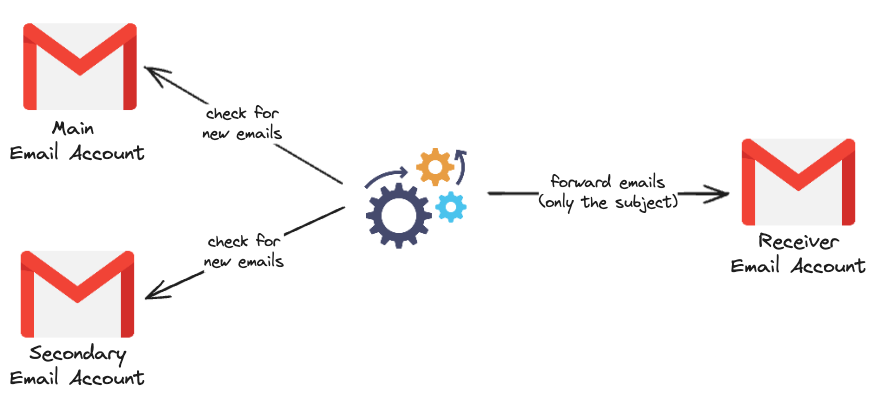
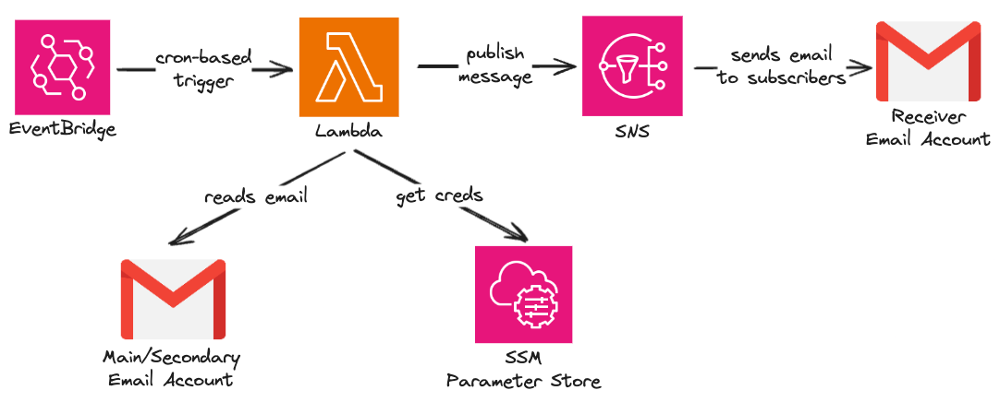
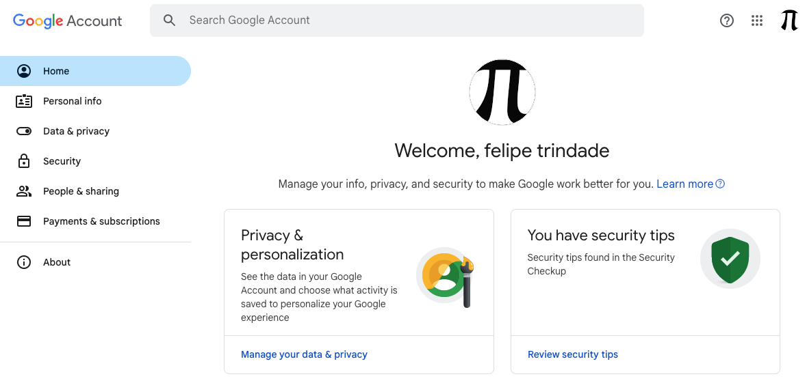
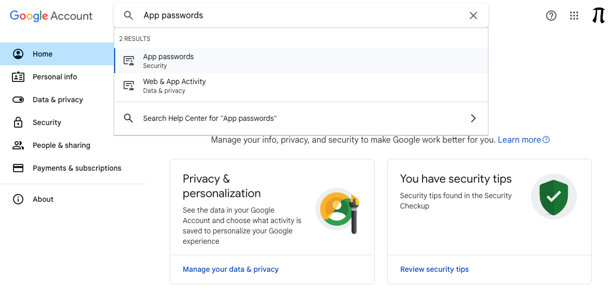
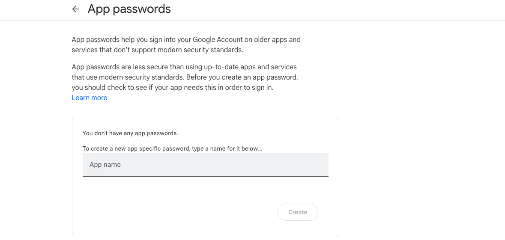
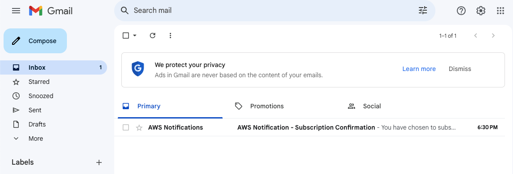
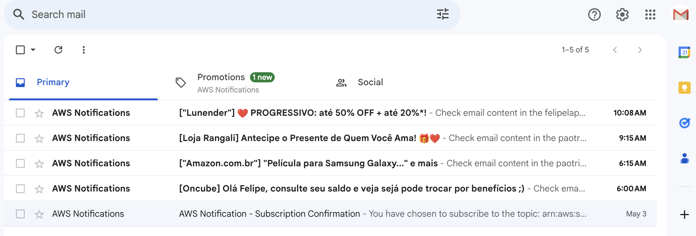
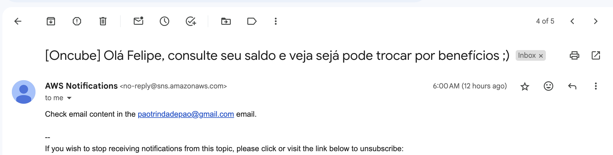

Today we use our phones for absolutely everything and to access everything, such as internet banking, social networks, email, phone calls... And this might be very risky.

In case you want to go directly to the Git repository, please check [here](https://github.com/felipelaptrin/email-forwarder).

## The risk

I remember that I saw a piece of news about a man who had his phone robbed. The thing is that the phone was unblocked. The robber looked for bank apps installed on the phone and for every bank app the robber started the "forget password" procedure. The reset password email was sent to the email of the person who was robbed (the email account was logged into the phone) and the robber had access to his bank account, stealing hundreds of dollars.

The bank security system to reset the password must be more secure, I agree with you. But this doesn't change the fact that the robber with access to the phone and SIM card can reset several accounts of this person (bank apps, social networks, e-commerce account...).

Because of that, I created a new Gmail account that only receives the subject of the emails received by my main and secondary emails and removed the main and secondary email accounts from my phone. This way, even if I had the [bad luck](https://youtu.be/lxxvT4KVqEs) of getting robbed with my phone unlocked I know that at least the robber won't have access to my email, making it very hard for him to reset the password of my bank account. In fact, he will see in my phone that new emails are arriving but since it's only the title of the email (the content won't be forwarded) the robber won't receive the code or link to reset the password of my account.



## Proposed Architecture

The gear icon in the diagram above is composed of several components that will be deployed in the cloud (I used AWS). I will comment on the cost of this project later (spoiler: basically free).

From time to time (cron-based) a code written in Python, using the [IMAP](https://en.wikipedia.org/wiki/Internet_Message_Access_Protocol) protocol, will communicate with the main/secondary email, get the recent emails and forward only the title of these emails to the receiver email account using pub-sub pattern.



This entire infrastructure was created using [AWS CDK](https://aws.amazon.com/pt/cdk/).

## CDK Code
All the infrastructure was created using a single stack:

```typescript
// stack.ts
import { Duration, Stack, StackProps, Tags } from "aws-cdk-lib";
import { Construct } from "constructs";
import { DockerImageFunction, DockerImageCode } from "aws-cdk-lib/aws-lambda";
import path from "path";
import { StringParameter } from "aws-cdk-lib/aws-ssm";
import { InfraConfig } from "./config";
import { Rule, RuleTargetInput, Schedule } from "aws-cdk-lib/aws-events";
import { LambdaFunction } from "aws-cdk-lib/aws-events-targets";
import { Topic } from "aws-cdk-lib/aws-sns";
import { EmailSubscription } from "aws-cdk-lib/aws-sns-subscriptions";

export class EmailForwarderStack extends Stack {
  constructor(scope: Construct, id: string, config: InfraConfig, props?: StackProps) {
    super(scope, id, props);

    const topic = new Topic(this, "Topic", {
      topicName: "email-forwarder",
    });
    topic.addSubscription(new EmailSubscription(config.targetEmail));

    const lambda = new DockerImageFunction(this, "Lambda", {
      description:
        "Cron-based Lambda that checks new email of Gmail accounts and forward the title and sender of the email to another Gmail email",
      functionName: "email-forwarder",
      code: DockerImageCode.fromImageAsset(path.join(__dirname, "../../", "lambda")),
      environment: {
        SNS_TOPIC_ARN: topic.topicArn,
      },
      timeout: Duration.seconds(config.lambda.timeoutInSeconds),
      memorySize: config.lambda.memoryInMiB,
      deadLetterTopic: topic,
      architecture: config.lambda.architecture,
    });
    topic.grantPublish(lambda);

    for (const email of config.sourceEmail) {
      const [username, domain] = email.split("@");

      const parameterEmail = new StringParameter(this, `Email${username}`, {
        parameterName: `/email/${domain}/${username}/email`,
        stringValue: email,
      });
      parameterEmail.grantRead(lambda);
      const parameterPassword = new StringParameter(this, `Email${username}Password`, {
        parameterName: `/email/${domain}/${username}/password`,
        stringValue: "ChangeMe",
      });
      parameterPassword.grantRead(lambda);
      const parameterId = new StringParameter(this, `Email${username}LatestId`, {
        parameterName: `/email/${domain}/${username}/latest-id`,
        stringValue: "ThisWillBeManagedByTheLambda",
      });
      parameterId.grantRead(lambda);
      parameterId.grantWrite(lambda);

      const unit = config.lambda.triggerRateInMinutes == 1 ? "minute" : "minutes"
      const triggerRule = new Rule(this, `TriggerRule${username}`, {
        schedule: Schedule.expression(`rate(${config.lambda.triggerRateInMinutes} ${unit})`),
      });
      triggerRule.addTarget(
        new LambdaFunction(lambda, {
          event: RuleTargetInput.fromObject({
            parameterStore: {
              lastEmailIdRead: parameterId.parameterName,
              email: parameterEmail.parameterName,
              password: parameterPassword.parameterName,
            },
          }),
        }),
      );
    }

    Tags.of(this).add("Repository", "https://github.com/felipelaptrin/email-forwarder");
    Tags.of(this).add("ManagedBy", "CDK");
  }
}
```

As you can see we are deploy the following resources:
- `SNS Topic`: The topic will be used to forward the subjects of the emails to the receiver Gmail account. So in this topic there will be a single subscriber (the receiver account).
- `Lambda`: It's the "brain" of the project, will contain the code responsible for reading the emails from the main/secondary Gmail account and publish this message into the SNS topic. Notice that I'm using a monorepo and the application code of the lambda sits on the same repository and we are building the Docker image of the Lambda during CDK deployment.
- `Parameters`: We are going to store the credentials to the main/secondary account and the last ID read by the Lambda (more on that later).
- `EventBridge Rule`: This allows us to trigger the Lambda passing as parameter the name of the parameter store that has the credentials of the emails.

This code is completely generic (things are not hardcoded) and you can customize it by editing the `config.ts` file.

```typescript
import { Architecture } from "aws-cdk-lib/aws-lambda";

export interface LambdaProps {
  timeoutInSeconds: number;
  memoryInMiB: number;
  triggerRateInMinutes: number;
  architecture: Architecture;
}

export interface InfraConfig {
  sourceEmail: string[];
  targetEmail: string;
  lambda: LambdaProps;
}

export const config: InfraConfig = {
  sourceEmail: ["felipelaptrin@gmail.com", "paotrindadepao@gmail.com"],
  targetEmail: "emailsfelipetrindade@gmail.com",
  lambda: {
    timeoutInSeconds: 60,
    memoryInMiB: 256,
    triggerRateInMinutes: 15,
    architecture: Architecture.ARM_64, // This must match your architecture (since we are building during deployment)
  },
};
```

Notice that you can completely modify your use case.

## Lambda code
I decided to go for a more OOP-oriented code and created the following classes:

```python
# ssm.py
import boto3
from envs import AWS_REGION

ssm = boto3.client('ssm', region_name=AWS_REGION)

class ParameterStore:

    def get_parameter(self, name: str) -> str:
        try:
            response = ssm.get_parameter(Name=name)
            value = response['Parameter']['Value']
            return value.strip()

        except Exception as e:
            print(f'Error fetching parameter from SSM Parameter Store: {str(e)}')

    def update_parameter(self, name: str, value: str) -> None:
        try:
            ssm.put_parameter(
                Name=name,
                Value=value,
                Overwrite=True
            )
        except Exception as e:
            print(f'Error trying to update parameter from SSM Parameter Store: {str(e)}')
```

This class is responsible for retrieving and recording data from/in the Parameter Store. I also created a class to interact with the SNS topic.


```python
# sns.py
import boto3
from email_reader import Email
from envs import AWS_REGION, SNS_TOPIC_ARN

sns = boto3.client('sns', region_name=AWS_REGION)

class SNS:
    def send_message(email: Email, original_email: str) -> None:
        try:
            sns.publish(
                TargetArn=SNS_TOPIC_ARN,
                Subject=f"[{email.sender}] {email.title}",
                Message=f"Check email content in the {original_email} email."
            )

        except Exception as e:
            print(f'Error publish message to topic: {str(e)}')
```

The last class I created was responsible for managing the Email read.

```python
# email_reader.py
import email
import imaplib
from dataclasses import dataclass
from typing import List

from ssm import ParameterStore

imap = imaplib.IMAP4_SSL("imap.gmail.com")

@dataclass
class Email:
    id: int
    title: str
    sender: str

@dataclass
class Parameters:
    lastEmailIdRead: str
    email: str
    password: str

class EmailReader:
    def __init__(self, parameters: Parameters):
        self.parameters = parameters
        self.parameter_store = ParameterStore()
        self.email = self.parameter_store.get_parameter(self.parameters.email)
        self.imap = self.login()
        self.latest_email_read = self.get_latest_email_read()


    def login(self) -> imaplib.IMAP4_SSL:
        imap = imaplib.IMAP4_SSL("imap.gmail.com")

        password = self.parameter_store.get_parameter(self.parameters.password)
        imap.login(self.email, password)

        return imap

    @staticmethod
    def __decode_str(string: str):
        """Decode email header string."""
        decoded_header = email.header.decode_header(string)
        result = []
        for decoded_part, charset in decoded_header:
            if isinstance(decoded_part, bytes):
                if charset:
                    decoded_part = decoded_part.decode(charset)
                else:
                    decoded_part = decoded_part.decode()
            result.append(decoded_part)
        return ''.join(result)

    def read_emails(self) -> List[Email]:
        imap = self.imap
        emails = []

        emails_to_read_ids = [
            str(id_as_int).encode('ascii')
            for id_as_int
            in range(self.latest_email_read+1, self.get_latest_email_receive()+1)
        ]
        print(f"There are {len(emails_to_read_ids)} to be read...")

        for email_id in emails_to_read_ids:
            _, msg_data = imap.fetch(email_id, '(RFC822)')
            imap.store(email_id, '-FLAGS', '\\Seen') # Mark as unread

            for response_part in msg_data:
                if isinstance(response_part, tuple):
                    msg = email.message_from_bytes(response_part[1])
                    sender = self.__decode_str(msg['from'].split(" <")[0])
                    read_email = Email(
                        id=email_id,
                        title= self.__decode_str(msg['subject']),
                        sender = sender,
                    )
                    print(f"Email ==> {read_email}")
                    emails.append(read_email)
        return emails

    def update_latest_email_read(self, most_recent_email_id: int):
        try:
            print("Updating parameter store ")
            self.parameter_store.update_parameter(
                self.parameters.lastEmailIdRead,
                str(most_recent_email_id)
            )
        except Exception as e:
            raise Exception(e)

    def get_latest_email_read(self) -> int:
        try:
            value = self.parameter_store.get_parameter(
                name=self.parameters.lastEmailIdRead
            )
            # The below if statement will only be executed once (first run after infra is created)
            if value == "ThisWillBeManagedByTheLambda":
                print("Bootstraping the Parameter store with ID value")
                self.update_latest_email_read(self.get_latest_email_receive())
                return self.get_latest_email_receive()
            return int(value)
        except Exception as e:
            print(e)

    def get_latest_email_receive(self) -> int:
        imap = self.imap
        imap.select('INBOX')
        _, email_ids = imap.search(None, 'ALL')
        email_ids = email_ids[0].split()

        latest_email_id = email_ids[-1]
        return int(latest_email_id.decode('ascii'))
```

Something that I think it's worth mentioning:
- IMAP reads emails by the index of the email. So the first email your Gmail got has index `1`, the second has index `2` and so on until the most recent email you have.
- If we store the last read email ID (I used Parameter Store for that) we can check the most recent email ID and the last email ID read and forward only those that were not read.
- I don't want you to deal with this ID thing manually, so the first time the code runs (after you deploy the infra), it will set the last email read as the last email you received (so the first time it runs it won't email you, it will only setup the Parameter Store).

And finally, the entrypoint of our lambda:

```python
# main.py
import os

from email_reader import EmailReader, Parameters
from envs import (
    PARAMETER_STORE_EMAIL,
    PARAMETER_STORE_EMAIL_PASSWORD,
    PARAMETER_STORE_LAST_EMAIL_ID_READ,
)
from sns import SNS


def lambda_handler(event, context):
    print(f"Event ==> {event}")
    print(f"Context ==> {context}")

    reader = EmailReader(Parameters(**event["parameterStore"]))
    emails = reader.read_emails()
    if emails:
        for email in emails:
            print("Sending email...")
            SNS.send_message(email, reader.email)
        max_id = max(emails, key=lambda email: email.id).id
        reader.update_latest_email_read(int(max_id.decode('ascii')))

if(os.getenv('LOCAL_DEVELOPMENT') == 'TRUE'):
   print("---- Running the code locally ----")
   lambda_handler({
       "parameterStore": {
           "lastEmailIdRead": PARAMETER_STORE_LAST_EMAIL_ID_READ,
           "email": PARAMETER_STORE_EMAIL,
           "password": PARAMETER_STORE_EMAIL_PASSWORD,
          }
    }, None)
```

Now that you know how the infrastructure and code works let's check how you can implement that too.

## Pricing

AWS offers a generous free tier for the services we use:

- `Parameter Store`: Standard parameters are free. The interaction (retrieve/update value) with the parameter costs `$0.05` per 10,000 interactions.
- `EventBridge Rule`: Free for our use case.
- `SNS`: 1,000 notifications are free, after that $2 per 100,000 notifications.
- `Lambda`: This varies based on the memory and execution time of the Lambda. Using a Lambda of 512MB and 5s for each execution and running every 1 minute we will use around `110,000GB-s/month`. The free tier is 1 million invocations per month and 400,000Gb-s of compute time. So for us, this will be free.

So this is very likely to be free for you!

## Deployment

To make it more user-friendly I will do a step-by-step guide to help you setup all of this. Follow this in order!

### Gmail settings

The first thing we need to do is to access your [Gmail settings](https://mail.google.com/mail/u/0/#settings/general) and make sure the `IMAP` is enabled (check the `Forwarding and POP/IMAP` tab).

After that let's create a new App Password for us to use with the IMAP.

1) Access [Google Settings](https://myaccount.google.com/?hl=en)



2) Search for `App Passwords`



3) Create a new app password and copy the password value after creation



Make sure to do all these steps in the email accounts you want to secure, in my case I have two (so I did this for both accounts).

### Infrastructure deployment

To make the development live easier I set up [DevBox](https://www.jetify.com/devbox/docs/) in the project. So you only need to have DevBox installed and run `devbox shell` to install all the dependencies of the project (NodeJS, Yarn...).

1) Install the dependencies

```sh
devbox shell
```

2) Move to the `infrastructure` folder

```sh
cv infrastructure
```

3) Install NodeJS dependencies

```sh
yarn
```

4) Modify the `config.ts` file accordingly

5) Deploy the infrastructure

```sh
yarn cdk deploy
```

Make you have AWS credentials setup in place and that your account-region is already [CDK bootstraped](https://docs.aws.amazon.com/cdk/v2/guide/bootstrapping.html).

6) Check the receiver email and accept the subscribe email from Amazon SNS



6) Go to the AWS console and update the parameter(s) that contain your password (e.g. `/email/gmail.com/<YOUR_EMAIL>/password`) to used the app password you copied.

## Final result

Finally! Now we are receiving our forwarded emails as expected!






## Cya!
I hope you liked this new blog post! See you around! 👋
