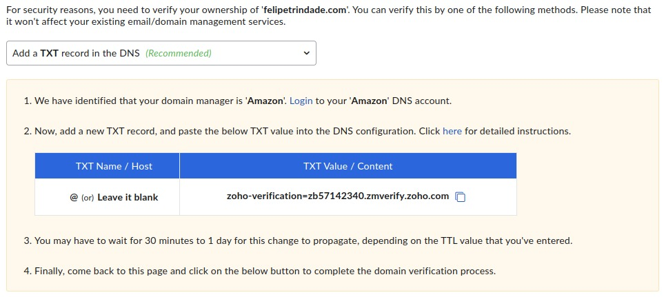
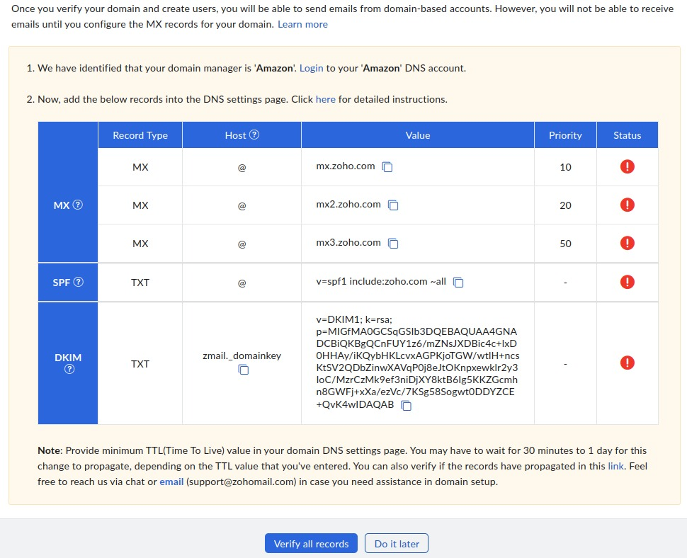
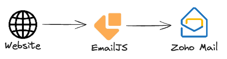

If you own a domain (in my case `felipetrindade.com`) you can easily configure a free email provider and start using your custom email (e.g. `contact@felipetrindade.com`). This is so much more professional!

## Stack

#### Infra as Code
As you probably know, DevOps Engineers hate to do manual things. That's why I'm going to avoid as maximum as I can manual steps and I will configure our custom email provider using [Pulumi](https://www.pulumi.com/) with Typescript as Infrastructure as Code tool.

#### DNS
I will consider that your domain is already being managed by AWS Route53. This is not necessary, you can manage your domain in the registrar (the website you bought your domain, e.g. GoDaddy, Namecheap...), but since the code I wrote using Pulumi is specific this is a pre-requirement for following this post.

#### Email provider
There are myriad options of email providers out there, such as Google Workspace, Zoho, ProtonMail, Outlook, AOL, Yahoo... What we want is a free email provider (or one that has a free plan that is enough for our use case).

I'm very used to Gmail, but I'm not willing to pay around [$5](https://workspace.google.com/pricing) per month to use barely use Gmail (Google Workspace). Oh, just for reference I paid $15 (second year) for a full year for my domain on NameCheap. And I pay around `$0.5` per month to maintain my [static blog/website](https://felipetrindade.com/static-website-s3-cloudfront/). So domain + website cost me around `$21` per year... This is the same as 4 months of Google Workspace in the cheapest plan. So, I don't think it is worth it (for my use case).

[Zoho](https://www.zoho.com/mail/zohomail-pricing.html?zredirect=f&zsrc=langdropdown&lb=pt-br) provided a good free plan for my use case, but another good alternative is [Proton](https://proton.me/pricing).

## Zoho configuration
Configuring Zoho is straightforward, you need to create the account, follow the steps and soon you will be presented with the following screen:



After configuring this DNS record (we will get there!) the following screen will be displayed:



## Pulumi code
To configure Zoho to be the email provider for your domain you need to create TXT and MX records in your DNS (AWS Route53). I created a generic class for this:

```typescript
// email.ts
import { route53 } from "@pulumi/aws"
import { ICommonProps } from "./commons"

export interface ICommonProps {
  domainName: string
  accountId: string
  zoneId: string
}

interface Record {
  type: "MX" | "TXT"
  subdomain?: string
  value: string[]
}

export interface IEmail {
  record: Record[]
  commonProps: ICommonProps
}

export class Email {
  id: string
  props: IEmail

  constructor(id: string, props: IEmail) {
    this.id = id
    this.props = props
    this.setRecords()
  }

  setRecords(): void {
    for(let i=0; i<this.props.record.length; i++){
      const subdomain = this.props.record[i].subdomain ?? '';
      new route53.Record(`${this.id}-${i}-record`, {
        zoneId: this.props.commonProps.zoneId,
        name: subdomain,
        type: this.props.record[i].type,
        records: this.props.record[i].value,
        ttl: 300
      })
    }
  }
}
```

We need to instantiate this class in two parts. The first TXT DNS record and then we apply the Pulumi configuration and after it's configured we apply the rest of the records.

```typescript
// index.ts
import { Email } from "./email"

export const commonProps: ICommonProps = {
  domainName: "felipetrindade.com",
  accountId: "1111111111111",
  zoneId: "Z123456789ABCDEFGHI00",
}

export const emailConfig: IEmail = {
  record: [{
    type: "TXT",
    value: ["zoho-verification=zb57142340.zmverify.zoho.com"]
  }],
  commonProps: commonProps,
}

new Email("email", emailConfig)
```

After you apply this (`pulumi up`), the second DNS screen will be displayed and you can edit this file to be:


```typescript
// index.ts
import { Email } from "./email"

export const commonProps: ICommonProps = {
  domainName: "felipetrindade.com",
  accountId: "1111111111111",
  zoneId: "Z123456789ABCDEFGHI00",
}

export const emailConfig: IEmail = {
  record: [{
    type: "TXT",
    value: [
      "zoho-verification=zb57142340.zmverify.zoho.com",
      "v=spf1 include:zoho.com ~all",
    ],
    },{
    type: "MX",
    value: [
      "10 mx.zoho.com",
      "20 mx2.zoho.com",
      "50 mx3.zoho.com",
    ],
    },{
    type: "TXT",
    subdomain: "zmail._domainkey",
    value: ["v=DKIM1; k=rsa; p=MIGfMA0GCSqGSIb3DQEBAQUAA4GNADCBiQKBgQCnFUY1z6/mZNsJXDBic4c+lxD0HHAy/iKQybHKLcvxAGPKjoTGW/wtlH+ncsKtSV2QDACinwXAVqP0j8eJtOKnABCwklr2y3IoC/MzrCzMk9ef3ni1Vg8ktB6Ig5KKZGcmhn8GWFj+xXa/ezVc/7KSgABCogwt0DDYZCE+QvK4wIDAQAB"]
  }],
  commonProps: commonProps,
}

new Email("email", emailConfig)
```

## Email Forwarder
In case you want to set up a `Contact `Me` page on your website you will need to configure an email forwarder to forward the message to your email provider (in our case, Zoho).

I did that on my website, as you can check [here](https://felipetrindade.com/contact/). I've used [EmailJS](https://www.emailjs.com/) which gives me 200 emails per month in the free plan. This is more than enough for my website!




## Cya
Hope you liked this post! Stay tuned for the following posts!