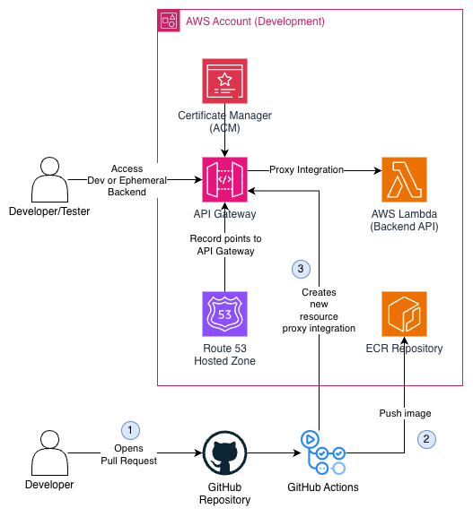
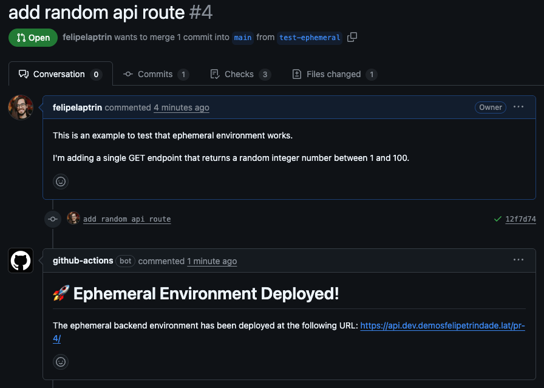
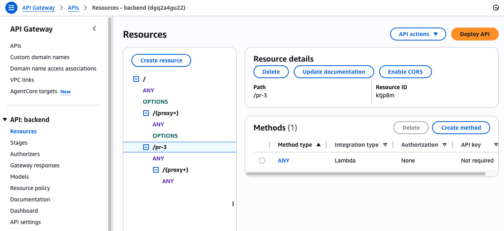
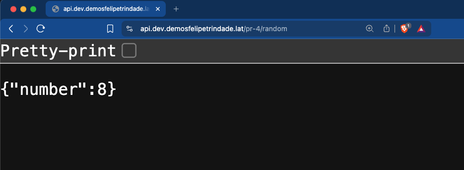
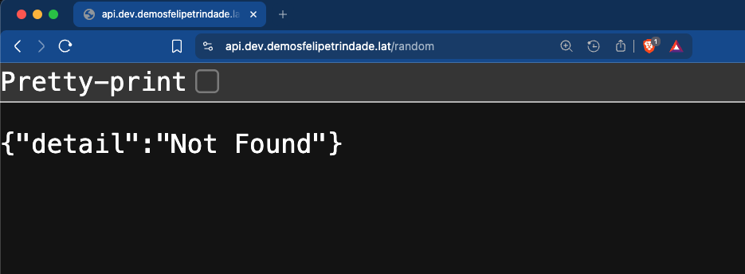

Today, I will cover a strategy for ephemeral environments for backend applications hosted in AWS Lambda behind an API Gateway. So today's goal is to deploy a short-lived environment that exists during the pull request lifecycle, helping the developers and testers make sure the code change implements what is expected, without having to merge to the dev/qa environment to test the changes on a lower environment.

For this demo, I will use AWS CDK (with Typescript) and GitHub Actions.

All the code used for this demo is available in my [GitHub Repository](https://github.com/felipelaptrin/ephemeral-environment-backend-serverless)!

## Architecture

The architecture is fairly simple: an API Gateway with a custom domain (e.g., `api.mydomain.com`) that points to a Lambda Function (using proxy integration) that serves as an API.

The proposed solution in this blog post has some considerations:
- The Lambda uses [AWS Lambda Web Adapter](https://github.com/awslabs/aws-lambda-web-adapter) in order to run APIs on AWS Lambda (e.g., fastapi, flask, next, express...).
- Although I'll be using FastAPI (Python), you can use any other API framework that is compatible with the Lambda Web Adapter mentioned.
- The proposed solution is agnostic in terms of the IaC tool. I'll be using CDK, but the same result could be achieved with Terraform, Pulumi, or even AWS CLI. Here, what matters is the proposed idea.

So, based on the architecture, you should expect to have an endpoint deployed that your web page or other service would call (e.g., HTTP GET `api.mydomain.com/users/123`). The API Gateway has a root `/` resource and a `/{proxy+}` that will be used to [proxy](https://docs.aws.amazon.com/apigateway/latest/developerguide/api-gateway-set-up-simple-proxy.html) all routes to the Lambda, and the Lambda will handle the request. The API Gateway will target a Lambda Alias that points to the environment (i.e., `dev`).

## Flow of the Ephemeral Environment

The ephemeral environment deployed will have the same lifespan as the pull request, so we are aiming for the following flow:

1) Developer opens a Pull Request with code changes
2) GitHub Actions runs a workflow that builds and deploys the image to the ECR repository. It creates a lambda alias (e.g., `pr-4`), updates the `$LATEST` version of the lambda to the image that was just pushed, adds the [REMOVE_BASE_PATH](https://github.com/awslabs/aws-lambda-web-adapter) (more on that on step 3) environment variable, and creates a new Lambda version pointing to the lambda alias created. Then, it creates a new API Gateway with Lambda alias proxy integration (e.g., `pr-4`).

The biggest reason to not use $LATEST version of the Lambda directly is that new versions are created from the $LATEST version, so it doesn't make sense to modify the $LATEST version (that would point to dev) when deploying to the ephemeral environment.

3) A comment is added to the pull request with the link to access the ephemeral environment.

It is important to mention that the ephemeral environment here is using a `path-based` model, instead of a `subdomain-based` model (e.g., `pr-4.api.mydomain.com`). This is because during Pull Request, we are creating a new API Gateway proxy resource with `pr-4` as the name. So every request that has `pr-4` in the path will be forwarded to the ephemeral environment lambda alias. This is the main reason for us to use the `REMOVE_BASE_PATH`: the API calls to the ephemeral environment will be routed by the newly created API Gateway resource (i.e., `pr-4` in the example). So we need to remove this base path before sending the payload to the API code, otherwise, we would expect a `not found` response.

4) Developer/QA/Tester checks the ephemeral environment and verifies the changes
5) Pull Request gets approved and merged
6) GitHub Action runs a workflow to delete the ephemeral environment (i.e., deletes Lambda alias, version, and API Gateway resource) and the comment in the Pull Request with the URL.

This is a simple flow that is very powerful and can be extended to meet different needs.

Suppose the following [Pull Request](https://github.com/felipelaptrin/ephemeral-environment-backend-serverless/pull/4/files) that creates a new endpoint `/random` that generates a pseudo-random number. During the Pull Request, the endpoint will be available in the ephemeral environment:

But if you try to access the dev environment, the endpoint will not be there:

## Code
I don't think it will be beneficial to copy and paste code from the demo [GitHub Repository](https://github.com/felipelaptrin/ephemeral-environment-backend-serverless). So I recommend that you go over the code there and deploy it yourself!

## Cya!
Hope you liked this blog post!

See you around! 👋
