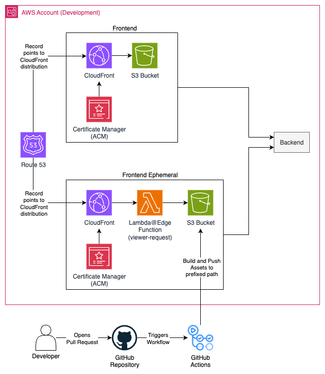
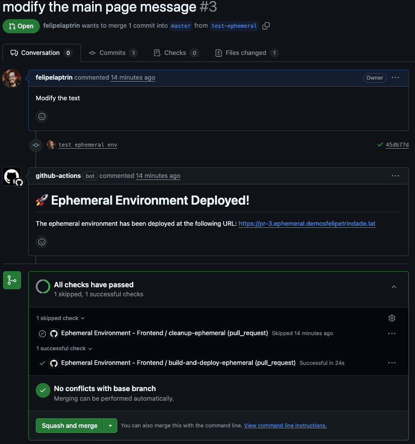
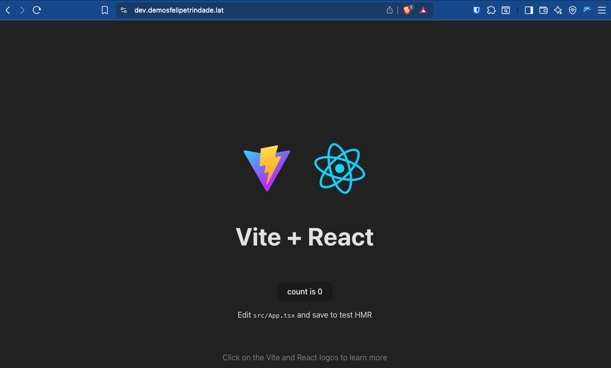
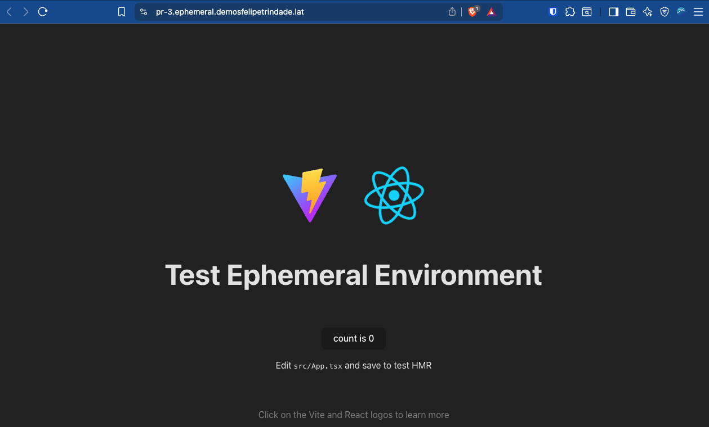

Today I will cover a strategy for ephemeral environments for frontend (static websites) applications, i.e., a short-lived frontend deployment will exist during the pull request lifecycle, and this will help the developers and testers make sure the code change implements what is expected, without having to merge to dev environment to test.

For this demo I will use Terraform, GitHub Actions and AWS (CloudFront + S3 for the frontend). In case you do not know how to deploy a static frontend application, I recommend you check two blog posts I've posted in the past: [Deploying a static website on AWS using S3 and CloudFront
](https://www.felipetrindade.com/static-website-s3-cloudfront/) and [Deploying a serverless, cheap, and scalable infrastructure using Terraform in AWS
](https://www.felipetrindade.com/serverless-infra/).

All the code used for this demo is available in my [GitHub Repository](https://github.com/felipelaptrin/ephemeral-environment-frontend)!

## Architecture
The architecture of this demo is fairly simple but has some interesting points to be commented on.

This demo will not deploy a backend application, but usually the static website interacts with a backend application, so that's why I added it in the architecture diagram. The code for this demo involves the deployment of a dev environment frontend and an ephemeral environment frontend. This is not a must-have, but I wanted to isolate the dev environment from the ephemeral environment, especially because the ephemeral environment will require a Lambda@Edge function to rewrite the path (more on that later), and the dev deployment does not need it (at least in my code it doesn't). The idea is that the ephemeral frontend environment will use the dev backend.

Our goal is to have an ephemeral environment (frontend) for every Pull Request opened and access the environment using a dedicated (subdomain-based) URL. So, the idea is actually very simple:
- Have a dedicated CloudFront + S3 infrastructure for  the ephemeral environment. This is very cheap!
- Set up an `ephemeral.<DOMAIN>` certificate for the CloudFront and create the domain records pointing to the CloudFront.
- For every Pull Request, build the code and push it to the S3 bucket that serves as the origin of this distribution. Objects in S3 will be prefixed by the pull request number, e.g., `pr-10`.
- A `viewer-request` Lambda@Edge function will be used to rewrite the URI to the appropriate folder, i.e., if the user accesses `pr-15.ephemeral.<DOMAIN>`, the Lambda will fetch `/pr-15/index.html` in the bucket (and the same logic applies to all the other static assets).

## Flow

The ephemeral environment deployed will have the same lifespan as the pull request, so we are aiming for the following flow:

1) Developer opens a Pull Request with code changes
2) GitHub Actions runs a workflow that builds and deploys the code to the S3 bucket (prefixed by the pull request number). This workflow runs for every new commit in the pull request, i.e. the ephemeral environment will always be up-to-date with the pull request code.
3) A comment is added to the pull request with the link to access the ephemeral environment

4) Developer/QA/Tester checks the ephemeral environment and verifies the changes
5) Pull Request gets approved and merged
6) GitHub Action runs a workflow to delete the ephemeral environment (i.e., deletes files from S3) and the comment in the Pull Request with the URL.

This is a simple flow that is very powerful and can be extended to meet different needs. In this demo, I've used [Vite](https://vite.dev/) template and deployed it to the dev environment.

When the Pull Request was opened to modify the message, the following ephemeral environment was deployed:

Check the URL of each screenshot! As you can see, I'm deploying an ephemeral environment for the frontend. You can even check my Pull Request [here](https://github.com/felipelaptrin/ephemeral-environment-frontend/pull/3).

## Code
I don't think it will be beneficial to copy and paste code from the demo [GitHub Repository](https://github.com/felipelaptrin/ephemeral-environment-frontend). So I recommend that you go over the code there and deploy it yourself!

## Considerations
I think some DevOps Engineers might disagree that what we have here is an ephemeral environment, since there is already an environment in place (S3 + CloudFront + Lambda@Edge deployed beforehand). I don't agree with this point of view since, in the end, we have an isolated environment per pull request. Also, CloudFront is a slow service, in the sense that it takes a long time to be provisioned, so I don't think it's smart to create it on the fly. Also, by having dedicated ephemeral environment resources already deployed, we speed up the deployment and avoid some quota limitations. These services are billed based on usage, so if no pull request is made, then you *basically* won't get billed.

The frontend code used in this project was a Vite template. In a real-world application, things are way more complex, so you should expect changes in the CI/CD, such as adding environment variables before building the frontend, or end-to-end tests, integration with SSO...

There are several other ways of achieving the same thing I did here. This solution is not a silver bullet and has pros/cons over other solutions. Be critical and adapt to the situation.

## Cya!
Hope you liked this blog post! Ephemeral environment is a really interesting topic and the strategy to deploy it varies a lot based on the compute/data stack used (e.g. Kubernetes, ECS, Lambda, EC2...). Here I presented an ephemeral environment strategy for S3 + CloudFront (frontend) deployments.

See you around! 👋
