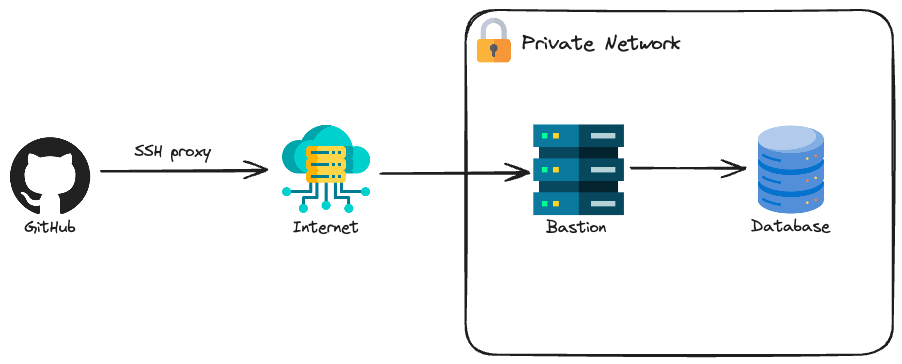
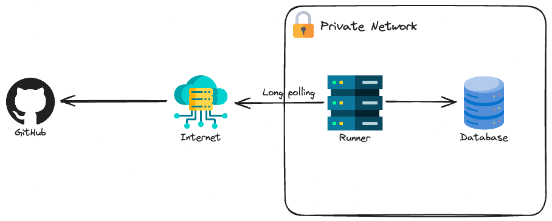

The demo GitHub repository with all the code for this project can be accessed [here](https://github.com/felipelaptrin/iac-private-resources/).

The goal of this blog post is to present two ways of configuring private resources. First, let's define what I mean by private resources. Private resources are resources that are not accessible directly via the internet, i.e. are resources that are contained in a private network. When I say "resources" I'm talking about configurations for applications/services (that are typically a Terraform resource). A good example is a DB/User in a database (which is typically deployed in a private network and can't be accessed directly), but it could have been a configuration for [Harbor](https://registry.terraform.io/providers/goharbor/harbor/latest), [Keycloak](https://registry.terraform.io/providers/mrparkers/keycloak/latest) or any other service that can be configured. For this demo we want to create a DB in a database service.

Notice that I'm not talking about resources that are deployed privately but can be configured because the API is public. For example, the creation of these services (e.g. Amazon RDS) is in general not a problem because they are being created in a cloud provider (e.g. AWS) and the API for creating these resources is public (but requires authentication). Configuring all "cloud-related" topics for these services is not a problem (e.g. replication, backup, instance size...) but the internal configuration of this service (e.g. database creation, db user creation) requires you to connect to these services and do the configuration yourself.

It is important to have these services in a private network because it's a security risk to expose them publicly so it's not worth the risk of having it exposed to easy access versus the risk that you will face in case of an attack.

In this blog post, I will cover two common approaches to this problem:
- **SSH Proxy**: Using a bastion host as to SSH-proxy the connection to the private resource
- **Self Host**: Instead of using the bastion as a proxy, the entire CI/CD to configure these resources can be deployed inside the private network

For this project, I'll be using [Vultr](https://www.vultr.com/) Cloud and [Opentofu](https://opentofu.org/) (the open-source version of Terraform). I wouldn't skip this in case you are looking for an AWS approach, what matters here are the concepts, that you can easily replicate to AWS scenario.

## SSH-proxy
This is a well-known solution when users need to connect to private resources. The idea is to deploy a virtual machine publicly so only the developers have access and connect to this instance using SSH. Once the connection is established, the developers can access all the resources deployed inside the internal network (of course, if the firewall allows it). Ideally, you should also restrict the IPs that can connect to the bastion, but one bad thing is that usually, internet service providers (ISP) give you a dynamic IP. You can have a plan that gives you a static IP but it's usually way more expensive.



This is usually a cheap approach because you typically deploy a virtual machine that is small since this machine won't run workloads of application and will serve only as a network proxy for your internal network.

Let's check how can we create a private network with a bastion host and database.

```hcl
# variables.tf
variable "public_ssh_key" {
  description = "Public SSH key to attach to the authorized_keys of the bastion host"
  type        = string
}
```

A single variable will be used here: the public SSH key to attach to the `authorized_keys` file of the bastion host.

```hcl
# main.tf
locals {
  region = "mia" # Miami
  label  = "ssh-proxy"
}

############################
###### Networking
############################
resource "vultr_vpc" "this" {
  region         = local.region
  v4_subnet      = "10.0.0.0"
  v4_subnet_mask = 24
}

resource "vultr_firewall_group" "bastion" {
  description = "Bastion Firewall"
}

resource "vultr_firewall_rule" "bastion" {
  firewall_group_id = vultr_firewall_group.bastion.id
  protocol          = "tcp"
  ip_type           = "v4"
  subnet            = "0.0.0.0"
  subnet_size       = 0
  port              = "22"
  notes             = "Allow all SSH from anywhere"
}
############################
###### Virual Machine
############################
resource "vultr_ssh_key" "bastion" {
  name    = "bastion"
  ssh_key = var.public_ssh_key
}

resource "vultr_instance" "bastion" {
  region              = local.region
  vpc_ids             = [vultr_vpc.this.id]
  plan                = "vc2-1c-1gb"
  os_id               = data.vultr_os.ubuntu.id
  backups             = "disabled"
  label               = local.label
  firewall_group_id   = vultr_firewall_group.bastion.id
  ssh_key_ids         = [vultr_ssh_key.bastion.id]
  enable_ipv6         = true
  disable_public_ipv4 = false
  ddos_protection     = false
  activation_email    = false
}

############################
###### Database
############################
resource "vultr_database" "this" {
  region                  = local.region
  vpc_id                  = vultr_vpc.this.id
  plan                    = "vultr-dbaas-hobbyist-cc-1-25-1"
  database_engine         = "pg"
  database_engine_version = "15"
  label                   = local.label
  trusted_ips = [
    "${vultr_instance.bastion.internal_ip}/32",
  ]
}

resource "postgresql_database" "this" {
  name = "demodb"
}
```


```hcl
# versions.tf
terraform {
  required_providers {
    vultr = {
      source  = "vultr/vultr"
      version = "2.21.0"
    }
    postgresql = {
      source  = "cyrilgdn/postgresql"
      version = "1.22.0"
    }
  }
}

provider "vultr" {}

module "db_tunnel" {
  source  = "flaupretre/tunnel/ssh"
  version = "2.2.1"

  target_host = vultr_database.this.host
  target_port = vultr_database.this.port

  gateway_host = vultr_instance.bastion.main_ip
  gateway_user = "root"
}

provider "postgresql" {
  host     = module.db_tunnel.host
  port     = module.db_tunnel.port
  username = vultr_database.this.user
  password = vultr_database.this.password
  database = vultr_database.this.dbname
}
```


```hcl
# data.tf
data "vultr_os" "ubuntu" {
  filter {
    name   = "name"
    values = ["Ubuntu 22.04 LTS x64"]
  }
}
```

Notice that for simplicity, I'm allowing the bastion instance firewall to receive traffic from anywhere but this is not a best practice in terms of security, as commented before.

Terraform does not have a built-in feature to SSH-proxy, that's why you need to implement it. There is a really good module called [tunnel](https://registry.terraform.io/modules/flaupretre/tunnel/ssh/latest) that I've used to create this SSH-proxy tunnel and reference the database host as the "localhost" of the runner.

## Self-Hosted
The self-hosted approach is a very interesting approach for configuring private resources. You are fully responsible for the security, availability, operating system, and software tools presented in the runner. For the demo, I will use GitHub Action self-hosted runner.

There are two important considerations:
- This might be an expensive solution for smaller teams in terms of maintenance and servers. Developers are expensive, maybe it is not suitable for your team to "spend" developer time to configure, maintain and deploy self-hosted runners. Also, it's unlikely that there will be jobs running late at night, so paying for an infrastructure (remember that a server to run a CI/CD will usually require more CPU/Memory to run tests, build, and stress-test) that is not in use can be expensive for a small company. Of course, you can create automation to turn on and off the servers but, again, more developer work.
- Do not use self-hosted runners if your repository is [public](https://docs.github.com/en/actions/hosting-your-own-runners/managing-self-hosted-runners/about-self-hosted-runners#self-hosted-runner-security). This is because if the repository is public anyone can fork your repository and create a pull request that executes code in a workflow, which can be treated as a security risk.



The code for provisioning this infrastructure is really similar to the one we've used in the SSH-proxy.

```hcl
# variables.tf
variable "repo_name" {
  description = "Github repository name including the owner (e.g. felipelaptrin/my-repo)"
  type        = string
}

variable "public_ssh_key" {
  description = "Public SSH key to attach to the authorized_keys of the self-hosted runner host"
  type        = string
}

variable "github_actions_version" {
  description = "Version that the self-hosted runner will use. You can check all version here: https://github.com/actions/runner/releases"
  type        = string
  default     = "v2.319.1"
}
```

Notice that in addition to the SSH key to connect to the self-hosted runner host (in this case only to debug if needed), there are two more variables: the GitHub runner version and the repository name that the self runner will be configured (needed to retrieve the runner token to connect to GitHub and register the runner).

```hcl
# main.tf
locals {
  region                 = "mia" # Miami
  label                  = "self-hosted"
  github_actions_version = split("v", var.github_actions_version)[1]
  repo_name              = split("/", var.repo_name)[1]
}

############################
###### Networking
############################
resource "vultr_vpc" "this" {
  region         = local.region
  v4_subnet      = "10.0.0.0"
  v4_subnet_mask = 24
}

resource "vultr_firewall_group" "runner" {
  description = "Github self-runner Firewall"
}

resource "vultr_firewall_rule" "runner" {
  firewall_group_id = vultr_firewall_group.runner.id
  protocol          = "tcp"
  ip_type           = "v4"
  subnet            = "0.0.0.0"
  subnet_size       = 0
  port              = "22"
  notes             = "Allow all SSH from anywhere"
}

############################
###### Virual Machine
############################
resource "vultr_ssh_key" "runner" {
  name    = "runner"
  ssh_key = var.public_ssh_key
}

resource "vultr_instance" "runner" {
  region              = local.region
  vpc_ids             = [vultr_vpc.this.id]
  plan                = "vc2-1c-1gb"
  os_id               = data.vultr_os.ubuntu.id
  backups             = "disabled"
  label               = local.label
  firewall_group_id   = vultr_firewall_group.runner.id
  ssh_key_ids         = [vultr_ssh_key.runner.id]
  enable_ipv6         = true
  disable_public_ipv4 = false
  ddos_protection     = false
  activation_email    = false
  user_data           = <<EOF
#!/bin/bash
echo "ubuntu ALL=(ALL) NOPASSWD: ALL" >> /etc/sudoers
cd /home/ubuntu && mkdir actions-runner && cd actions-runner
curl -o actions-runner-linux.tar.gz -L https://github.com/actions/runner/releases/download/${var.github_actions_version}/actions-runner-linux-x64-${local.github_actions_version}.tar.gz
tar xzf ./actions-runner-linux.tar.gz
sudo chown -R ubuntu /home/ubuntu/actions-runner
sudo -u ubuntu ./config.sh --name vultr --replace --url https://github.com/${var.repo_name} --token ${sensitive(data.github_actions_registration_token.this.token)}
sudo -u ubuntu ./run.sh
  EOF

  lifecycle {
    ignore_changes = [
      user_data
     ]
  }
}

############################
###### Database
############################
resource "vultr_database" "this" {
  region                  = local.region
  vpc_id                  = vultr_vpc.this.id
  plan                    = "vultr-dbaas-hobbyist-cc-1-25-1"
  database_engine         = "pg"
  database_engine_version = "15"
  label                   = local.label
  trusted_ips = [
    "${vultr_instance.runner.internal_ip}/32",
  ]
}

resource "postgresql_database" "this" {
  name = "demodb"
}
```


```hcl
# versions.tf
terraform {
  required_providers {
    vultr = {
      source  = "vultr/vultr"
      version = "2.21.0"
    }
    github = {
      source  = "integrations/github"
      version = "6.2.3"
    }
    postgresql = {
      source  = "cyrilgdn/postgresql"
      version = "1.22.0"
    }
  }
}

provider "vultr" {}

provider "github" {}

provider "postgresql" {
  host     = vultr_database.this.host
  port     = vultr_database.this.port
  username = vultr_database.this.user
  password = vultr_database.this.password
  database = vultr_database.this.dbname
}
```


```hcl
# data.tf
data "vultr_os" "ubuntu" {
  filter {
    name   = "name"
    values = ["Ubuntu 22.04 LTS x64"]
  }
}

data "github_actions_registration_token" "this" {
  repository = local.repo_name
}
```

Notice that now we are directly connecting to the database: not proxy, just direct connection.


## CI/CD using GitHub Actions
We don't want to apply things manually, let's use a pipeline workflow to deploy our infrastructure using GitHub Actions! The idea is simple:
- **During pull request**: Plan the actions that will be performed and [commit](https://stackoverflow.com/questions/67963719/should-terraform-lock-hcl-be-included-in-the-gitignore-file) the [dependency lock file](https://developer.hashicorp.com/terraform/language/files/dependency-lock).
- **When pull request is merged**: Deploy the infrastructure.

Two jobs were created (one for ssh-proxy and the other one for self-hosted) and to not repeat code two composite actions (plan and deploy) were also created. Let's check the actions first

```yaml
# .github/actions/plan/action.yaml
name: plan
description: Plan IaC

inputs:
  folder:
    description: Name of the folder that terraform will run
    required: true

runs:
  using: "composite"
  steps:
    - name: Install devbox
      uses: jetify-com/devbox-install-action@v0.11.0

    - name: Configure Git
      shell: bash
      run: |
        git config --global user.name "github-actions[bot]"
        git config --global user.email "github-actions[bot]@users.noreply.github.com"

    - uses: webfactory/ssh-agent@v0.9.0
      with:
        ssh-private-key: ${{ env.SSH_PRIVATE_KEY }}

    - name: Plan
      shell: bash
      env:
        FOLDER: ${{ inputs.folder }}
        VULTR_API_KEY: ${{ env.VULTR_API_KEY }}
        AWS_ACCESS_KEY: ${{ env.AWS_ACCESS_KEY }}
        AWS_SECRET_ACCESS_KEY: ${{ env.AWS_SECRET_ACCESS_KEY }}
        GITHUB_TOKEN: ${{ env.PAT_GITHUB }}
      run: |
        devbox run tofu -chdir=$FOLDER init
        devbox run tofu -chdir=$FOLDER plan -var-file=variables.tfvars

    - name: Install GH CLI
      uses: dev-hanz-ops/install-gh-cli-action@v0.1.0
      with:
        gh-cli-version: 2.54.0

    - name: Commit .terraform.lock.hcl files
      working-directory: ${{ inputs.folder }}
      if: github.ref != 'refs/heads/main'
      env:
        GITHUB_TOKEN: ${{ env.GITHUB_TOKEN }}
      shell: bash
      run: |
        if [ -n "$(git status --porcelain)" ]; then
          gh pr checkout ${{ github.event.pull_request.number }}
          git add .
          git commit -m "Add .terraform.lock.hcl files"
          git push
        else
          echo "Nothing to commit."
        fi
```

```yaml
# .github/actions/apply/action.yaml
name: apply
description: Apply IaC

inputs:
  folder:
    description: Name of the folder that opentofu will run
    required: true

runs:
  using: "composite"
  steps:
    - name: Install devbox
      uses: jetify-com/devbox-install-action@v0.11.0

    - uses: webfactory/ssh-agent@v0.9.0
      with:
        ssh-private-key: ${{ env.SSH_PRIVATE_KEY }}

    - name: Apply Opentofu
      shell: bash
      env:
        FOLDER: ${{ inputs.folder }}
        VULTR_API_KEY: ${{ env.VULTR_API_KEY }}
        AWS_ACCESS_KEY: ${{ env.AWS_ACCESS_KEY }}
        AWS_SECRET_ACCESS_KEY: ${{ env.AWS_SECRET_ACCESS_KEY }}
        GITHUB_TOKEN: ${{ env.GITHUB_TOKEN }}
      run: |
        devbox run tofu -chdir=$FOLDER init
        devbox run tofu -chdir=$FOLDER apply -var-file=variables.tfvars -auto-approve
```

Notice that several env vars are required to fully plan/run Opentofu:
- `VULTR_API_KEY`: [Required](https://registry.terraform.io/providers/vultr/vultr/latest/docs) to authenticate with Vultr Cloud. This API Key is safely stored in the GitHub Secrets of the repository.
- `AWS_ACCESS_KEY` and `AWS_SECRET_ACCESS_KEY`: I didn't paste the [backend.tf](https://github.com/felipelaptrin/iac-private-resources/blob/main/self-hosted/backend.tf) code because it's not relevant to the post, but I've configured a Vultr Object Storage (similar to S3) to store the state of Opentofu and these environment variables are [required](https://docs.vultr.com/how-to-store-terraform-state-in-vultr-object-storage). This keys are safely stored in the GitHub Secrets of the repository.
- `GITHUB_TOKEN`: Notice that in the plan action, I'm using two different values for this environment value. The first one is [automatically](https://docs.github.com/en/actions/security-for-github-actions/security-guides/automatic-token-authentication) created by GitHub and it's being used to use GitHub Bot to commit the dependency lock files of Opentofu. The second value is my GitHub PAT token (Personal Access Token) that is being used to get the token to register the self-hosted runner (check the `data.tf` file of the self-hosted manifests). This PAT token is safely stored in the GitHub Secrets of the repository.
- `SSH_PRIVATE_KEY`: This is the private SSH key that can be used to connect to the bastion host and self-hosted runer. The latter is necessary only in case of debug, since all the self-runner configuration is being done in the user_data script.

Now, let's chack how the workflow looks like

```yaml
# .github/workflows/main.yaml
name: "Opentofu Actions"
on:
  pull_request:
  push:
    branches:
      - main

env:
  AWS_ACCESS_KEY: "${{ secrets.AWS_ACCESS_KEY }}"
  AWS_SECRET_ACCESS_KEY: "${{ secrets.AWS_SECRET_ACCESS_KEY }}"
  VULTR_API_KEY: "${{ secrets.VULTR_API_KEY }}"
  SSH_PRIVATE_KEY: ${{ secrets.SSH_PRIVATE_KEY }}

permissions:
  contents: write

jobs:
  ssh-proxy:
    runs-on: ubuntu-latest
    steps:
      - name: "Checkout"
        uses: actions/checkout@v4

      - name: Plan ssh-proxy
        if: github.ref != 'refs/heads/main'
        uses: ./.github/actions/plan
        env:
          GITHUB_TOKEN: ${{ secrets.GITHUB_TOKEN }}
          PAT_GITHUB: ${{ secrets.PAT_GITHUB }}
        with:
          folder: ssh-proxy

      - name: Apply ssh-proxy
        if: github.ref == 'refs/heads/main'
        uses: ./.github/actions/apply
        env:
          GITHUB_TOKEN: ${{ secrets.PAT_GITHUB }}
        with:
          folder: ssh-proxy

  self-hosted:
    runs-on: self-hosted
    steps:
      - name: "Checkout"
        uses: actions/checkout@v4

      - name: Plan self-hosted
        if: github.ref != 'refs/heads/main'
        uses: ./.github/actions/plan
        env:
          GITHUB_TOKEN: ${{ secrets.GITHUB_TOKEN }}
          PAT_GITHUB: ${{ secrets.PAT_GITHUB }}
        with:
          folder: self-hosted

      - name: Apply self-hosted
        if: github.ref == 'refs/heads/main'
        uses: ./.github/actions/apply
        env:
          GITHUB_TOKEN: ${{ secrets.PAT_GITHUB }}
        with:
          folder: self-hosted
```

Great!

Wait, we are not over! Did you notice the chicken and the egg problem when using self-hosted? Well, we want to run a CI/CD pipeline to deploy our infrastructure. This infrastructure declares the runner that the CI/CD will run (self-hosted). When you commit this, GitHub Actions will try to run this on the self-hosted runners (that does not exist) and it's trying to create itself. Not good.

How can we solve that? This is what we call a bootstrap process. We can do this in a two-step process:
- Comment the resource `postgresql_database.this` (`data.tf` file) and modify the `runs-on` input of the `self-hosted` job to use `ubuntu-latest`.
- Apply the infrastructure (via GitHub Actions managed runners). After done, uncomment the resource `postgresql_database.this` and add back `self-hosted` input.

That's one way of doing this. You can also use scrips or have a completely separate workflow only for setting the self-hosted runners to solve this problem.

## Cya
Hope you enjoyed this blog post! See you in the next post! 👋
