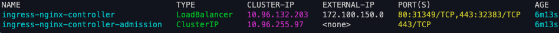

The goal of this post is to teach you (explaining the concepts, problems and doing a demo) how to create a local Kubernetes cluster, expose your application using an Load Balancer and manage the traffic using Ingress using Linux and MacOs.

I will slowly explain the logic behind the setup and the need for every tool used here. If you want to check the code directly you can take a look on the [GitHub repository](https://github.com/felipelaptrin/local-kubernetes-ingress-load-balancer). Let's start!

## Local Kubernetes cluster
There are several tools to run Kubernetes locally, such as [Kind](https://kind.sigs.k8s.io/), [k3s](https://k3s.io/), [k3d](https://k3d.io/v5.7.2/), [Minikube](https://minikube.sigs.k8s.io/docs/start/?arch=%2Fmacos%2Farm64%2Fstable%2Fbinary+download). My personal choice is always Kind because it's lightweight (Kind stands for Kubernetes in Docker) because it runs in containers instead of virtual machines and is one of the few tools (if not the only) that allows you to run a multi node cluster (multi control plane and multi worker nodes), which is very handy to test affinity, tolerance, rolling restarts... So we are going to use Kind to provision a local Kubernetes cluster.

Since Kind uses containers we also need to choose a container runtime to run our containers (nodes of the Kubernetes cluster). I will stick to `Docker Desktop` for MacOs and Linux, which comes by default when you intall Docker.

For MacOs there are other options, such as [Colima](https://github.com/abiosoft/colima) or [Orbstack](https://orbstack.dev/). Due to Docker Inc [licence agreement change](https://www.docker.com/blog/updating-product-subscriptions/) (Docker Desktop is no longer free for enterprise usage), some engineers decided to use Colima, since an open-source project, to setup the container environment. In my case Docker Desktop is fine, specially because for the Kubernetes set up I'll comment in this blog post I will need a tool that is only supported in Docker Desktop.

## Docker container network
To run containers in MacOs you will need to run them inside a Linux virtual machine (VM), since Docker containers run o a Linux kernel. This means that Docker Desktop and Colima, for exameple, will create VMs to run your containers.

This reminds me of Matrix. In fact, when running a container in MacOs we are running the container inside a Virtual Machine. So in MacOs, when you run a container with port-forward (e.g. `docker container run nginx -p 3000:80`) the traffic gets routed to the VM and then the VM routes the request to the container inside it.

So, using MacOs, because the containers run inside a Virtual Machine we can't directly access their network interface, there is no traffic by default to the VM. We could configure the iptable and routing rules to send traffic from MacOs to the VM and then set forward traffic rules to the Kind network. This is tedious. I way better and automatic approach of managing that is to install [docker-mac-net-connect](https://github.com/chipmk/docker-mac-net-connect). This tool allow us to directly connect to the ip of the container.

Let's give an example to make it easier to understand. Without the tool installed I will run an nginx container without port-forward (`docker container run -d --name nginx nginx`). Without port-forward you won't be able to access this container. Let's check the IP of the container (`NGINX_IP=$(docker inspect --format '{{ .NetworkSettings.IPAddress }}' nginx)`) and try to run a curl (`curl $NGINX_IP). You will get a timeout. You simply can't reach the container, there is no traffic. Now, install the `docker-mac-net-connect` tool and you will see that you are able to get a response from the NGINX container! Don't forget to kill the container we created for testing (docker rm -f nginx).

If you are a Linux user, you can ignore all the previous explanation. In Linux, you have direct access to the docker network interface and can access the containers directly by IP!

## MetalLB

This setup is completely local (similar to an on-premise environment), there is no cloud involved so if you want to expose your application using a LoadBalancer you will need to have a tool to create this LoadBalancer for you inside your cluster. The most popular tool is, by far, [MetalLB](https://metallb.universe.tf/). MetalLb provides a network load balancer implementation, i.e. allows you to create Kubernetes services of type LoadBalancer in clusters that don't run on a cloud provider.

To use MetalLb you will need to define two things (considering you have already installed it in your cluster):
- The IPs that MetalLb will assign to the load balancer. Notice that for our use-case, this IP must be in the same network space (network CIDR) of our local Kubernetes cluster. This is done by instanciating a Kubernetes resource of kind `IPAddressPool` (a custom resource that comes with MetalLB installation).
- Announce the IPs of the load balancer to make the network beyond our cluster aware of the IPs of the LoadBalancers. This can be achieve using two routing protocols: ARP/NDP (OSI Layer 2) or BGP. This is done by instanciating a Kubernetes resource of kind `L2Advertisement` for ARP. BGP set up is more specific and we won't use in this demo, so I won't comment to make this post less confusing.

To summarize, MetalLb allow us to expose your applications (demo comes soon!). So if we deploy an application (e.g. Kubernetes Deployment) and expose this application using Kubernetes service of type `LoadBalancer`, MetalLB will assign one IP for our service and user using this IP can access our applications.

## Ingress Controller
Let's be honest, directly using IPs to access application is something tedious and no one does that. We access applications using names (e.g. `myapp.mydomain.tld`). Also, if we expose every application with a load balancer we might run out of IPs.

A common practice is to re-use the LoadBalancer and internally (inside Kubernets) forward the traffic to the requested service. There are several cloud-agnostic ingress controllers, such as [NGINX Ingress](https://docs.nginx.com/nginx-ingress-controller/) and [Traefik](https://doc.traefik.io/traefik/). Since I'm more familiar with NGINX Ingress will use it in this post.

## Demo time
For this demo I will assume you have:
- [docker-mac-net-connect](https://github.com/chipmk/docker-mac-net-connect)
- [Kubectl](https://kubernetes.io/docs/tasks/tools/#kubectl)
- [Kind](https://kind.sigs.k8s.io/)
- [Docker](https://www.docker.com/)
- [Helm](https://helm.sh/)


For a better experience, please check the content of [GitHub repository](https://github.com/felipelaptrin/local-kubernetes-ingress-load-balancer) containing all code needed to run this demo.

### Creating the Kind Cluster

The MetalLB IPs need to be in the range of the IPs of the cluster. I good strategy is to before the Kubernetes cluster creation to create the range of IPs we want our Kubernetes cluster to be in. This way the Kubernetes manifest for the MetalLB ip pool (`IPAddressPool`) won't need to be modified. This docker network will be used by our Kind cluster on the following step.

```sh
docker network create --subnet 172.100.0.0/16 custom-kind-network
```

Now, let's create our local Kind cluster with two nodes: one control-plane and one worker.

```sh
cat <<EOF > /tmp/kind-config.yaml
kind: Cluster
apiVersion: kind.x-k8s.io/v1alpha4
nodes:
- role: control-plane
  image: kindest/node:v1.30.2
- role: worker
  image: kindest/node:v1.30.2
EOF
KIND_EXPERIMENTAL_DOCKER_NETWORK=custom-kind-network kind create cluster --config /tmp/kind-config.yaml
```

You can check the nodes of the cluster by running `docker ps`.

### Installing MetalLB

Install MetalLB using Helm.

```sh
helm repo add metallb https://metallb.github.io/metallb
helm install metallb -n metallb --create-namespace metallb/metallb
sleep 5
kubectl wait -n metallb -l app.kubernetes.io/component=controller --for=condition=ready pod --timeout=120s
```

Now, let's create a range of IPs (that must be inside the docker network we just created).

```sh
kubectl apply -f - <<EOF
apiVersion: metallb.io/v1beta1
kind: IPAddressPool
metadata:
  name: ip-pool
  namespace: metallb
spec:
  addresses:
  - 172.100.150.0-172.100.150.10
EOF
```

Notice that we are allocating 10 IPs for load balancer in our local cluster, which is more than enought for this demo.

Now, using ARP protocol, let's announce these IPs.

```sh
kubectl apply -f - <<EOF
apiVersion: metallb.io/v1beta1
kind: L2Advertisement
metadata:
  name: advertisement-l2
  namespace: metallb
spec:
  ipAddressPools:
  - ip-pool
EOF
```

### Install NGINX Ingress

Install NGINX Ingress using Helm.

```sh
helm repo add ingress-nginx https://kubernetes.github.io/ingress-nginx
helm repo update
helm install ingress-nginx -n ingress-nginx --create-namespace ingress-nginx/ingress-nginx
```

Run `kubectl get service -n ingress-nginx` to notice that NGINX Ingress create a service of type Load Balancer (and MetalLB assigned an external ip to this Load Balancer in the range we specified before). This will be used later!




### Deploy application with LoadBalancer service

Let's deploy an application that uses LoadBalancer service type.

```sh
kubectl apply -f - <<EOF
apiVersion: apps/v1
kind: Deployment
metadata:
  labels:
    app: app-load-balancer
  name: app-load-balancer
  namespace: default
spec:
  replicas: 1
  selector:
    matchLabels:
      app: app-load-balancer
  template:
    metadata:
      labels:
        app: app-load-balancer
    spec:
      containers:
      - image: nginx
        name: nginx
        command:
          - sh
          - -c
          - "echo 'Hello, from app-load-balancer' > /usr/share/nginx/html/index.html && nginx -g 'daemon off;'"
EOF
```

And for the service:

```sh
kubectl apply -f - <<EOF
apiVersion: v1
kind: Service
metadata:
  labels:
    app: app-load-balancer
  name: app-load-balancer
  namespace: default
spec:
  ports:
  - port: 80
    protocol: TCP
    targetPort: 80
  selector:
    app: app-load-balancer
  type: LoadBalancer
EOF
```

Now, let's check if our application was correctly provisioned with a Load Balancer service with an external IP (run `kubectl get service -n default`).


Now, let's check if we can access this service via Load Balancer external IP (`172.100.150.1`).


### Deploy application with Ingress

Let's deploy an application that uses the NGINX Ingress. Starting with the deployment manifest:

```sh
kubectl apply -f - <<EOF
apiVersion: apps/v1
kind: Deployment
metadata:
  labels:
    app: app-ingress
  name: app-ingress
  namespace: default
spec:
  replicas: 1
  selector:
    matchLabels:
      app: app-ingress
  template:
    metadata:
      labels:
        app: app-ingress
    spec:
      containers:
      - image: nginx
        name: nginx
        command:
          - sh
          - "-c"
          - "echo 'Hello, from app-ingress' > /usr/share/nginx/html/index.html && nginx -g 'daemon off;'"
EOF
```

The service

```sh
kubectl apply -f - <<EOF
apiVersion: v1
kind: Service
metadata:
  labels:
    app: app-ingress
  name: app-ingress
  namespace: default
spec:
  ports:
  - port: 80
    protocol: TCP
    targetPort: 80
  selector:
    app: app-ingress
  type: ClusterIP
EOF
```

And finally the ingress

```sh
kubectl apply -f - <<EOF
apiVersion: networking.k8s.io/v1
kind: Ingress
metadata:
  name: app-ingress
  namespace: default
spec:
  ingressClassName: nginx
  rules:
  - host: app-ingress.local
    http:
      paths:
      - path: /
        pathType: Prefix
        backend:
          service:
            name: app-ingress
            port:
              number: 80
EOF
```

The `app-ingress` application is exposed by the NGINX Ingress Load Balancer and routed accordingly by the Ingress resource. In order to locally resolve "app-ingress.local" we will need to add this entry to our `/etc/hosts` file. If it was a real Kubernetes deployment we would add an A record to the DNS server. To be honest, you can setup a local DNS server (using dnsmasq for example) to specify that all `.local` names should be resolved to the IP of the NGINX Load Balancer. This is specially useful if you have several services exposed locally (`/etc/hosts` does not support wildcard, so we would need to add an entry for every service we expose via Ingress).

Get the NGINX Ingress IP

```sh
INGRESS_LB_IP=$(kubectl get svc ingress-nginx-controller -n ingress-nginx -o jsonpath='{.status.loadBalancer.ingress[0].ip}')
echo "Add $INGRESS_LB_IP to /etc/hosts"
```

Now add this IP to the `/etc/hosts` file

```sh
echo "$INGRESS_LB_IP app-ingress.local" | sudo tee -a /etc/hosts
```

Now access `http://app-ingress.local`. Check if the application is accessible.


If you are done with the demo just run the command below to destroy the Kubernetes cluster.

```sh
kind delete cluster
```

## Cya
Hope you enjoyed this blog post! There only a few resources online explaining how to do that using MacOs, because the VMs is tricky. This demo works for both Linux and MacOs and I hope you found it helpful!

See you in the next post! 👋