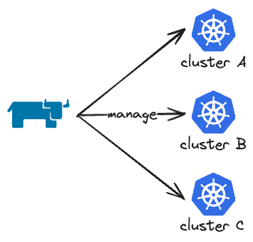
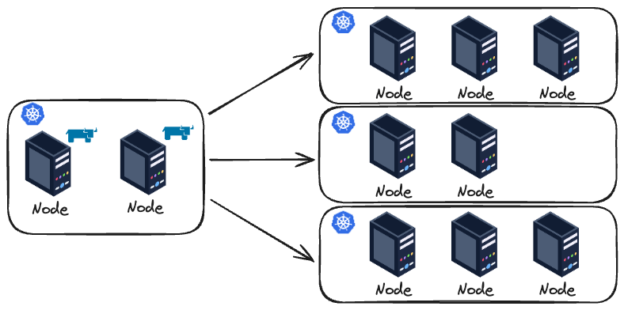
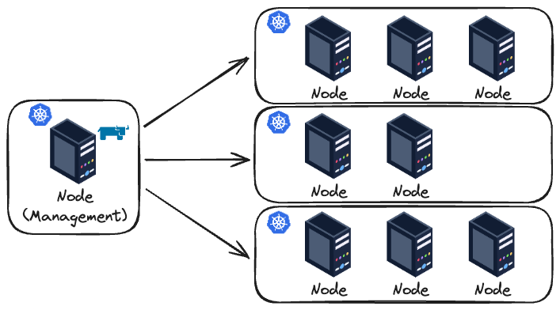
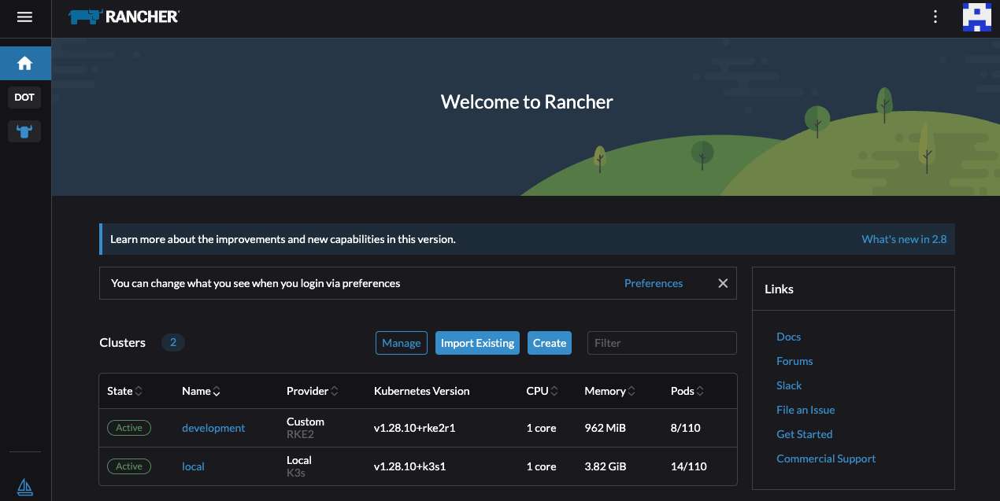

If you want to go directly to the code/source code you can check my [GitHub repository](https://github.com/felipelaptrin/on-premise-k8s). Otherwise, let's start to comment about Rancher, Vagrant, OpenTofu/Terraform!

## Rancher
I usually like to understand a tool by asking questions such as: what is the problem that the tool is trying to solve? How the tool can solve this problem? So let's go directly to these questions:

- **The problem**: Managing Kubernetes at scale is complex and a real challenge. You need to manage things such as multi-cluster, standardization, security/access, and deploy applications consistently across clusters.
- **What is Rancher?**: Rancher is an open-source platform to simplify the deployment, management and operation of Kubernetes clusters (cloud, on-prem or hybrid). It makes it easier to solve the mentioned problem because:
1) It acts as a centralized tool for managing all clusters
2) You can use GUI and CLI
3) Cluster provisioning is all done by Rancher, which is perfect for on-premise clusters
4) Provides authentication and RBAC for access/permission control
5) Provides built-in monitoring and logging compatible with Prometheus and Grafana

and many more!

- **Basic Diagram**: I'm a very visual person, so even simple diagrams help me visualize things.


### Deployment and Installation
Rancher can be deployed in several cloud providers (AWS, GCP, Azure, Linode, DigitalOcean...) or bare metal. You can use your preferred IaC tool (such as Terraform, Pulumi or even Ansible) to configure and deploy the environment that will have Rancher installed. In this blog post, I will use a virtual machine, provisioned via Vagrant, that will deploy Rancher using Terraform. It doesn't matter the deployment method you are going to use, you just need to make sure that Rancher can reach (network) the Kubernetes cluster that it's going to provision/manage.

Rancher can be [installed](https://ranchermanager.docs.rancher.com/getting-started/installation-and-upgrade#overview-of-installation-options) in several different ways. There is no right or wrong, each one has pros and cons when compared to other methods. Let's check a few ways of doing that:

- **Multi-cluster**: For the production environment you NEED high availability, so you should set up at least three (3) nodes when using RKE and two (2) nodes when using K3s (don't freak out about RKE or K3s, I will comment about them soon!). Using Helm as a Kubernetes Package Manager makes your life easier to install Rancher on multiple nodes on the management Kubernetes cluster that will have Rancher installed.




- **Single-node**: As you can imagine, a single node running Rancher is good for testing, cost-saving and non-critical environments, not for production. For testing and demonstration purposes you can even install Rancher using Docker!




Ok.. Now that we know that we can deploy in a multi-cluster or single-node way (in this demo I will use a single-node approach), where we are installing Rancher? And how we are going to use Helm to install Rancher if we don't even have a running Kubernetes cluster at first? To answer this let's comment about bootstrapping.

### Bootstrapping
Bootstrap is the initial process of setting up a system/environment with basic components, dependencies, and configuration. To install Rancher you will need a Kubernetes cluster. I know... this is confusing, you will need a Kubernetes cluster to install a tool that creates/manages Kubernetes clusters. And this is part of the bootstrap. You will need to create manually/script/IaC a Kubernetes cluster to run Rancher. You can use several [Kubernetes engines](https://www.suse.com/suse-rancher/support-matrix/all-supported-versions/rancher-v2-8-4/) to host Rancher: RKE (also known as RKE1), RKE2, K3s, EKS, AKS and GKE. The last three engines are cloud-specific, so if you are going for on-premise you should focus on RKE1, RKE2 or K3s.

One very important thing: It is NOT recommended to run workloads in this cluster. This cluster should be used entirely for Rancher and will serve as the control plane for managing the other clusters. This cluster is also known as the "Rancher Manager Cluster".

## Vagrant
Since I don't have physical server (or a home lab) I will create virtual machines using a hypervisor. Instead of manually creating these machines using the hypervisor interface/GUI I will use Vagrant to automate this task. Once again let's target these questions:

- **The problem**: Managing the creation, access and configuration of Virtual Machines is a tedious task that can be automated!
- **What is Vagrant?**: Vagrant is a tool that allows us to declaratively define a manifest (called Vagrantfile) with the configuration of the VMs that we would like to create. Notice that Vagrant is not a hypervisor, it sits between the hypervisor and the user.

As commented, we still need a hypervisor. There are several hypervisors in the market. For this tutorial I decided to use `VMware Fusion Pro`. I could have used any other hypervisor (e.g. Virtualbox is probably the most famous one) to deploy the VMs but I think VMware Fusion is a great option because it's one of the few free (for personal use) hypervisors that you can use with M-series Macbooks and x86 architectures.

### Installation
Set up Vagrant with VMware Fusion Pro integration is fairly simple but a bit tricky because it requires you to install several things. The step-by-step guide is the following:

- [Install Vagrant](https://developer.hashicorp.com/vagrant/docs/installation)
- [Install VMWare Fusion Pro](https://support.broadcom.com/group/ecx/productdownloads?subfamily=VMware+Fusion) (it requires you to create a free account on [Broadcom](https://profile.broadcom.com/web/registration))
- [Install VMware Utility](https://developer.hashicorp.com/vagrant/docs/providers/vmware/vagrant-vmware-utility) (this will provide VMware provider plugin - that we are installing next - various functionalities)
- [Install Vagrant VMware plugin](https://developer.hashicorp.com/vagrant/docs/providers/vmware/installation)

### Configuration
To configure the VMs I will use a `Vagrantfile` that will consume inputs from a YAML file.

```ruby
# Vagrantfile
require 'yaml'
settings = YAML.load_file(File.join(File.dirname(__FILE__), 'vagrant.yaml'))

Vagrant.configure("2") do |config|
  config.vm.box = settings['box_name']

  settings['vm'].each do |vm_config|
    config.vm.define vm_config['name'] do |vm|
      vm.vm.hostname = vm_config['name']
      vm.vm.network "private_network", ip: vm_config['ip']
      vm.vm.synced_folder ".", "/vagrant", disabled: false

      vm.vm.provider "vmware_fusion" do |vb|
        vb.memory = vm_config['memory']
        vb.cpus = vm_config['cpus']
      end
    end
  end
end
```

If you are not familiar with Vagrant please don't get scared. It's actually fairly easy to read this. For every input in the `vagrant.yaml` file we will create a VM in a private network with a given private IP and a given amount of CPU and memory. Easy, right? Now let's check the `vagrant.yaml` file:

```yaml
box_name: "bento/ubuntu-22.04"
vm:
- name: "rancher-manager"
  ip: "192.168.110.10"
  memory: "4096"
  cpus: "1"
- name: "node01"
  ip: "192.168.110.11"
  memory: "4096"
  cpus: "1"
- name: "node02"
  ip: "192.168.110.12"
  memory: "2048"
  cpus: "1"
- name: "node03"
  ip: "192.168.110.13"
  memory: "1024"
  cpus: "1"
```

I'm defining the OS of the VMs (you can check all the available OS in the [Vagrant Box website](https://app.vagrantup.com/boxes/search)) and the configuration of each VM. In our case, four VMs: one for the Rancher manager cluster and others for the Kubernetes cluster that Rancher will create (one VM will assume the role of the `etcd`, another for the `controlplane` and the last one for the `worker` role).

### Deployment
Vagrant deployment is as easy as running `vagrant up`. That's it. That's all.

## OpenTofu (Terraform)
Once again, here we go:

- **The problem**: I could write an entire blog post commenting about infrastructure as code (IaaC) and its benefits. To be direct to the point I will say that manually creating infrastructure is terrible: not reproducible, hard to review, prone to errors, there is no history of actions performed...
- **What OpenTofu is?**: OpenTofu is the open-source version of Terraform (which is [no longer open source](https://www.hashicorp.com/blog/hashicorp-adopts-business-source-license) since 2023). It allows us to declaratively define manifests (in JSON or HCL - a domain-specific language) it has the concepts of "blocks" to create resources.

Here we will use OpenTofu to install Rancher a configure Kubernetes nodes. Although Terraform was created to manage infrastructure it can be used to manage configuration in machines. Ansible is a more specific tool for this purpose but I think Terraform/OpenTofu can be perfectly used here.

### Configuration
Let's start with the variables of the OpenTofu code:

```hcl
// variables.tf
variable "k3s_version" {
  description = "K3s version that will be used in the management cluster (Rancher). Check all available versions on GitHub releases page: https://github.com/k3s-io/k3s/releases"
  type        = string
}

variable "cert_manager_version" {
  description = "Cert Manager version that will be deployed, as a Rancher dependency. Check all available versions on Github releases page: https://github.com/cert-manager/cert-manager/releases"
  type        = string
}

variable "rancher_version" {
  description = "Rancher version that will be deployed, as a Rancher dependency. Check all available versions on Github releases page: https://github.com/rancher/rancher/releases"
  type        = string
}

variable "rancher_endpoint" {
  description = "URL that points to the Rancher server"
  type        = string
}

variable "management_cluster" {
  description = "Defines the management cluster that will be created."
  type = object({
    host        = string
    user        = string
    password    = string
    port        = number
    private_key = string
  })
}

variable "managed_cluster" {
  description = "Defines all the clusters that will be created. Also defines all the nodes of the cluster."
  type = map(
    object({
      kubernetes_version = string
      nodes = list(object({
        host        = string
        user        = string
        password    = string
        port        = number
        private_key = string
        role        = list(string) # Accept values: etcd, controlplane, worker
  })) }))
}
```

Just a few variables: versions of K3s (I decided to use K3s instead of RKE), Cert Manager (needed to install Rancher) and Rancher. Also the definition of the Rancher endpoint and the configuration of the node that will contain the Rancher installation and the nodes that Rancher will create the managed Kubernetes cluster.

A completely valid configuration can be seen below:

```hcl
// vars.tfvars
k3s_version          = "v1.28.10+k3s1"
cert_manager_version = "v1.14.5"
rancher_version      = "v2.8.4"
rancher_endpoint     = "192.168.110.10.sslip.io"
management_cluster = {
  host        = "127.0.0.1",
  user        = "vagrant"
  password    = "vagrant"
  port        = 2222
  private_key = "/Users/felipe/Desktop/folders/personal/rancher/.vagrant/machines/rancher-manager/vmware_fusion/private_key"
}
managed_cluster = {
  development = {
    kubernetes_version = "v1.28.10+rke2r1"
    nodes = [{
      host        = "127.0.0.1",
      user        = "vagrant"
      password    = "vagrant"
      port        = 2200
      private_key = "/Users/felipe/Desktop/folders/personal/rancher/.vagrant/machines/node01/vmware_fusion/private_key",
      role        = ["controlplane"]
      },{
      host        = "127.0.0.1",
      user        = "vagrant"
      password    = "vagrant"
      port        = 2201
      private_key = "/Users/felipe/Desktop/folders/personal/rancher/.vagrant/machines/node02/vmware_fusion/private_key"
      role        = ["etcd"]
      },
      {
      host        = "127.0.0.1",
      user        = "vagrant"
      password    = "vagrant"
      port        = 2202
      private_key = "/Users/felipe/Desktop/folders/personal/rancher/.vagrant/machines/node03/vmware_fusion/private_key"
      role        = ["worker"]
      }]
  }
}
```

PS: Make sure to edit `managed_cluster.<cluster-name>.nodes[]` accordingly. You can run `vagrant ssh-config` (after the VMs are created) to get the `host`, `user`, `password`, `port` and `private_key`.

The following providers will be used:

```hcl
// versions.tf
terraform {
  required_version = "~> 1.7"
  required_providers {
    rancher2 = {
      source  = "rancher/rancher2"
      version = "4.1.0"
    }
  }
}

provider "local" {}

provider "rancher2" {
  alias = "bootstrap"

  api_url = "https://${var.rancher_endpoint}"
  insecure  = true
  bootstrap = true
}

provider "rancher2" {
  alias = "admin"

  api_url   = rancher2_bootstrap.this.url
  token_key = rancher2_bootstrap.this.token
  insecure  = true
}
```

Notice that we are using Rancher (we will use that to create a managed cluster). You might ask why two providers for Rancher. This is needed because one of the providers will deal with the bootstrapping of the Rancher (change the initial admin password, set Rancher endpoint, create and manage the rotation of the Rancher token) and the other we will use to manage Rancher itself (using the token created by the bootstrap provider).

Now the most important part: the resources created by OpenTofu.

```hcl
// main.tf
locals {
  bootstrap_remote_folder_path = "/tmp/bootstrap"
  bootstrap_folder_path        = "${path.module}/bootstrap"
  rancher_install_command      = "/bin/bash ${local.bootstrap_remote_folder_path}/install-manager.sh ${var.k3s_version} ${var.cert_manager_version} ${var.rancher_version} ${local.bootstrap_remote_folder_path}"
  nodes = flatten([
    for cluster_name, cluster_value in var.managed_cluster : [
      for index, node_value in cluster_value.nodes :
      merge({ "cluster" : cluster_name }, node_value)
    ]
  ])
}

data "archive_file" "check_if_bootstrap_needs_to_run" {
  type        = "zip"
  source_dir  = local.bootstrap_folder_path
  output_path = "/tmp/k3s-bootstrap.zip"
}

resource "null_resource" "bootstrap_rancher" {
  connection {
    type        = "ssh"
    host        = var.management_cluster["host"]
    user        = var.management_cluster["user"]
    password    = var.management_cluster["password"]
    port        = var.management_cluster["port"]
    private_key = file(var.management_cluster["private_key"])
  }

  provisioner "file" {
    source      = local.bootstrap_folder_path
    destination = local.bootstrap_remote_folder_path
  }

  # We can´t have a single 'remote-exec' for running 2 commands because it will
  # consider that this resource was successful if the last inline command run fine
  provisioner "remote-exec" {
    inline = [
      local.rancher_install_command,
    ]
  }

  provisioner "remote-exec" {
    inline = [
      "rm -rf ${local.bootstrap_remote_folder_path}",
    ]
  }

  triggers = {
    script_hash     = data.archive_file.check_if_bootstrap_needs_to_run.output_sha
    install_command = md5(local.rancher_install_command)
  }
}

resource "rancher2_bootstrap" "this" {
  depends_on       = [null_resource.bootstrap_rancher]
  provider         = rancher2.bootstrap
  initial_password = "ChangedByTerraform"
  telemetry        = false
}

resource "rancher2_cluster_v2" "this" {
  for_each = var.managed_cluster

  provider           = rancher2.admin
  name               = each.key
  kubernetes_version = each.value.kubernetes_version
}

resource "null_resource" "bootstrap_node" {
  depends_on = [null_resource.bootstrap_rancher, rancher2_cluster_v2.this]
  for_each   = { for k, v in local.nodes : k => v }
  connection {
    type        = "ssh"
    host        = each.value["host"]
    user        = each.value.user
    password    = each.value.password
    port        = each.value.port
    private_key = file(each.value.private_key)
  }

  provisioner "file" {
    source      = local.bootstrap_folder_path
    destination = local.bootstrap_remote_folder_path
  }

  provisioner "remote-exec" {
    inline = [
      "/bin/bash ${local.bootstrap_remote_folder_path}/install-node.sh",
      "${rancher2_cluster_v2.this[each.value.cluster].cluster_registration_token[0].insecure_node_command} ${join(" ", [for x in each.value.role : format("--%s", x)])}",
    ]
  }

  provisioner "remote-exec" {
    inline = [
      "rm -rf ${local.bootstrap_remote_folder_path}",
    ]
  }

  triggers = {
    always = timestamp()
  }
}
```

Notice that the code does the following:
- Copy the `install-manager.sh` (we will get there soon!) script to the node that will have Rancher installed and run it
- Creates the managed cluster by Rancher
- Copy the `install-node.sh` (once again, we will get there!) script to all the managed nodes and run the command to add these nodes to the newly created cluster by Rancher (once Rancher detects the nodes it will install Kubernetes in these nodes and manage everything for you!)

Now, let's comment about these two scripts:

```bash
# install-manager.sh
#!/bin/bash
set -euo pipefail

# Description: This bash script install K3s, Cert Manager and Rancher. It's supposed to
#              be executed in the node of the management cluster.

# Arguments: This bash script expects the follow arguments in order:
# 1) K3S_VERSION: Version of K3S
# 2) CERT_MANAGER_VERSION: Version of K3S
# 3) RANCHER_VERSION: Version of K3S
# 4) HELM_VALUES_RANCHER_FOLDER_PATH: Path of the folder that contains the custom "values.yaml" file for the Rancher Helm installation

if [ "$#" -ne 4 ]; then
  echo "Error: Exactly 4 arguments are required."
  echo "Usage: $0 <K3S_VERSION> <CERT_MANAGER_VERSION> <RANCHER_VERSION> <HELM_VALUES_RANCHER_FOLDER_PATH>"
  exit 1
fi

K3S_VERSION=$1
CERT_MANAGER_VERSION=$2
RANCHER_VERSION=$3
HELM_VALUES_RANCHER_FOLDER_PATH=$4

# Basic tools
sudo apt-get update
sudo apt install curl jq -y

# K3s Installation
curl -sfL https://get.k3s.io | INSTALL_K3S_VERSION=$K3S_VERSION sh -s - server --cluster-init
export KUBECONFIG="$HOME/.kube/config"
echo "export KUBECONFIG=$KUBECONFIG" >> $HOME/.bashrc
mkdir -p $HOME/.kube
sudo k3s kubectl config view --raw > $HOME/.kube/config
sudo chmod 600 $HOME/.kube/config

# Kubernetes
## Helm
curl -fsSL -o /tmp/get_helm.sh https://raw.githubusercontent.com/helm/helm/main/scripts/get-helm-3
chmod +x /tmp/get_helm.sh
/tmp/get_helm.sh

## Cert Manager
CERT_MANAGER_NAMESPACE=cert-manager
CERT_MANAGER_HELM_RELEASE=cert-manager
kubectl apply -f https://github.com/cert-manager/cert-manager/releases/download/$CERT_MANAGER_VERSION/cert-manager.crds.yaml
helm repo add jetstack https://charts.jetstack.io
helm repo update
if helm status -n $CERT_MANAGER_NAMESPACE $CERT_MANAGER_HELM_RELEASE > /dev/null 2>&1; then
  echo "Release '$CERT_MANAGER_HELM_RELEASE' exists."
  version=$(helm list -n $CERT_MANAGER_NAMESPACE -o json -a | jq -r .[].app_version)
  if [[ $version != $CERT_MANAGER_VERSION ]]; then
    echo "Upgrading release '$CERT_MANAGER_HELM_RELEASE' to version '$CERT_MANAGER_VERSION'..."
    helm upgrade $CERT_MANAGER_HELM_RELEASE jetstack/cert-manager \
      --namespace $CERT_MANAGER_NAMESPACE --version $CERT_MANAGER_VERSION
  fi
else
  echo "Release '$CERT_MANAGER_HELM_RELEASE' does not exist. Installing version '$CERT_MANAGER_VERSION'..."
  helm install $CERT_MANAGER_HELM_RELEASE jetstack/cert-manager \
    --namespace $CERT_MANAGER_NAMESPACE --version $CERT_MANAGER_VERSION --create-namespace
fi
kubectl -n $CERT_MANAGER_NAMESPACE rollout status deploy/cert-manager

## Rancher
RANCHER_NAMESPACE=cattle-system
RANCHER_HELM_RELEASE=rancher
helm repo add rancher-latest https://releases.rancher.com/server-charts/latest
if helm status -n $RANCHER_NAMESPACE $RANCHER_HELM_RELEASE > /dev/null 2>&1; then
  echo "Release '$RANCHER_HELM_RELEASE' exists."
  version=$(helm list -n $RANCHER_NAMESPACE -o json -a | jq -r .[0].app_version)
  if [[ $version != $RANCHER_VERSION ]]; then
    echo "Upgrading release '$RANCHER_HELM_RELEASE' to version '$RANCHER_VERSION'..."
    helm upgrade $RANCHER_HELM_RELEASE rancher-latest/rancher \
      --namespace $RANCHER_NAMESPACE --version $RANCHER_VERSION \
      -f $HELM_VALUES_RANCHER_FOLDER_PATH/values.yaml
  fi
else
  echo "Release '$RANCHER_HELM_RELEASE' does not exist. Installing version '$RANCHER_VERSION'..."
  helm install $RANCHER_HELM_RELEASE rancher-latest/rancher \
    --namespace $RANCHER_NAMESPACE --version $RANCHER_VERSION \
    -f $HELM_VALUES_RANCHER_FOLDER_PATH/values.yaml --create-namespace
  kubectl -n $RANCHER_NAMESPACE rollout status deploy/rancher
  sleep 30
fi
kubectl -n $RANCHER_NAMESPACE rollout status deploy/rancher

# Clean up
rm -rf HELM_VALUES_RANCHER_FOLDER_PATH
```

This script is tedious to read but it, as the comment in the script says, installs K3s, Cert Manager (via Helm Chart) and Rancher (via Helm Chart).

I'm using custom values for the Helm Chart.

```yaml
# values.yaml
hostname: 192.168.110.10.sslip.io
replicas: 1
bootstrapPassword: ChangedByTerraform
```

Notice that the hostname is the static IP that we set in the `vagrant.yaml` file! Also, the `bootstrapPassword` will be modified by the bootstrap Rancher provider of OpenTofu.

Finally, the `install-node.sh` script!

```bash
# install-node.sh
#!/bin/bash
set -euo pipefail

# Description: This bash script applies best practices for Kubernetes nodes.

# Disable Swap (Kubernetes requirements)
sudo swapoff -a
sudo sed -i '/swap/d' /etc/fstab

# Install recommended packages
sudo apt-get update
sudo apt-get install -y curl tar
```

It's recommended to set the nodes with some [Kubernetes configurations](https://ranchermanager.docs.rancher.com/reference-guides/best-practices/rancher-server/tips-for-running-rancher#make-sure-nodes-are-configured-correctly-for-kubernetes), such as disable swap.

### Deployment
Deploying all of this using OpenTofu is as simple as running `tofu init` and `tofu apply --var-file="vars.tfvars"`. After it's deployed you can simply access `192.168.110.10.sslip.io` and verify the cluster deployment. The username to access the Rancher application is `admin` and the password can be found on the `terraform.tfstate` file (since the bootstrap provider modified the initial admin password).



## Cya
Hope you enjoyed this blog post! This time the post was really hands-on and not so focused on the theorical part of it, but I hope it's a bit clear how you can deploy Kubernetes clusters using Rancher and OpenTofu! 

See you in the next post! 👋