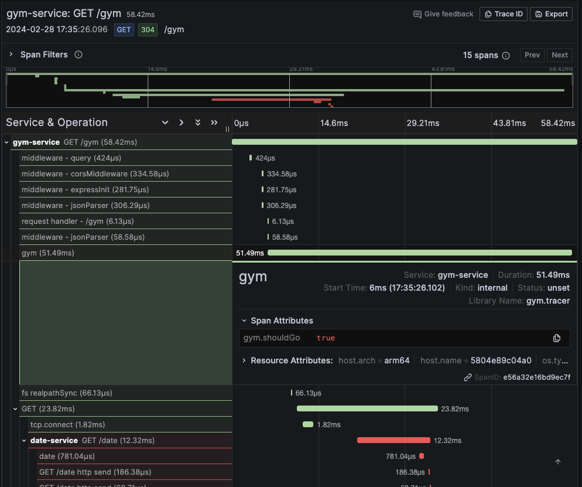

The goal of this blog post is to demystify OpenTelemetry using applications written in Python and NodeJS (Typescript). We will check how to add telemetry (logs, metrics, traces) to our application and we will use Opentelemetry when possible.

I coded two simple APIs:
- `Date Service`: Written in Python (using fastapi) that runs on port `3000`. Expose the route `/date` that returns the current day, `0` for Monday, `1` for Tuesday, and it keeps going until `6` for Sunday.
- `Gym Service`: Written in NodeJS and Typescript (using express) that runs on port `8000`. Expose the route `/gym` that returns a JSON saying if you should or should not go to the gym based on the current day. It calls the `Date Service` to know what's the current day. In case you are curious the business rule applied here is simple: we should go to the gym when it's a weekday.

I will try to link everything I'm doing with the documentation so I can teach you where to look when you need to develop yourself.

Oh, and something very important, if you are not familiar with OpenTelemetry I highly recommend you to check my [previous blog post](https://www.felipetrindade.com/opentelemetry/) that goes into detail about what OTel is, its goal, concepts and much more.

## Applications

### Python API: Date Service

```python
import logging
from datetime import datetime

from fastapi import FastAPI, HTTPException

# Logger
logging.basicConfig(level=logging.DEBUG, format='%(asctime)s - %(levelname)s - %(message)s')
logger = logging.getLogger(__name__)

# App
app = FastAPI()

# Routes
@app.get("/health")
def healthcheck():
    logger.info("Checking status of application...")
    return {
        "App Name": "Date Service",
        "status": "success",
        "message": "OK"
    }


@app.get("/date")
def get_date():
    try:
        day = datetime.today().weekday()
        logger.info(f"Successfully able to get current day ({day})")
        return {
            "status": "success",
            "date": day
        }
    except Exception as e:
        logger.error(f"Not able to get current day: {e}")
        return HTTPException(500, {
            "status": "failed",
            "message": "Something went wrong... Try again"
        })
```

As you can see a straightforward code. Notice that we are not logging in JSON format (this is important because in the NodeJS API, I will use JSON so we will see the differences in the following steps).

### NodeJS API: Gym Service

```typescript
import express from 'express'
import bodyParser from 'body-parser'
import cors from 'cors'
import { createLogger, format, transports } from 'winston'
import axios from 'axios'

// Logger
const { combine, timestamp, json } = format
const logger = createLogger({
  format: combine(
    timestamp(),
    json()
  ),
  transports: [
    new transports.Console()
  ]
})

// App
const app = express()

app.use(express.json())
app.use(cors())
app.use(bodyParser.json())
app.listen(8000)

// Routes
app.get('/health', (req, res) => {
  logger.info("Checking status of application...")
  res.send({
    "App Name": "Gym Service",
    "status": "success",
    "message": "OK"
  })
})

app.get('/gym', async (req, res) => {
  try {
    const dateResponse: any = await axios.get(
      `http://${process.env.DATE_SERVICE_HOSTNAME}:${process.env.DATE_SERVICE_PORT}/date`
    )
    logger.info("Able to get the date from date service")
    if (dateResponse.data.date === 5 || dateResponse.data.date === 6) {
      res.send({
        status: "success",
        message: "Day off! No need to go to the gym today..."
      })
      return
    } else {
      res.send({
        status: "success",
        message: "Let's work out! You need to go to the gym today..."
      })
      return
    }

  } catch (error) {
    logger.error(`Unable to get current date: ${String(error)}`)
    res.status(500).send({
      status: "failed",
      message: "Something went wrong... Try again later."
    })
    return
  }
})
```

A bit bigger code, when compared to the `Date Service` but still small and easy to understand. Notice that here we are logging in JSON format.

### Deployment

We can easily deploy these applications using Docker and orchestrate this deployment locally using Docker Compose. A simple `docker compose up --build` will run all the things we need!

#### Dockerfile

For the `Date Service`:

```yaml
FROM python:3.11.8-slim
WORKDIR /app
RUN pip install pipenv
COPY Pipfile .
COPY Pipfile.lock .
RUN pipenv install --deploy
COPY . .
CMD ["pipenv", "run", "uvicorn", "main:app", "--host", "0.0.0.0", "--port", "3000", "--no-access-log"]
```

For the `Gym Service`:
```yaml
FROM node:20-alpine as build
WORKDIR /app
COPY package.json ./
RUN yarn
COPY . .
RUN yarn build


FROM node:20-alpine as runner
WORKDIR /app
COPY package.json ./
RUN yarn --prod
COPY --from=build /app/dist ./
EXPOSE 8000
CMD ["node", "index.js"]
```

#### Docker Compose
We can deploy these services in the same bridge network in a Docker Compose as follows:

```yaml
version: "3"

services:
  date:
    container_name: date-service
    build:
      context: ./services/date
    networks:
      - observability
    ports:
      - 3000:3000

  gym:
    container_name: gym-service
    build:
      context: ./services/gym
    networks:
      - observability
    environment:
      DATE_SERVICE_HOSTNAME: date-service
      DATE_SERVICE_PORT: 3000
    ports:
      - 8000:8000

networks:
  observability:
    name: observability
```

## Instrumentation

Ok, so far I only explained the applications and how they are being deployed locally. Now let's start the interesting part: instrumentation.

OpenTelemetry only exposes SDKs, APIs and specs to standardize observability. It is not part of OpenTelemetry to deal with storage and visualization (called observability backend, or simply backend). There are several tools in the market, I will point some that we can use:

- `Logs`: [Grafana Loki](https://grafana.com/oss/loki/), [Elasticsearch](https://www.elastic.co/guide/en/elasticsearch/reference/current/elasticsearch-intro.html)
- `Traces`: [Zipkin](https://zipkin.io/), [Jaeger](https://www.jaegertracing.io/), [Grafana Tempo](https://grafana.com/oss/tempo/)
- `Metrics`: [Prometheus](https://prometheus.io/)

There are two other categories of tools (that are not used for instrumentation) but are usually used in observability projects that I would like to mention:
- `Visualization`: Help you visualize all the metrics, logs, and traces in a single place. It consumes (data connection) the other observability backends used. Popular open-source tools are [Grafana](https://grafana.com/oss/grafana/) and [Kibana](https://www.elastic.co/guide/en/kibana/current/index.html).
- `Alerts`: Let developers know when issues are happening in the applications using alert tools such as [AlertManager](https://prometheus.io/docs/alerting/latest/alertmanager/), [Keep](https://www.keephq.dev/)
- `Collectors` (or `Agents`): These tools are used to collect the instrumentation data (logs, metrics, metrics). The idea is that your application shouldn't worry manage the retries, process (transformations), and export telemetry to the backend service, it should only expose and another tool should manage this: this is where collectors come in. Some open-source collectors are [Fluentbit](https://fluentbit.io/) (for collecting logs), [Logstash](https://www.elastic.co/logstash) (for collecting logs), [OpenTelemetry Collector](https://opentelemetry.io/docs/collector/) (for collecting Logs, Metrics and Traces), [Vector](https://vector.dev/) (Logs, metrics), and [Grafana Agent](https://grafana.com/docs/agent/latest/).
- `APM Platforms`: APM (Application Performance Monitoring) in simple words is just a fancy word to say "observability", commonly it's used to talk about tools/services that in a single place can help you understand how your application is performing (using traces, logs, metrics). The most famous APM platforms in the market are [Datadog](https://www.datadoghq.com/), [New Relic](https://newrelic.com/), and [Dynatrace](https://www.dynatrace.com/). There is also an open-source APM that it's an alternative to all these paid services: [SigNoz](https://signoz.io/).

As you can see, there are infinite ways to set up an observability stack. The community even likes to create acronyms for popular stacks: such as ELK (Elasticsearch - Logstash - Kibana).

For this blog post, I chose to use the following backends:
- **Collector**: `OpenTelemetry Collector` (as a collector)
- **Logs Collector**: `Fluentbit`
- **Logs**: `Grafana Loki`
- **Metrics**: `Prometheus`
- **Traces**: `Grafana Tempo`
- **Visualization**: `Grafana`

So without further ado, let's start!


Notice that we are using `Fluentbit` to collect logs of the applications. Why? Because at the moment I'm writing this blog post the [SDK status](https://opentelemetry.io/status/#language-sdks) for Python is in an experimental state and the Javascript is under development. Although the [SDK spec](https://opentelemetry.io/docs/specs/status/#logging) is stable, the open-source community is still implementing the spec in the programming languages. I could have used OpenTelemetry to export logs in Python but I wanted to apply the same collect strategy for the NodeJS application, which is not possible at the moment I'm writing this blog post.

### Logging
Actually, we have already instrumented our code with logs, but now we need to set up the infrastructure to forward them to the backend. This will be done in three (3) steps: deploy the logs backend (Grafana Loki), deploy fluentbit for collecting the logs and configure Grafana to visualize these logs.

#### Grafana Loki
Loki can be deployed in several [modes](https://grafana.com/docs/loki/latest/get-started/deployment-modes/). For simplicity, we will deploy in the monolithic mode using a [local configuration](https://github.com/grafana/loki/blob/main/cmd/loki/loki-local-config.yaml).


```yaml
loki:
  image: grafana/loki:2.9.0
  container_name: loki
  networks:
    - observability
  ports:
    - 3100:3100
    - 7946:7946
    - 9095:9095
  command:
    - -config.file=/etc/loki/local-config.yaml
    - -print-config-stderr=true
  healthcheck:
    test: wget --no-verbose --tries=1 --spider http://localhost:3100/ready || exit 1
    interval: 15s
    timeout: 5s
    retries: 5
```

#### Fluentbit
Currently, Date service is logging to `STDOUT` in a non-serialized format (not JSON) and Gym service in JSON format to `STDOUT`.

To collect logs with Fluentbit we will need to:

1) Deploy Fluentbit

This can be easily achievable by adding a new service to our Docker Compose file.

```yaml
fluent-bit:
  image: fluent/fluent-bit:2.2.0
  container_name: fluent-bit
  networks:
    - observability
  volumes:
    - ./config/fluent-bit.conf:/fluent-bit/etc/fluent-bit.conf
    - ./config/fluent-bit-parsers.conf:/fluent-bit/etc/fluent-bit-parsers.conf
  ports:
    - "24224:24224/tcp"
    - "24224:24224/udp"
  command: -c /fluent-bit/etc/fluent-bit.conf -log.level=debug
```

Notice that the `fluent-bit.conf` and `fluent-bit-parsers.conf` are two configuration files for the fluent-bit. I will comment about these files in the next section.

Probably the most common way to collect logs with Fluentbit is to read logs from a file. Even if your application is configured to send logs to STDOUT, depending on where your application is running, the tool that manages the deployment (e.g. Docker and Kubernetes) will get the STDOUT logs and dump them in a file, so you can read this file using fluentbit.

I'm using a Mac and the Docker logs folder of the containers is not available easily (in Linux you could easily do this by collecting the log files inside the `/var/lib/docker/containers` folder). So instead of reading a file, I will [configure](https://docs.docker.com/compose/compose-file/compose-file-v3/#logging) the logs of the Docker to use fluentbit as the logging driver. Even though fluentbit is not present in the list of [logging drivers](https://docs.docker.com/config/containers/logging/configure/#supported-logging-drivers) we can use the `fluentd` logging driver. This works because both projects are very similar, the main differences are the fact that fluentbit is written only in C (instead of C and Ruby for fluentd) and it uses way less memory. So we can configure fluentd driver with the following [configuration](https://docs.docker.com/config/containers/logging/fluentd/#options) (this configuration will be added to Date and Gym Service):

```yaml
logging:
  driver: fluentd
  options: localhost:24224
  fluentd-async: true
```

2) Configure Fluentbit pipeline
Fluentbit configuration of pipelines can be done via the [classic way](https://docs.fluentbit.io/manual/administration/configuring-fluent-bit/classic-mode/configuration-file) (conf files) or the "[modern](https://docs.fluentbit.io/manual/administration/configuring-fluent-bit/yaml/configuration-file)" way (YAML files), and I went for the first approach.

Let's first create a dummy pipeline to inspect how the logs will be seen by fluentbit:

```conf
# fluent-bit.conf

# https://docs.fluentbit.io/manual/pipeline/inputs/forward
[INPUTS]
  Name            forward
  Listen          0.0.0.0
  Port            24224

# https://docs.fluentbit.io/manual/pipeline/filters/standard-output
[OUTPUT]
  name            stdout
  match           *
```

We got the following sample logs:
- **Date Service**:
```
[[1709125948.000000000, {}], {"container_name"=>"/date-service", "source"=>"stderr", "log"=>"2024-02-28 13:12:28,235 - INFO - Successfully able to get current day (2)", "container_id"=>"a58d767d02d37feaf384733808e879a4980c7cce6ac8524addacb58ad4e09253"}]
```
- **Gym Service**:
```
[[1709125948.000000000, {}], {"source"=>"stdout", "log"=>"{"level":"info","message":"Able to get the date from date service","timestamp":"2024-02-28T13:12:28.241Z"}", "container_id"=>"c402b0f01f439e6d76b94b71757894f974dc43ab3250907dbd930c90f26389a3", "container_name"=>"/gym-service"}]
```

We can clearly see the Fluentbit [event format](https://docs.fluentbit.io/manual/concepts/key-concepts#event-format) in these logs: `[[TIMESTAMP, METADATA], MESSAGE]`. Notice that the `message` contains some keys to identify where the logs came from, such as `container_id` and `container_name`. Also, notice that the `log` key is the real log message that we were expecting. We need to transform the `message` into more structured (correctly parse it) data to send to the backend and would also need to forward these logs to the Loki backend.

```conf
# fluent-bit.conf

# https://docs.fluentbit.io/manual/administration/configuring-fluent-bit/classic-mode/configuration-file#config_section
[SERVICE]
  Parsers_File   /fluent-bit/etc/fluent-bit-parsers.conf

# https://docs.fluentbit.io/manual/pipeline/inputs/forward
[INPUTS]
  Name           forward
  Tag            docker
  Listen         0.0.0.0
  Port           24224

# https://docs.fluentbit.io/manual/pipeline/filters/parser
[FILTER]
  Name           parser
  Match          docker
  Key_Name       log
  Parser         date-service
  Reserve_Data   True

[FILTER]
  Name           parser
  Match          docker
  Key_Name       log
  Parser         gym-service
  Reserve_Data   True

# https://docs.fluentbit.io/manual/pipeline/filters/standard-output
[OUTPUT]
  name           stdout
  match          docker

# https://docs.fluentbit.io/manual/pipeline/outputs/loki
[OUTPUT]
  name loki
  match *
  host loki
  port 3100
  labels collector=fluentbit, container_name=$container_name
```

```conf
# fluent-bit-parsers.conf

# https://docs.fluentbit.io/manual/v/1.3/parser/json
[PARSER]
  Name           gym-service
  Format         json
  Time_Key       timestamp
  Time_Format    %Y-%m-%dT%H:%M:%S %z

# https://docs.fluentbit.io/manual/pipeline/parsers/regular-expression
[PARSER]
  Name           date-service
  Format         regex
  Regex          ^(?<time>[^ ]*) - (?<level>[^ ]*) - (?<message>.*)$
  Time_Key       time
  Time_Format    %Y-%m-%d %H:%M:%S
  Time_Keep      On
```

Now we can see in fluentbit the following events:

- **Date Service**:
```
[[1709130293.000000000, {}], {"container_name"=>"/date-service", "source"=>"stderr", "log"=>"2024-02-28 14:24:53,777 - INFO - Successfully able to get current day (2)", "container_id"=>"b2d627623047133424981c15f67381c66c57f661f6869f60b7b0241e71500e59"}]
```
- **Gym Service**:
```
[[1709130293.000000000, {}], {"level"=>"info", "message"=>"Able to get the date from date service", "timestamp"=>"2024-02-28T14:24:53.782Z", "container_id"=>"c402b0f01f439e6d76b94b71757894f974dc43ab3250907dbd930c90f26389a3", "container_name"=>"/gym-service", "source"=>"stdout"}]
```

Good job!	😀

#### Grafana
As you probably expect... we will also deploy Grafana via Docker Compose. We are going to deploy Grafana and automatically set up a [data source](https://grafana.com/docs/grafana/latest/administration/provisioning/#data-sources) to point to Loki.

```yaml
grafana:
  image: grafana/grafana:10.2.1
  container_name: grafana
  networks:
    - observability
  environment:
    - GF_PATHS_PROVISIONING=/etc/grafana/provisioning
    - GF_AUTH_ANONYMOUS_ENABLED=true
    - GF_AUTH_ANONYMOUS_ORG_ROLE=Admin
  ports:
    - "3001:3000" # Using 3001 because 3000 is already being used by Date Service
  volumes:
    - ./config/grafana.yaml:/etc/grafana/provisioning/datasources/ds.yaml
  entrypoint:
    - sh
    - -euc
    - /run.sh
```

Where the config file is the data source file pointing to loki:

```yaml
apiVersion: 1
datasources:
  # https://grafana.com/docs/grafana/latest/datasources/loki/#provision-the-loki-data-source
  - name: Loki
    type: loki
    access: proxy
    url: http://loki:3100
    basicAuth: false
```

Now you should be seeing logs from Grafana in the explorer page.


### Traces
Traces SDKs are [stable](https://opentelemetry.io/status/) for Python and Javascript so we will definitely use OpenTelemetry here! We can divide this into five (5) steps: deploy trace backend (Grafana Tempo), add Tempo data source to Grafana, deploy OpenTelemetry Collector, instrument Date service, and instrument Gym service.

#### Grafana Tempo
We are going to deploy Grafana Tempo in the [monolithic mode](https://grafana.com/docs/tempo/latest/setup/deployment/#monolithic-mode) and [configure](https://grafana.com/docs/tempo/latest/configuration/) some things such as: allowing it to receive traces via OTLP (via HTTP) and configuring Grafana Tempo storage to be local (you don't want to do that in production, I'm just using a simple configuration since Tempo configuration is not the goal of this blog post).

```yaml
tempo:
  image: grafana/tempo:2.3.1
  container_name: tempo
  networks:
    - observability
  ports:
    - 3200:3200
    - 4318:4318 # OTLP http receiver
  volumes:
    - ./config/tempo.yaml:/etc/tempo/config.yaml
  command: -config.file=/etc/tempo/config.yaml
```

And `tempo.yaml` is the configuration file for Grafana Tempo:

```yaml
stream_over_http_enabled: true

# https://grafana.com/docs/tempo/latest/configuration/#server
server:
  http_listen_port: 3200
  log_level: info

# https://grafana.com/docs/tempo/latest/configuration/#query-frontend
query_frontend:
  search:
    duration_slo: 5s
  trace_by_id:
    duration_slo: 5s

# https://grafana.com/docs/tempo/latest/configuration/#distributor
distributor:
  receivers:
    otlp:
      protocols:
        http:

# https://grafana.com/docs/tempo/latest/configuration/#storage
storage:
  trace:
    backend: local
    wal:
      path: /tmp/tempo/wal             # where to store the the wal locally
    local:
      path: /tmp/tempo/blocks
```

#### Grafana Tempo data source
To add a new data source, as we saw earlier, we should add a new entry in the `grafana.yaml` file:

```yaml
apiVersion: 1
datasources:
  # https://grafana.com/docs/grafana/latest/datasources/loki/#provision-the-loki-data-source
  - name: Loki
    type: loki
    access: proxy
    url: http://loki:3100
    basicAuth: false
  # https://grafana.com/docs/grafana/latest/datasources/tempo/configure-tempo-data-source/#provision-the-data-source
  - name: Tempo
    type: tempo
    url: http://tempo:3200
```

#### OpenTelemetry Collector
We can deploy the OTel Collector in [Docker Compose](https://opentelemetry.io/docs/collector/installation/#docker-compose).

```yaml
otel-collector:
    image: otel/opentelemetry-collector:0.95.0
    container_name: otel-collector
    command: [ "--config=/etc/otel-collector.yaml" ]
    networks:
      - observability
    volumes:
      - ./config/otel-collector.yaml:/etc/otel-collector.yaml
```

The `otel-collector.yaml` contains the [OTel Collector configuration](https://opentelemetry.io/docs/collector/configuration/). The idea is that we want to receive data from the applications (Date and Gym service) via HTTP using OTLP protocol (there are other protocols, such as gRPC), and then we want to forward these traces to Grafana Tempo.

```yaml
# https://opentelemetry.io/docs/collector/configuration/#receivers
receivers:
  otlp:
    protocols:
      http:
        endpoint: 0.0.0.0:4318

# https://opentelemetry.io/docs/collector/configuration/#exporters
exporters:
  otlphttp:
    endpoint: http://tempo:4318

# https://opentelemetry.io/docs/collector/configuration/#pipelines
service:
  pipelines:
    traces:
      receivers: [otlp]
      exporters: [otlphttp]
```


#### Date Service (Python)
Finally! Now that all the infrastructure is in place we can start to work on the application. As I promised I will instrument the code automatically and manually. Let's start with the [automatic instrumentation](https://opentelemetry.io/docs/languages/python/automatic/) for Python.

We need to install the packages `opentelemetry-distro` (installs API, SDK and Bootstrap packages) and `opentelemetry-exporter-otlp`. We will also need to add other packages to allow auto instrumentation of the packages we are using in our project. We could check these packages in the [registry](https://opentelemetry.io/ecosystem/registry) and install them or simply run `opentelemetry-bootstrap -a `install`, which will automatically check our dependencies and install these packages.

We need to run this Opentelemetry auto instrumentation agent with our application so instead of running `uvicorn main:app` to run the application we will need to call the agent first `opentelemetry-instrument uvicorn main:app`. So our new Dockefile will be (just modified the CMD):


```yaml
FROM python:3.11.8-slim
WORKDIR /app
RUN pip install pipenv
COPY Pipfile .
COPY Pipfile.lock .
RUN pipenv install --deploy
COPY . .
CMD ["pipenv", "run", "opentelemetry-instrument", "uvicorn", "main:app", "--host", "0.0.0.0", "--port", "3000", "--no-access-log"]
```

We should also configure the name of the service in the OpenTelemetry SDK by configuring the [environment variables](https://opentelemetry.io/docs/languages/sdk-configuration/general/) `OTEL_SERVICE_NAME`. We should also configure the application to send data to the collector by configuring the `OTEL_TRACES_EXPORTER` (by default it's already OTLP, which is the exporter that we are going to use to communicate with the OTel Collector), the `OTEL_EXPORTER_OTLP_PROTOCOL` (to specify that the [protocol](https://opentelemetry.io/docs/languages/sdk-configuration/otlp-exporter/#otel_exporter_otlp_protocol) used is HTTP), and the `OTEL_EXPORTER_OTLP_ENDPOINT` (configuration of the [OTLP exporter](https://opentelemetry.io/docs/languages/sdk-configuration/otlp-exporter/#otel_exporter_otlp_endpoint)).

```yaml
# docker-compose.yaml (inside date-service)
environment:
  OTEL_SERVICE_NAME: date-service
  OTEL_TRACES_EXPORTER: otlp
  OTEL_EXPORTER_OTLP_PROTOCOL: http/protobuf
  OTEL_EXPORTER_OTLP_ENDPOINT: http://otel-collector:4318
```

Now you can see traces in the explorer session in Grafana. Now let's [manually](https://opentelemetry.io/docs/languages/python/getting-started/#add-manual-instrumentation-to-automatic-instrumentation) instrument the Python application.


```python
import logging
from datetime import datetime

from fastapi import FastAPI, HTTPException
from opentelemetry import trace

# Logger
logging.basicConfig(level=logging.DEBUG, format='%(asctime)s - %(levelname)s - %(message)s')
logger = logging.getLogger(__name__)

# Opentelemetry
tracer = trace.get_tracer("diceroller.tracer")

# App
app = FastAPI()

# Routes
@app.get("/health")
def healthcheck():
    logger.info("Checking status of application...")
    return {
        "App Name": "Date Service",
        "status": "success",
        "message": "OK"
    }


@app.get("/date")
def get_date():
    with tracer.start_as_current_span("date") as span:
        try:
            day = datetime.today().weekday()
            span.set_attribute("date.value", day)
            logger.info(f"Successfully able to get current day ({day})")
            return {
                "status": "success",
                "date": day
            }
        except Exception as e:
            logger.error(f"Not able to get current day: {e}")
            span.set_attribute("date.value", None)
            return HTTPException(500, {
                "status": "failed",
                "message": "Something went wrong... Try again"
            })
```

Now we can see this new span from Grafana:


#### Gym Service (NodeJS)
Here, we are going to do the same thing we did in the Python service above: add automatic instrumentation and add manual instrumentation.

For the [automatic](https://opentelemetry.io/docs/languages/js/automatic/) instrumentation, we need to install `@opentelemetry/api` and `@opentelemetry/auto-instrumentations-node`. To auto instrument [express](@opentelemetry/auto-instrumentations-node) framework we will install `@opentelemetry/instrumentation-http` and `@opentelemetry/instrumentation-express`. To run the auto instrumentation agent we will also need to modify the command that starts the application to add the flag `--require @opentelemetry/auto-instrumentations-node/register`. This means that our new Dockerfile will be:

```yaml
FROM node:20-alpine as build

WORKDIR /app
COPY package.json ./
RUN yarn
COPY . .
RUN yarn build


FROM node:20-alpine as runner

WORKDIR /app
COPY package.json ./
RUN yarn --prod
COPY --from=build /app/dist ./
EXPOSE 8000
CMD ["node", "--require", "@opentelemetry/auto-instrumentations-node/register", "index.js"]
```

The environment variables are also needed:

```yaml
# docker-compose.yaml (inside gym-service)
environment:
  OTEL_SERVICE_NAME: gym-service
  OTEL_TRACES_EXPORTER: otlp
  OTEL_EXPORTER_OTLP_PROTOCOL: http/protobuf
  OTEL_EXPORTER_OTLP_ENDPOINT: http://otel-collector:4318
```

Now let's [manually](https://opentelemetry.io/docs/languages/js/getting-started/nodejs/#instrumentation) instrument the application. The following packages need to be installed: `@opentelemetry/sdk-node`, `@opentelemetry/api`, `@opentelemetry/sdk-trace-node`. And since we want to export the traces via OTLP we will also need to install `@opentelemetry/exporter-trace-otlp-proto` to use the [OTLP exporter](https://opentelemetry.io/docs/languages/js/exporters/#otlp-dependencies) to the OpenTelemetry Collector. We can [add a new span](https://opentelemetry.io/docs/languages/js/instrumentation/#create-spans) to the trace manually:

```typescript
import express from 'express'
import bodyParser from 'body-parser'
import cors from 'cors'
import { createLogger, format, transports } from 'winston'
import axios from 'axios'
import { trace } from '@opentelemetry/api'

// Logger
const { combine, timestamp, json } = format
const logger = createLogger({
  format: combine(
    timestamp(),
    json()
  ),
  transports: [
    new transports.Console()
  ]
})

// OpenTelemetry
const tracer = trace.getTracer('gym.tracer')

// App
const app = express()

app.use(express.json())
app.use(cors())
app.use(bodyParser.json())
app.listen(8000)

// Routes
app.get('/health', (req, res) => {
  logger.info("Checking status of application...")
  res.send({
    "App Name": "Gym Service",
    "status": "success",
    "message": "OK"
  })
})

app.get('/gym', async (req, res) => {
  const span = tracer.startSpan('gym')
  try {
    const dateResponse: any = await axios.get(
      `http://${process.env.DATE_SERVICE_HOSTNAME}:${process.env.DATE_SERVICE_PORT}/date`
    )
    logger.info("Able to get the date from date service")
    if (dateResponse.data.date === 5 || dateResponse.data.date === 6) {
      span.setAttribute("gym.shouldGo", false)
      res.send({
        status: "success",
        message: "Day off! No need to go to the gym today..."
      })
      return
    } else {
      span.setAttribute("gym.shouldGo", true)
      res.send({
        status: "success",
        message: "Let's work out! You need to go to the gym today..."
      })
      return
    }

  } catch (error) {
    logger.error(`Unable to get current date: ${String(error)}`)
    res.status(500).send({
      status: "failed",
      message: "Something went wrong... Try again later."
    })
    return
  } finally {
    span.end()
  }
})
```

Now, when checking Grafana we can see two cool things: a new span being added manually and the full trace showing spans of our two services!



### Metrics
Metrics SDKs are also [stable](https://opentelemetry.io/status/) for Python and Javascript. Just like what we did in the traces section, we are going to perform five (5) steps: deploy metric backend (Prometheus), add Prometheus data source to Grafana, configure the OpenTelemetry Collector, instrument Date service, and instrument Gym service.

#### Prometheus
Prometheus [deployment](https://prometheus.io/docs/prometheus/latest/installation/#using-docker) will be done via Docker Compose and it's very easy for basic configuration:

```yaml
prometheus:
  image: prom/prometheus:v2.50.0
  container_name: prometheus
  networks:
    - observability
  ports:
    - 9090:9090
  volumes:
    - ./config/prometheus.yaml:/etc/prometheus/config.yaml
  command: --config.file=/etc/prometheus/config.yaml --enable-feature=otlp-write-receiver
```

Prometheus is best used as a pull-based system, which means, he is best used when it goes directly to the applications and collects the metrics instead of the system/collector sending the metrics to Prometheus. But, since we want to use the OTLP protocol we can configure the [OTLP Receiver](https://prometheus.io/docs/prometheus/latest/feature_flags/#otlp-receiver) in Prometheus, allowing it to receive metrics via an HTTP request (this is considered an [inefficient](https://prometheus.io/docs/prometheus/latest/querying/api/#otlp-receiver) way of ingesting metrics).

The config file used was simple, just to allow Prometheus to auto-collect its logs.

```yaml
global:
  scrape_interval: 15s

scrape_configs:
  - job_name: prometheus
    static_configs:
      - targets:
        - localhost:9090
```

#### OpenTelemetry Collector
The OpenTelemetry Collector needs to be configured to forward metrics to the OTLP endpoint of Prometheus. This is easily done by editing the Otel Collector configuration file:

```yaml
# https://opentelemetry.io/docs/collector/configuration/#receivers
receivers:
  otlp:
    protocols:
      http:
        endpoint: 0.0.0.0:4318

# https://opentelemetry.io/docs/collector/configuration/#exporters
exporters:
  otlphttp/tempo:
    endpoint: http://tempo:4318

  otlphttp/prometheus:
    endpoint: http://prometheus:9090/api/v1/otlp

# https://opentelemetry.io/docs/collector/configuration/#pipelines
service:
  pipelines:
    traces:
      receivers: [otlp]
      exporters: [otlphttp/tempo]
    metrics:
      receivers: [otlp]
      exporters: [otlphttp/prometheus]
```

Notice that we can use several exporters/receivers, if we want to use the same type of exporter/receiver we just need the `/<NAME>` suffix. The `<NAME>` can be anything you want: a number, or a name... but I used the name of the service to be more meaningful and easy to understand.

#### Date Service (Python)
Adding a metric is as easy as adding a trace, but before adding the metric we need to properly configure the application to export the metrics correctly via OTLP to the OpenTelemetry Collect with the following [environment variables](https://opentelemetry.io/docs/languages/sdk-configuration/otlp-exporter/#otel_exporter_otlp_metrics_protocol):

```yaml
# docker-compose.yaml (inside date-service)
environment:
  OTEL_EXPORTER_OTLP_METRICS_PROTOCOL: http/protobuf
```

Now, let's manually create the metrics in our application. It will be similar to what we did in the traces session: get a `meter`, create a metric instrument (I chose a `counter` to count the number of requests the `/date` endpoint received), modify the metric instrument (adding one to the metric when the `/date` endpoint is called).


```python
import logging
from datetime import datetime

from fastapi import FastAPI, HTTPException
from opentelemetry import metrics, trace

# Logger
logging.basicConfig(level=logging.DEBUG, format='%(asctime)s - %(levelname)s - %(message)s')
logger = logging.getLogger(__name__)

# Opentelemetry
tracer = trace.get_tracer("date.tracer")
meter = metrics.get_meter("date.meter")

date_counter = meter.create_counter(
    "requests_counter_get_date",
    description="Counts the number of requests that the /date endpoint received"
)

# App
app = FastAPI()

# Routes
@app.get("/health")
def healthcheck():
    logger.info("Checking status of application...")
    return {
        "App Name": "Date Service",
        "status": "success",
        "message": "OK"
    }


@app.get("/date")
def get_date():
    date_counter.add(1)
    with tracer.start_as_current_span("date") as span:
        try:
            day = datetime.today().weekday()
            span.set_attribute("date.value", day)
            logger.info(f"Successfully able to get current day ({day})")
            return {
                "status": "success",
                "date": day
            }
        except Exception as e:
            logger.error(f"Not able to get current day: {e}")
            span.set_attribute("date.value", None)
            return HTTPException(500, {
                "status": "failed",
                "message": "Something went wrong... Try again"
            })
```

If we deploy the stack using Docker Compose and make some requests to `localhost:3000/date` we will see the metric in Grafana, as you can see below:


#### Gym Service (NodeJS)

As you can already tell, we are going to perform the exact same things: add the environment variable, create a [meter](https://opentelemetry.io/docs/languages/js/instrumentation/#initializing-metrics-with-sdk-metrics), create a metric instrument, and modify the metric instrument.

```yaml
# docker-compose.yaml (inside gym-service)
environment:
  OTEL_EXPORTER_OTLP_METRICS_PROTOCOL: http/protobuf
```

Before adding the code we will also need to add `@opentelemetry/sdk-metrics` [package](https://opentelemetry.io/docs/languages/js/getting-started/nodejs/).


```typescript
import express from 'express'
import bodyParser from 'body-parser'
import cors from 'cors'
import { createLogger, format, transports } from 'winston'
import axios from 'axios'
import { trace, metrics } from '@opentelemetry/api'
import {
  MeterProvider,
  PeriodicExportingMetricReader
} from '@opentelemetry/sdk-metrics'
import { Resource } from '@opentelemetry/resources'
import opentelemetry from '@opentelemetry/api'
import { OTLPMetricExporter } from '@opentelemetry/exporter-metrics-otlp-proto'
import { SemanticResourceAttributes } from '@opentelemetry/semantic-conventions'
// Logger
const { combine, timestamp, json } = format
const logger = createLogger({
  format: combine(
    timestamp(),
    json()
  ),
  transports: [
    new transports.Console()
  ]
})

// OpenTelemetry
const myServiceMeterProvider = new MeterProvider({
  resource: Resource.default().merge(
    new Resource({
      [SemanticResourceAttributes.SERVICE_NAME]: process.env.OTEL_SERVICE_NAME
    })
  ),
  readers: [new PeriodicExportingMetricReader({
    exporter: new OTLPMetricExporter(),
  })],
})

// Set this MeterProvider to be global to the app being instrumented.
opentelemetry.metrics.setGlobalMeterProvider(myServiceMeterProvider)

const tracer = trace.getTracer('gym.tracer')
const meter = metrics.getMeter('gym.meter')
const gymCounter = meter.createCounter("requests_counter_get_gym", {
  description: "Counts the number of requests that the /gym endpoint received"
})

// App
const app = express()

app.use(express.json())
app.use(cors())
app.use(bodyParser.json())
app.listen(8000)

// Routes
app.get('/health', (req, res) => {
  logger.info("Checking status of application...")
  res.send({
    "App Name": "Gym Service",
    "status": "success",
    "message": "OK"
  })
})

app.get('/gym', async (req, res) => {
  const span = tracer.startSpan('gym')
  gymCounter.add(1)
  try {
    const dateResponse: any = await axios.get(
      `http://${process.env.DATE_SERVICE_HOSTNAME}:${process.env.DATE_SERVICE_PORT}/date`
    )
    logger.info("Able to get the date from date service")
    if (dateResponse.data.date === 5 || dateResponse.data.date === 6) {
      span.setAttribute("gym.shouldGo", false)
      res.send({
        status: "success",
        message: "Day off! No need to go to the gym today..."
      })
      return
    } else {
      span.setAttribute("gym.shouldGo", true)
      res.send({
        status: "success",
        message: "Let's work out! You need to go to the gym today..."
      })
      return
    }

  } catch (error) {
    logger.error(`Unable to get current date: ${String(error)}`)
    res.status(500).send({
      status: "failed",
      message: "Something went wrong... Try again later."
    })
    return
  } finally {
    span.end()
  }
})
```

And we can visualize this metric in Grafana.


## Cya!
I hope you liked this new blog post! OpenTelemetry is the hype topic of the moment about observability and the hype is well deserved!

You can check the [entire code repository](https://github.com/felipelaptrin/opentelemetry-blog) or check the individual PR below:
- [Adding Loki](https://github.com/felipelaptrin/opentelemetry-blog/pull/1)
- [Adding Fluentbit](https://github.com/felipelaptrin/opentelemetry-blog/pull/2)
- [Adding Grafana](https://github.com/felipelaptrin/opentelemetry-blog/pull/3)
- [Adding Tempo](https://github.com/felipelaptrin/opentelemetry-blog/pull/4)
- [Adding OTelCollector](https://github.com/felipelaptrin/opentelemetry-blog/pull/5)
- [Adding Tempo as a new data source to Grafana](https://github.com/felipelaptrin/opentelemetry-blog/pull/6)
- [Adding Traces to Date Service (python)](https://github.com/felipelaptrin/opentelemetry-blog/pull/7)
- [Adding Traces to Gym Service (nodejs)](https://github.com/felipelaptrin/opentelemetry-blog/pull/8)
- [Adding Prometheus](https://github.com/felipelaptrin/opentelemetry-blog/pull/9)
- [Adding OTel Collector config to forward metrics to Prometheus](https://github.com/felipelaptrin/opentelemetry-blog/pull/10)
- [Adding Prometheus as a new data source to Grafana](https://github.com/felipelaptrin/opentelemetry-blog/pull/11)
- [Adding Metrics to Date Service (python)](https://github.com/felipelaptrin/opentelemetry-blog/pull/12)
- [Adding Metrics to Gym Service (nodejs)](https://github.com/felipelaptrin/opentelemetry-blog/pull/13)

See you around! 👋