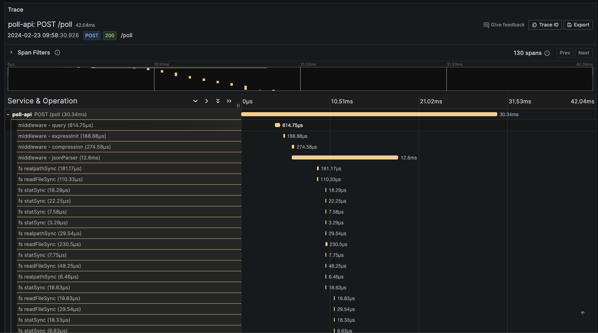
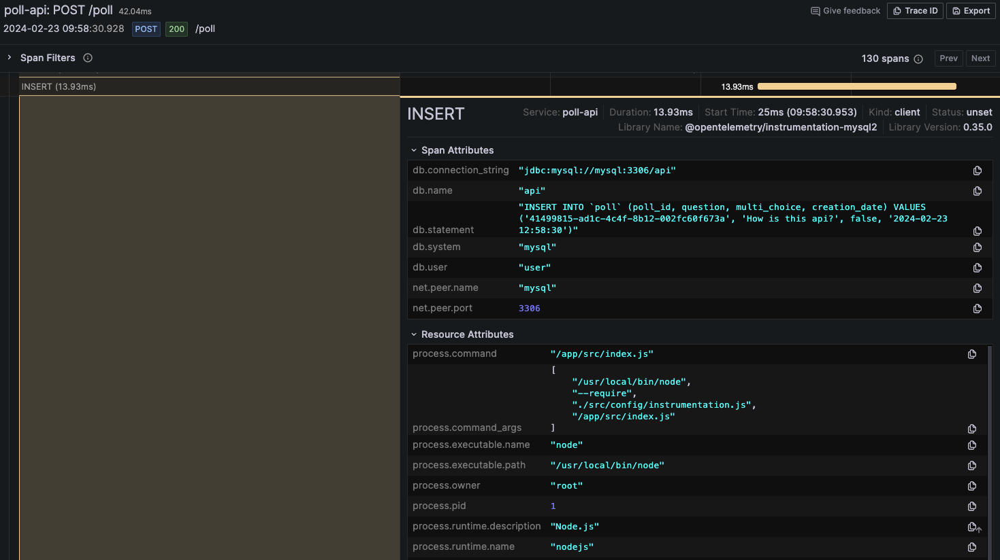
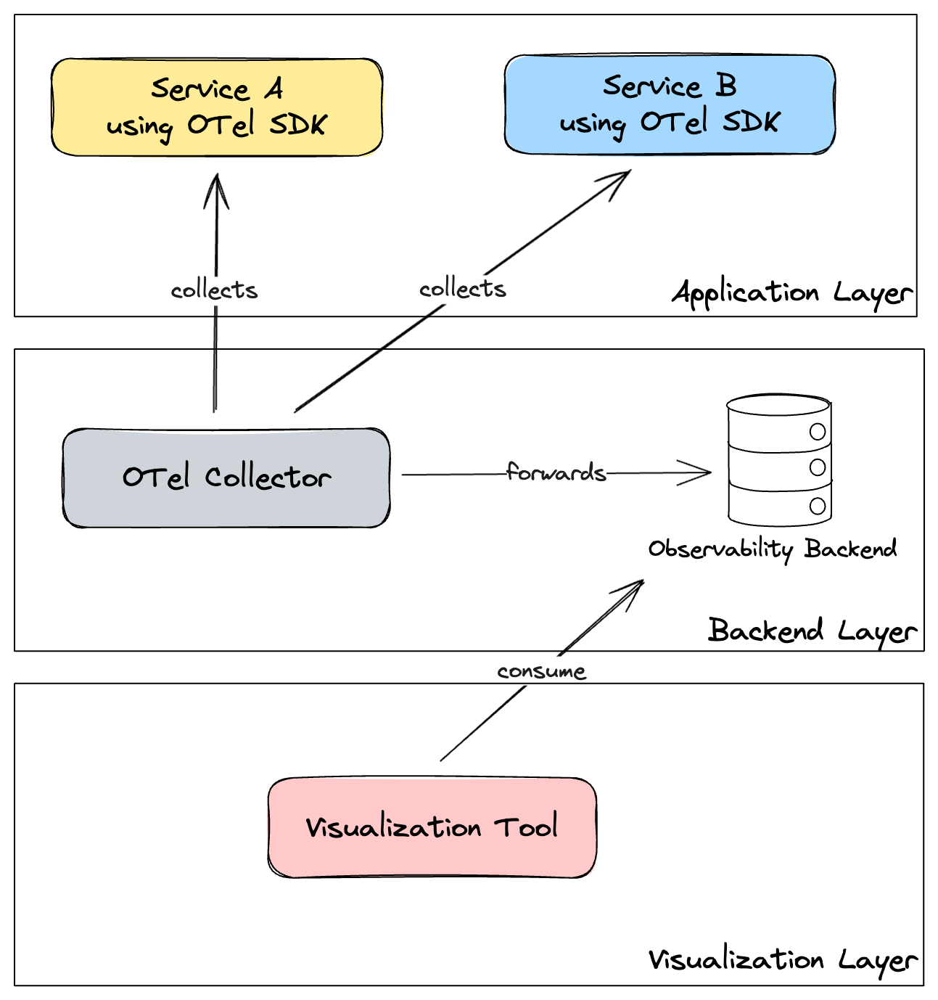
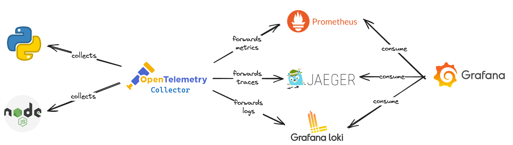

OpenTelemetry (as known as OTel) is an open-source project (maintained by CNCF, the same foundation that maintains Kubernetes) that aims to help developers instrument their code in a more standardized way. This project is a merge of two other projects: [OpenTracing](https://opentracing.io/) and [OpenCensus](https://opencensus.io/). It provides several components, most notably:
- **APIs and SDK**: per programming language for generating and emitting telemetry
- **Collector**: a component that receives, processes and exports telemetry to the observability backend
- **OTLP**: a protocol for transmitting telemetry data

This documentation was divided into the following parts (in order):
- **Concepts**: Some frequently used terms in observability and OTel
- **Signals**: We will talk about the main components (traces, metrics, logs) used to make an application observable
- **Instrumentation**: Here we will cover what needs to be done in your application to emit signals
- **OpenTelemetry**: Architecture, reasons to exist, components...

## Concepts
OTel requires you to know several important words used in observability, the most important ones for you to know are:

- **Observability**: Observability lets us observe our system, making it easier to answer the question "Why is this happening?". It's very helpful to troubleshoot and handle problems. To have observability your code must be instrumented.
- **Observability Backend**: OTel does not provide storage and visualization for collected telemetry data, that's where an observability backend is needed. Examples of backends: [Jaeger](https://www.jaegertracing.io/), [Prometheus](https://prometheus.io/), [Zipkin](https://zipkin.io/), [Loki](https://grafana.com/docs/loki/latest/).
- **Instrumentation**: The application code emits signals such as logs, metrics and traces.
- **Signals**: Categories of telemetry supported. At the moment it supports traces, metrics, logs and baggage.
- **Logs**: Timestamped messages that help you understand at a code level what happened. Since they lack contextual information (such as where they were called from in a distributed system), they are not extremely useful for tracking code alone but are way more useful when included as part of a span.
- **Span**: Represents a unit of work or operation such as a request made, or query made to the database. It contains name, log message and attributes.
- **Trace**: It's the "path" or "route" made by requests that propagate among services. Traces are what improve visibility in distributed systems/microservice architectures. Traces are composed of one or more spans.
- **Metrics**: Aggregations over time about your infrastructure/application. It can be related to the infrastructure itself, like CPU usage, memory usage, and requests per second or it can be related to the business, like sales per second.

## Signals

### Traces

Traces are super important to understand the full "path" that a request takes in your application, especially if you are using a microservice, mesh or multiple-service architecture. Technically, a `trace` is just a collection of JSONs (each one represents a `span`) where each JSON contains a name, log, attributes and timestamps. You can think of spans as structured logs on steroids (with context).

Example of a span JSON:

```json
{
    "name": "Hello-Salutations",
    "context": {
        "trace_id": "0x5b8aa5a2d2c872e8321cf37308d69df2",
        "span_id": "0x93564f51e1abe1c2",
    },
    "parent_id": "0x051581bf3cb55c13",
    "start_time": "2022-04-29T18:52:58.114492Z",
    "end_time": "2022-04-29T18:52:58.114631Z",
    "attributes": {
        "http.route": "/cart",
        "http.server_name": "frontend",
        "http.scheme": "http",
        "http.status_code": "200",
        "net.peer.port": "10243"
    },
    "events": [
        {
            "name": "hey there!",
            "timestamp": "2022-04-29T18:52:58.114561Z",
            "attributes": {
                "event_attributes": 1
            }
        }
    ],
}
```

The "magic" that allows us to trace the requests is the `context` and `parent_id` field. With these fields, the backend tracing tool can organize the spans and create the full trace of the request. Some points about this:
- If the `parent_id` is empty it means that it is the initial span (root)
- If two spans have the same `trace_id` it means they belong to the same trace
- One span is a child of another span if the `parent_id` of the first span is the same as the `span_id` of the latter.

Traces should be stored in a proper backend, popular open-source tools for that are Jaeger, Zipkin, Grafana Tempo and SigNoz. Some of these tools are just the backend for storing the traces and do not provide a graphical interface to see the traces. In these scenarios, you can always use a dashboard tool that can integrate with the backend to display the traces, a popular tool for that is [Grafana](https://grafana.com/docs/grafana/latest/).

A visual example of a trace can be seen below (please click on the picture to open in a separate tab and be able to visualize the image properly):



In the above example, you can see a trace of a `POST` HTTP request in the `/poll` endpoint. The request took 42.04ms and is composed of 130 spans (you would see the rest if you scroll down the UI of the trace). You have complete visibility of how long each process took and can tackle bottlenecks and understand the behavior of the request. One of the last traces there is a query to insert data to the database, let's check what this span looks like:



The span contains several useful pieces of information to help us debug and understand of what is going on: query made, the user used to connect to the database, how long the query took...

#### Span telemetry components
Four parts are necessary to instrument our code to use traces:

1) **Tracer**: Creates spans containing more information about what's happening for a given operation (e.g. query to the database). They are created by a tracer provider.

2) **Tracer Provider**: It's the factory that creates a `Tracer`. Usually, it's a class that needs to be instantiated once but in some language SDKs, a global tracer is already initialized automatically.

3) **Trace Exporter**: Send traces to a consumer such as STDOUT, OTel Collector or open source/vendor backend.

4) **Trace Context**: As we mentioned, this is what makes it possible to correlate spans no matter where they were generated, enabling distributed tracing. A context (the `context` object in the span example) contains IDs that are related to the service that called/calls the request. Each context is associated with a span!

#### Span Information

Span contains the following information:

- Name
- Parent ID (empty for root spans)
- Start and End timestamps
- Context
- Attributes (key-value pairs containing metadata)
- Events (logs about a meaningful event that happened during the span execution)
- Links (way to associate spans with one another)
- Status (set when there is a known error in the app code, accept values `Unset`, `Ok` and `Error`)
- Kind (accept values `Client`, `Server`, `Internal`, `Producer` or `Consumer`)


### Metrics
A metric is a measurement of a service in a given time that is extremely useful for monitoring the performance and availability of applications. OTel measurements are captured by `metric instruments` that are defined by:

- **Name**
- **Kind**: Here are the following types of metric instruments:
  - **Counter**: A value that accumulates over time and only goes up. E.g. Count the number of HTTP requests with 5XX status code
  - **Asynchronous Counter**: An asynchronous counter
  - **UpDownCounter**: A value that accumulates over time but can also decrease. E.g. Number of items in a queue, Number of active requests
  - **Asynchronous UpDownCounter**: An asynchronous updowncounter
  - **Gauge**: Measures a current value at the time it is read. Notice that this is similar to UpDownCounter but the difference is that here you don't care about the rate of change. E.g. Amount of memory being used
  - **Histogram**: Aggregation of values, useful when you are interested in statistic values. E.g. Request latency/duration
- **Unit** (Optional)
- **Description** (Optional)

#### Metric telemetry components
The instrument our code to support metrics the following components are required (you will note a clear similarity with the Span components):

1) **Meter**: Creates metrics instruments, capturing measurements about the service at runtime (e.g. CPU usage). It is created by a `Meter Provider`.

2) **Meter Provider**: Factory to create `Meter`. Usually, it's a class that needs to be instantiated once but in some language SDKs, a global meter provider is already initialized automatically.

3) **Metric Exporter**: Send metrics to a consumer such as STDOUT, OTel Collector or open source/vendor backend.

### Logs

Logs are just timestamped text records with metadata. It's recommended to be structured (like a JSON) but it can be unstructured. They may also be attached to spans for extra visibility. The rule is: if it's not part of a trace or is not a metric then it is a log. A sample log (not in a JSON format):
```
I, [2021-02-23T13:26:23.505892 #22473]  INFO -- : [6459ffe1-ea53-4044-aaa3-bf902868f730] Started GET "/" for ::1 at 2021-02-23 13:26:23 -0800
```

Another example of a standardized log (JSON format) is:

```json
{
  "timestamp": "2024-02-23 12:58:30.949",
  "level": "info",
  "message": "Creating a new poll",
  "container_name": "/poll",
  "source": "stdout",
  "container_id": "21aa4fa96624ee698e319e7e8b6571de58"
}
```

OTel approach to logs is a bit different than the approach to traces or metrics. Because logging solutions are widespread in all programming languages, OTel will be "hidden" behind these logging solutions. In other words, as a developer, you will choose your favorite logger library (it needs to be compatible with OpenTelemetry) and configure it to use a log appender/bridge to emit logs to OpenTelemetry LogRecordExporter. All the log components, such as `Logger`, `Logger Provider` and `Log Record Exporter` will be managed by the logger library that you use.

### Baggage

Allow a way to propagate information across traces/signals. Since spans are immutable once created and can be exported before you need information on them you can use baggage to solve this problem. It should be used for storing non-sensitive data (it will be passed in HTTP headers). Common use cases are for account identification, user IDs, product IDs, and origin IPs. Baggage is not the same as span attributes!

## Instrumentation
Once again: we need to instrument our code to emit signals and have observability in the system... but how can we do that? We can do that in two ways: automatic or manual. In the automatic way you don't even need to touch the code base of your application, while manually you will need to change it.

At first sight, the automatic way looks way better, this is not true, it's just different. Of course, there is a trade-off but in the manual configuration, you can have a way more granular approach, which can help with your observability. For most languages you can use both approaches at the same time, gaining direct insights from automatic and granular observability with the manual instrumentation! Let's take a closer look.

### Automatic Instrumentation
The automatic configuration will require you to add dependencies/packages to your application (API, SDK and instrumentation tools), add new environment variables to the application (name of the application, an endpoint to export the signals...) and modify the way the application starts (e.g. in Python instead of `python main.py` it will be `opentelemetry-instrument python main.py`, in JavaScript instead of `node index.js` it will be `node --require @opentelemetry/auto-instrumentations-node/register index.js`). So it's a change you will make in the Dockerfile and dependencies of the application, you won't need to change a single line of code!

### Manual Instrumentation
If you decide to use the manual configuration you will need to manually instrument the application to call OpenTelemetry APIs. It turns out that most of the applications don't need this because the code mostly relies on some dependencies (e.g. web frameworks such as Express, Flask, Spring Boot) so you won't even need to deal with OTel APIs. In these scenarios, there are two possibilities:
- **Natively Instrumented**: the dependency you use can directly call OTel APIs (e.g. [NextJS](https://nextjs.org/docs/app/building-your-application/optimizing/open-telemetry)). There are only a few libraries that are natively instrumented, you will likely have to go for the next possibility.
- **Integration Libraries**: The open-source community created a library that integrates your dependency and OTel API. In case you want to check these libraries your best friend is the [OpenTelemetry Registry](https://opentelemetry.io/ecosystem/registry/). Search for the name of the dependency you are using and check if the open-source community created the integration library!

## OpenTelemetry

### What is the point of Open Telemetry?
It's better to start by understanding how code was instrumented before OTel, so we can understand why OTel exists.

As commented before, you can only have observability if your code is instrumented. To do so your code must send data (logs, metrics, traces) to an observability backend. There are several observability backend tools (open sources like Jaeger and Zipkin or paid services like Datadog and New Relic) and for each tool, there will be specific libraries/agents for emitting the data. It means that if we instrumented our code using Jaeger but now we need to change to Zipkin we would have to re-instrument the code again using different libraries, different codes, different collectors, and different agent. That's where OpenTelemetry comes in.

OpenTelemetry goal is to provide standard SDKs, APIs and tools for sending data to an observability backend. Otel is not an observability backend service, it supports exporting data to the observability backend tools (open source or not). In other words, OTel wants to standardize the way we instrument the application code and standardize the data format of generated telemetry data. Once the telemetry data is in a consistent format we can send it to any observability backend (such as Jaeger, Prometheus, Signoz...).

So OTel does two important things: allows you to own the data you generate rather than be stuck with a proprietary data format or tool and allows you to learn a single set of APIs and conventions.

### The OpenTelemetry Architecture



The diagram above uses generic elements to represent each category and this is the important thing to understand. You can easily modify the blocks to real tools, e.g.



### OTel Components

The main components of OTel are:

1) **Specification**: Defines cross-language requirements for all implementations, defining API, SDK and OTLP (OpenTelemetry Protocol).

2) **Collector**: Proxy that receives, processes and exports telemetry data to a backend. It supports data in multiple formats (OTLP, Jaeger, Prometheus...).

3) **Language SDKs**: It lets you use OTel API to generate telemetry data for your favorite language and export to your favorite backend.

4) **Instrumentation Libraries**: Supports popular libraries and frameworks for generating telemetry.

5) **Automatic Instrumentation**: Provides a way to instrument the code without changing a single line of code. It will add a minimum telemetry for you.

6) **K8S Operator**: It's a Kubernetes Operator that manages the OTel Collector and auto-instrumentation.

### Collector
The OpenTelemetry Collector is a vendor-agnostic proxy that can receive, process, and export telemetry data. It supports receiving telemetry data in multiple formats (for example, OTLP, Jaeger, Prometheus, as well as many commercial/proprietary tools) and sending data to one or more backends. It also supports processing and filtering telemetry data before it gets exported.

The OTel Collector is NOT necessary. You can configure your application to emit signals and export to the backend tools directly or you can configure it to send to the collector and then the collector forwards to the backend tools.

Well, if it's optional, why would you want to use the collector then? Using a collector is more scalable!

#### Configuration
The configuration of the collector is done through a YAML file. In the collector, we can configure a pipeline with the following elements:
- **Receivers**: Define the sources of the telemetry
- **Processors**: Applies transformations to the collected data. This includes actions such as filtering, renaming, dropping, recalculating...
- **Exporters**: Define where the telemetry (after the processor is applied) will be sent
- **Connectors**: Acts as an exporter and receiver because it will connect two pipelines (consuming data as an exporter and emitting data as a receiver)

All these components must be enabled in the `service` session of the YAML manifest. An example of a valid configuration is the following:

```yaml
receivers:
  otlp:
    protocols:
      grpc:
        endpoint: 0.0.0.0:4317
      http:
        endpoint: 0.0.0.0:4318
processors:
  batch:

exporters:
  otlp:
    endpoint: otelcol:4317

extensions:
  health_check:
  pprof:
  zpages:

service:
  extensions: [health_check, pprof, zpages]
  pipelines:
    traces:
      receivers: [otlp]
      processors: [batch]
      exporters: [otlp]
    metrics:
      receivers: [otlp]
      processors: [batch]
      exporters: [otlp]
    logs:
      receivers: [otlp]
      processors: [batch]
      exporters: [otlp]
```

### OTLP
The OpenTelemetry Protocol (OTLP) defines how the telemetry data will be transported between the source (application) and destination (observability backend). It will define the encoded, protocol (it accepts HTTP and gRPC) of the payloads.

In simple terms, the idea is to define a specification (common language) that can be spoken by all parts: the application, the collector (that can be an OpenTelemetry Colletor or any other alternative, such as Grafana Agent) and the observability backend (Loki, Prometheus, Grafana Tempo...). If all parts follow the same specification (language) you can simply change the elements (e.g. switch from Jaeger to Tempo) without having to modify the application code (maybe you will need to modify environment variables but that's all).

If you want to check in depth I recommend you to check the [official documentation](https://opentelemetry.io/docs/specs/otlp/).

## Cya!
Well, we covered a lot of what OTel is, the main components, concepts, and architecture... I highly recommend you to check some very useful links above:

- [OpenTelemetry Documentation](https://opentelemetry.io/docs/)
- [Awesome Links for OpenTelemetry](https://github.com/magsther/awesome-opentelemetry)
- [OpenTelemetry Registry](https://opentelemetry.io/ecosystem/registry)

Play around, get familiar with the documentation, take notes and start to use OpenTelemetry in your applications!

I intend to make another blog post applying the concepts we covered here so stay tuned! Hope you like it and see you around! 👋
