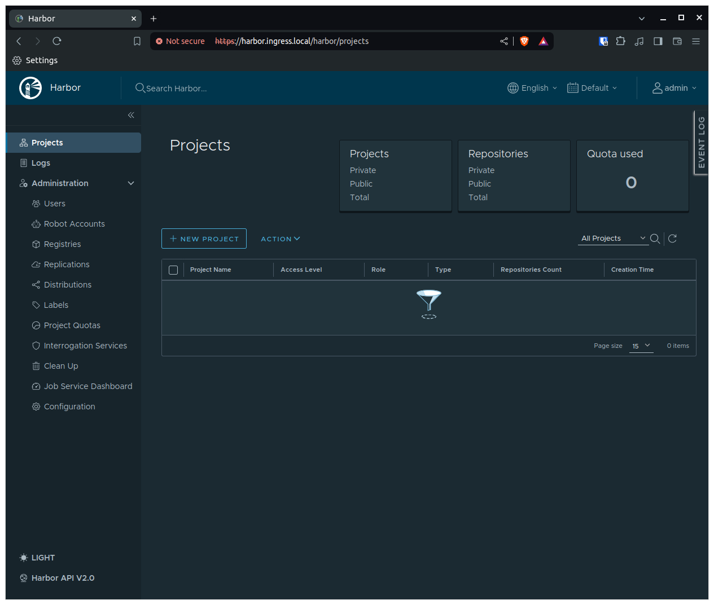
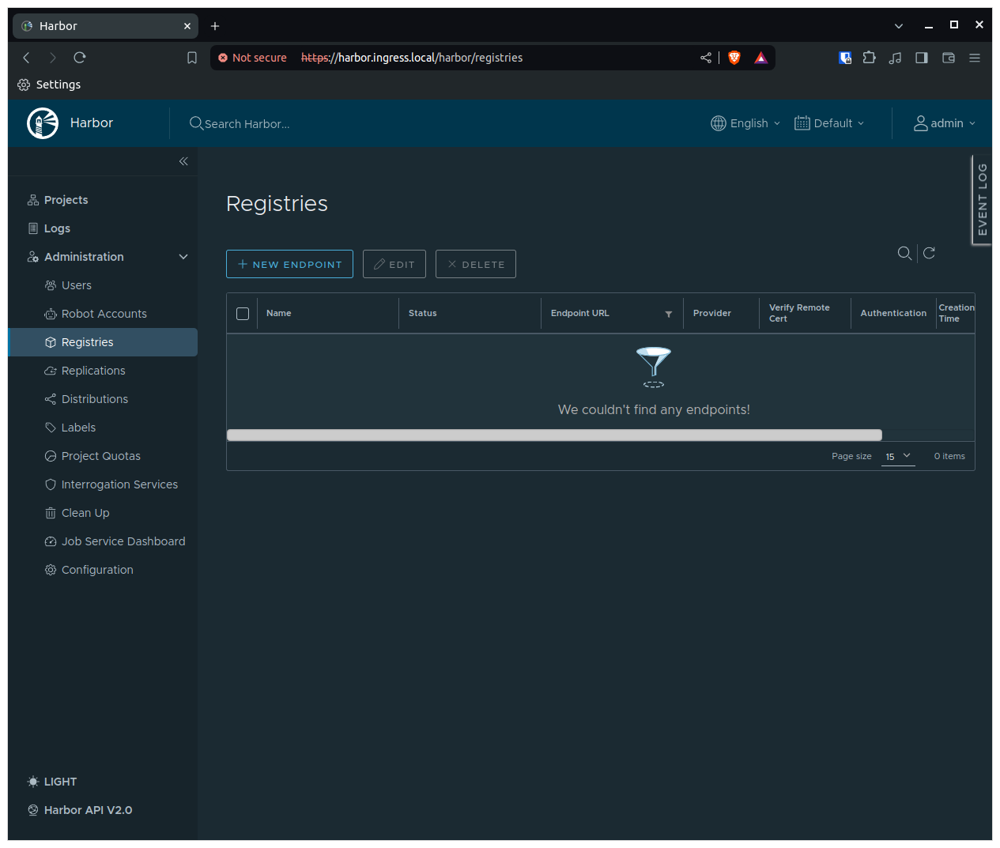
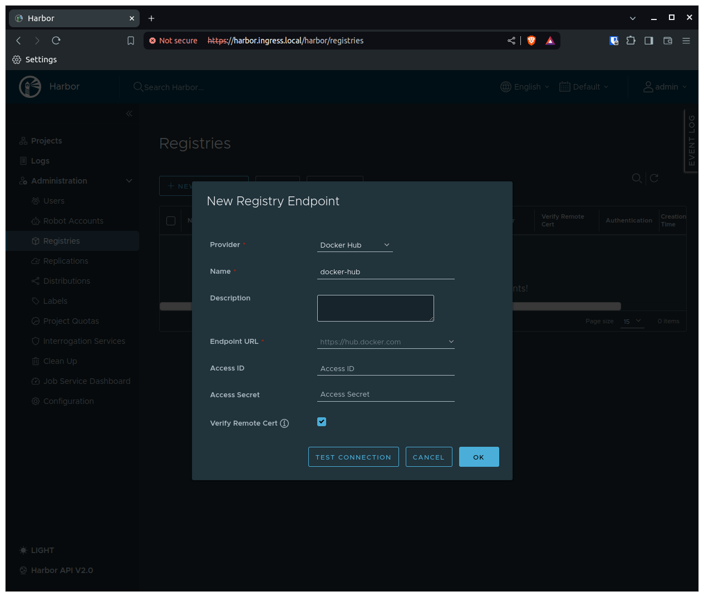
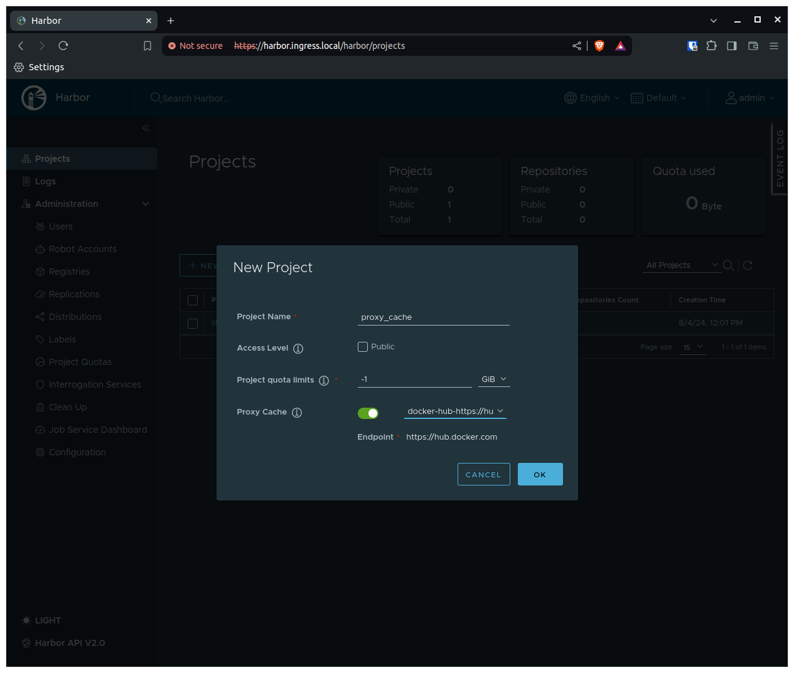
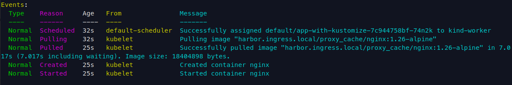
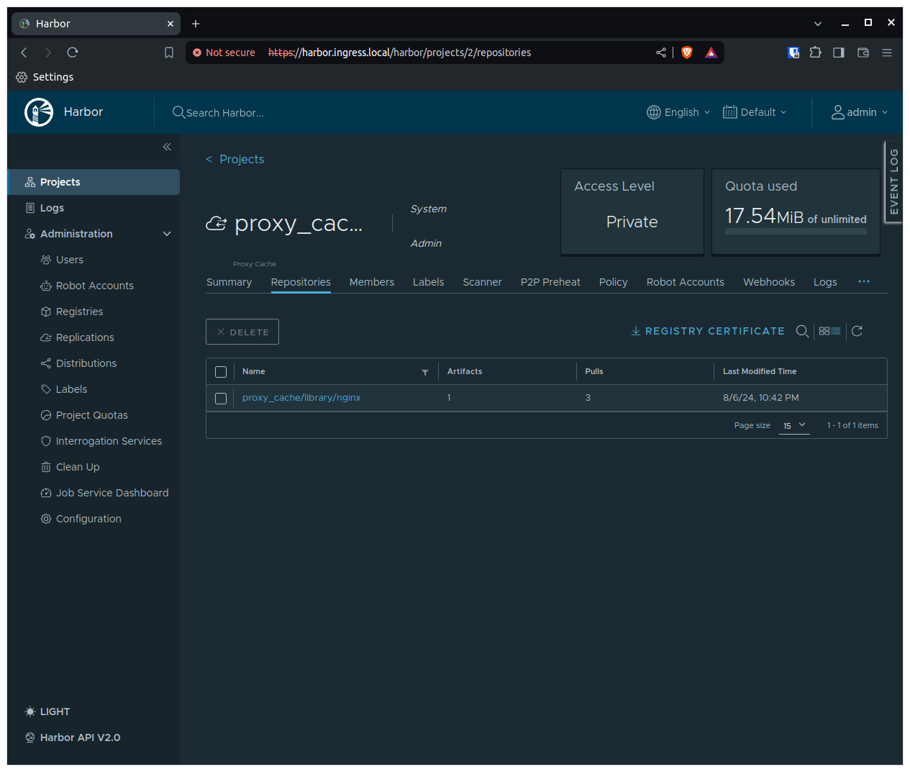
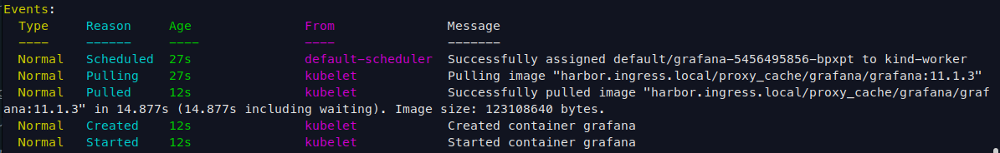
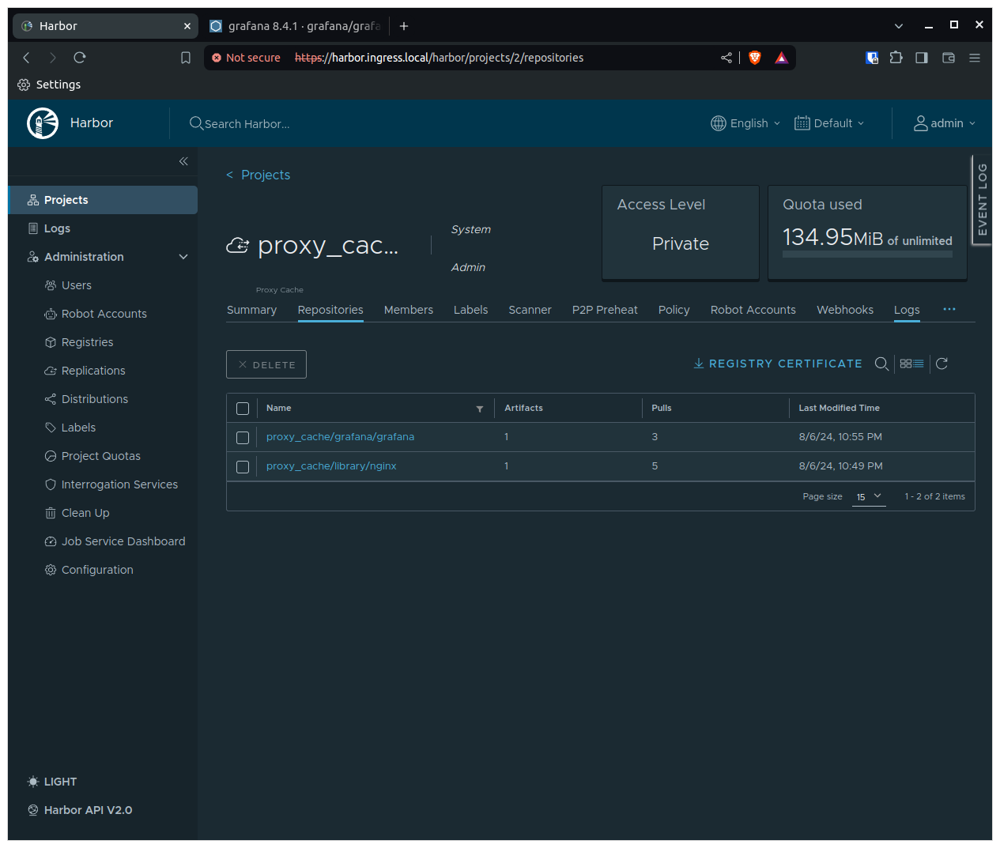
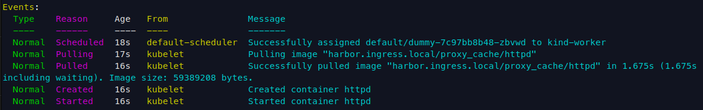
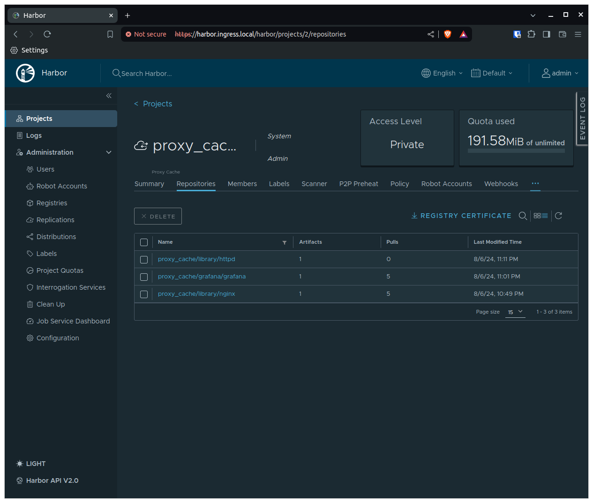

A common problem when dealing with highly dynamic and/or big Kubernetes cluster is facing pull limits from Dockerhub. The [pull rate limits](https://docs.docker.com/docker-hub/download-rate-limit/) are:
- 100 pulls per 6 hours per IP (for unauthenticated users)
- 200 pulls per 6 hours (for authenticated users)

This is usually enough for small clusters, but dynamic and big clusters face issues. A simple solution is implementing a proxy cache project with [Harbor](https://goharbor.io/). Notice that there are several benefits, besides avoiding the low rate pull limit from Dockerhub, of implementing an image proxy cache, such as:
- **Reduce egress traffic**: NAT is usually charged by the amount of traffic
- **Faster pod startup**: The image is already cached inside the cluster
- **Improve reliability**: If the image is cached in the cluster, you do not depend on the external registry

## How does a proxy cache work?
Harbor allows proxy cache to Dockerhub and Harbor repositories. Since our use case is to proxy cache from DockerHub I will only mention DockerHub, but keep in mind that it also applies to Harbor registries (in case you want to have a private image registry).

A [proxy cache](https://goharbor.io/docs/2.1.0/administration/configure-proxy-cache/) basically does the following:
- If the image is not cached in the registry (Harbor), it will proxy the pull image registry to Dockerhub and cache the image locally
- If the image is already cached, Harbor doesn't need to send the request to Dockerhub and will serve the cached image

In reality, there are some extra steps that Harbor does before serving the cache image, such as:
- Checking if the image still exists in Dockerhub. If it doesn't, the image is not served
- Checking if the image was updated. If it wasn't it serves cache, if it was it will proxy the request to Dockerhub (notice that this commonly happens if you use `latest` tag)
- If DockerHub is not reachable, it will serve the cache image

## Local Kubernetes setup

I will demo this locally using [Kind](). I highly recommend you check my blog post on [how to set up a local Kubernetes cluster with LoadBalancer and name resolution in MacOs and Linux](https://felipetrindade.com/kubernetes-ingress-load-balancer/). I will reuse all the components present in the blog post. Since I don't want to repeat myself and keep things dry, I highly recommend you read it (or skim the text).

## Demo time

### Basic local Kubernetes cluster setup

Once again, some of these steps were explained in detail in my previous blog post, I won't go deeper into the explanation here

1) Create a docker network

```sh
docker network create --subnet 172.100.0.0/16 custom-kind-network
```

2) Create a Kind cluster

Using the following Kind configuration

```yaml
# kind.yaml
kind: Cluster
apiVersion: kind.x-k8s.io/v1alpha4
nodes:
  - role: control-plane
    image: kindest/node:v1.30.2
  - role: worker
    image: kindest/node:v1.30.2
```

run the command:

```sh
KIND_EXPERIMENTAL_DOCKER_NETWORK=custom-kind-network kind create cluster --config kind.yaml
```

3) Install MetalLB

Let's install MetalLB using Helm Chart

```sh
helm repo add metallb https://metallb.github.io/metallb
helm install metallb -n metallb --create-namespace metallb/metallb
sleep 5
kubectl wait -n metallb -l app.kubernetes.io/component=controller --for=condition=ready pod --timeout=120s
```

Now that MetalLB is installed let's create our LBs IPs

```yaml
# ip-adress-pool.yaml
apiVersion: metallb.io/v1beta1
kind: IPAddressPool
metadata:
  name: ip-pool
  namespace: metallb
spec:
  addresses:
    - 172.100.150.0-172.100.150.10
```

and announce using the L2 ARP protocol

```yaml
# advertisement.yaml
apiVersion: metallb.io/v1beta1
kind: L2Advertisement
metadata:
  name: advertisement-l2
  namespace: metallb
spec:
  ipAddressPools:
    - ip-pool
```

Apply these manifests:

```bash
kubectl apply -f ip-adress-pool.yaml
kubectl apply -f advertisement.yaml
```

4) Install NGINX Ingress

Once again, let's use Helm to install NGINX Ingress

```sh
helm repo add ingress-nginx https://kubernetes.github.io/ingress-nginx
helm repo update
helm install ingress-nginx -n ingress-nginx --create-namespace ingress-nginx/ingress-nginx
```

You should see that an external-ip is being used by the NGINX service (`kubectl get service -n ingress-nginx`).

### Harbor installation

The only configuration that needs to be changed for this demo (at the end of this blog post I will comment on several improvements that must be done in a real production environment) is related to the ingress, but I will also modify the admin password to be `admin` by simplicity (the classic `admin`/`admin`).

```yaml
# values.yaml
externalURL: https://harbor.ingress.local
harborAdminPassword: admin
expose:
  type: ingress
  ingress:
    controller: default
    className: nginx
    hosts:
      core: harbor.ingress.local
  tls:
    certSource: auto
```

Notice that you will need to add `harbor.ingress.local` to your `/etc/hosts` file.

```sh
INGRESS_LB_IP=$(kubectl get svc ingress-nginx-controller -n ingress-nginx -o jsonpath='{.status.loadBalancer.ingress[0].ip}')
echo "$INGRESS_LB_IP harbor.ingress.local" | sudo tee -a /etc/hosts
```

And finally install Harbor

```sh
helm repo add harbor https://helm.goharbor.io
helm repo update
helm install harbor -n harbor --create-namespace --values values.yaml --version 1.15.0 harbor/harbor
```

Wait for it to get ready and access `https://harbor.ingress.local` UI interface using username `admin` and password `admin`.

After login, this will be the first page you will see



### Creating a proxy cache project

I will show you how to create via UI the proxy cache project but I will also provide the Terraform code.

Let's go to the `Registries` tab.



Now, let's create the endpoint for Dockerhub



Now we can create a new proxy cache project using the registry we just created




Instead of manually managing your Harbor configuration, a better approach is to create all of this using infrastructure as a code. I highly recommend Terraform/OpenTofu in these cases. You can simply use the Harbor provider created by the community and have all configurations as a code. Let's create a simple Terraform module for that

```hcl
# version.tf
terraform {
  required_providers {
    harbor = {
      source  = "goharbor/harbor"
      version = "3.10.14"
    }
  }
}

provider "harbor" {
  url      = var.url
  username = var.username
  password = var.password
}
```

```hcl
# variables.tf
variable "url" {
  description = "The url of harbor"
  type        = string
}

variable "username" {
  description = "The username to be used to access harbor"
  type        = string
}

variable "password" {
  description = "The password to be used to access harbor"
  type        = string
}

variable "proxy_project_name" {
  description = "The name of the project that will be created in harbor."
  type        = string
  default     = "proxy_cache"
}
```

```hcl
# main.tf
resource "harbor_registry" "docker" {
  name          = "docker-hub"
  provider_name = "docker-hub"
  endpoint_url  = "https://hub.docker.com"
}

resource "harbor_project" "proxy" {
  name        = var.proxy_project_name
  registry_id = harbor_registry.docker.registry_id
}
```


```hcl
# vars.tfvars
url ="http://harbor.ingress.local"
username ="admin"
password ="admin"
```

We are simply going to run (using OpenTofu):

```sh
tofu init
tofu apply -var-file=vars.tfvars
```

### Using the harbor proxy cache
Ok, so let's recap what we have so far. We have a local Kubernetes cluster created using Kind with Harbor installed and configured with a proxy cache repository that is proxying DockerHub. Harbor is exposed by our MetalLB Load balancer and routed by the NGINX Ingress.

Now we would like to run an application and see Harbor proxy working in action. Let's run the following demos:
1) Deploy an application that uses Kustomize
2) Deploy an application that uses Helm Chart
3) Deploy an application whose image is already presented in the node

When we are using a private image registry (remember that we didn't check the `Public` box while creating the proxy cache project) we need to tell Kubernetes "Hey, use these credentials to pull the image from the registry". We do that by:
- Pointing the image to the desired registry and repository. This looks obvious, but what I want to say is: that we are not going to directly use DockerHub images, we are going to use Harbor as a registry. This means that we will need to add a [prefix](https://goharbor.io/docs/2.1.0/administration/configure-proxy-cache/) to DockerHub images to point to the Harbor project (`<harbor_server_name>/<proxy_cache_name>`), in our use case this will be equivalent to `harbor.ingress.local/proxy_cache`.
- Define the Kubernetes secret name that contains the credentials to access the private registry in the `imagePullSecrets` property of [container definition](https://kubernetes.io/docs/reference/kubernetes-api/workload-resources/pod-v1/#containers)

For simplicity, I'll use the admin user credentials (that have permission to pull images from the proxy cache project). Notice that this secret needs to be created in every namespace that our apps will require the usage of Harbor registry, in our case we will deploy all apps in the `default` namespace. Let's create this secret by running

```sh
kubectl create secret -n default docker-registry regcred-harbor \
  --docker-server=harbor.ingress.local \
  --docker-username=admin \
  --docker-password=admin
```

Ok, now let's comment about a tricky step that we will need to do to make this work locally. In a real environment with real TLS certificates, you wouldn't have this problem, but since we are running this locally with self-signed TLS certificates (or even without) this problem will appear. Kubernetes, by default, won't pull from "insecure" registries and because of that, we will need to configure the Kubernetes nodes to trust our private Harbor registry.

This configuration is done in the [container runtime](https://kubernetes.io/docs/setup/production-environment/container-runtimes/) that is being used by the Kubernetes cluster, in our case, Kind only supports [containerd](https://kind.sigs.k8s.io/docs/design/principles/#target-cri-functionality), and for containerd, this [configuration](https://github.com/containerd/containerd/blob/v2.0.0-rc.3/docs/cri/config.md) is defined in the `/etc/containerd/config.toml` file.

Let's connect your our Kubernetes node. We should do this to every worker node of our cluster, but since we only have 1 worker node this procedure will only be done once.

```sh
docker exec -it kind-worker bash
```

Let's install some utilities for editing the `/etc/containerd/config.toml` file

```sh
apt-get update
apt install vim -y
vim /etc/containerd/config.toml
```

and add the following lines to the file


```toml
[plugins."io.containerd.grpc.v1.cri".registry]
[plugins."io.containerd.grpc.v1.cri".registry.mirrors]
  [plugins."io.containerd.grpc.v1.cri".registry.mirrors."harbor.ingress.local"]
    endpoint = ["https://harbor.ingress.local"]
  [plugins."io.containerd.grpc.v1.cri".registry.configs."harbor.ingress.local".tls]
    insecure_skip_verify = true
[plugins."io.containerd.grpc.v1.cri".registry.configs."harbor.ingress.local".auth]
  username = "admin"
  password = "admin"
```

and finally restart containerd so these changes can be applied:

```sh
systemctl restart containerd
```

#### Deploying an application that uses Kustomize
Let's deploy an NGINX Kubernetes Deployment manifest using Kustomize. A common pattern when using Kustomize is to have a `base` folder that will be reused by the `overlays` folder (usually the overlays folders represent an environment, e.g. `development`). We would apply generators and patches in the overlays folder but always use the base resources as a reference.

Let's suppose the Kubernetes deployment manifest is in the base folder. One option is to manually modify the prefix of the image there to point to our Harbor registry. It's possible but unlikely that all environments (overlays) will use the same endpoint. So a better idea is to add this as a patch. Let's create a patch for adding the registry credential and the prefix to the image.

```yaml
# base/deployment.yaml
apiVersion: apps/v1
kind: Deployment
metadata:
  labels:
    app: app-with-kustomize
  name: app-with-kustomize
spec:
  replicas: 1
  selector:
    matchLabels:
      app: app-with-kustomize
  template:
    metadata:
      labels:
        app: app-with-kustomize
    spec:
      containers:
        - image: nginx:1.26-alpine
          name: nginx
---
# base/kustomization.yaml
apiVersion: kustomize.config.k8s.io/v1beta1
kind: Kustomization
resources:
  - deployment.yaml
```

Now let's check the overlays folder for the `local` environment:

```yaml
# local/harbor-image-prefix.yaml
apiVersion: builtin
kind: PrefixTransformer
metadata:
  name: image-prefix
prefix: harbor.ingress.local/proxy_cache/
fieldSpecs:
  - path: spec/template/spec/containers/image
---
# local/harbor-regcred.yaml
- op: add
  path: /spec/template/spec/imagePullSecrets
  value:
    - name: regcred-harbor
---
# local/kustomization.yaml
apiVersion: kustomize.config.k8s.io/v1beta1
kind: Kustomization
namespace: default
resources:
  - ../base
patches:
  - path: harbor-regcred.yaml
    target:
      group: apps
      version: v1
      kind: Deployment
      name: app-with-kustomize
transformers:
  - harbor-image-prefix.yaml
```

Let's apply this using `kubectl apply -k local` and describe the pod.



Let's check the `proxy_cache` project in the Harbor UI to see if a new registry was created there.



Perfect!

#### Deploying an application that uses Helm
When using Helm, there are two possibilities: you created the Helm chart, you are using someone else Helm chart. I'm not going to detail the first option, since you have total control over the templates used you can simply add the variable to add the `imagePullSecrets` and also a variable to add a prefix to the image. The second option might be scary: what if the chart owner didn't add this variable? Well, it's possible but unlikely since these are very common things in a well-built Helm chart. Let's use [Grafana chart](https://artifacthub.io/packages/helm/grafana/grafana) as an example.

As you can see in the `default values` section, there are two variables that we are going to use: `global.imageRegistry`, `global.imagePullSecrets`. So let's create our custom values for this chart:

```yaml
# values.yaml
global:
  imageRegistry: harbor.ingress.local/proxy_cache
  imagePullSecrets:
    - regcred-harbor
```

And install it by running

```sh
helm repo add grafana https://grafana.github.io/helm-charts
helm repo update
helm install grafana grafana/grafana -n default --version 8.4.1 --values values.yaml
```

Let's describe the pod and check how it went:



Finally, let's check if the registry was created in Harbor



Perfect!

#### Deploy an application whose image is already presented in the node
Now we are going to deploy an application using an image directly from Dockerhub and modifying it to use Harbor proxy cache and see how it's going to behave, it might surprise you.

```yaml
apiVersion: apps/v1
kind: Deployment
metadata:
  labels:
    app: dummy
  name: dummy
  namespace: default
spec:
  replicas: 1
  selector:
    matchLabels:
      app: dummy
  strategy: {}
  template:
    metadata:
      labels:
        app: dummy
    spec:
      containers:
      - image: httpd
        name: httpd
```

Let's apply that and see that indeed it worked as expected. The pod is running. Now, let's modify this deployment a bit to use the Harbor proxy cache and the registry private credential.

```yaml
apiVersion: apps/v1
kind: Deployment
metadata:
  labels:
    app: dummy
  name: dummy
spec:
  replicas: 1
  selector:
    matchLabels:
      app: dummy
  strategy: {}
  template:
    metadata:
      labels:
        app: dummy
    spec:
      imagePullSecrets:
      - name: regcred-harbor
      containers:
      - image: harbor.ingress.local/proxy_cache/httpd
        name: httpd
```

Now, let's describe the pod and see if it pulled the image correctly:




Now if you check Harbor UI you will see that the `httpd` image is not there! Why? The image was already present in our node! So kubelet queried Harbor to resolve the name of the image (in our case `httpd:latest`) to an image digest. Since the image digest wanted was the same as the one cached locally (if I waited a time long enough to make the digest different - i.e. a new image was pushed to `latest` tag - this would be different!) then kubelet used the cached image (presented on the node).

Let's run an experiment to prove our point. Let's connect to the Kubernetes node and delete the image presented on the node.

```sh
docker exec -it kind-worker bash
crictl rmi harbor.ingress.local/proxy_cache/httpd
```

Now, let's roll out the deployment (or simply delete the pod, downtime is irrelevant here) and check if the image will now be present in Harbor.



Bingo!

## Cya
Hope you enjoyed this blog post! Please, don't copy and paste this to directly deploy to the production environment. There are SEVERAL things that you would need to do to be in a production-ready state. Here are a few tips before deploying this in a real environment.

1) **Use TLS and certificates**: Enhance your security by using TLS/HTTPS and certificates. Adding insecure registries to Kubernetes nodes is not a good practice.
2) **Configure external database for Harbor**: The configurations for Harbor (such as SSO, and users) are all stored in the database. By default, the Helm chart deploys a Postgres database for you but it's more secure to use an external Postgres database (it can even be a database that you run inside Kubernetes with an Operator).
3) **Don't Harbor credentials explicit in Terraform variables**: A good option is to store this somewhere safe (AWS Secrets Manager, SOPS, Hashicorp Vault...) and pass only the name of the secret that contains the credentials. This way you can use the correct provider to pull this information.
4) **Don't use admin user credentials as image pull secret**: Create a user with limited permissions and use these credentials

See you in the next post! 👋
