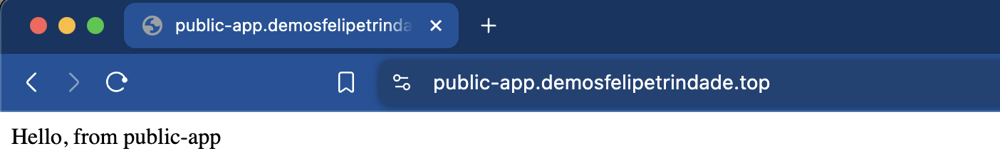
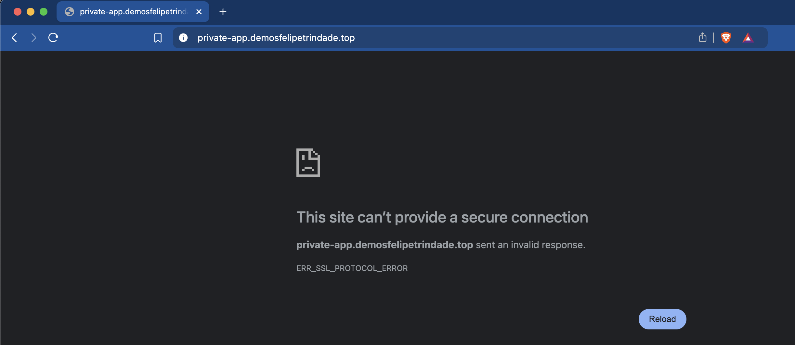
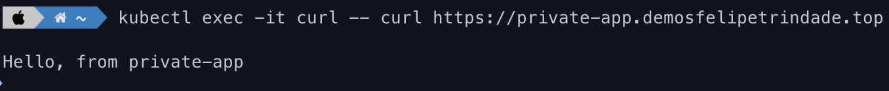

The goal of this blog post is to deploy a Kubernetes cluster with a public and a private application. This is a common requirement in several companies because usually their main service is exposed publicly but internal tools (e.g. Grafana, Airflow) shouldn't be exposed publicly, even if they require authentication, so are deployed internally/privately.

Several tools will be used during the process. Cert Manager, Kubernetes Replicator, External DNS and NGINX Ingress will help us achieve this goal. This will be explained in detail during the blog post, so don't freak out!

For this demo, I will use Vultr to provision the Kubernetes cluster. If you are using a different cloud provider (such as AWS) I would still read this post, since everything here is valid and I will comment exactly where things need to change if you are using a different cloud provider.

All the manifests used here are in the [GitHub repository](https://github.com/felipelaptrin/private-public-kubernetes-apps).

## Ingress and NGINX Ingress Controller
Instead of exposing every Kubernetes application using a LoadBalancer service type, which would require the deployment of a single LoadBalancer per application in your cloud provider, a good practice is to reuse the LoadBalancer to expose multiple services and route these internally using an Ingress.

An Ingress only works with an Ingress Controller, which is not deployed in Kubernetes by default. There are [several controllers available](https://kubernetes.io/docs/concepts/services-networking/ingress-controllers/#additional-controllers) out there. One of the most popular options available is the [NGINX Ingress Controller](https://github.com/kubernetes/ingress-nginx), which is cloud-agnostic and open-source.

The NGINX Ingress Controller will be responsible for requesting a Load Balancer (layer 4) to your cloud provider and will manage the routing to your services. So imagine the following scenario (for simplicity consider all apps are public):
- **Application A**: Configured in the ingress manifest to be accessible in the `app-a.mydomain.com`.
- **Application B**: Configured in the ingress manifest to be accessible in the `app-b.mydomain.com`.

If you resolve these names (e.g. using `dig` or `nslookup`) you will see that they resolve to the same IP, because it's indeed a single Load Balancer exposed and all the routing is happening inside Kubernetes by the Ingress controller (in this case NGINX Ingress). This will be demoed, don't worry!

It's also in the [ingress manifest](https://kubernetes.io/docs/reference/kubernetes-api/service-resources/ingress-v1/#IngressSpec) that we define if the application will be exposed securely (using a TLS certificate). If HTTPS is configured we need to specify the name of the Kubernetes secret that contains the certificates in the ingress manifest.

## Let's Encrypt and Cert Manager
Now that we know that we can use NGINX Ingress Controller to expose our applications using a single Load Balancer and we can specify in the ingress manifest the certificates of the TLS the question now is how the TLS certificate gets generated.

You can self-sign your certificate but who is going to trust you? By default browsers and operational systems come with a list of CA (Certificate Authorities) that are trustable to issue certificates (e.g. [Firefox included certificates](https://ccadb.my.salesforce-sites.com/mozilla/IncludedCACertificateReport)). If you self-sign this certificate you will need to add yourself as a valid CA in the computers of the users (which is something that is not practical, but that can be done in an on-premise environment). To summarize, a self-signed certificate is not practical even for on-premise/private environments is something tedious.

Another option is to buy a certificate from one of these CA companies (e.g. [Digicert](https://www.digicert.com/) or [Segtigo](https://www.sectigo.com/) - this is not an advertisement, I'm just giving examples and I honestly recommend certificates that can be issued for free by LetsEncrypt) but this is usually expensive.

A really popular and free option is to issue certificates from a nonprofit CA company called [Let's Encrypt](https://letsencrypt.org/). According to [W3Techs](https://w3techs.com/technologies/history_overview/ssl_certificate/all), around 53% of the websites use a certificate issued by Let's Encrypt!

For a certificate to be issued to your domain/website you will need to prove that you own the domain (this is called a `challenge`). Let's Encrypt uses ACME protocol to verify that you control the given domain. There are [several ACME clients](https://letsencrypt.org/docs/client-options/) that you can use to issue the certificate, for Kubernetes the most popular tool is [Cert Manager](https://github.com/cert-manager/cert-manager). Let's Encrypt accepts the following [challenges](https://letsencrypt.org/docs/challenge-types/) from the ACME protocol:
- **HTTP-01**: Let's Encrypt gives you a token and you must expose this token in a given route/path (`/.well-known/acme-challenge/<TOKEN>`) in your website. Let's Encrypt will try to retrieve (several times from different servers) this token and check if this is the same token he sent to your ACME client. If it's the same then a new certificate will be issued, otherwise it will fail, meaning that you probably don't own/manage the domain you are trying to issue a certificate. Notice that your application must be public so Let's Encrypt can reach your server.
- **DNS-01**: Instead of managing a route/path to expose the token in your application, DNS-01 challenge will verify that you own the domain by checking TXT records in your domain. Let's Encrypt gives you a TXT value to add to the domain and will check if the value was updated as expected, if so, it means you own the domain and the certificate will be issued. DNS-01 allows issuing certificates with wildcards, while HTTP-01 doesn't.

Some things that are important to mention:
- The tokens/TXT values are not sensitive. They are only used to prove that you own the domain. Users who resolve the TXT record (DNS-01) or access the path containing the token (HTTP-01) can't do anything with this information
- The certificate received is public and the private key is created by the ACME client (in our case Cert-Manager) and will be stored in a Kubernetes secret (once the certificate is issued, the public certificate will also be added to the secret)
- The encryption and decryption part is done in the NGINX Ingress Controller pod
- The certificate is valid for [90 days](https://letsencrypt.org/docs/faq/#what-is-the-lifetime-for-let-s-encrypt-certificates-for-how-long-are-they-valid) and needs to be renewed before this time
- You can issue 5 certificates per week, this is a hard [rate limit](https://letsencrypt.org/docs/rate-limits/) and you can not change it, so if you are still testing your application you should use the [staging environment](https://letsencrypt.org/docs/staging-environment/) of Let's Encrypt

Both solutions are possible to be used in production but DNS-01 is preferred over HTTP-01. First, because it works for public and private applications. Second, because you can issue the certificate before the application is deployed, so no period of missing the certificate. We are going to use DNS-01 challenge since we have private applications and because we are going to issue a wildcard certificate. We will need to provide credentials to Cert Manager so it can go to our DNS and add the TXT record.

## Kubernetes Replicator
As commented, when you issue the certificate, Cert Manager will create a Kubernetes secret containing the private and public keys that will be used by the ingress. As we know, Kubernetes secrets are namespace-scoped so if you have multiple applications in different namespaces there are a few options when using DNS-01:
- Issue one certificate per every application, i.e. one certificate for `app-a.mydomain.com`, another for `app-b.mydomain.com` and so on (this is exactly what you have to do if you use HTTP-01)
- Issue one wildcard certificate per every namespace, i.e. a certificate for `*.mydomain.com` in the `apps` namespace, `*.mydomain.com` in the `monitoring` namespace and so on.
- Issue a single wildcard certificate and replicate this secret in every namespace needed

I'll use the third approach, especially because this will reduce the number of certificates issued, which can be critical for deployments in a big Kubernetes cluster. Since there is no built-in solution for Kubernetes to replicate a Kubernetes secret we need a tool for that. I will use [Kubernetes Reflector](https://github.com/EmberStack/kubernetes-reflector) but other tools can be used, such as [Kubernetes Replicator](https://github.com/mittwald/kubernetes-replicator). The usage is as simple as installing the tool and adding annotations to the secret you want to replicate.

## DNS records and External DNS
We commented that ingress allows us to expose our applications (internal-facing or public-facing) using a Load Balancer and routing using an ingress controller internal to the cluster. We need to add these names (e.g. `app-a.mydomain.com`) to our DNS so clients can resolve this name into an IP.

We definitely don't want to manage this by hand, since this is tedious and prone to error. We can automate this task by using a well-known Kubernetes tool called [External DNS](https://github.com/kubernetes-sigs/external-dns). External DNS will be responsible for adding the DNS records to the DNS automatically!

The configuration is simple and it connects to several DNS providers, such as AWS, GCP, Azure, Linode, Digital Ocean, Vultr... We simply need to add permissions to connect and execute changes in the DNS and we are good to go! External DNS automatically monitors created ingresses.

## Demo
Let's demo with a step-by-step approach. I will use Helm Chart with Kustomize to deploy the applications, since using GitOps (e.g. using ArgoCD) is out of the scope of this demo. For the infrastructure, I will use Terraform.

### Creating the Kubernetes cluster
I'm using Vultr to deploy my Kubernetes cluster, so let's use Vultr Terraform provider.

```hcl
# versions.tf
terraform {
  required_providers {
    vultr = {
      source = "vultr/vultr"
      version = "2.21.0"
    }
  }
}

provider "vultr" {}
```

Creating a Kubernetes cluster is as easy as providing a single terraform resource

```hcl
# main.tf
resource "vultr_kubernetes" "this" {
    region  = "mia" # Miami
    label   = "terraform"
    version = "v1.30.0+1"

    node_pools {
        node_quantity = 1
        plan          = "vc2-2c-4gb"
        label         = "vke-nodepool"
        auto_scaler   = false
    }
}

output "cluster_id" {
  description = "ID of Kubernetes cluster"
  value       = vultr_kubernetes.this.id
}
```

To interact with Vultr API you need to set your environment variable to use the API key of your account (e.g. `export VULTR_API_KEY=BRYAAFNWHYEFY2ZHGTQSDZCHEA`). Make sure you have Terraform or Opentofu (I will use OpenTofu - which is the open-source version of Terraform) and run:

```sh
tofu init
tofu apply
```

You can use Vultr-CLI to get the kubeconfig (it will).

```sh
vultr-cli kubernetes config $(tofu output -raw cluster_id)
```

### Installing Kubernetes Reflector

Let's use the Helm Chart to install the Kubernetes Reflector

```yaml
# namespace.yaml
apiVersion: v1
kind: Namespace
metadata:
  name: reflector
  labels:
    app.kubernetes.io/name: reflector
---
# kustomization.yaml
apiVersion: kustomize.config.k8s.io/v1beta1
kind: Kustomization
resources:
  - namespace.yaml
helmCharts:
  - name: reflector
    repo: https://emberstack.github.io/helm-charts
    releaseName: reflector
    namespace: reflector
    version: 7.1.288
```

### Installing NGINX Ingress Controller

We will need two Load Balancers: one for the public apps and another one for the private apps, because of that we will deploy the NGINX Ingress Controller [two times](https://kubernetes.github.io/ingress-nginx/user-guide/multiple-ingress/#multiple-ingress-controllers).

NGINX pod will request to your Cloud Provider the Load Balancers so you will need to provide credentials to the pod to interact with the cloud. For Vultr this is as simple as providing the API token. For AWS you could provide the AWS Access Keys (this is not a best practice), [IRSA](https://docs.aws.amazon.com/eks/latest/userguide/iam-roles-for-service-accounts.html) or [Pod Identity](https://docs.aws.amazon.com/eks/latest/userguide/pod-identities.html).

Notice that these credentials will also be used in the cert-manager (to create TXT records) and external-dns (to create records for the apps) so we could create these two secrets manually but let's create only a single secret and replicate using Kubernetes Reflector.

```yaml
kubectl create namespace cert-manager
kubectl create namespace ingress-nginx
kubectl create secret generic vultr-credentials -n ingress-nginx --from-literal=apiKey=$VULTR_API_KEY
kubectl label secret vultr-credentials -n ingress-nginx created-manually=true
kubectl annotate secret vultr-credentials -n ingress-nginx reflector.v1.k8s.emberstack.com/reflection-auto-namespaces=kube-system,cert-manager
kubectl annotate secret vultr-credentials -n ingress-nginx reflector.v1.k8s.emberstack.com/reflection-allowed="true"
kubectl annotate secret vultr-credentials -n ingress-nginx reflector.v1.k8s.emberstack.com/reflection-auto-enabled="true"
```

The Load Balancer creation can be configured using annotations that are specific to the cloud provider (e.g. [AWS](https://kubernetes-sigs.github.io/aws-load-balancer-controller/v2.2/guide/ingress/annotations/) and [Vultr](https://github.com/vultr/vultr-cloud-controller-manager/blob/master/docs/load-balancers.md)). Private Load Balancers require special [annotation](https://kubernetes.io/docs/concepts/services-networking/service/#internal-load-balancer).

Let's check the manifests for deploying NGINX Ingress Controller:


```yaml
# namespace.yaml
apiVersion: v1
kind: Namespace
metadata:
  name: ingress-nginx
  labels:
    app.kubernetes.io/name: ingress-nginx
---
# values-private.yaml
controller:
  electionID: ingress-controller-leader-private
  ingressClass: nginx-private
  ingressClassResource:
    name: nginx-private
    controllerValue: k8s.io/private-ingress-nginx
  service:
    external:
      enabled: false
    internal:
      enabled: true
      annotations:
        service.beta.kubernetes.io/vultr-loadbalancer-vpc: true
        service.beta.kubernetes.io/vultr-loadbalancer-backend-protocol: "http"
---
# values-public.yaml
controller:
  electionID: ingress-controller-leader-public
  ingressClass: nginx-public
  ingressClassResource:
    name: nginx-public
    controllerValue: k8s.io/public-ingress-nginx
---
# kustomization.yaml
apiVersion: kustomize.config.k8s.io/v1beta1
kind: Kustomization
namespace: ingress-nginx
resources:
  - namespace.yaml
helmCharts:
  - name: ingress-nginx
    repo: https://kubernetes.github.io/ingress-nginx
    releaseName: ingress-nginx-public
    namespace: ingress-nginx
    version: 4.11.1
    valuesFile: values-public.yaml
    includeCRDs: true
  - name: ingress-nginx
    repo: https://kubernetes.github.io/ingress-nginx
    releaseName: ingress-nginx-private
    namespace: ingress-nginx
    version: 4.11.1
    valuesFile: values-private.yaml
    includeCRDs: true
```

It might take a while for the Load Balancer to get created. You can run `kubectl get service -n ingress-nginx` and check if the Load Balancers services already have an IP assigned.

### Installing Cert-Manager
Once again, let's use Helm Chart to install Cert Manager. One important thing to mention, when installing Cert Manager several CRDs are installed, such as `ClusterIssuer` and `Certificate`. We need to create a cluster issuer for Let's Encrypt and a wildcard certificate to be used in all namespaces.

When creating the cluster issuer using DNS-01 we need to define the DNS provider that we are going to use. There are several options available and the [configuration](https://cert-manager.io/docs/reference/api-docs/#acme.cert-manager.io/v1.ACMEChallengeSolverDNS01) of each one is specific to the provider. For Vultr, we need to use the webhook method, so we are going to install the [Vultr webhook for Cert Manager](https://github.com/vultr/cert-manager-webhook-vultr). This will already provide the cluster issuer for us, but in case you are curious to know how the cluster issuer manifest would look for AWS it is like the following:

```yaml
apiVersion: cert-manager.io/v1
kind: ClusterIssuer
metadata:
  name: ca-issuer
  namespace: cert-manager
spec:
  acme:
    email: youremail@domain.com
    server: https://acme-v02.api.letsencrypt.org/directory # you can use staging URL for testing
    privateKeySecretRef:
      name: issuer-key
    solvers:
    - dns01:
        route53:
          region: us-east-1
          hostedZoneID: Z101361A2CEA1ZXYAMN60
```

So now, let's install Cert Manager.

```yaml
# namespace.yaml
apiVersion: v1
kind: Namespace
metadata:
  name: cert-manager
  labels:
    app.kubernetes.io/name: cert-manager
---
# certificate.yaml
apiVersion: cert-manager.io/v1
kind: Certificate
metadata:
  name: ca-tls
  namespace: default
spec:
  issuerRef:
    name: vultr-letsencrypt-prod # created by vultr webhook
    kind: ClusterIssuer
  duration: 2160h # 90 days
  renewBefore: 240h # 10 days
  privateKey:
    algorithm: RSA
    encoding: PKCS1
    size: 2048
  dnsNames:
    - "*.demosfelipetrindade.top"
  secretName: ca-tsl
  secretTemplate:
    annotations:
      reflector.v1.k8s.emberstack.com/reflection-allowed: "true"
      reflector.v1.k8s.emberstack.com/reflection-auto-enabled: "true"
---
# values.yaml
installCRDs: true
---
# kustomization.yaml
apiVersion: kustomize.config.k8s.io/v1beta1
kind: Kustomization
resources:
  - namespace.yaml
  - certificate.yaml
  - vultr-webhook.yaml
helmCharts:
  - name: cert-manager
    repo: https://charts.jetstack.io
    releaseName: cert-manager
    namespace: cert-manager
    valuesFile: values.yaml
    version: 1.15.2
```

Notice that I didn't include here the values of the `vultr-webhook.yaml`. You can check in the GitHub repository but I rather not paste it here because it's really big (the deployed Helm Chart of Vultr Webhook is old so I've used `helm template` to get the manifests from the source code).

It will take a while for the certificate to become valid. You can check the flow of issuing a certificate in the [documentation](https://cert-manager.io/docs/usage/) but you basically:
- You create the Certificate (`kubectl get certificate`)
- The Certificate creates a [CertificateRequest](https://cert-manager.io/docs/usage/certificaterequest/) (`kubectl get CertificateRequest`)
- An [Order](https://cert-manager.io/docs/concepts/acme-orders-challenges/#orders) gets created (`kubectl get order`)
- A [Challenge](https://cert-manager.io/docs/usage/certificaterequest/) gets created (`kubectl get challenge`)

During the certificate is being issued you can run `kubectl get` and `kubectl describe` to get the state of the resources. If you open your DNS provider you will see that a TXT record will be created and after validation it will be removed.

### Installing External-DNS
Differently than Cert-Manager, here we don't need to instantiate CRDs, but we need to set credentials to the cloud provider.

```yaml
# values.yaml
provider:
  name: vultr
env:
  - name: VULTR_API_KEY
    valueFrom:
      secretKeyRef:
        key: apiKey
        name: vultr-credentials # secret replicated
---
# kustomization.yaml
apiVersion: kustomize.config.k8s.io/v1beta1
kind: Kustomization
helmCharts:
  - name: external-dns
    repo: https://kubernetes-sigs.github.io/external-dns/
    releaseName: external-dns
    namespace: kube-system
    valuesFile: values.yaml
    version: 1.14.5
```

### Deploying a public application
Let's deploy a really simple application using Nginx as the base image and show the text "Hello, from public-app". We are going to deploy a `Service` of kind `ClusterIp`, a `Deployment` and an `Ingress`.

```yaml
# deployment.yaml
apiVersion: apps/v1
kind: Deployment
metadata:
  labels:
    app: public-app
  name: public-app
spec:
  replicas: 1
  selector:
    matchLabels:
      app: public-app
  template:
    metadata:
      labels:
        app: public-app
    spec:
      containers:
      - image: nginx
        name: nginx
        command:
          - sh
          - "-c"
          - "echo 'Hello, from public-app' > /usr/share/nginx/html/index.html && nginx -g 'daemon off;'"
---
# service.yaml
apiVersion: v1
kind: Service
metadata:
  labels:
    app: public-app
  name: public-app
spec:
  ports:
  - port: 80
    protocol: TCP
    targetPort: 80
  selector:
    app: public-app
  type: ClusterIP
---
# ingress.yaml
apiVersion: networking.k8s.io/v1
kind: Ingress
metadata:
  name: public-app
  annotations:
    nginx.ingress.kubernetes.io/rewrite-target: /
    nginx.ingress.kubernetes.io/ssl-redirect: "true"
spec:
  ingressClassName: nginx-public
  tls:
    - secretName: ca-tsl
      hosts:
        - public-app.demosfelipetrindade.top
  rules:
  - host: public-app.demosfelipetrindade.top
    http:
      paths:
      - path: /
        pathType: Prefix
        backend:
          service:
            name: public-app
            port:
              number: 80
---
# kustomization.yaml
apiVersion: kustomize.config.k8s.io/v1beta1
kind: Kustomization
namespace: default
resources:
  - deployment.yaml
  - service.yaml
  - ingress.yaml
```

Notice that we are using the public ingress class created in the NGINX Ingress Controller installation (`nginx-public`).

### Deploying a private application
The manifests for deploying the private application are almost identical to the the public one, the only change will be the name of the application being deployed, the message displayed and the ingress class name (`nginx-private`)

```yaml
# deployment.yaml
apiVersion: apps/v1
kind: Deployment
metadata:
  labels:
    app: private-app
  name: private-app
spec:
  replicas: 1
  selector:
    matchLabels:
      app: private-app
  template:
    metadata:
      labels:
        app: private-app
    spec:
      containers:
      - image: nginx
        name: nginx
        command:
          - sh
          - "-c"
          - "echo 'Hello, from private-app' > /usr/share/nginx/html/index.html && nginx -g 'daemon off;'"
---
# service.yaml
apiVersion: v1
kind: Service
metadata:
  labels:
    app: private-app
  name: private-app
spec:
  ports:
  - port: 80
    protocol: TCP
    targetPort: 80
  selector:
    app: private-app
  type: ClusterIP
---
# ingress.yaml
apiVersion: networking.k8s.io/v1
kind: Ingress
metadata:
  name: private-app
  annotations:
    nginx.ingress.kubernetes.io/rewrite-target: /
    nginx.ingress.kubernetes.io/ssl-redirect: "true"
spec:
  ingressClassName: nginx-private
  tls:
    - secretName: ca-tsl
      hosts:
        - private-app.demosfelipetrindade.top
  rules:
  - host: private-app.demosfelipetrindade.top
    http:
      paths:
      - path: /
        pathType: Prefix
        backend:
          service:
            name: private-app
            port:
              number: 80
---
# kustomization.yaml
apiVersion: kustomize.config.k8s.io/v1beta1
kind: Kustomization
namespace: default
resources:
  - deployment.yaml
  - service.yaml
  - ingress.yaml
```


### Checking the applications
You can inspect the logs (`kubectl logs`) of the external-dns pod in the kube-system namespace and check that it will detect the new ingress and will create records in the DNS provider. Notice that it might take a while for the DNS to propage the changes and the applications to be accessible.

Now access the public application URL (in my case `https://public-app.demosfelipetrindade.top`). Check the message displayed!



Now let's check if we are able to access the private application URL (in my case `https://private-app.demosfelipetrindade.top`).



We can't, as expected! So let's see if we can access the private application within the cluster. For that, let's run a pod that has `curl` installed and curl the private app URL.


```sh
kubectl run curl --image=nginx:alpine
kubectl exec -it curl -- curl https://private-app.demosfelipetrindade.top
```



Bingo! The private application is accessible within the cluster! A great improvement would be to deploy a VPN in this network and access the private applications using the VPN but this is out of the scope of this blog post.

## Cya!
Well, I hope you liked this blog post. We covered several tools used in real Kubernetes environments and explained in detail why they are needed and how they all are used together!

See you around! 👋
