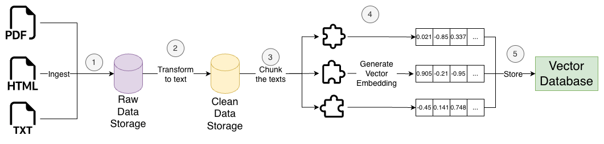
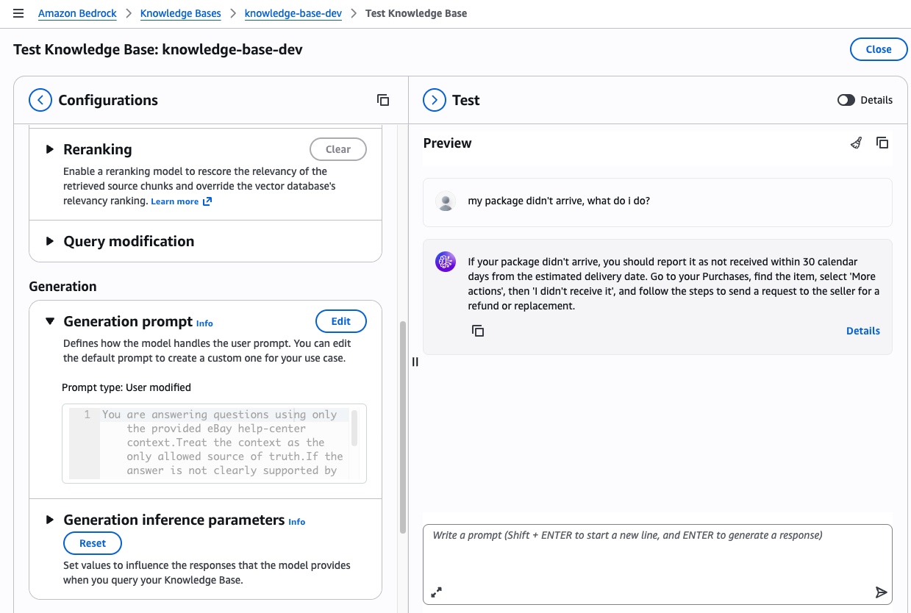
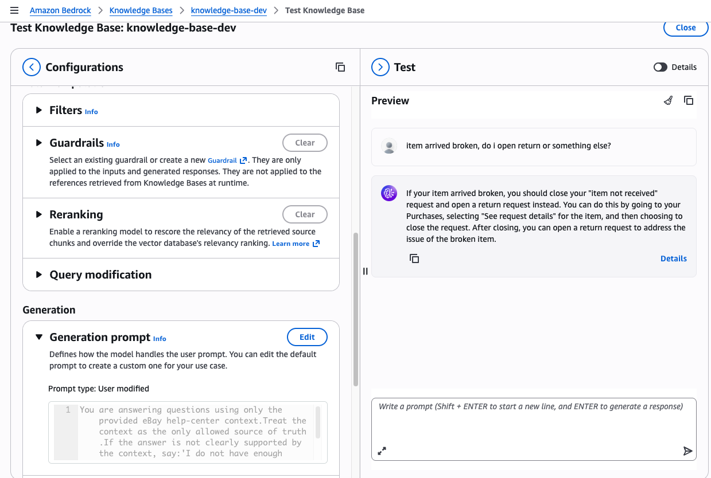

Today we are going to do something different than what I usually post here. We are going to deploy a Self-Managed and AWS-managed RAG System to explore it more and understand more about RAG systems. If you are not familiar with it, don't worry, we will get there! It's essential to note that I'm not a Machine Learning Engineer and definitely not an expert in this matter, but I've participated in several projects involving the RAG system in AWS, and I believe I can explain it in a way that other DevOps professionals could benefit from.

Check out the code used on this [GitHub Repository](https://github.com/felipelaptrin/rag).
## RAG explained

RAG (Retrieval Augmented Generation) is a pattern used with LLM to get answers given external knowledge/context to the LLM. Why is this important? Well, have you ever had an interaction with an LLM that couldn't provide a meaningful response? Maybe you asked about something that was specific to your company, and the LLM hallucinated or gave a wrong answer. This happened because the LLM didn't have the knowledge about what you were asking, maybe because the context you have is private and the LLM has no access (e.g., information that only exists in internal documents of your company), or maybe because the LLM was not trained with that piece of data (outdated data). The RAG system allows us to get better responses from the LLM given an external data collection. So, to summarize, RAG is a technique used to **retrieve** data from an external data collection where this data is **augmented** (injected into LLM prompt) at run-time and the LLM **generates** a response given that extra piece of context. This technique is very common to be implemented in AI customer chatbots (RAG is used to retrieve information about refunds, shipping, policies...) and AI assistants (use RAG to have more context about a PDF, file you uploaded).

A RAG system has two phases:
- **Indexing Phase**: This part we get the data collection (PDFs, Web pages, internal documentation...) and chunk the text into smaller pieces, embed each chunk into a vector, and finally store in a vector database
- **Querying Phase**: The application will use the vector database to retrieve the most similar chunks and inject this in the prompt in run-time.

Now, it's possible that you have multiple questions: What is this Vector Database? How was this database populated? What is this "similar search"? What is a vector? Don't worry, I plan to cover all these technicalities, so keep reading, and we will get there!

Visually, the querying phase with a RAG system goes like this:


1) First, the user asks something to the application, let's suppose an AI Chatbot. Let's say the user asked, "The shirt I bought arrived yesterday, but it's too big for me. Can I exchange it for a smaller size?"
2) The app will get the user's question, transform it into a vector using an embedding model, and send this vector to the vector database to perform a similarity search. In this case, it will understand it's about `Returns, Refunds, Exchanges` and retrieve information about the return policy of the company.
3) With the response from the vector database, the application can now inject this into a prompt (about the return policy) to an LLM to respond to the user's question.
4) The application will return the LLM response with a more concise and better context response.

The indexing phase with a RAG system goes like this:



1) First, we collect all the documents we would like to index (PDF, texts, URL...) and store them somewhere (e.g., object store service like S3)
2) Convert the data to text and perform cleanup on the data
3) Chunk the converted text data into multiple chunks using a chunking strategy and add metadata to it
4) Create the embeddings for each chunk
5) Store vector embeddings, original text, and metadata in an index in the vector database

## Technicalities
Let's define some jargon that was used!

- **Vector**: If you went to college in a STEM field (Science, Technology, Engineering, Math) you studied this for sure! A vector is simply a list of numbers living in a N-dimentional space. It's basically a generic math object that represents something (in physics, we use a lot to represent the direction of a force, for example).
- **Embedding**: It is a numerical representation of data that captures its relevant qualities in a way that ML algorithms can process. In other words, think of it as the mathematical representation of something (image, text, audio...) that captures the relevant qualities, such as: meaning/topic when it's a text, shapes/textures in pictures... We need to convert the data to numbers; that's how we can perform mathematical logic in ML. The data is embedded in n-dimensional space.
- **Vector Embedding**: Sometimes you will see people only saying "embeddings" instead of "vector embedding" because in the ML context, embeddings are almost always used in the vector form. The process of transforming the data to a vector embedding is performed by an `embedding model`, i.e., a machine learning model that is specialized in performing embedding.
- **Vector Similarity**: Now that we have our data transformed into a vector embeddings, we can mathematically perform operations to know if one vector is similar to another vector. There are multiple methods to perform this, but the main ones are: dot product, cosine similarity, and Euclidean distance. The differences between them are outside the scope of this blog post. Why is this important? Simple! We can retrieve from a text information about `refunds` even if the user said `I want my money back`, because they are similar.
- **Chunking**: Documents are too long to embed in a single vector, that's why chunking comes to rescue! Chunking means splitting the data into multiple smaller pieces that will later be embedded into vector embeddings. But there is a trade-off: smaller chunkings give a more precise retrieval but might miss context, while larger chunkings have more context but might be noisier. So the Machine Learning Engineer needs to use techniques to find the best chunking strategy.
- **Vector Database**: Traditional databases are not optimized to deal with high-dimensional data and perform ANN (Approximate Nearest Neighbor) at scale, i.e. vector embedding requires optimized databases to work with. Top Vector Databases are: Qdrant, Pgvector (an extension of PostgreSQL), Milvus, ElasticSearch.
- **ANN**: Approximate Nearest Neighbor is very popular algorithm that performs efficient search at scale. It's important not confuse it with the similarity metrics mentioned before (dot product, cosine similarity, and Euclidean distance). While the similarity metric answers "How similar are these two vectors?", the ANN answers "How do we find the top-K most similar vectors?". Imagine having to compare the embedded vector with millions of embedded vectors. This is an `O(n)` operation (using Big-O notation), and it's not the fast method... That's where ANN comes into play, by sacrificing a bit of accuracy (that's why it has `Approximate` in its name!) to gain speed.
- **Metadata**: So far, everytime I talked about similarity and retrieval I only mentioned the data itself, but in reality it's very common in professional RAG systems to also use metadadata. During the indexing phase for each chunk, you usually store three things: the data (e.g., the text of the chunked context), the embedding vector (the numeric representation), and the metadata. The metadata holds attributes about the chunk that can be used to filter during the querying phase. Example of metadata fields are: language, region, source, title, section, page number, department, owner, tenant id...

I think this is the minimum you need to know in order to understand the basics of RAG. The Machine Learning Engineer needs to know way more than this and also apply the best strategy for chunking (size and overlap of each chunk), embedding (which embedding model to use), retrieval (how similar the words need to be and filters to use), and much more.

## Hands On
Let's deploy the RAG architecture to serve a customer-facing chatbot responsible for answering eBay clients' questions. Ebay offers extensive documentation for helping sellers and buyers: more than 10 different pages talking about different topics. That's a great dataset for us! For our self-managed RAG system, I will open each page and download the page as PDF, for the AWS-managed solution, I will simply use the URL of the website. This way, I can present two different ways of dealing with input data for RAG.

### Self-Managed RAG System
For the self-managed RAG system, I propose an event-based architecture that, every time a new PDF is added to the S3 Bucket, the entire process starts and does the parsing (PDF to text), chunking, and embedding process. Since the PDFs are small and the duration to run these processes is not long, it makes sense to trigger the orchestration (Step Function Workflow) of the process using the S3 upload event as input, run each process in Lambda (serverless, cheap, easy to maintain), and store it in the Vector Database. For the database, I will use Qdrant, since it's an open-source solution with great community support. For simplicity (this is now prod-ready design...) I will run the database in EC2 (data stored in EBS volume) managed by ECS. I void the usage of Fargate because I would need to use NFS for storing the data, and Qdrant docs explicitly say that [Qdrant does not work with Network file systems](https://qdrant.tech/documentation/guides/installation/#storage). And of course, an API to receive the user question, perform similarity search in the vector database, and talk to a generative LLM to get a response (given a prompt and returned data from the vector database). For this, I will stick with the classic API Gateway + Lambda approach! Oh, and we can even leverage the new [API Gateway streaming feature](https://aws.amazon.com/about-aws/whats-new/2025/11/api-gateway-response-streaming-rest-apis/).

The orchestration is actually very simple: extract the PDF S3 Object key from the event and trigger the `pdf-to-text` Lambda, then the `chunking`, and finally the `embedding`. Clean, simple, and it works! Each PDF gets a `doc_id` and is stored in an organized way in the S3 bucket:

```
raw/      # Prefix used to PDF files uploaded by employees
clean/    # JSON containing the extracted text from PDF
chunks/   # JSONL (each line is a JSON) containing the chunk
```

### AWS managed RAG System
Well, for the AWS-managed RAG system the things get... way simple! Bedrock Knowledge Bases is an AWS service that simplifies by A LOT the RAG system workflow. Indeed, you only need to define two things: the storage configuration (where the data will be stored - vector database) and the data source (where the data comes from). In our case we will use `WEB Crawler` data source (URLs) and the [AWS Documentation](https://docs.aws.amazon.com/bedrock/latest/userguide/webcrawl-data-source-connector.html?utm_source=chatgpt.com) tell us that the only supported vector database supported is `OpenSearch Serverless`, so that's it. In the date I'm writing this blog post (Feb 2026) the Web Crawler data source is in preview release and is subject to change, but let's use it anyway. Here we would still need to use an API to perform the RAG process but since Knowledge Bases offers an UI to test your knowledge base I will stick with it for this hands on experiment.

### Proposed Architecture
Based on that, we have our proposed architecture for this project!


It's very important to say that this is not a silver bullet architecture that works great for all scenarios. This is simply a recommended architecture for this hands-on blog post!

### Deployment
As always, the code for this hands-on experiment is in my [GitHub Repository](http://github.com/felipelaptrin/rag). As you might imagine, there are several parts in this project:
- `pdf-to-text` Lambda code
- `chunking` Lambda code
- `embedding` Lambda code
- API Lambda code
- Terraform code
- GitHub Actions CI/CD code

And pasting all this code here would be too much, so I will intentionally not paste any code here and encourage you to check the repository. Since it's all Terraform, feel free to deploy in your environment and test it!

### Results
I've used a very simple prompt for the generative LLM that goes like this:

```txt
You are answering questions using only the provided eBay help-center context.
Treat the context as the only allowed source of truth.
If the answer is not clearly supported by the context, say:
'I do not have enough information in the provided knowledge base to answer that clearly.'
Do not guess.
Do not invent UI steps, actions, deadlines, or policies.
Do not combine buyer and seller flows unless the context explicitly says both apply.
If the user question is buyer-specific, prefer buyer instructions.
If the user question is seller-specific, prefer seller instructions.
If the role is unclear and the context differs by role, say so.
Ignore irrelevant context.
Return only plain English text, short and factual, in one paragraph.

Question: $query$

Context: $search_results$

Answer the question using only the context above.
```

where `$query$` corresponds to the user input question and `$search_results$` the results of the similarity search in the vector database.

#### Results - Self-Managed RAG
I've input several questions into the system and compiled all the answers [here](https://github.com/felipelaptrin/rag/blob/main/self-managed-answers.txt), some examples below:

```txt
Q: My package didn't arrive. What do I do?

A: If your item hasn't arrived, check your order confirmation email
for the expected delivery date and shipping address, and select
“View order details” to see the latest tracking updates. If the
estimated delivery date has passed, report that your item hasn't
arrived by contacting the seller through your order confirmation
email, selecting “I haven't received my item yet,” and choosing
“No, I want to contact the seller.” You have up to 30 calendar days
from the estimated delivery date to do so, and the seller should
respond within 3 business days with an update, replacement, or refund.
```

and

```txt
Q: Item arrived broken, do I open a return or something else?

A: If an item arrives broken, you should go to your Purchases
and select “See request details” to close your request. Select
a reason for closing the return and add details if you want to,
then confirm.
```

Sometimes the responses were on point, sometimes they looked weird. That's because we need to tune the system, perform better cleaning (PDF to text)... Not the perfect system, but the idea has been proven. And it works! In the logs of the API, you can even see the chunk returned by the similarity search operation.


### Results - AWS Managed
I didn't compile all the responses that came from the AWS Knowledge Base, but I screenshot some responses.






For these questions, very similar results.

## Cya!
Well, I hope you liked this blog post!

See you around! 👋