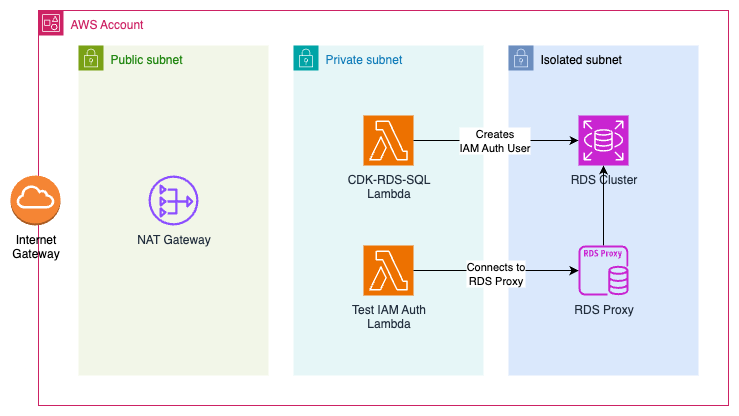

The goal of this blog post is to deploy a Lambda Function inside the VPC and make this Lambda Function connect to an RDS Cluster using Authentication. To increase the resiliency and reduce spikes of connections in the database, we are also going to add an RDS proxy.

All the code used in this blog post is available in my [GitHub Repository](https://github.com/felipelaptrin/rds-iam-auth).

## IAM Authentication
In AWS, there are two ways of authenticating in RDS databases:
- Using static credentials of users in the database (i.e., master password or user created within the database)
- Using dynamic credentials, i.e., using IAM Authentication

There are several benefits of using dynamic credentials, such as: no need to handle password rotation and easy integration with AWS services (AWS Lambda, ECS Task, EC2...), since these services already assume an IAM Role that can be granted access to the database. Your security team will be very happy with you!

When using IAM Authentication, your application will issue a token (temporary password) by using the [generate_db_auth_token](https://boto3.amazonaws.com/v1/documentation/api/latest/reference/services/rds/client/generate_db_auth_token.html) action. This token will be used by your application as the password of the DB user that can use IAM Auth (more on that soon).

This token has a lifetime of 15 minutes and can only be used once, but once this token is used and you are connected to the database, there is no "lifetime" involved. You are in!

The steps needed to use IAM Authentication are:
- Allow RDS Cluster/Instance to use IAM Authentication
- Create a [user](https://docs.aws.amazon.com/AmazonRDS/latest/UserGuide/UsingWithRDS.IAMDBAuth.DBAccounts.html) in the DB that will be used during IAM Authentication. The way to create this user depends on the engine (PostgreSQL, MySQL, MariaDB) of the database.
- Create an IAM Role that will be used by your application. The [policy](https://docs.aws.amazon.com/AmazonRDS/latest/UserGuide/UsingWithRDS.IAMDBAuth.html) of this role should allow `rds-db:connect` action on the ARN of the DB user.

With that being done, your application can issue the token to get the password to connect to the database using the created DB user.

There are some [limitations](https://docs.aws.amazon.com/AmazonRDS/latest/UserGuide/UsingWithRDS.IAMDBAuth.html#UsingWithRDS.IAMDBAuth.Limitations), or at least, points of attention in case you decide to use IAM Authentication. The most relevant, in my opinion, is the fact that IAM database authentication throttles connections at 200 connections per second, and the fact that CloudWatch and CloudTrail don't log IAM authentication.

Two hundred connections per second might look scary and a huge spike, but when we are talking about Lambda Functions (serverless) that create connections on every new lambda context creation, this can easily be a reality. To solve this problem, we can add a pool system that will manage the connections to the database to avoid this problem!

There are several open source database pool systems that you can use, e.g., [pgBouncer](https://www.pgbouncer.org/) (for PostgreSQL). In case you don't want to self-deploy and manage your DB pool system, you can use the AWS managed solution: RDS Proxy.

## RDS Proxy
RDS Proxy is an AWS solution to manage a database pool of connections. It's a service that is easily integrated with RDS (unfortunately, it does not work with self-managed databases - e.g., deployed in EC2) and can help you with unpredictable surges in database traffic, as mentioned, this is very common in serverless scenarios.

RDS Proxy can connect to databases using static credentials to the database or with IAM Authentication. You know what this means? That we can have an end-to-end integration (App -> RDS Proxy -> Database) using IAM Authentication! And that's exactly what we are going to do in this blog post.

## Architecture



We are going to deploy all this infrastructure using AWS CDK. Ready?

## Talk is cheap, show me the code

Let's start with our application code. A simple Lambda Python code that connects to the database and runs a simple query.

```python
import os

import boto3
import psycopg2
from dotenv import load_dotenv


def get_db_password():
    client = boto3.client("rds", region_name=os.getenv("AWS_REGION"))
    token = client.generate_db_auth_token(
        DBHostname=os.getenv("DB_HOST"),
        Port=os.getenv("DB_PORT"),
        DBUsername=os.getenv("DB_USER"),
        Region=os.getenv("AWS_REGION"),
    )
    print(f"{token = }")

    return token


def handler(event, context):
    print("------ LAMBDA STARTED ------")

    try:
        if os.getenv("USE_IAM_AUTH").lower() == "true":
            password = get_db_password()
        else:
            password = os.getenv("DB_PASSWORD")
        conn = psycopg2.connect(
            host=os.getenv("DB_HOST"),
            user=os.getenv("DB_USER"),
            password=password,
            port=os.getenv("DB_PORT"),
            dbname=os.getenv("DB_NAME"),
            sslmode="require",
        )

        cursor = conn.cursor()
        cursor.execute("SELECT current_database(), current_user;")
        record = cursor.fetchall()[0]
        db_name, db_user = record
        print(f"Connected to database '{db_name}' with user '{db_user}'...")
    except Exception as e:
        raise e


if __name__ == "__main__":
    if os.getenv("LOCAL_DEVELOPMENT"):
        load_dotenv()
        handler({}, {})
```

The code is simple. You can connect via static credentials or with IAM Auth (if the environment variable USE_IAM_AUTH is set to TRUE).

Now, let's take a look at the CDK Code.

```typescript
import { ArnFormat, Duration, Fn, Stack, StackProps, Tags } from "aws-cdk-lib";
import * as ec2 from "aws-cdk-lib/aws-ec2";
import * as rds from "aws-cdk-lib/aws-rds";
import { Construct } from "constructs";
import * as rdsSql from "cdk-rds-sql";
import * as lambda from "aws-cdk-lib/aws-lambda";
import * as iam from "aws-cdk-lib/aws-iam";
import * as ecrAssets from "aws-cdk-lib/aws-ecr-assets";
import * as path from "path";

export class IamAuthStack extends Stack {
  vpc: ec2.Vpc;

  constructor(scope: Construct, id: string, props?: StackProps) {
    super(scope, id, props);
    Tags.of(this).add("Repo", "github.com/felipelaptrin/iam-authentication-rds");

    this.vpc = this.setVpc();
    const dbName = "app";
    const dbUser = "iamuserapp";

    const { cluster, clusterProxy, clusterProxySg, clusterProxyId } = this.createDatabase(dbName, dbUser);
    this.setRdsIamAuthentication(dbName, dbUser, cluster);
    this.setBackend(dbUser, cluster, clusterProxy, clusterProxySg, clusterProxyId);
  }

  setVpc(): ec2.Vpc {
    const vpc = new ec2.Vpc(this, "Vpc", {
      ipAddresses: ec2.IpAddresses.cidr("10.220.0.0/16"),
      maxAzs: 2,
      natGateways: 1,
      subnetConfiguration: [
        {
          cidrMask: 24,
          name: "public",
          subnetType: ec2.SubnetType.PUBLIC,
        },
        {
          cidrMask: 24,
          name: "private",
          subnetType: ec2.SubnetType.PRIVATE_WITH_EGRESS,
        },
        {
          cidrMask: 24,
          name: "databases",
          subnetType: ec2.SubnetType.PRIVATE_ISOLATED,
        },
      ],
    });

    return vpc;
  }

  createDatabase(
    dbName: string,
    dbUser: string,
  ): {
    cluster: rds.DatabaseCluster;
    clusterProxy: rds.CfnDBProxy;
    clusterProxySg: ec2.SecurityGroup;
    clusterProxyId: string;
  } {
    const cluster = new rds.DatabaseCluster(this, "DatabaseCluster", {
      vpc: this.vpc,
      iamAuthentication: true,
      serverlessV2MaxCapacity: 2,
      serverlessV2MinCapacity: 0.5,
      autoMinorVersionUpgrade: true,
      engine: rds.DatabaseClusterEngine.auroraPostgres({
        version: rds.AuroraPostgresEngineVersion.VER_17_4,
      }),
      writer: rds.ClusterInstance.serverlessV2("writer"),
      vpcSubnets: this.vpc.selectSubnets({
        subnetType: ec2.SubnetType.PRIVATE_ISOLATED,
      }),
      defaultDatabaseName: dbName,
      deletionProtection: false,
    });

    const proxyRole = new iam.Role(this, "PostgresClusterRdsProxyRole", {
      assumedBy: new iam.ServicePrincipal("rds.amazonaws.com"),
    });
    cluster.secret!.grantRead(proxyRole);
    cluster.grantConnect(proxyRole, dbUser);

    const clusterProxySg = new ec2.SecurityGroup(this, "PostgresClusterRdsProxySecurityGroup", {
      vpc: this.vpc,
    });
    cluster.connections.allowFrom(clusterProxySg, ec2.Port.POSTGRES);

    // L2 Construct rds.DatabaseProxy does not support modifying the DefaulAuthScheme to IAM. So we should use L1 construct instead
    const clusterProxy = new rds.CfnDBProxy(this, "PgProxyIamE2E", {
      dbProxyName: "PostgreSqlProxy",
      roleArn: proxyRole.roleArn,
      engineFamily: "POSTGRESQL",
      vpcSubnetIds: this.vpc.isolatedSubnets.map((subnet) => subnet.subnetId),
      vpcSecurityGroupIds: [clusterProxySg.securityGroupId],
      requireTls: true,
      defaultAuthScheme: "IAM_AUTH",
    });

    new rds.CfnDBProxyTargetGroup(this, "PgProxyTG", {
      dbProxyName: clusterProxy.dbProxyName!,
      targetGroupName: "default",
      connectionPoolConfigurationInfo: {},
      dbClusterIdentifiers: [cluster.clusterIdentifier],
    });

    const clusterProxyId = Fn.select(1, Fn.split("db-proxy:", clusterProxy.attrDbProxyArn));

    return {
      cluster,
      clusterProxy,
      clusterProxySg,
      clusterProxyId,
    };
  }

  setRdsIamAuthentication(dbName: string, dbUser: string, dbCluster: rds.DatabaseCluster): void {
    const provider = new rdsSql.Provider(this, "Provider", {
      vpc: this.vpc,
      cluster: dbCluster,
      secret: dbCluster.secret!,
      vpcSubnets: {
        subnetType: ec2.SubnetType.PRIVATE_WITH_EGRESS,
      },
    });

    new rdsSql.Sql(this, "CreateIamAuthUser", {
      provider: provider,
      statement: `
        CREATE ROLE ${dbUser} LOGIN;
        GRANT rds_iam TO ${dbUser};
        GRANT CONNECT ON DATABASE ${dbName} TO ${dbUser};
        GRANT USAGE ON SCHEMA public TO ${dbUser};
      `,
    });
  }

  setBackend(
    dbUser: string,
    dbCluster: rds.DatabaseCluster,
    dbProxy: rds.CfnDBProxy,
    dbProxySg: ec2.SecurityGroup,
    dbProxyId: string,
  ): void {
    const lambdaFunction = new lambda.DockerImageFunction(this, "BackendFunction", {
      vpc: this.vpc,
      vpcSubnets: {
        subnetType: ec2.SubnetType.PRIVATE_WITH_EGRESS,
      },
      code: lambda.DockerImageCode.fromImageAsset(path.join(__dirname, "../backend"), {
        platform: ecrAssets.Platform.LINUX_AMD64,
      }),
      environment: {
        USE_IAM_AUTH: "TRUE",
        DB_HOST: dbProxy.attrEndpoint,
        DB_NAME: dbCluster.secret!.secretValueFromJson("dbname").unsafeUnwrap(),
        DB_PORT: dbCluster.secret!.secretValueFromJson("port").unsafeUnwrap(),
        DB_USER: dbUser,
      },
      timeout: Duration.seconds(10),
      memorySize: 1024,
      functionName: "TestIamAuth",
    });
    const rdsProxyDbUserArn = Stack.of(this).formatArn({
      service: "rds-db",
      resource: "dbuser",
      resourceName: `${dbProxyId}/iamuserapp`,
      arnFormat: ArnFormat.COLON_RESOURCE_NAME,
    });
    lambdaFunction.addToRolePolicy(
      new iam.PolicyStatement({
        actions: ["rds-db:connect"],
        resources: [rdsProxyDbUserArn],
      }),
    );
    lambdaFunction.connections.allowTo(dbProxySg, ec2.Port.POSTGRES);
  }
}
```

In the CDK code we are creating:
- VPC with public (for the NAT Gateway), private (for CDK-RDS-SQL module), and isolated (for RDS Cluster and RDS Proxy)
- Serverless RDS Cluster (but it didn't have to be serverless)
- RDS Proxy (here I've used a L1 construct since the current L2 construct of RDS Proxy does not support IAM Authentication)
- Docker Lambda Function

Pay attention to the following security group rules:
- RDS Cluster should allow inbound traffic coming from the RDS Proxy
- RDS Proxy should allow inbound traffic coming from the Lambda Function

This is because we are aiming for the following flow: (Lambda Function -> RDS Proxy -> RDS Cluster).

The creation of the DB user that will be used in the IAM Auth was created using [cdk-rds-sql](https://constructs.dev/packages/cdk-rds-sql) construct. This is needed because the RDS sits in an isolated subnet, meaning that when the code runs, it will run on our machine, and our machine can't connect to the database without a VPN. The idea behind CDK-rDS-SQL is to deploy a Lambda Function inside the VPC that can reach the database and execute queries.

## Cya!
That's it! We've implemented a full end-to-end IAM Auth to connect to RDS using RDS Proxy! This is the basic idea, and you can adapt this to your needs (e.g., add more perms to the DB user to actually use the database). I hope you've liked it!

See you around! 👋
