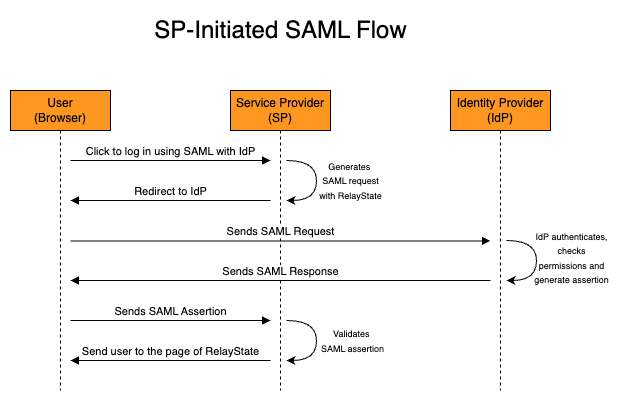
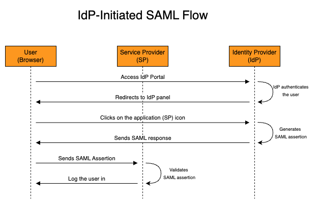

## The basics

### SSO and common scenario
As I have mentioned in previous blog posts, my preferred way to understand a topic is by answering generic questions about it. Once the basics are clear, it's easier to deep dive into the topic. This time, I will stick to this method, but before getting into the questions, I will propose a scenario. So, without further ado:

Imagine that you work in a company that uses several apps/services. It doesn't really matter the services, but if you are a more visual person, you can think of apps such as SalesForce, PowerBI, ArgoCD, Gmail... The most dummy way to manage credentials to all these apps is to create an account (probably IT would do this for you) in every service and then you would have to setup a password for each application. This is tedious because of several reasons:

- Now you have to memorize a bunch of credentials and manage the rotating (change of password) of each one when needed. Sure, you can use a vault to store your credentials, but still, very tedious.
- You don't have an easy way to check which apps you have access. You would need to save all the URLs in your browser bookmark.
- For each new service that you want to have access, you will have to create a new password and manage, manage the rotation and memorize/save the URL to access the application.

This is tedious, insecure and time-consuming. Ideally what you want is to have SSO (Single Sign-On), which is a single place that will manage your access to the apps. To allow SSO you will need a component (I will name this component soon, but for now let's call it simply "component") responsible for:

- Centralized user identities, i.e. the users of your organization will be registered in a central place (a "centralized database"). This way your users only need to worry about these single credentials.
- Handling all the communication/security between itself and the users and itself and the applications. Here is exactly where SAML comes into play.

### What is SAML and how it help us?
SAML (Security Assertion Markup Language) is a standard to exchange authentication and authorization between two parts using XML. In our previous scenario, SAML would be used between the component mentioned and the applications.

To use SAML, both parts (component and applications) must "speak" SAML, i.e. they should implement SAML in their code. There are three SAML versions (`1.0`, `1.1` and `2.0`), where SAML 2.0 is the latest and by far the most widely used version. When you hear someone saying "SAML" they are probably talking about the 2.0 version.

### Concepts
SAML uses several technical terms that can intimidate you when trying to learn about it. Let's define them using simple words, then I will show you the classic sequence diagram.

- **Identity Provider (IdP)**: In our scenario, the IdP is the "component" mentioned. It's the heart of the SSO! It's responsible for storing the identities of the users and contains the "logic" to speak with the applications and users.
- **Service Provider (SP)**: In our scenario, the SP is the application! As the name suggest, a service provider will provide a service for the user (e.g. SalesForce, Gmail, PowerBI...). This is exactly what the user wants to use. The user is not interested in the IdP part, he wants to access the applications that will be accessible by using the IdP (instead of a specific single user/password created for this service). The service provider must be able to communicate using SAML protocol with the IdP.
- **SAML Request**: Corresponds to the XML message that the SP will send to the IdP. In plain english this would be something such as "Hey IdP, there is a user that is trying to log in. Can valide his credentials? I will wait you validate his credentials (authentication) and log him in if you say the credentials are valid, and I will only allow him to do things he is allowed to (authorization)". You might be wondering, "Why would the SP trust another entity to validate if the user can log in into it?". This is because the SP and the IdP were configured previously to allow this using SAML protocol (more on that later).
- **SAML Response**: Corresponds to the XML message that the IdP will send to the SP. In plain english this would be something such as "Hey SP, I validated that this user credentials are correct, but make them valid only for the next X minutes/hours. This user is actually John Doe, and should have role 'admin'. You can validate that this message was issued by me and didn't suffer a man in the middle attack by checking my digital signature".
- **Assertion**: It is the main part of the SAML response. The SAML response contains assertions (usually it only contains a single one) and more things (such as issuer, status...), but the most important information is the assertion, which contains important pieces of information: subject (who the user is), conditions (time window of validity of the assertion), issuer (the IdP), attributes (email, roles, department)... The assertion is signed with IdP digital certificate keys, so this can be validated to make sure the message was not tampered.
- **Assertion Consumer Service (ACS)**: The ACS is simply the SP endpoint (e.g. `https:/myservice.com/saml`) that the IdP will send the XML data. Remember that SAML is a protocol that uses XML messages and these messages are transported using the HTTP protocol. You should check this endpoint in the documentation of your SP. In other words, the SP is the entire application, while the ACS is a endpoint of the SP.
- **SAML Flow**: SAML allows two flows: SP-initiated and IdP-initiated. As the name suggests, in the SP-initiated flow the service provider (application) is the one that starts the communication with the Identity Provider (IdP). This flow happens if the user access the SP URL directly (and click to login using the IdP). The IdP-initiated flow is the opposite, the IdP that starts the SAML flow and basically redirect the user to the ACS. This flow usually happens when the user is already logged in and from the IdP Portal clicks to access an application. In practice the only technical difference between these two flows is that the IdP-initiated flow won't have a Relay State (more on that below).
- **Relay State**: Imagine the user bookmark a specific URL page of the SP (e.g. a specific Dashboard in PowerBI, a specific App in ArgoCD). If he access this link directly the SP-initiated flow will be used. And RelayState didn't exist, you would expect, at the end of the flow, to the user to be redirect to the homepage of the service provided, not the specific URL that he wanted to access at first. The RelayState is basically the information of the page that the user wants to access when the SAML login is completed. This information can't be lost during the entire flow, so the RelayState information is passed since the SAML request until the SP validates the SAML assertion and redirect the user to the page.

Now that you know what all these technical words let's jump to the diagrams!

Here is the SP-initiated flow.

Notice that the SP initiated the SAML flow, that's why the flow is called `SP-initiated`. It's important to understand that in both flows, the SP and IdP do not communicate directly, this is all done by the user browser, with redicts and HTTP requests to the endpoints (e.g. ACS). Now let's check the IdP-initiated SAML flow.

The IdP-initiated SAML flow starts with the IdP already generating the SAML response with assertion, so a "SAML request" does not exist in the IdP-initiated flow.