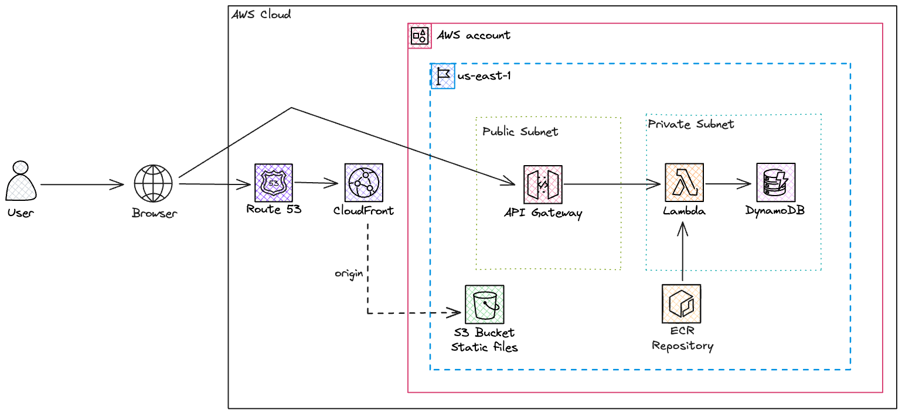

In today's blog post, I would like to comment on costs, scalability, and my thoughts about an initial architecture for a new company/product. All the code of this blog post will be available on [GitHub](https://github.com/felipelaptrin/serverless-infra-blog/tree/main).

I've worked with several different clients and it still shocks me how some care about technology more than the business. They focus so much on using new technologies, hyped tools, and writing their own solutions for problems that already exist that they simply ignore the economic and business parts of the organization.

During my time working in new startups, I notice that:
- **Time is key**: The company is still trying to validate an idea or a product and needs to do that fast. You don't need to deliver a full/complete product, only the minimum viable product (MVP) to validate if what the company is trying to do is feasible.
- **Money is tight**: Money is not infinite, the company needs to spend the money in the correct place. Use it wisely and remember that (developer) time is money.
- **You are not a MANG** It's so common to see entrepreneurs thinking that their idea is so extraordinary that they will be the next MANG (Meta, Apple, Netflix, Google). Well, I expect them to grow, but let's keep our feet on the ground. It's amazing to read MANG's tech blogs and see the solution they are using for their problems (i.e. tools, strategies...) but remember you are NOT a FANG. Their blog post means: that if you were us, facing the same problems that we are, maybe, and just maybe, the proposed solution here will work for you. Start small, grow constantly, and modify your infrastructure and software as you grow. There is a well-known sentence in the software engineering community that says "Premature Optimization is the root of all evil".

It's shocking the amount of time that I saw over complex architectures in startups that don't even have clients: Kubernetes, multi-regional deployment, extra costs involved in compliance (we not needed)... This only increases the overall costs of the startup and reduces the time to market of the product.

Here, I will propose a simple, scalable and cheap infrastructure, ideal for most startups. This is 100% opiniated, and that's fine, it might not be viable in all scenarios but it's a good start for a good amount of startups. I have DevOps friends that do not like to use managed services at all, and hate serverless and Lambdas and that's completely ok, just make sure you are aware of the pros and cons of each approach.

## Full Stack Architecture
A basic full-stack architecture is composed of at least three parts:
- **Backend**: A piece of software that will be responsible for handling the bussiness logic
- **Database**: The backend needs to store information in a database
- **Frontend**: Website that will display information for the users. It's always communicating with the backend to get data.

Once again, this is the basic infrastructure. We are missing several other parts (e.g. caching, load balancing, authentication/authorization, observability...) that are still relevant but out of the scope of this blog post.

The classic (not talking about the old days) approach for deploying this infrastructure is:
- Deploy the Database (SQL - such as PostgreSQL - or NoSQL - such as MongoDB)
- Deploy the API and expose it by an API Gateway/Load Balancer (e.g. Kong, NGINX)
- Deploy the frontend by exposing the assets via a web server (e.g. NGINX)

This is a perfect approach, nothing is wrong but notice that this involves having a server running 100% of the time to respond to incoming requests (shutting down all the servers to reduce costs means downtime for clients) and you also will need to manage scalability (if a sudden spike of traffic comes, you need to spin up more servers).

Once again, this might be a huge cost for a new startup that barely has clients. Here is a more cost-effective approach:
- Use a serverless, pay for what you use, database: DynamoDB. Notice that this is a NoSQL database and might not fit the needs of your application. For new accounts, AWS offers a 12-month free tier for RDS small databases, this might be a good alternative.
- Deploy the API using Lambda Function and expose it using API Gateway, you only pay for the traffic, storage of Lambda code (ECR or S3 zip object), and Lambda execution. For Lambda, AWS offers a monthly always-free tier of 1 million requests and up to 400,000 GB-seconds of execution (which means 111 hours of execution in a month when using a 1GB X86 architecture Lambda). Amazon API Gateway has a 12-month free tier of 1 million requests per month, but even without the free tier, the cost is $1.00 per million requests.
- Deploy the frontend using Amazon S3 for storing the website assets and distributing it at edge locations using CloudFront. The always free tier of CloudFront is great, with 1TB of data transfer out and 10 million requests per month. S3 will be basically free since we expect to cache all the static content in CloudFront and the size of the website assets is small.



## Serverless
Serverless, by definition, is the lack of servers, which is contradictory because you must have CPU, Memory, and Disk in order to run any software. So, what does it mean? Well, it basically means that your application will run in a way that you won't even see the servers running your application; you won't need to manage the virtual servers running or code; and you won't need to worry about managing failures, restarts and scalability.

Serverless was highly related to "pay as you go" and "pay by what you use". Meaning that, if you don't use it, you won't pay for it. This is partially true since we have serverless products in AWS that will charge you even if you are not using them (e.g. RDS Serverless, Fargate). So that's why I rather stick with the "you don't manage servers" instead of thinking it's free if you don't use it.

Cloud is to On-Premise as Virtual Servers is to Serverless. If you understand this sentence then you understand the serverless concept.

## Frontend: S3 + CloudFront
I've already talked about S3 and CloudFront to deploy a website in a previous blog post called [Deploying a static website on AWS using S3 and CloudFront](https://www.felipetrindade.com/static-website-s3-cloudfront/) but I will talk about it again. I highly recommend you read the `CloudFront` section and subsections. Be aware that this method of deploying a website only works if your Javascript code is CRS (Client Side Rendering), so you can't use frameworks that are SSR (e.g. [NextJS](https://nextjs.org/)), only CSR (e.g. [React](https://react.dev/)). Another super important thing to mention is that when using SSL/TLS certificates with CloudFront you must [issue the certificate in the us-east-1 region](https://docs.aws.amazon.com/AmazonCloudFront/latest/DeveloperGuide/cnames-and-https-requirements.html).

There are two easy ways of deploying a website using S3:
- [S3 with website hosting configuration enabled](https://docs.aws.amazon.com/AmazonS3/latest/userguide/EnableWebsiteHosting.html)
- [CloudFront with S3 origin](https://docs.aws.amazon.com/AmazonCloudFront/latest/DeveloperGuide/DownloadDistS3AndCustomOrigins.html#concept_S3Origin)

I could make a comparison between these methods but I really don't see a reason why you would prefer only S3 with website hosting configuration enabled. Why? Well, check the disadvantages of using this method:
- It does not support HTTPS. This is a big NO, but let's keep going...
- Limited to a specific location, which may cause delays to users in different geo locations
- Bad SEO
- S3 bucket needs to be public

Because of that I really don't think it's worth it to even use the S3 website hosting option when you can use the CloudFront with S3 origin as an alternative. With the latter you have all the benefits that are cons in S3 website hosting plus:
- Advanced caching behavior
- Geographic restriction
- Custom headers (good for SEO, and security)

So the idea here is to create a CloudFront distribution and select the S3 bucket as origin. This bucket will contain the build of our frontend website. When a distribution gets created you will get a URL (something like `d111111abcdef8.cloudfront.net`) that is your endpoint for accessing your website. To simplify the way of accesing your website, you can create an A record (with alias) pointing to this distribution (e.g. `app.mydomain.com`).

Let's take a step back and talk about how CloudFront accesses the origin (S3 bucket in our case). In a single CloudFront distribution, you can have several origins (e.g. ELB, API Gateway, S3 bucket) and the way you control which origin will be used is by controlling the behavior of the distribution and you can define access patterns based on the [URL path](https://docs.aws.amazon.com/cloudfront/latest/APIReference/API_CacheBehavior.html) to decide what origin will be used. You can also specify a default behavior, which, in our use case it's enough, since there is only a single origin in our distribution.

When controlling the behavior we can specify other things, such as:
- **Protocol policy**: HTTP and HTTPS; redirect HTTP to HTTPS; only HTTPS.
- **Allowed HTTP methods**: GET, HEAD; GET, HEAD, OPTIONS; GET, HEAD, OPTIONS, PUT, POST, PATCH, DELETE.
- **Caching Policy** You can use a custom or a managed caching policy (that defines TTL, Headers, Cookies, and Queries string)
- **Function Association**: CloudFront Functions or Lambda@Edge functions to run based on the response/request. It's useful if you would like to run operations such as URL redirects/rewrites, manipulate the header, access the HTTP body request... I've used Lambda@Edge in a previous [blog post](https://www.felipetrindade.com/static-website-s3-cloudfront/) to perform URL rewrite!


## Backend: API Gateway + Lambda
Lambda offers a way of running a code for a short (up to 15 minutes) duration and you only pay for the storage of the function (in S3 as a ZIP file or in ECR as a Docker Image) and the duration of the Lambda execution. This becomes very interesting when you are working with API, which usually takes a sub-second response time. By default, the [default concurrency Lambda limit](https://repost.aws/knowledge-center/lambda-concurrency-limit-increase) is 1000, i.e. you can have up to 1000 Lambdas running at the same time in your account, but you can increase this values since it's a soft-limit.

API Gateway offers a secure HTTP endpoint for invoking your Lambda function, while also managing high call volumes through traffic throttling and automating the validation and authorization of API requests. The idea is to proxy all requests to the Lambda. An API Gateway can be one of the following types: HTTP, REST, and WebSocket. The first two are suitable for your API use case and the REST API is basically an HTTP with batteries included (API keys, per-client throttling, AWS WAF integration, caching...). REST API Gateway can also be deployed privately and at the edge, while HTTP is only available publicly in a regional deployment. The REST API comes with more features but it comes with a price, at the first tier of requests (~300million per month - which is likely to be your use-case) it costs $3.5/million of requests, while the HTTP costs a fraction of it: $1/million of requests. To summarize, HTTP API Gateway is cheaper and has lower latency, while REST API Gateway offers advanced features but it's more expensive.

One of the great advantages of using Lambdas is the famous "cold start" that can indeed make your application slower. Cold start varies from under 100ms to over 1s but typically it's under 1s, it depends on several things, such as the number of dependencies, the amount of RAM allocated to the function, the programming language used...

You would need to adapt your code to be "Lambda-compliant" which is something that varies based on the programming language used, so the best thing to do is to directly check the [documentation](https://docs.aws.amazon.com/lambda/latest/dg/welcome.html).

Remember that our API Gateway will receive requests from a browser, so we need to be aware of [CORS](https://docs.aws.amazon.com/apigateway/latest/developerguide/how-to-cors.html), which means that your code needs to return some headers for the OPTIONS method (more on that in the code).

## Database: DynamoDB
DynamoDB is a blazing-fast NoSQL key-value database proprietary service of AWS. It's completely serverless, you don't need to manage anything, you use the service as it is and only pay for storage and transactions (read and writes) in the table. When I say blazing fast I really mean it, it offers a single-digit millisecond latency but it's an expensive service, especially if you do not design your table correctly.

A table in DynamoDB is schemaless, but you need to define a primary key (hash key) that must be unique in the entire table. The primary key can be a single key (partition key) or a composite key (partition key and sort key). The design of a DynamoDB table is completely off this discussion but to make you curious, it's a common strategy to denormalize data, single there are no joins in DynamoDB, so it's a completely different way of design when compared to common SQL tables. Because you pay for reading/writing in the table, a well-designed is so important, since you definitely don't want to avoid scan operation.

## Demo Time

### Infrastructure as Code
Let's create the entire infrastructure of this code using Terraform! I decided to maximize the amount of community modules when creating the resources to make the code easier to read. If you rather check some "pure" Terraform code you can check [this repository](https://github.com/felipelaptrin/serverless-infra) that has a similar infrastructure to the one we are creating right now.

Let's define the providers (AWS) that we will use in your terraform code. Notice that I've defined a specific AWS provider to the `us-east-1` region (do you rember the TLS/SSL certificates when using CloudFront?).

```hcl
# providers.tf
provider "aws" {
  region = var.aws_region

  default_tags {
    tags = {
      Project    = "Serverless Infra"
      Repository = "https://github.com/felipelaptrin/serverless-infra-blog"
    }
  }
}

provider "aws" {
  alias  = "us_east_1"
  region = "us-east-1"

  default_tags {
    tags = {
      Project    = "Serverless Infra"
      Repository = "https://github.com/felipelaptrin/serverless-infra-blog"
    }
  }
}
```

Below, I declared all the variables that will be used, notice that only two variables are needed: `domain` (your domain) and `frontend_bucket_name` (the bucket name that will contain the frontend assets).

```hcl
# variables.tf
########################################
##### GENERAL
########################################
variable "aws_region" {
  type        = string
  description = "AWS region to deploy the infrastructure"
  default     = "us-east-1"
}

variable "domain" {
  type        = string
  description = "The domain of your project"
}

variable "logs_retention" {
  type        = number
  description = "CloudWatch Group log retention"
  default     = 90
}

########################################
##### NETWORKING
########################################
variable "vpc_deploy" {
  type        = bool
  description = "Controls the deployment of the VPC resources (VPC, Subnets, Internet Gateway, Route Table...). If you already have a VPC deployed, set this variable to false and set 'vpc_id' variable."
  default     = true
}

variable "vpc_id" {
  type        = string
  description = "VPC ID of the already deployed VPC in your account. To use this, set vpc_deploy to false."
  default     = ""
}

variable "vpc_name" {
  type        = string
  description = "Name of the VPC to deploy"
  default     = "PoC"
}

variable "vpc_cidr" {
  type        = string
  description = "CIDR of the VPC to create. Please use a /16 mask for high compatibility with this module."
  default     = "10.50.0.0/16"
}

########################################
##### BACKEND
########################################
variable "backend_subdomain" {
  type        = string
  description = "Subdomain where the API Gateway will be exposed, i.e. https://{backend_subdomain}/{domain}"
  default     = "api"
}

variable "lambda_name" {
  type        = string
  description = "Name of the Lambda Function"
  default     = "backend-api"
}

variable "lambda_memory" {
  type        = number
  description = "Amount of memory that should be used in the Lambda"
  default     = 256
}

variable "lambda_architecture" {
  type        = string
  description = "Architecture that the Lambda function will run"
  default     = "arm64"

  validation {
    condition     = contains(["x86_64", "arm64"], var.lambda_architecture)
    error_message = "Valid values for var: test_variable are: 'x86_64' and 'arm64'."
  }
}

variable "lambda_timeout" {
  type        = number
  description = "Timeout in seconds of the Lambda"
  default     = 5
}

########################################
##### DATABASE
########################################
variable "table_name" {
  type        = string
  description = "Name of the DynamoDB table"
  default     = "table"
}

variable "table_attributes" {
  type        = list(map(string))
  description = "Attributes of the DynamoDB table"
  default = [
    {
      name = "UserId",
      type = "S",
    },
  ]
}

variable "table_hash_key" {
  type        = string
  description = "Hash key of the DynamodDB table"
  default     = "UserId"
}

########################################
##### FRONTEND
########################################
variable "frontend_subdomain" {
  type        = string
  description = "Subdomain that the Website will be exposed, i.e. https://{frontend_subdomain}/{domain}"
  default     = "app"
}

variable "frontend_bucket_name" {
  type        = string
  description = "Name of the S3 bucket that will contains the frontend website"
}
```

Now, let's check some "helper" files (data sources and locals).

```hcl
# locals.tf
locals {
  vpc_id          = var.vpc_deploy == true ? module.vpc[0].vpc_id : var.vpc_id
  vpc_ip          = cidrhost(var.vpc_cidr, 0)
  all_subnets     = [for i in range(4) : cidrsubnet(var.vpc_cidr, 8, i + 1)]
  public_subnets  = slice(local.all_subnets, 0, 2)
  private_subnets = slice(local.all_subnets, 2, 4)
  account_id      = data.aws_caller_identity.current.account_id
}
```

```hcl
# data.tf
data "aws_caller_identity" "current" {}

data "aws_route53_zone" "this" {
  name = var.domain
}
```

And finally, let's check the main code.

```hcl
# main.tf

########################################
##### NETWORKING
########################################
module "vpc" {
  count = var.vpc_deploy == true ? 1 : 0

  source  = "terraform-aws-modules/vpc/aws"
  version = "5.15.0"

  name = var.vpc_name
  cidr = var.vpc_cidr

  azs             = ["${var.aws_region}a", "${var.aws_region}b"]
  private_subnets = local.private_subnets
  public_subnets  = local.public_subnets
}

########################################
##### DATABASE
########################################
module "dynamodb-table" {
  source  = "terraform-aws-modules/dynamodb-table/aws"
  version = "4.2.0"

  name         = var.table_name
  attributes   = var.table_attributes
  hash_key     = var.table_hash_key
  billing_mode = "PAY_PER_REQUEST"
}

########################################
##### BACKEND
########################################
module "ecr" {
  source  = "terraform-aws-modules/ecr/aws"
  version = "2.3.0"

  repository_name                 = "backend-api"
  repository_image_tag_mutability = "MUTABLE"
  repository_image_scan_on_push   = false
  create_lifecycle_policy         = false
}


module "lambda_function" {
  source  = "terraform-aws-modules/lambda/aws"
  version = "7.14.0"

  function_name                     = var.lambda_name
  description                       = "Lambda Function based API serving as backend for the app"
  create_package                    = false
  architectures                     = [var.lambda_architecture]
  image_uri                         = "${module.ecr.repository_url}:latest"
  package_type                      = "Image"
  cloudwatch_logs_retention_in_days = var.logs_retention

  attach_network_policy = true
  vpc_subnet_ids        = module.vpc[0].private_subnets

  memory_size = var.lambda_memory
  timeout     = var.lambda_timeout
  environment_variables = {
    TABLE_NAME        = var.table_name
    FRONTEND_ENDPOINT = "https://${var.frontend_subdomain}.${var.domain}"
  }

  create_current_version_allowed_triggers = false
  allowed_triggers = {
    ApiGateway = {
      service    = "apigateway",
      source_arn = "arn:aws:execute-api:${var.aws_region}:${local.account_id}:${module.api_gateway.api_id}/*/*"
    }
  }

  attach_policy_json = true
  policy_json = jsonencode({
    Version = "2012-10-17"
    Statement = [
      {
        Action = [
          "dynamodb:Batch*",
          "dynamodb:GetItem",
          "dynamodb:PutItem",
          "dynamodb:UpdateItem",
          "dynamodb:Query",
          "dynamodb:Scan",
        ]
        Effect   = "Allow"
        Resource = "${module.dynamodb-table.dynamodb_table_arn}"
      },
    ]
  })
}

module "api_gateway" {
  source  = "terraform-aws-modules/apigateway-v2/aws"
  version = "5.2.0"

  name             = "backend-gateway"
  description      = "HTTP API Gateway for the Lambda-based API"
  protocol_type    = "HTTP"
  domain_name      = "${var.backend_subdomain}.${var.domain}"
  hosted_zone_name = var.domain
  subdomains       = [var.backend_subdomain]

  cors_configuration = {
    allow_headers = ["*"]
    allow_methods = ["*"]
    allow_origins = ["https://${var.frontend_subdomain}.${var.domain}"]
  }

  routes = {
    "$default" = {
      integration = {
        uri                    = "arn:aws:lambda:${var.aws_region}:${local.account_id}:function:${var.lambda_name}" // module.lambda_function.lambda_function_arn
        payload_format_version = "2.0"
      }
    }
  }
}

########################################
##### FRONTEND
########################################
module "s3_bucket" {
  source  = "terraform-aws-modules/s3-bucket/aws"
  version = "4.2.2"

  bucket = var.frontend_bucket_name

  attach_policy = true
  policy = jsonencode({
    "Version" : "2008-10-17",
    "Id" : "PolicyForCloudFrontPrivateContent",
    "Statement" : [
      {
        "Sid" : "AllowCloudFrontServicePrincipal",
        "Effect" : "Allow",
        "Principal" : {
          "Service" : "cloudfront.amazonaws.com"
        },
        "Action" : "s3:GetObject",
        "Resource" : "arn:aws:s3:::${var.frontend_bucket_name}/*",
        "Condition" : {
          "StringEquals" : {
            "AWS:SourceArn" : "arn:aws:cloudfront::${local.account_id}:distribution/${module.cdn.cloudfront_distribution_id}"
          }
        }
      }
    ]
  })

  providers = {
    aws = aws.us_east_1
  }
}

module "acm" {
  source  = "terraform-aws-modules/acm/aws"
  version = "5.1.1"

  domain_name       = var.domain
  validation_method = "DNS"
  zone_id           = data.aws_route53_zone.this.id

  subject_alternative_names = [
    "${var.frontend_subdomain}.${var.domain}",
  ]
  wait_for_validation = true

  providers = {
    aws = aws.us_east_1
  }
}

module "cdn" {
  source  = "terraform-aws-modules/cloudfront/aws"
  version = "3.4.1"

  aliases             = ["${var.frontend_subdomain}.${var.domain}"]
  comment             = "CDN of Frontend"
  price_class         = "PriceClass_All"
  is_ipv6_enabled     = true
  default_root_object = "index.html"

  create_origin_access_control = true
  origin_access_control = {
    s3_bucket_frontend = {
      description      = "Frontend assets bucket"
      origin_type      = "s3"
      signing_behavior = "always",
      signing_protocol = "sigv4"
    }
  }
  origin = {
    s3 = {
      domain_name           = "${var.frontend_bucket_name}.s3.us-east-1.amazonaws.com"
      origin_access_control = "s3_bucket_frontend"
    }
  }

  default_cache_behavior = {
    target_origin_id       = "s3"
    viewer_protocol_policy = "redirect-to-https"
    allowed_methods        = ["DELETE", "GET", "HEAD", "OPTIONS", "PATCH", "POST", "PUT"]
    cached_methods         = ["GET", "HEAD"]
    cache_policy_id        = "658327ea-f89d-4fab-a63d-7e88639e58f6" # CachingOptimized - Recommended for S3
    use_forwarded_values   = false
    compress               = true
  }

  viewer_certificate = {
    acm_certificate_arn      = module.acm.acm_certificate_arn
    ssl_support_method       = "sni-only"
    minimum_protocol_version = "TLSv1.2_2021"
  }
}

module "records" {
  source  = "terraform-aws-modules/route53/aws//modules/records"
  version = "4.1.0"

  zone_name = data.aws_route53_zone.this.name

  records = [
    {
      name = "${var.frontend_subdomain}"
      type = "A"
      alias = {
        name    = module.cdn.cloudfront_distribution_domain_name
        zone_id = module.cdn.cloudfront_distribution_hosted_zone_id
      }
    }
  ]
}
```

To recap, the following was created:
- VPC (for the entire project)
- CloudFront distribution (S3 bucket as origin)
- S3 bucket (frontend assets)
- API Gateway (Lambda as Target)
- ECR repository (store backend Docker image)
- Lambda (serve as Backend)
- ACM Certificates (for HTTPs in the API Gateway and CloudFront)
- Route53 records (for frontend and backend endpoints)
- DynamoDB table

If you try to run this for the first time it will fail. Why? Because the code will attempt to create an ECR repository and use the `latest` image in this repository to provision the Lambda. This is impossible to happen. What needs to be done is: create ECR repository -> push docker image to repository -> deploy Lambda function.

A simple option to make this deployement work is: apply terraform -> fail -> push image to ECR repo -> apply terraform again.

### Backend Code Example (Golang)
I will show a quick Golang code that when receives a POST request adds records in the DynamoDB table and OPTIONS for the CORS.

```go
package main

import (
  "context"
  "encoding/json"
  "fmt"
  "log"
  "os"
  "time"

  "github.com/aws/aws-lambda-go/events"
  "github.com/aws/aws-lambda-go/lambda"
  "github.com/aws/aws-sdk-go-v2/aws"
  "github.com/aws/aws-sdk-go-v2/config"
  "github.com/aws/aws-sdk-go-v2/service/dynamodb"
  "github.com/aws/aws-sdk-go-v2/service/dynamodb/types"
  "github.com/aws/aws-sdk-go-v2/service/sts"
)

type User struct {
  UserId    string `json:"userId"`
  Name      string `json:"name"`
  Email     string `json:"email"`
  CreatedAt string `json:"createdAt"`
}

func getEnv(key, fallback string) string {
  value, exists := os.LookupEnv(key)
  if !exists {
    value = fallback
  }
  return value
}

var dynamoClient *dynamodb.Client
var tableName = getEnv("TABLE_NAME", "table")

func init() {
  cfg, err := config.LoadDefaultConfig(context.TODO(), config.WithRegion(getEnv("AWS_REGION", "us-east-1")))
  if err != nil {
    log.Fatalf("Failed to load AWS config: %v", err)
  }

  dynamoClient = dynamodb.NewFromConfig(cfg)

  stsClient := sts.NewFromConfig(cfg)
  identity, err := stsClient.GetCallerIdentity(context.TODO(), &sts.GetCallerIdentityInput{})
  if err != nil {
    log.Printf("Failed to get caller identity: %v", err)
  } else {
    log.Printf("Lambda is running as: %s", *identity.Arn)
  }
}

func handler(request events.APIGatewayV2HTTPRequest) (events.APIGatewayProxyResponse, error) {
  if request.RequestContext.HTTP.Method == "OPTIONS" {
    return events.APIGatewayProxyResponse{
      Headers: map[string]string{
        "Access-Control-Allow-Headers": "Content-Type",
        "Access-Control-Allow-Origin":  os.Getenv("FRONTEND_ENDPOINT"),
        "Access-Control-Allow-Methods": "OPTIONS,POST,GET",
      },
      StatusCode: 200,
    }, nil
  }
  if request.RequestContext.HTTP.Method == "POST" {
    return createUser(request)
  }

  return events.APIGatewayProxyResponse{
    Body:       "Method not supported",
    StatusCode: 405,
  }, nil
}

func createUser(request events.APIGatewayV2HTTPRequest) (events.APIGatewayProxyResponse, error) {
  var user User

  if err := json.Unmarshal([]byte(request.Body), &user); err != nil {
    return events.APIGatewayProxyResponse{
      Body:       fmt.Sprintf("Invalid request body: %v", err),
      StatusCode: 400,
    }, nil
  }

  if user.UserId == "" {
    return events.APIGatewayProxyResponse{
      Body:       "UserId must be provided",
      StatusCode: 400,
    }, nil
  }

  getItemOutput, err := dynamoClient.GetItem(context.TODO(), &dynamodb.GetItemInput{
    TableName: aws.String(tableName),
    Key: map[string]types.AttributeValue{
      "UserId": &types.AttributeValueMemberS{Value: user.UserId},
    },
  })
  if err != nil {
    return events.APIGatewayProxyResponse{
      Body:       fmt.Sprintf("Error checking for existing user: %v", err),
      StatusCode: 500,
    }, nil
  }

  if getItemOutput.Item != nil {
    return events.APIGatewayProxyResponse{
      Body:       "User already exists",
      StatusCode: 400,
    }, nil
  }

  user.CreatedAt = time.Now().UTC().Format(time.RFC3339)

  item := map[string]types.AttributeValue{
    "UserId":    &types.AttributeValueMemberS{Value: user.UserId},
    "Name":      &types.AttributeValueMemberS{Value: user.Name},
    "Email":     &types.AttributeValueMemberS{Value: user.Email},
    "CreatedAt": &types.AttributeValueMemberS{Value: user.CreatedAt},
  }

  _, err = dynamoClient.PutItem(context.TODO(), &dynamodb.PutItemInput{
    TableName: aws.String(tableName),
    Item:      item,
  })
  if err != nil {
    return events.APIGatewayProxyResponse{
      Body:       fmt.Sprintf("Failed to save user: %v", err),
      StatusCode: 500,
    }, nil
  }

  responseBody, _ := json.Marshal(map[string]string{
    "message": "User created successfully",
    "userId":  user.UserId,
  })

  return events.APIGatewayProxyResponse{
    Body:       string(responseBody),
    StatusCode: 201,
  }, nil
}

func main() {
  lambda.Start(handler)
}
```

## Cya!
Well, I hope you liked this blog post. See you around! 👋
