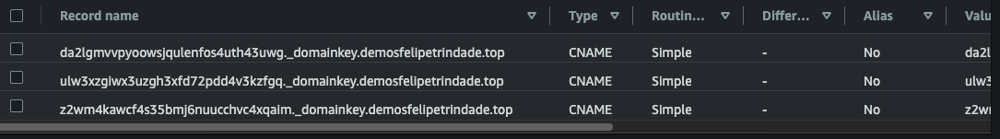
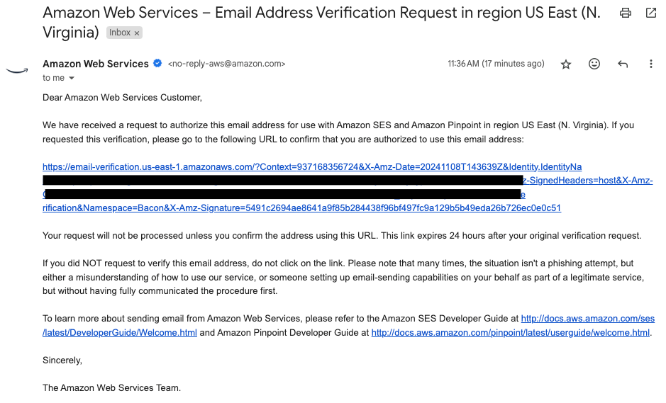
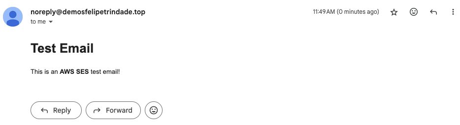
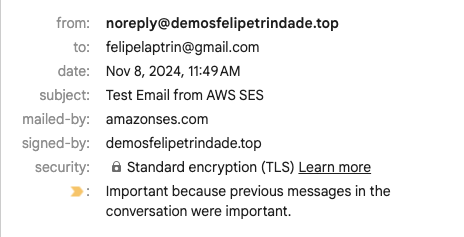
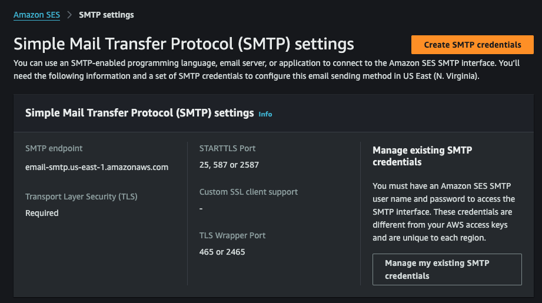
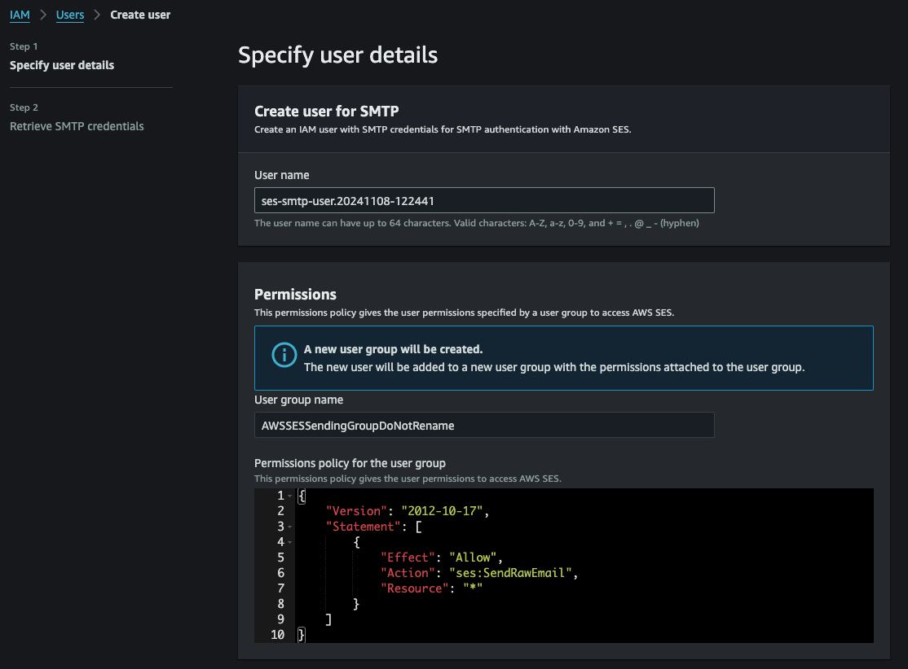
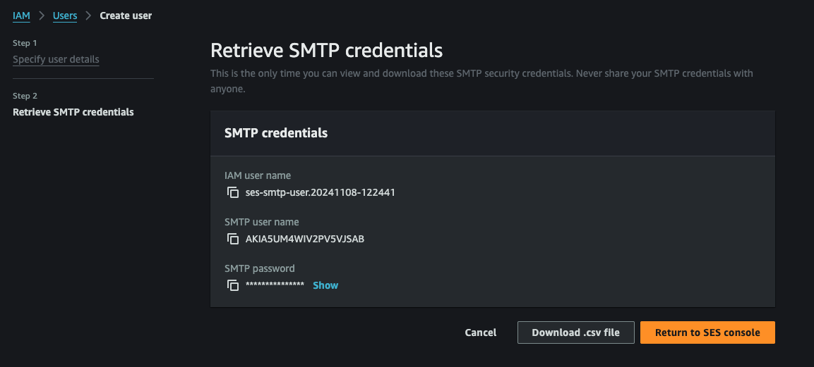
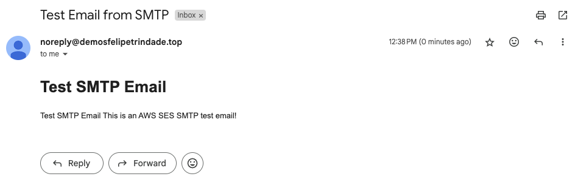

The goal of today's post is to comment more about the Amazon SES service, email infrastructure, protocols, and domain. The entire source code of this demo is available in my [GitHub repository](https://github.com/felipelaptrin/email-ses).

## How does email work?
Before we dive deep into Amazon SES, we need to take a step back and understand how email works, its concepts, and the protocols involved in the process.

Well, you know what an email is: an electronic message, a "digital letter." But how am I able to send a message from my personal email (e.g., `myemail@something.com`) to yours (e.g., `youremail@otherthing.com`)? Let's deep-dive.

When you create an email account in an email provider (e.g., Gmail, Outlook, Yahoo), you are now relying on the provider's infrastructure to handle email operations, such as receiving, sending, filtering/detecting spam, etc. Under the hood, they use several protocols to make sure everything works fine for you.

### Protocol for sending emails
The standard protocol for sending mail is known as SMTP (Simple Mail Transfer Protocol). It is a network protocol that defines how servers should exchange information to send mail to another server. It creates a standard in the way the emails should navigate the internet from the sender to the recipient. Notice that SMTP is NOT a protocol that specifies how the mail should be received, this belongs to other protocols that will be covered in the next section.

The SMTP protocol was specified in several different RFC (publications about the base of the internet), such as [RFC 772](https://datatracker.ietf.org/doc/html/rfc772), [RFC 780](https://datatracker.ietf.org/doc/html/rfc780), [RFC 788](https://datatracker.ietf.org/doc/html/rfc788) and [RFC 821](https://datatracker.ietf.org/doc/html/rfc821). As time passed, bugs were found, errors were fixed more secure strategies were created and new RFCs were presented to enhance SMPT, such as [RFC 5321](https://datatracker.ietf.org/doc/html/rfc5321). Could you imagine emails being sent without encryption (over TLS/SSL) these days? SMTP protocol was created more than 10 years before the invention of SSL, so that's why updates in these standards are so important.

Now that we have the protocol in place we need software that implements this protocol, i.e. we need an SMTP server. There are plenty of open-source SMTP servers out there, and the most open-source famous one is [Postfix](https://www.postfix.org/). As you probably know, ports are just numbers and you can basically run any service in any port (e.g. SSH by default works on port 22 but you can run in any other port) but there are standards that are always good to know and follow if possible. There are four [SMTP ports](https://www.cloudflare.com/learning/email-security/smtp-port-25-587/#:~:text=Today%2C%20SMTP%20should%20instead%20use,should%20be%20used%20if%20possible.) that you should know about:
- `25`: This is the default SMTP port and it's often blocked by your ISP to prevent spam.
- `587`: This is the standard SMTP port when used with TLS encryption (SMTPS).
- `465`: This was the original port intended to be used with SMTPS but it's considered deprecated, although some providers may still offer this option.
- `2525`: In case the ports above are blocked (by ISP or firewall rules) it is commonly used this port.

When you open your Gmail email, for example, you are using the default Gmail's SMTP server ([smpt.gmail.com](https://developers.google.com/gmail/imap/imap-smtp)).

Notice that for interacting with the SMTP server you need an SMTP client. When using Gmail, for example, everything is abstracted in the browser and you don't even realize these technicities. But you can also use SMTP programmatically, e.g. [smtplib for Python](https://docs.python.org/3/library/smtplib.html), [sendmail](https://linux.die.net/man/8/sendmail.sendmail).

### Protocol for receiving emails
There are two main protocols for receiving mails: POP3 (Post Office Protocol version 3) and IMAP (Internet Message Access Protocol). I have already used the IMAP with Python in my [configuring an email forward to enhance your phone security in case of a robbery](https://www.felipetrindade.com/email-forwarder/) blog post.

Similarly to the SMTP, POP3 and IMAP were proposed in several different RFCs that I will not go into detail. Both protocols have the same goal: retrieve mail, but they do that using different ways and approaches. The main difference between these protocols is that IMAP reads the emails from the email server without deleting them, while POP3 downloads and deletes the emails from the server, because of that, POP3 downloads the emails from the server allowing the emails to be accessible offline, while in IMAP it doesn't.

With the protocol established we need, once again, software to implement it, following all the rules and conventions. By default, these servers use the following ports:
- `143`: IMAP.
- `993`: IMAP over SSL.
- `110`: POP3.
- `995`: POP3 over SSL.

There are several open-source software that implement these protocols, such as [Wildduck](https://github.com/nodemailer/wildduck) and [Dovecot](https://www.dovecot.org/).

### Domain
When you send someone an email (e.g. `youremail@otherthing.com`) how does it know "how to get" to your inbox? Domain resolution. Computers do not understand names, only IPs, that's why DNS exists. `otherthing.com` is a domain and the nameservers will tell you the IP of the email servers. If you have a domain and would like to setup an email you would need to configure some records in your DNS. Some records are important to be set in your domain such as:
- `Email record`: A `MX` record that will specify the mail server(s).
- `SPF`: A `TXT` record used to specify what servers are authorized to send emails on behalf of your domain (the mail provider that will send the emails). It helps receiving servers verify that emails claiming to come from your domain are sent by legitimate sources.
- `DKIM`: A `TXT` record that contains the public key. The emails from your domain will be signed by your private key and people that receive the email can verify if it was signed by you by checking it using the public key. This is usually generated by the email provider and you only need to add to your DNS.
- `DMARC`: A `TXT` record that specifies what should email servers do (nothing/quarantine/discard) if they receive an email that failed SPF/DKIM checks.

Some of these records were set in my [configuring a free email provider for your domain using AWS Route53 and Zoho](https://www.felipetrindade.com/email-provider-for-domain/) blog post.

### Missing pieces
The real email infrastructure with all components of a real provider (e.g. Gmail) is really big and complex but there are so many more parts that are not relevant for this post, such as:
- **Email Storage**: Store all the mail, and attachments somewhere that should be accessible by the user.
- **Anti-Spam and Anti-Virus filters**: Smart detection of phishing, false, and spam mail.
- **Web interface**: Access your inbox via browser.

## SES
Amazon SES (Simple Email Service) is a service responsible for sending emails using its interface/API or using SMTP. You may probably be thinking: "Ok... can't I simply set up my own SMTP server and send emails using it?". Indeed you can, but there are a few catches: you would need to make sure your server is scalable and secure; would need to manage retries and assure high deliverability; would need to establish IP addresses with a good reputation (otherwise your emails will always arrive in the receipt spam folder); would need to set up feedback mechanism (bounced and undelivered emails). That's why services like Amazon SES, SendGrid, Mailchimp, and Mailgun exist, for you to focus only on your application.

Be aware that SES by default puts your environment in a `sandbox` mode, where you can only send emails to emails verified by SES. This is ok for testing but for production, this makes no sense, so you should open a ticket to AWS informing that you would like to move out from the `sandbox` mode, specifying why and how you going to send email.

### Identity
There are two ways of proving that you own the email (validate identity) you would like to send the emails from:
- **Domain validation**: To prove that you own the domain you will need to set up DKIM records. You can either choose `Easy DKIM` (AWS will generate a public-private key for you to use and will ask you to add the public key in your DNS) or `BYODKIM` (you provide the private key instead of relying on AWS to create one for you). And later you can add SPF and DMARC records to reduce the chances of your email going to the spam folder. It's very common for companies to use an email provider (e.g. Outlook, Google Workspace) with the domain (e.g. `example.com`) and create a subdomain for sending an email (e.g. `mail.example.com` or `marketing.example.com`).
- **Email address validation**: To prove that you own that email address, AWS will send a mail to the provided email and you should confirm it by clicking the confirmation link provided. By confirming that you own the email address, you are allowing Amazon SES to send emails using your email address in the "From" field.

There are a few differences in choosing one over another:
- **Set up complexity**: Email address identity is way faster to set up when compared to domain identity.
- **Deliverability**: Domain identity is always used to achieve optimal deliverability because the receipt can always validate if the email using DNS records. You can also send emails from any subdomain or email address of the domain identity, while when using email address identity you can only send from the specified email.

### Sending emails using SES
When using Amazon SES there are two ways to send emails:
- **API**: Amazon SES exposes a public API that you can use in three ways: making direct [HTTPS requests](https://docs.aws.amazon.com/ses/latest/APIReference/Welcome.html), using AWS SDK or using [AWS CLI](https://docs.aws.amazon.com/cli/latest/reference/ses/). The first one (HTTPS request) is less commonly used because you will need to handle authentication, [signing](https://docs.aws.amazon.com/IAM/latest/UserGuide/reference_sigv.html) of requests and manually construct the request. The second one (AWS SDK) is very common, especially if your application is already running inside AWS (Lambda, ECS, EC2) and it's pretty easy to use with your favorite programming language (e.g. [Python](https://boto3.amazonaws.com/v1/documentation/api/latest/reference/services/ses.html), [Javascript](https://docs.aws.amazon.com/sdk-for-javascript/v3/developer-guide/javascript_ses_code_examples.html)). The later (AWS CLI) is commonly used in scripts and testing. In all these ways you need to make sure that the IAM User/IAM Role that is sending the requests has the correct IAM permission.
- **SMTP interface**: The SMTP protocol can be used to send emails using SMTP protocol. You will need to specify the [SMTP server endpoint](https://docs.aws.amazon.com/general/latest/gr/ses.html), the [SMTP port](https://docs.aws.amazon.com/ses/latest/dg/smtp-connect.html) and [SMTP user and password](https://docs.aws.amazon.com/ses/latest/dg/smtp-credentials.html) (create an IAM user that has permission to use Amazon SES and issue SMTP credentials).

## Demo time!
For this demo, I will use AWS CDK to create the needed infrastructure. You can also run this demo with me, you just need to adapt the inputs (e.g. your domain name). The only thing that I expect from you is that your AWS region is [CDK bootstrapped](https://docs.aws.amazon.com/cdk/v2/guide/bootstrapping.html) and the domain in Route53 is already configured (I will not configure this in this code because this domain is already being used in other personal demos). If you do not own a domain I highly recommend you buy a cheap one just for testing (you can get a cheap domain for $2/year or even less than that).

I will use Amazon SES in a region that it's still in Sandbox mode, i.e. it can only send emails to identities verified in Amazon SES. So because of that, I will create two identities, an email address identity (personal email) and a domain identity (using the domain in Route53).

### CDK Code
This will be a simple code that will use a single stack to create two email identities, the first will be validated using the domain, while the other is a personal email that will be validated using email address validation. Let's check the main (entry point) of our CDK project.

```typescript
// src/main.ts
#!/usr/bin/env ts-node
import "source-map-support/register";
import * as cdk from "aws-cdk-lib";
import { SesStack } from "./stack/ses";
import { devProps } from "./config";

const app = new cdk.App();

new SesStack(app, "SesStack", devProps);
```

Before checking the values of the stack let's first take a look at the stack definition.

```typescript
// src/stack/ses.ts
import { Stack, StackProps, Tags } from "aws-cdk-lib";
import { Construct } from "constructs";
import {
  DkimIdentity,
  EasyDkimSigningKeyLength,
  EmailIdentity,
  Identity,
  MailFromBehaviorOnMxFailure,
} from "aws-cdk-lib/aws-ses";
import { HostedZone, TxtRecord } from "aws-cdk-lib/aws-route53";

export interface SesStackProps extends StackProps {
  domain: string;
  email: string;
}

export class SesStack extends Stack {
  constructor(scope: Construct, id: string, props: SesStackProps) {
    super(scope, id, props);

    this.setEmailIdentity(props.email);
    this.setDomainIdentity(props.domain);

    Tags.of(this).add("CreatedBy", "CDK");
  }

  private setEmailIdentity(email: string): void {
    new EmailIdentity(this, "EmailIdentity", {
 identity: Identity.email(email),
    });
  }

  private setDomainIdentity(domain: string): void {
    const hostedZone = HostedZone.fromLookup(this, "Zone", { domainName: domain });
    new EmailIdentity(this, "DomainIdentity", {
 identity: Identity.publicHostedZone(hostedZone),
 dkimIdentity: DkimIdentity.easyDkim(EasyDkimSigningKeyLength.RSA_2048_BIT),
 mailFromBehaviorOnMxFailure: MailFromBehaviorOnMxFailure.USE_DEFAULT_VALUE,
 dkimSigning: true,
    });
    new TxtRecord(this, "DmarkRecord", {
 recordName: "_dmarc",
 values: ["v=DMARC1;p=quarantine"],
 zone: hostedZone,
    });
    new TxtRecord(this, "SpfRecord", {
 recordName: "",
 values: ["v=spf1 include:amazonses.com -all"],
 zone: hostedZone,
    });
  }
}
```

And finally, let's check the values for this stack.


```typescript
// src/config/dev.config.ts
import { SesStackProps } from "../stack/ses";

export const devProps: SesStackProps = {
 domain: "demosfelipetrindade.top",
 email: "yourpersonalemail@gmail.com",
 env: {
 account: "937168356724",
 region: "us-east-1",
  },
};
```

There you go! Deploying this stack is super easy and you only need to run `cdk deploy` with the appropriate IAM permissions to the desired account. Of course you will need to change these values to fit your use case.

A few important points to mention:
- Notice that in the code we didn't have to configure the DKIM record. Why? Actually, because my domain is being managed by Route53 I've used the [publicHostedZone](https://docs.aws.amazon.com/cdk/api/v2/docs/aws-cdk-lib.aws_ses.Identity.html#static-publicwbrhostedwbrzonehostedzone) method of CDK that already setup the `DKIM` in the hosted zone. If you used the [domain](https://docs.aws.amazon.com/cdk/api/v2/docs/aws-cdk-lib.aws_ses.Identity.html#static-domaindomain) method the Amazon SES would provide you with the DKIM records for you to add in your DNS. Indeed, after deployment you will see the DNS records there:



- You will need to confirm the personal email address identity in your inbox. It will be similar to the following.



### Let's test!
We can easily test by sending a test email using AWS CLI or SMTP. Why not check how it works using both approaches?

#### Sending emails using Amazon SES API
Let's use a simple bash script for sending these emails:

```sh
#!/bin/bash

# PARAMETERS
SENDER="noreply@demosfelipetrindade.top"
RECIPIENT="yourpersonalemail@gmail.com"
SUBJECT="Test Email from Amazon SES"
BODY_HTML="<html><body><h1>Test Email</h1><p>This is an <strong>Amazon SES</strong> test email!</p></body></html>"
AWS_REGION="us-east-1"

Amazon SES send-email \
 --region "$AWS_REGION" \
    --from "$SENDER" \
 --destination "ToAddresses=$RECIPIENT" \
    --message "Subject={Data=$SUBJECT,Charset=utf-8},Body={Html={Data=$BODY_HTML,Charset=utf-8}}"

if [ $? -eq 0 ]; then
    echo "Email sent successfully!"
else
    echo "Failed to send email."
fi
```

Notice that because I validated the entire domain I can send email using any email address within that domain, in this case, I'm using `noreply`. After executing this script the following email will show up in your email inbox.



We can check the details of this email to see extra information.

. Notice the `mailed-by` field! The value is `amazonses.com`. Is it possible to change this? Yes it is tottaly possible. This is called the [EMAIL FROM](https://docs.aws.amazon.com/ses/latest/dg/mail-from.html) field. By default if not specified AWS uses Amazon SES domain. This is out of the scope of this demo but it's good to know.

#### Sending emails using SMTP
Sending email using SMTP requires more work at first. I'll create using the AWS Console an IAM User with SMTP credentials. Ideally you should save this in Secrets Manager for your application to use (remember that at the moment it is not recommended to create SMTP credentials using ephemeral/temporary AWS credentials).









Now that we have the SMTP user and SMTP password let's use a simple Python code to send emails.

```python
import smtplib
from email.mime.multipart import MIMEMultipart
from email.mime.text import MIMEText

# Parameters
smtp_server = "email-smtp.us-east-1.amazonaws.com"
smtp_port = 587
smtp_username = "YOUR_SMTP_USERNAME"
smtp_password = "YOUT_SMTP_PASSWORD"
sender = "noreply@demosfelipetrindade.top"
recipient = "yourpersonalemail@gmail.com"
subject = "Test Email from SMTP"
message = """
Test SMTP Email
This is an Amazon SES SMTP test email!
"""
body_html = f"<html><body><h1>Test SMTP Email</h1><p>{message}</p></body></html>"

msg = MIMEMultipart("alternative")
msg["Subject"] = subject
msg["From"] = sender
msg["To"] = recipient

part1 = MIMEText(message, "plain")
part2 = MIMEText(body_html, "html")

msg.attach(part1)
msg.attach(part2)

try:
    with smtplib.SMTP(smtp_server, smtp_port) as server:
 server.starttls()
 server.login(smtp_username, smtp_password)
 server.sendmail(sender, recipient, msg.as_string())
    print("Email sent successfully!")
except Exception as e:
    print(f"Failed to send email: {e}")
```

After code execution, you should see the following in your inbox:



## Cya!
I hope you've like it and that this demo and explanation was helpful!

See you around! 👋