It's been a while since I wanted to write this blog post! I do not intend to follow best practices to deploy Authentik or be extremely detailed about how SAML/OIDC works in depth but I will give you a good overview and flows to explain how it works. The idea of this post is to explain how SAML/OAuth/OIDC works, and how to configure a SAML and OIDC application using Authentik. I highly recommend you check the [GitHub repository](https://github.com/felipelaptrin/sso) that contains the code used in the blog post!

At the end of this blog post you should be able to create the following infrastructure:

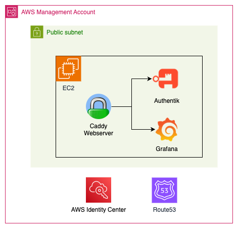

## SSO and common scenario
As I have mentioned in previous blog posts, my preferred way to understand a topic is by answering generic questions about it. Once the basics are clear, it's easier to deep into the topic. This time, I will stick to this method, but before getting into the questions, I will propose a scenario. So, without further ado:

Imagine working for a company that uses several apps/services. It doesn't really matter what services you use, but if you are a more visual person, you can think of apps such as SalesForce, PowerBI, ArgoCD, Gmail, etc. The most dummy way to manage credentials to all these apps is to create an account (probably IT would do this for you) in every service and then you would have to set up a password for each application. This is tedious because of several reasons:

- Now you have to memorize a bunch of credentials and manage the rotating (change of password) of each one when needed. Sure, you can use a vault to store your credentials, but still, very tedious.
- You don't have an easy way to check which apps you have access to. You would need to save all the URLs in your browser bookmark.
- For each new service that you want to have access to, you will have to create a new password, manage the rotation, and memorize/save the URL to access the application.

This is tedious, kinda-insecure (do all apps implement good password policies and 2FA?), and time-consuming. Ideally what you want is to have SSO (Single Sign-On), which is a single place that will manage your access to the apps. To allow SSO you will need a component (technically it's called an Identity Provider) responsible for:

- Centralized user identities, i.e. the users of your organization will be registered in a central place (a "centralized database"). This way your users only need to worry about these single credentials.
- Handling all the communication/security between itself and the users and itself and the applications. Here is exactly where SAML and OIDC come into play.

### SAML
SAML (Security Assertion Markup Language) is a standard to exchange authentication and authorization between two parts using XML. In our previous scenario, SAML would be used by the Identity Provider and the applications.

To use SAML, both parts must "speak" SAML, i.e. they should implement SAML in their code. There are three SAML versions (`1.0`, `1.1`, and `2.0`), where SAML 2.0 is the latest and by far the most widely used version. When you hear someone saying "SAML" they are probably talking about the 2.0 version.

#### SAML Concepts
SAML uses several technical terms that can intimidate you when trying to learn about it. Let's define them using simple words, then I will show you the classic sequence diagram.

- **Identity Provider (IdP)**: It's the heart of the SSO! It's responsible for storing the identities of the users and contains the "logic" to speak with the applications and users.
- **Service Provider (SP)**: The SP is the application that users will access! As the name suggests, a service provider will provide a service for the user (e.g. SalesForce, Gmail, PowerBI...). This is exactly what the user wants to use. The user is not interested in the IdP part, he wants to access the applications that will be accessible by using the IdP (instead of a specific single user/password created for this service). The service provider must be able to communicate using SAML protocol with the IdP, i.e. you need to confirm in the documentation of the application if it supports SAML.
- **SAML Request**: Corresponds to the XML message that the SP will send to the IdP. In plain English, this would be something such as "Hey IdP, there is a user that is trying to log in. Can you validate his credentials? I will wait for you to validate his credentials (authentication) and log him in if you say the credentials are valid, and I will only allow him to do things he is allowed to (authorization)". You might be wondering, "Why would the SP trust another entity to validate if the user can log in into it?". This is because the SP and the IdP were previously configured to allow this using SAML protocol (more on that later).
- **SAML Response**: Corresponds to the XML message that the IdP will send to the SP. In plain English, this would be something such as "Hey SP, I validated that these user credentials are correct, but make them valid only for the next X minutes/hours. This user is actually John Doe, and should have the role 'admin'. You can validate that this message was issued by me and didn't suffer a man-in-the-middle attack by checking my digital signature".
- **Binding**: The IdP and SP communicate via the browser exchanging HTTPS messages. We call "binding" the mechanism to transport these messages. The most common ways of exchanging these messages are via HTTP POST (SAML message is sent via HTML form with base64 encoding) or HTTP redirect (SAML message is sent via HTTP GET with URL query string). You might be thinking... which one should I choose? This should be mentioned in the SP documentation!
- **Assertion**: It is the main part of the SAML response. The SAML response contains assertions (usually it only contains a single one) and more things (such as issuer, and status...), but the most important information is the assertion, which contains important pieces of information: subject (who the user is - an important field here is the `NameID` that identifies the user usually via email or id), conditions (time window of validity of the assertion), issuer (the IdP), attributes (email, roles, department)... The assertion is signed with IdP digital certificate keys, so this can be validated to make sure the message was not tampered.
- **Assertion Consumer Service (ACS)**: The ACS is simply the SP endpoint (e.g. `https:/myservice.com/saml`) that the IdP will send the XML data. Remember that SAML is a protocol that uses XML messages and these messages are transported using the HTTP protocol. You should check this endpoint in the documentation of your SP. In other words, the SP is the entire application, while the ACS is the endpoint of the SP.
- **SAML Flow**: SAML allows two flows: SP-initiated and IdP-initiated. As the name suggests, in the SP-initiated flow the service provider (application) is the one that starts the communication with the Identity Provider (IdP). This flow happens if the user accesses the SP URL directly (and clicks to log in using the IdP). The IdP-initiated flow is the opposite, the IdP starts the SAML flow and basically redirects the user to the ACS. This flow usually happens when the user is already logged in and from the IdP Portal clicks to access an application. In practice, the only technical difference between these two flows is that the IdP-initiated flow won't have a Relay State (more on that below).
- **Relay State**: Imagine the user bookmark a specific URL page of the SP (e.g. a specific Dashboard in PowerBI, a specific App in ArgoCD...). If he accesses this link directly the SP-initiated flow will be used. And if RelayState didn't exist, you would expect, at the end of the flow, the user to be redirected to the homepage of the service provided, not the specific URL that he wanted to access at first. The RelayState is basically the information of the page that the user wants to access when the SAML login is completed. This information can't be lost during the entire flow, so the RelayState information is passed from the start of the SAML request until the SP validates the SAML assertion and redirects the user to the page.
- **Metadata**: When configuring SAML it's common to see the SP or IdP exposing its metadata, i.e. information about itself that should be known by the other part (URL, certificates, binding...), allowing a more automatic configuration. This usually can be exported as an XML file or exposed via HTTP endpoint.

Now that you know all these technical words let's jump to the diagrams!

Here is the SP-initiated flow.

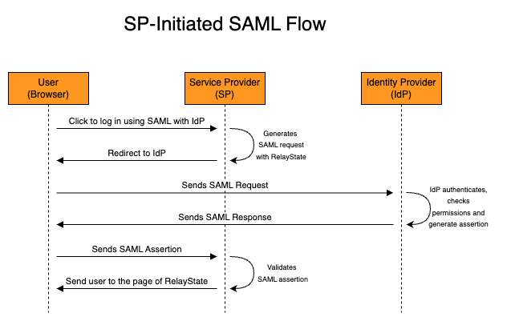

Notice that the SP initiated the SAML flow, that's why the flow is called `SP-initiated`. It's important to understand that in both flows, the SP and IdP do not communicate directly, this is all done by the user browser (front channel), with redirects and HTTP requests to the endpoints (e.g. ACS). Now let's check the IdP-initiated SAML flow.

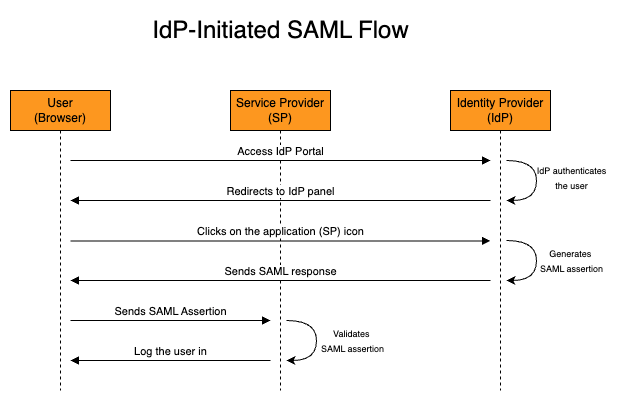

The IdP-initiated SAML flow starts with the IdP already generating the SAML response with assertion, so a "SAML request" does not exist in the IdP-initiated flow.

### OIDC
Similarly to SAML, OIDC (OpenID Connect) is a standard for exchanging authentication and authorization using JSON. This standard was built on top of OAuth: a standard that only implemented authorization (that's why we don't use OAuth for SSO). OAuth's first version (1.0) was born in 2009 but nowadays it's rarely used, since OAuth 2.0 (created in 2013) is more flexible and simpler to implement. OIDC implements the authentication layer of OAuth 2.0 and it's a common standard used with SSO these days. The general rule is: that new apps use OIDC, while legacy/enterprise apps use SAML.

#### OAuth/OIDC Concepts
Let's check some concepts that are present in both OAuth and OIDC.

Basically, there are four actors involved:
- **Resource Owner**: The user that owns data/resources and would like to grant access to another part. This is usually a human (me, you, etc) that would like to share information with a system. Have you ever seen the "Log in with Gmail" instead of creating from scratch your user in a platform? That's it, you are the owner of your information (name, email, phone number) and would like to share these. Resource Owner is also known as simply "User".
- **Resource Server**: This corresponds to the server/service that contains the resources (e.g. Google Drive, Grafana...).
- **Client** The client is the application that wants to access the resources on behalf of the resource owner (user). Here is a practical example: I usually use DrawIO to create the diagrams for my blog post. I can integrate the diagram created with Google Drive (so I don't have to store it locally). DrawIO is the client (because he wants to access my Google Drive on my behalf) and Google Drive is the Resource Server.
- **Authorization Server**: It's responsible for issuing access tokens for the client to access the resources. In the DrawIO example I just mentioned, this would be the Google Accounts service. Sometimes the Authorization Server and Resource Server is the same thing (same system). Although this is not technically 100% accurate the Authorization Server is also known as Identity Provider (IdP).

Before the OAuth/OIDC flow starts the client and authorization server should be configured beforehand.
- **Client type**: The client can be placed in one of the following categories when adding a new client to the authorization server: confidential client and public client (non-confidential). The concept of public here doesn't mean publicly accessible, it means an application that cannot safely store secrets. A SPA can not store secrets securely because the only way for the application to store this is in the source code, which is available if you inspect the website. Because of this, confidential clients (i.e. server-side hosted applications) are the only type of clients that store `client secret`. Public clients use PKCE (Proof Key for Code Exchange) a one-time code challenge.
- **Client ID and Client Secret**: The authentication server needs to create in its configuration a new application/client. This gives us a client ID (nonsensitive) and a client secret (sensitive - if the client is confidential). These are used later to obtain the access token when using the authorization code flow (keep reading and you will understand this!).

Some important concepts in the flow:
- **Authorization Code**: Corresponds to a short-lived (around 10 minutes), one-time-only use code that is used to prove to the client that the user logged in and gave permissions. The authorization code is meaningless to the resource server and it's obtained with browser communication (front channel), which is less secure (is it secure, don't get me wrong, but it's considered less secure than a server to server - i.e. back channel - communication), that's why the authorization code is not sufficient to access the protected resources.
- **Scopes**: We don't want the client to access the resource server with permissions to execute whatever he wants, we would like to limit the access. Using the DrawIO example, we would like to grant DrawIO (the client) to see/create its own configuration data in the user Google Drive([https://www.googleapis.com/auth/drive.appdata scope](https://developers.google.com/identity/protocols/oauth2/scopes#drive)) but not view the user photos, videos, and albums in Google Photos ([https://www.googleapis.com/auth/drive.photos.readonly scope](https://developers.google.com/identity/protocols/oauth2/scopes#drive)). The user needs to be aware of the actions that the client will do on the user's behalf, so that's why a consent screen is usually presented after the user logs in to the authorization server.
- **Redirect URI**: The Redirect URI (also known as callback URL) is the URL that the user needs to reach back with the Authorization code that was given by the Authorization Server. The flow is stateless and the communication happens using the browser as an intermediate layer (except for the Access Token exchange), so the client needs to specify this URL when the OAuth/OIDC process starts.
- **Access Token**: Differently from the Authorization Code, the Access Token contains the "real credential" that proves authorization to access the protected resources. It's often a signed JWT that can be validated by the resource server. This access token is limited to the scopes authorized (consented) by the user and it's obtained between the direct communication of the client and authorization server (back channel) when the client passes the client ID, client secret, and authorization code. Notice that this value can not fetched by the user, since this communication happens between the client and the authorization server.
- **Response Type**: The response type specifies what flow the client expects the authorization server to use. OAuth/OIDC supports several flows but the most common is the `Authorization Code Flow` (the one I'm commenting on here!). You might have heard about `Implicit flow` but this is deprecated and not recommended anymore (it only uses the front channel to exchange tokens).

If you understand these concepts, you are ready to understand the OAuth 2.0 Authorization Code Flow below.


As mentioned, OIDC is built on top of Auth 2.0, so it introduces new concepts/jargon that do not exist in OAuth 2.0 that are helpful when it comes to authentication:
- **ID Token**: A signed JWT that contains information about the user (name, email, unique ID...) that is issued by the Authorization Server. The key-value pair inside the JWT that represent the user is called `claim`.
- **/userinfo**: The OIDC standard specifies an endpoint called `/userinfo` in the authorization server so that the client can get more information about the user if needed. Yes, the ID Token already has information about the user, but sometimes the client needs extra information that is not available in the claim. In these cases, the client will reach the `/userinfo` route (passing the Access Token - since it's a protected route) to get more information, if needed.
- **openid scope**: To specify that the OIDC flow will be used, the client needs to specify the `openid` scope. Scope, as we just saw, is something present in OAuth 2.0, but the `openid` didn't exist.
- **/.well-known**: The Authorization Server exposes all the URL capabilities, and metadata that the client needs to interact via OIDC in a route called `/.well-known` (instead of specifying the Auth URL, Token URL, and Userinfo Url).

You will notice that the OIDC flow below will be very similar to the OAuth 2.0.


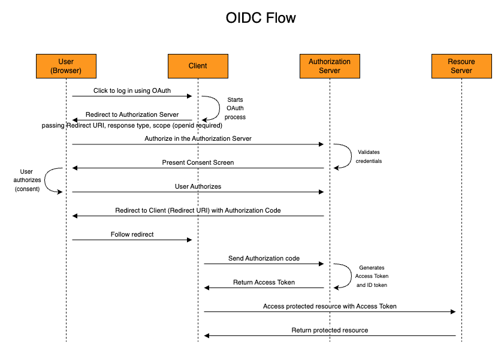


## Hands-On

The goal of this demo is to show how to configure:
- Authentik as an Identity Provider
- AWS as a Service Provider using SAML
- Grafana as Client using OIDC
- Configure Caddy as a web proxy

To achieve that I will use Terraform and deploy resources in AWS. For simplicity and to make this demo cheap I will deploy Grafana and Authentik in the same EC2. This is obviously a bad practice and you should not use this in production! Since the code is kinda big I will only paste the step-by-step guide to run the demo. Please check the repository for the code.

There are some things we need to know before hands-on starts:
- Grafana only supports SAML in the [Enterprise edition](https://grafana.com/docs/grafana/latest/setup-grafana/configure-security/configure-authentication/saml/), so we are going to use OIDC, that is available to everyone.
- AWS Identity Center can only be configured in the Management Account, so if you are planning to run this demo, make sure you are in the management account!
- Make sure you have a hosted zone configured in Route 53

1) Install dependencies of the repository

```sh
devbox shell
```

2) Initialize Terraform

```sh
terraform init
```

3) Create a file to define variables

You can check the README below to see the variables that are required (or check `variables.tf` file directly).

Here is one example of a valid file (modify it for your use case)

```hcl
# vars.tfvars
aws_region = "us-east-1"
domain = "mydomain.com"
use_staging_certificate = true
authentik_email = "me@mail.com"
```

4) Apply Terraform and create the infrastructure

Remember to have valid AWS credentials in your terminal!

```sh
terraform apply --var-file=vars.tfvars
```

This command will provision the VPC, and EC2 with elastic (static) IP and create the record in Route53 to allow Let's Encrypt to validate we own the domain (Caddy will manage and create this certificate for us). The EC2 will run the `user_data` script to configure Authentik and Grafana.

5) Wait for infrastructure to get ready
Open your browser and keep checking if the Authentik server is already ready (check the endpoint by running `terraform output authentik_endpoint`).
It will take a couple of minutes (most likely less than 10) to be available because the `user_data` script needs to take a couple of minutes to install Authentik and expose using Caddy. Also, the DNS to reach the DNS needs to propagate to the network.

You can check how the progress is going by connecting via Session Manager (AWS Console) to the EC2 and running the following command:

```sh
sudo su
echo "Check Cloud Init Script"
cat /var/log/cloud-init-output.log
echo "Check Caddy Status"
systemctl status caddy
```

6) Go to AWS Console to get Identity Center URL
Now, open the AWS Console and navigate to the IAM Identity Center.
Go to `Settings` and click `Change Identity source`

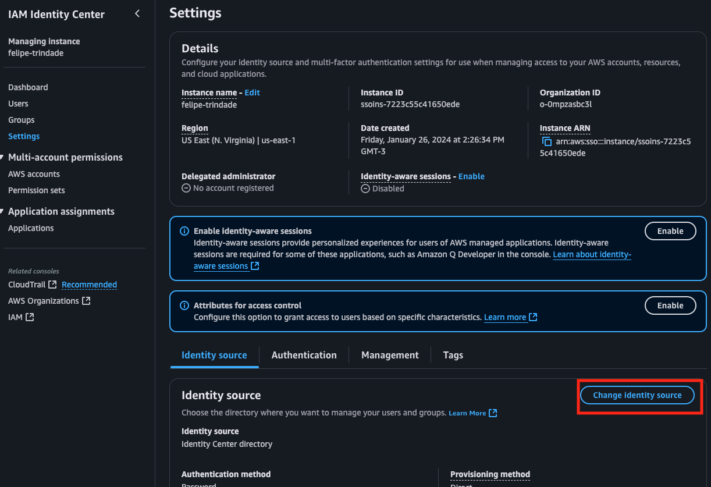

7) Select External Identity Source
We will be using Authentik as the IdP of AWS (our SP).

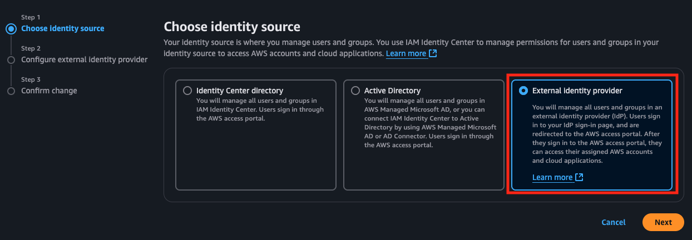

8) Copy the SP metadata provided
We are going to use these values in the Terraform Authentik configuration soon so do not close this window yet!

9) Get credentials to Authentik
Soon we are going to configure Authentik using Terraform. Authentik Terraform provider requires a Token to execute HTTP calls to execute actions and configure it. Also, we will need to configure Grafana's OAuth provider using the created client ID and client secret. We can get these values from the outputs of the main Terraform code we just executed.

Run the Terraform command to get these values:

```sh
terraform output authentik_endpoint
terraform output authentik_token
terraform output grafana_oauth_client_id
terraform output grafana_oauth_client_secret
```

If you would like to log in as admin you will use the email used to configure Authentik and the password available in the `authentik_password` output (`terraform output authentik_password`).

10) Initialize the Authentik Terraform module

```sh
cd authentik
terraform init
```

11) Create a file to define variables
The Authentik terraform module needs some variables to be defined. Here is an example:

```hcl
# authentik/vars.tfvars
authentik_url = "https://sso.mydomain.com/" # Use the Terraform output
authentik_token = "123ABC" # Use the Terraform output
authentik_insecure = true # Set to true if you set use_staging_certificate to true

grafana_url = "https://monitoring.mydomain.top" # Use the Terraform output
grafana_client_id = "1a2b3c" # Use the Terraform output
grafana_client_secret = "123abc" # Use the Terraform output

aws_sign_in_url = "https://ABC.awsapps.com/start" # Use the AWS value
aws_acs_url ="https://us-east-1.signin.aws.amazon.com/platform/saml/acs/DEF" # Use the AWS value
aws_issuer_url = "https://us-east-1.signin.aws.amazon.com/platform/saml/GHI" # Use the AWS value

set_scim = false
aws_scim_url = ""
aws_scim_token = ""
```

We are not setting SCIM yet. We need to first set up the external Identity Provider for the Identity Center before configuring the SCIM.

12) Apply Authentik configuration
If Authentik is already available you can now configure it using Terraform

```sh
terraform apply --var-file=vars.tfvars
```

Here we are going to create:
- SAML provider for AWS
- OIDC provider for Grafana
- AWS and Grafana application

Some important things to mention:
- [Grafana documentation](https://grafana.com/docs/grafana/latest/setup-grafana/configure-security/configure-authentication/generic-oauth/) specifies the redirect URI
- AWS Identity Center does not support [encrypted SAML assertion](https://docs.aws.amazon.com/IAM/latest/UserGuide/id_roles_providers_create_saml.html)
- AWS Identity Center supports [post binding](https://docs.aws.amazon.com/IAM/latest/UserGuide/id_roles_providers_create_saml_assertions.html)

13) Upload SAML metadata and IdP Cert to AWS External Identity Provider configuration
You will notice that when applying the module two files were generated: `authentik/cert.pem` and `authentik/metadata.xml`. These files can be obtained in the Authentik but for simplicity, we extracted them via Terraform.
Upload these to the AWS Console:
- `authentik/metadata.xml` should be uploaded in the "IdP SAML metadata" field
- `authentik/cert.pem` should be uploaded in the "IdP certificate" field

PS: I noticed a bug that I couldn't fix that it might happend here. The first Terraform apply execution of the authentik module can generate and empty the `metadata.xml` file. If this happens simply rerun the `terraform apply --var-file=vars.tfvars` command and the file will be created correctly. If the file is empty AWS will complain (of course!).

14) Enable SCIM
Go to AWS Console on the Identity Center Settings page. You will see a message to enable SCIM. Click to enable. An endpoint and a token will be generated. Copy these values because we are going to need it the next step.

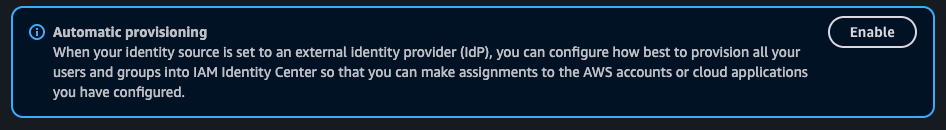

15) Deploy SCIM via Terraform
Modify the `authentik/vars.tfvars` file to enable SCIM. The SCIM variables should look like this:

```hcl
set_scim = true # This should have "true" value now!
aws_scim_url = "https://scim.AWS_REGION.amazonaws.com/ABCDEF/scim/v2"
aws_scim_token = "GIANT_TOKEN"
```

Rerun the apply
```sh
terraform apply --var-file=vars.tfvars
```

This will create:
- SCIM provider for AWS. AWS says that even when using an external identity provider you still need to [provision all applicable users and groups into AWS Identity Center](https://docs.aws.amazon.com/singlesignon/latest/userguide/manage-your-identity-source-idp.html). This is very tedious, but here SCIM comes to the rescue! SCIM is a standard to simplify the exchange of user identity information between identity centers. Since AWS supports SCIM we can use and take advantage of it! In other words, every time a user (that is from the AWS group) is created, Authentik will do an API call to the AWS SCIM server to also create this user there. The AWS SCIM implementation requires some specification and has some [constraints](https://docs.aws.amazon.com/singlesignon/latest/developerguide/createuser.html) so that's why we carefully used a Python script to specify the fields we need to pass to the AWS SCIM provider. Also, another important thing to mention is that the AWS external Identity Center requires us to use [email](https://docs.aws.amazon.com/singlesignon/latest/userguide/other-idps.html) as the NameID to identify the user.
- Two users: "dev" (that should only have ReadOnly permissions in the AWS account and Viewer permission in Grafana) and "admin" (should have AdministratorAccess in the AWS account and Admin permission in Grafana). We are creating passwords for these users using Terraform, this is not ideal in a real-world scenario: once again, this is a demo.
- Groups: AWS groups (all users that need AWS access should be placed here since in a real-world scenario we don't want to create users that do not need AWS access to be created there), Admin AWS group, Dev AWS group, Grafana Admin group, Granafa Viewer group.

16) Manually sync the SCIM
In case SCIM was not synced (i.e. users were not created in AWS IAM Identity Center) we should manually sync before moving on. Log in as admin (the email you set up and password of `authentik_password` in the main terraform code) and go to `Applications` > `Providers` > `aws-scim` > hit the sync button. Now, you can see in the AWS IAM Identity Center console (Users and Groups section) the users and groups created by the Authentik Terraform module.

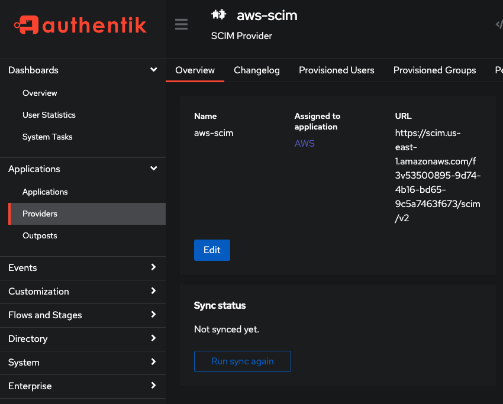

17) Initialize the AWS Organizations Terraform module
In the previous module, we created the users and groups. Now, from the AWS side, we need to configure this group to access the AWS account and configure their permissions. First, let's initialize the Terraform module.

```sh
cd ../organizations
terraform init
```

18) Create a file to define variables

```
# organizations/vars.tfvars
aws_region = "us-east-1"
instance_arn = "arn:aws:sso:::instance/ssoins-abc123"
identity_store_id = "GHI"
```

The `instance_arn` and `identity_store_id` variables can be obtained in the settings page of the Identity Center.

19) Deploy Organizations module

```sh
terraform apply --var-file=vars.tfvars
```

Here we create the permission sets (for administrators and developers) and assign these permission sets to the management account.

20) Log in using admin or dev user
Log in using the `dev` or `admin` user. The credentials are available in the Authentik Terraform module!

You should be able to see the following application on the Authentik home screen:

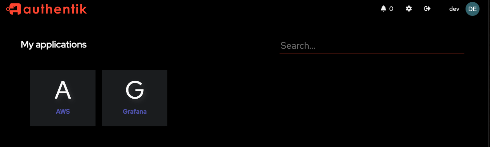

Now, let's log in the AWS using the Dev and Admin to see the differences. First, let's use the Dev user:


Now let's check with the Admin user:

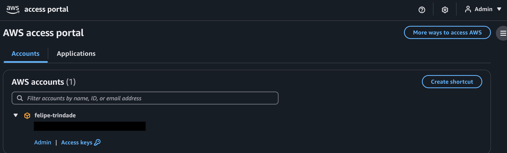

We will see the same behavior when using accessing Grafana. First, let's use Dev user:

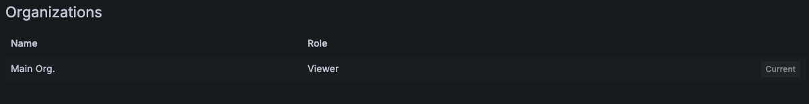

Then, admin user:

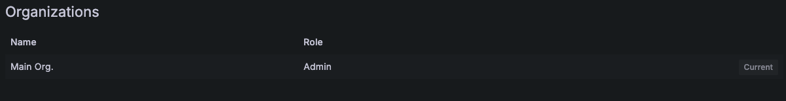


