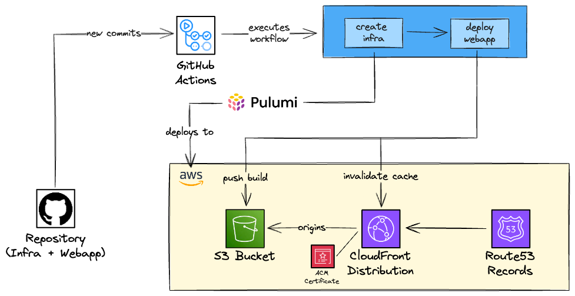

In this post, I'll comment, discuss and deep-dive about how to deploy a static web application using S3 and CloudFront. Actually, this was the way I deployed this website/blog!


## Considerations regarding the tools used
I've used some tools to help me deploy the static web application. To be honest, I think this is the less important part here, I could have used other tools to do the same job. The most important thing is to understand why the tool is being used, if you understand the reason you can replace it with another tool easily.

- **CI/CD**: I've used GitHub Actions to perform the CI/CI workflow of the project for the infrastructure as code (IaC) and for the website (static web application). You could have used any continuous integration tool here, such as [GitLab CI/CD](https://docs.gitlab.com/ee/ci/), [CircleCI](https://circleci.com/), [Jenkins](https://www.jenkins.io/)... I decided to use GitHub Actions to manage the CI/CD because it's already integrated with GitHub, the free tier is enough for my use case and it is a managed service (and I was not in the mood to self-manage and deploy an open source CICD tool). The workflow was performing the following tasks:
  - **For the infrastructure**: Deploying the cloud resources used in the project, such as S3 bucket, CloudFront distribution, and Route53 records. Don't worry! I will cover all these services, just keep reading!
  - **For the web app**: Building the source code, generating the static files, pushing the static files to S3 and invalidating the CloudFront distribution.
- **Infrastructure as Code**: All the cloud resources created could have been created manually in the console, but what is the point of it? This is not reproducible, difficult to document the changes, hard to keep track of the changes. I decided to use [Pulumi](https://www.pulumi.com/) to create the documentation. I chose Pulumi because I was curious to give it a try and be able to compare it with other IaC tools that I've used in other projects, such as [Terraform](https://www.terraform.io/)/[OpenTofu](https://opentofu.org/), [Terragrunt](https://terragrunt.gruntwork.io/), [AWS CDK](https://aws.amazon.com/pt/cdk/) and [SAM](https://aws.amazon.com/serverless/sam/).
- **Web app**: Here we have so many options to build a web application, so many different stacks/frameworks are possible to be used here, such as pure HTML/CSS project, React, NextJS... I decided to use [Gatsby](https://www.gatsbyjs.com/starters/gatsbyjs/gatsby-starter-blog), which is a web framework that uses React behind the scenes.

## Architecture

A visual approach to what we are going to deploy is available below.



The following AWS Services are being used:

- **S3**: Service that stores objects, in our case, it will serve as the storage of our static web app.
- **ACM**: It's a service that will provide the TLS certificate that will make our website secure (using HTTPS).
- **CloudFront**: It is a CDN service, that will cache the static files of our website and deliver them to the clients (users).
- **Route53**: To create records that allow the users to access the website using our domain.

### S3

The Simple Store Service, widely known as S3, is one of the most famous/oldest AWS services. It is an object storage service that automatically manages scalability, data availability, high availability, data replication... A cool feature of S3 is that you can set an [S3 bucket to host a static website](https://docs.aws.amazon.com/AmazonS3/latest/userguide/WebsiteHosting.html), so you can simply build the website code and throw it in the bucket, set the bucket to be public, add a bucket policy that allows anyone to get objects from the bucket and you have a website up and "running"!

That's it. It's that straightforward. But there are some catches that it is important to mention and be aware of. S3 website endpoints do not support HTTPS, which is a big bad thing, even if it's just a static website, the users might feel that the website is not safe, secure, trustworthy and won't put much credibility into it. Also, your website will be now hosted in the AWS region where the S3 bucket was created. This means that if you, for example, created the bucket in `us-east-1` (N. California) and a user from China wants to access the website, all the requests would have to go to the N. California servers, so the latency can be higher than expected. If it's a simple static website this might not even be noticed by the user, but if it contains videos, this can be very noticeable. And no, creating several buckets across different regions is not a good idea to solve the problem.

#### Bucket Policy
Since there is no such thing as an IAM Role for CloudFront, the way we allow CloudFront to get the assets from the S3 Bucket is by setting a bucket policy that allows the CloudFront service (we can add, and we will, a condition to only allow a specific CloudFront distribution, instead of the entire service) to pull objects from the bucket.
By doing that we guarantee that users are not able to access the website through the S3 Website endpoint, only through the CloudFront distribution. A configuration regarding access should also be done from the CloudFormation side, we will cover that in a bit!

### CloudFront
Wouldn't it be nice if we were able to cache our website very close to the users across the world and also allow HTTPS in our website? That's where CloudFront comes in!

CloudFront is the CDN (Content Delivery Network) of AWS. If you used AWS at least once you probably know that resources are deployed in regions (such as `us-east-1`, `ap-south-1`, `eu-west-2`...), and this means that the server that hosts the service is running in that region. So if you work for a company based in India and most of your clients are also from India, it probably makes sense to host this in India too (e.g. `ap-south-1`), because the data center that contains the server that is running your application will be closer to the client, resulting in lower latency and better user experience in general. Of course, there are some points to consider, such as the cost of the Indian region being more expensive than the US region, but that's the general idea in terms of performance.

But if you want to deploy static content (e.g. HTML, CSS, JS, Images, Videos...) you can deploy these assets in data centers that are closer to the clients, called edge locations - also called CloudFront POP (point of presence). These edge locations will cache your assets so the delivery to the client will be way faster! These edge locations exist all around the world so it means that even if you only host your application (e.g. the API that is used by your website) in one region, parts of the website (that are using the CloudFront to deliver static content) will be fast to the client.

#### Data center levels
There are three data center levels when we talk about CloudFront: edge locations (also known as POP), regional edge caches and the origin.


Let's take a look at each type and how they related:
- **Edge Location (POP)**: This is the closest server to the client and can serve the content directly to the users.
- **Regional Edge Caches**: It has a larger cache when compared to the POP so the objects persist longer than the POP.
- **Origin**: The "place" that contains the original content (in our case, the static files of the website). A common origin (and this is the origin that we will use) is to host the content in an S3 bucket, but you can also use Elastic Load Balancer, an HTTP server in an EC2 instance, [and many other options](https://docs.aws.amazon.com/cloudfront/latest/APIReference/API_Origin.html) as a CloudFront origin.

#### Distribution Price Class
We commented that the edge locations exist all around the world, and that's a fact, but you don't need to use all the edge locations. You can select the [Price Class](https://docs.aws.amazon.com/AmazonCloudFront/latest/DeveloperGuide/PriceClass.html) of your CloudFront distribution.

Edge locations are grouped in regions (North America, South America, Europe...). Price Class is a group of regions that will be used in your distribution. There are three Price Classes:
- **Price Class All**: Uses all POP in all regions.
- **Price Class 200**: Uses all POP in all regions, except South America, Australia and New Zealand regions.
- **Price Class 100**: Uses POP only in North America, Europe and Israel.

Based on that, you should ideally use a Price Class that covers most (or all) of your clients, reducing the latency they will see and optimizing the user experience. It is tempting to select `Price Class All`, so you will cover the entire world! But be aware that one of the highest costs in CloudFront is the data transfer going out of CloudFront to the users and this depends on the region. The cheapest regions (North America and Europe) cost `$0.085` per GB transferred and the most expensive region (Hong Kong, Indonesia...) costs `$0.120` per GB transferred. As we gonna comment in the pricing section, if your website has little access you won't even be charged because the free tier is very generous, so it's ok to use `Price Class All`.

If you select `Price Class 100`, it means that users from Japan (for example), won't get the content from an edge location. To be honest, there is a chance that they can be served by an edge location (that's how AWS works) but you will pay the least expensive region in your price class.

#### Caching Flow
We can sum up the caching flow using the following flow chart below:


You might be wondering: what happens if I update the content? Does it mean that the clients will get the cached content until eventually the cache is not available and the content needs to be fetched from the origin? Yes, that's exactly what happens. If you want to update the content and force it to show to your users you can *invalidate the cache*! This is something that we will do in our CI/CD: build the website, push the assets to the S3 bucket and invalidate the cache. But don't worry, we will still get there.

#### HTTPS
To distribute the content using HTTPS it is necessary to have a certificate. You can use the AWS Certificate Manager (ACM) service to create a certificate and "attach" to the CloudFront distribution. This way, your website will support HTTPS using TLS protocol.

#### Alias
When a CloudFront distribution is created, it automatically provides a domain name for you to access the distribution, something like `d139253ab29.cloudfront.net`. This domain name is really bad in terms of usability and you definitely shouldn't use it directly, especially in production.

The idea is to create an A record in your Route53 that points to a more friendly name (in a domain that you own), such as `felipetrindade.com`, `blog.felipetrindade.com` or `www.felipetrindade.com`.

#### Access Control
To allow CloudFront to authenticate with S3 as origin two ways can be used: Origin Access Control (OAC) and Origin Access Identity (OAI). The latest is the legacy method, so we will give preference to the OAC method. The main difference between OAC and OAI is that OAC enhances security (using short-term credentials behind the scenes) and allows you to use KMS with CloudFront and S3 bucket. Using OAC, we will allow the CloudFront distribution to access the S3 using authenticated requests as we want.

#### Lambda@Edge
CloudFront allows us to specify the default root object of our website, usually the `index.html`, but this only works on the root of the website (e.g. `https://www.felipetrindade.com` -> `https://www.felipetrindade.com/index.html`). [It does not work on any subdirectory level](https://aws.amazon.com/blogs/compute/implementing-default-directory-indexes-in-amazon-s3-backed-amazon-cloudfront-origins-using-lambdaedge/) (e.g. `https://www.felipetrindade.com/hello-world`).

Let me be more specific here, if you access the root page of the website (e.g. `https://www.felipetrindade.com`) and click on any post it will work normally, let's say that you click on the `Hello, World!` post, you will see that the URL of the browser will be modified to `https://felipetrindade.com/hello-world`. But if you reload the page of the post or simply try to access it from a link (`https://www.felipetrindade.com/hello-world`) you will get a 403 Access Denied error. But if you add `index.html` at the end of the URL it is gonna work perfectly (`https://felipetrindade.com/hello-world/index.html`).

The explanation for this problem is fairly simple. S3 authenticates with CloudFront using the OAC, sending requests to the S3 Rest API. The API does not allow redirection to the default index page. So when the user goes directly to a subpage (e.g. `https://felipetrindade.com/hello-world`) it will request to S3 an object with `hello-world` as the object key and this key does not exist, but the key `hello-world/index.html` exists! So that's why it is going to work if we add the `index.html` at the end of the URL.


This behavior is such a TERRIBLE user experience and we don't want to deploy such a bad thing. Luckily CloudFront provides us something called [Lambda@Edge](https://docs.aws.amazon.com/lambda/latest/dg/lambda-edge.html). Basically, we are going to deploy Lambda Functions at edge locations and these Lambda functions can alter the response or request between the user and edge location or between edge location and request. So it can be used to do A/B testing, add headers, dynamically route based on headers/cookies/query strings and so on. You can set the Lambda to run in four types of events:

- **Viewer request**: User request to edge location.
- **Viewer response**: Edge location request to the user.
- **Origin request**: Edge location request to origin.
- **Origin response**: Origin request to edge location.


In our use case, we want to modify the `Viewer Request`, since we want to modify the URI so the Edge Location can effectively retrieve the sub-page! We are going to implement that using NodeJS and it is as simple as 10 lines of code: get the URL from the events objects (JSON) and return the URL with `index.html` appended.

### Certificate Manager
AWS Certificate Manager is the service responsible for provisioning the TLS certificates. So you don't need to go through the burden of purchasing/issuing the certificate, renewing and uploading it to the servers. It is a really handy service and the best part is that public certificates are free, so you don't pay extra for it.

One tricky thing about the integration between ACM and CloudFront is that the certificate [MUST be issued in the N. Virginia region](https://docs.aws.amazon.com/AmazonCloudFront/latest/DeveloperGuide/cnames-and-https-requirements.html) (`us-east-1`).

### Route53
This is the DNS service managed by AWS, where you can buy a domain and manage the records for the domain, allowing name resolution for hostnames you own. One thing that is important to mention is that you DO NOT have to buy your domain from AWS to use it. If your domain was purchased from websites like GoDaddy, Namecheap, HostGator or any other registrar you can delegate your domain to be managed by Route53. This tutorial is out of the scope of this blog post but it is a straightforward process, it is easy to find tutorials or videos that go through it. The idea is that you will create a public or private (in our example the website is public, so I created a public one) zone in Route53.

## Pricing
Not sure if you noticed but the infrastructure we built is 100% serverless: we only pay for what we use and the amount of traffic we receive, let's take a deeper look at the costs:

1) Route53
We will pay `$0.50` to manage a public hosted zone. This is one of the highest costs of the project. There are other costs involved, but they are so low (if your website has low traffic) that you can consider it to be zero, e.g. `$0.40` per 1 million requests to resolve the host of your website (in my case `felipetrindade.com`).

2) S3
We pay for the assets that we put in S3. The storage cost is barely zero, for reference, the total size of my website is under 10MB (you pay only `$0.023` per GB). It's true that we also pay for API operations in S3 but it is only `$0.004` per 10,000 GET (which is likely to be the most used operation in your website).

3) ACM
As we commented before, public certificates are free. 😄

4) CloudFront
The CloudFront always free tier is generous so if your website does not have much access you probably won't even pay a single penny on that. The always free tier offers you 1TB of data transfer out, 10 million HTTP/HTTPS requests each month and this is more than enough for a personal website with low access. But in case you are curious to know more about the [CloudFront pricing](https://aws.amazon.com/cloudfront/pricing/), here we go:

- HTTP requests from users: from `$0.0075` to `$0.016` per 10,000 HTTP requests
- HTTPS requests from users: from`$0.01` to `$0.022` per 10,000 HTTPS requests
- Data Transfer from CloudFront to users: from `$0.085` to `$0.12` per GB transferred

5) Lambda@Edge
We are charged `$0.60` per 1 million requests and, since we are going to use a 128MB Lambda, `$0.00000625125` for every second used. So considering that the Lambda will run for 100ms per execution (usually it's way less), this means that 1 million executions of the Lambda will cost us `$1.23`. So cheap!

#### Total Cost
In the end, for a small project, you probably going to pay only for the Route53 public hosted zone. So the monthly cost for your project will be only `$0.50`!

## Infrastructure code

Well, my entire website code is [publicly available on GitHub](https://github.com/felipelaptrin/felipetrindade.com)! You can take your time to check the code, what is being done and how things were created. You can also find valuable information in the README.md files of the `frontend` and `infrastructure` folders.

I rather not talk about the website code, although you can check what I'm doing by taking a look at the Github repository. I rather comment on the infrastructure code. It's going to be a code specific for Pulumi but it is easy to "migrate" the code from Pulumi to Terraform or any other IaC tool since the valid thing here is to understand the resources being used.

### Pulumi

I divided the infrastructure into two parts:
- **Frontend**: The architecture diagram you saw earlier, is composed of ACM Certificate, CloudFront, S3 bucket, and Route53 records.
- **GitHub Actions OIDC**: In the CI/CD we need to perform some actions (e.g. push assets to the S3 bucket, invalidate CloudFront distribution) in the AWS account. There are two common ways to deal with this in terms of authentication:
  - Create an IAM User for the GitHub Actions, issue an access key/secret, store it in the secrets of GitHub actions, and perform authentication using these key pairs. The major problem with this approach in my opinion is that you are using static credentials, you will need to care about rotating these, so that's why we are not going through this path.
  - Create an Identity Provider in AWS that allows GitHub Actions to authenticate with AWS via OIDC and creates an IAM Role that GitHub Actions will be able to assume. The credentials are dynamic, so it's an improvement in terms of security! We are going to implement this!

#### Frontend

Pulumi creates resources when you instantiate the classes that represent the resource. My idea was to put all the frontend components into a single class called `Frontend` and instantiate in the `index.ts` file. So I ended up with the following file:


```typescript
// frontend.ts
import * as archive from "@pulumi/archive";
import { s3, acm, cloudfront, route53, lambda, iam, cloudwatch, Provider } from '@pulumi/aws'
import { interpolate, asset } from '@pulumi/pulumi'

import { accountId } from "./commons"

export interface IFrontend {
  domainName: string
  lambdaAtEdgeLogGroupRetention: number
}


export class Frontend {
  id: string
  props: IFrontend
  certificate: acm.Certificate
  distribution: cloudfront.Distribution
  bucket: s3.Bucket
  zoneId: Promise<string>
  lambda: lambda.Function
  provider: Provider

  constructor(id: string, props: IFrontend) {
    this.id = id
    this.props = props
    this.zoneId = this.getZone()
    this.certificate = this.getCertificate()
    this.bucket = this.getS3Bucket()
    this.lambda = this.getLambdaAtEdge()
    this.distribution = this.getDistribution()
    this.provider = new Provider("us-east-1", { region: "us-east-1" })

    this.setBucketPolicy()
    this.setRoute53()
  }

  getCertificate(): acm.Certificate {
    const certificate = new acm.Certificate(`${this.id}-certificate`, {
      domainName: `${this.props.domainName}`,
      subjectAlternativeNames: [
        this.props.domainName,
        `*.${this.props.domainName}`,
      ],
      validationMethod: "DNS"
    }, { provider: this.provider })
    const certificateValidation = new route53.Record(`${this.id}-certificate`, {
      zoneId: this.zoneId,
      name: certificate.domainValidationOptions[0].resourceRecordName,
      records: [certificate.domainValidationOptions[0].resourceRecordValue],
      type: certificate.domainValidationOptions[0].resourceRecordType,
      ttl: 60
    })
    new acm.CertificateValidation(`${this.id}-certificate-validation`, {
      certificateArn: certificate.arn,
      validationRecordFqdns: [certificateValidation.fqdn]
    })

    return certificate
  }

  getS3Bucket(): s3.Bucket {
    const bucket = new s3.Bucket(`${this.id}-bucket`, {
      website: {
        indexDocument: "index.html",
        errorDocument: "index.html",
      },
    })

    return bucket
  }

  getDistribution(): cloudfront.Distribution {
    const originAccessControl = new cloudfront.OriginAccessControl(`${this.id}-origin-access-control`, {
      originAccessControlOriginType: "s3",
      signingBehavior: "always",
      signingProtocol: "sigv4"
    })
    const distribution = new cloudfront.Distribution(`${this.id}-cloudfront-distribution`, {
      enabled: true,
      comment: "Cloudfront distribution of my personal website and blog",
      origins: [{
        domainName: this.bucket.bucketRegionalDomainName,
        originAccessControlId: originAccessControl.id,
        originId: "s3OriginId",
      }],
      priceClass: "PriceClass_All",
      defaultCacheBehavior: {
        allowedMethods: [
          "DELETE",
          "GET",
          "HEAD",
          "OPTIONS",
          "PATCH",
          "POST",
          "PUT",
        ],
        cachedMethods: [
          "GET",
          "HEAD",
        ],
        targetOriginId: "s3OriginId",
        viewerProtocolPolicy: "redirect-to-https",
        cachePolicyId: "658327ea-f89d-4fab-a63d-7e88639e58f6", // Managed-CachingOptimized
        lambdaFunctionAssociations: [{
          eventType: "viewer-request",
          lambdaArn: this.lambda.qualifiedArn
        }]
      },
      restrictions: {
        geoRestriction: {
          restrictionType: "none",
          locations: [],
        }
      },
      viewerCertificate: {
        cloudfrontDefaultCertificate: false,
        acmCertificateArn: this.certificate.arn,
        sslSupportMethod: "sni-only",
        minimumProtocolVersion: "TLSv1.2_2021",
      },
      customErrorResponses: [{
        errorCode: 404,
        responsePagePath: "/404.html",
        responseCode: 404,
        errorCachingMinTtl: 3600,
      }, {
        errorCode: 403,
        responsePagePath: "/404.html",
        responseCode: 404,
        errorCachingMinTtl: 3600,
      }],
      defaultRootObject: "index.html",
      aliases: [
        this.props.domainName,
        `www.${this.props.domainName}`
      ],
    })

    return distribution
  }

  setBucketPolicy(): void {
    const bucketPolicyDocument = interpolate`{
      "Version": "2008-10-17",
      "Id": "PolicyForCloudFrontPrivateContent",
      "Statement": [
        {
          "Sid": "AllowCloudFrontServicePrincipal",
          "Effect": "Allow",
          "Principal": {
            "Service": "cloudfront.amazonaws.com"
          },
          "Action": "s3:GetObject",
          "Resource": "${this.bucket.arn}/*",
          "Condition": {
            "StringEquals": {
              "AWS:SourceArn": "arn:aws:cloudfront::${accountId}:distribution/${this.distribution.id}"
            }
          }
        }
      ]}`
    new s3.BucketPolicy(`${this.id}-bucket-policy`, {
      bucket: this.bucket.id,
      policy: bucketPolicyDocument,
    })
  }

  getZone(): Promise<string> {
    const zone = route53.getZone({
      name: this.props.domainName
    })
    const zoneId = zone.then(zone => zone.zoneId)

    return zoneId
  }

  setRoute53(): void {
    new route53.Record(`${this.id}-record`, {
      zoneId: this.zoneId,
      name: this.props.domainName,
      type: "A",
      aliases: [{
        name: this.distribution.domainName,
        zoneId: this.distribution.hostedZoneId,
        evaluateTargetHealth: false
      }]
    })

    new route53.Record(`${this.id}-record-www`, {
      zoneId: this.zoneId,
      name: `www.${this.props.domainName}`,
      type: "A",
      aliases: [{
        name: this.distribution.domainName,
        zoneId: this.distribution.hostedZoneId,
        evaluateTargetHealth: false
      }]
    })
  }

  archiveLambdaCode(): string {
    const archiveFile = "lambda/lambda_at_edge.zip"
    archive.getFile({
      type: "zip",
      sourceFile: "lambda/index.js",
      outputPath: archiveFile
    })

    return archiveFile
  }

  getLambdaAtEdge(): lambda.Function {
    const archiveFile = this.archiveLambdaCode()
    const trustRelationship = interpolate`{
      "Version": "2012-10-17",
      "Statement": [{
        "Effect": "Allow",
        "Principal": {
          "Service": [
            "lambda.amazonaws.com",
            "edgelambda.amazonaws.com"
        ]},
        "Action": "sts:AssumeRole"
      }]
    }`

    const policy = new iam.Policy(`${this.id}-lambda-policy`, {
      policy: interpolate`{
        "Version": "2012-10-17",
        "Statement": [{
          "Sid": "VisualEditor0",
          "Effect": "Allow",
          "Action": ["s3:List", "s3:Get*"],
          "Resource": [
            "${this.bucket.arn}",
            "${this.bucket.arn}/*"
          ]
        }]
      }`
    })

    const role = new iam.Role(`${this.id}-lambda-at-edge`, {
      assumeRolePolicy: trustRelationship,
      managedPolicyArns: ["arn:aws:iam::aws:policy/service-role/AWSLambdaBasicExecutionRole", policy.arn],
    })

    const logGroup = new cloudwatch.LogGroup(`${this.id}-lambda-at-edge-log-group`, {
      retentionInDays: this.props.lambdaAtEdgeLogGroupRetention,
    })

    const lambda_function = new lambda.Function(`${this.id}`, {
      description: "Runs at edge to add '/index.html' in every uri, allowing users to access paths",
      role: role.arn,
      code: new asset.FileArchive(archiveFile),
      runtime: "nodejs20.x",
      handler: "index.handler",
      architectures: ["x86_64"],
      publish: true,
      loggingConfig: {
        logGroup: logGroup.name,
        logFormat: "Text"
      }
    }, { provider: this.provider })

    new lambda.Permission(`${this.id}-lambda-permission`, {
      action: "lambda:InvokeFunction",
      statementId: "AllowExecutionFromCloudFront",
      function: lambda_function,
      principal: "edgelambda.amazonaws.com",
    })

    return lambda_function
  }
}
```

The Lambda@Edge code is the following:

```javascript
// lambda/index.html
'use strict';
exports.handler = (event, context, callback) => {
  const request = event.Records[0].cf.request;
  const uri = request.uri;

  if (uri.endsWith('/')) {
    request.uri += 'index.html';
  } else if (!uri.includes('.')) {
    request.uri += '/index.html';
  }

  callback(null, request);
};
```

I used a `commons.ts` file to export helpful functions and values:

```typescript
// commons.ts
import { getCallerIdentity } from '@pulumi/aws'

const current = getCallerIdentity({});
export const accountId = current.then(current => current.accountId);
```

And instantiated my `Frontend` class in the `index.ts`:

```typescript
// index.ts
import { Frontend } from "./frontend"
import { frontendConfig, githubOidcConfig } from "./config"
import { GitHubOidc } from "./oidc"

new GitHubOidc("oidc", githubOidcConfig)
const frontend = new Frontend("frontend", frontendConfig)

// Export - Slack Outputs - Used during CI
export const cloudfrontDistribution = frontend.distribution.id
export const frontendS3Bucket = frontend.bucket.bucket
```

And the configs (parameters of my stack), I created the `config.ts` file:

```typescript
// config.ts
import { IFrontend } from './frontend'
import { IGitHubOidc } from './oidc'


export const frontendConfig: IFrontend = {
  domainName: "felipetrindade.com",
}

export const githubOidcConfig: IGitHubOidc = {
  roleName: "GithubActionsOidcWebsite",
  organization: "felipelaptrin",
  repository: "felipetrindade.com",
}
```

#### Github Actions OIDC
Now, let's take a look at the class that creates the GitHub Actions identity provider.

```typescript
// oidc.ts
import { iam } from "@pulumi/aws"
import { accountId } from "./commons"
import { interpolate } from "@pulumi/pulumi"

export interface IGitHubOidc {
  roleName: string
  organization: string
  repository: string
}

export class GitHubOidc {
  id: string
  props: IGitHubOidc
  role: iam.Role

  constructor(id: string, props: IGitHubOidc) {
    this.id = id
    this.props = props
    this.setIdentityProvider()
    this.role = this.getOidcRole()
  }

  setIdentityProvider(): void {
    new iam.OpenIdConnectProvider(`${this.id}-identity-provider`, {
      url: "https://token.actions.githubusercontent.com",
      clientIdLists: ["sts.amazonaws.com"],
      thumbprintLists: [
        "1b511abead59c6ce207077c0bf0e0043b1382612"
      ]
    })
  }

  getOidcRole(): iam.Role {
    const trustRelationship = interpolate`{
      "Version": "2012-10-17",
      "Statement": [{
        "Effect": "Allow",
        "Principal": {
          "Federated": "arn:aws:iam::${accountId}:oidc-provider/token.actions.githubusercontent.com"
        },
        "Action": "sts:AssumeRoleWithWebIdentity",
        "Condition": {
          "StringEquals": {
            "token.actions.githubusercontent.com:aud": "sts.amazonaws.com"
          },
          "StringLike": {
            "token.actions.githubusercontent.com:sub": "repo:${this.props.organization}/${this.props.repository}:*"
          }
        }
      }]
    }`

    const role = new iam.Role(`${this.id}-role`, {
      name: this.props.roleName,
      description: "Role assumed by the GitHub Actions to deploy resources related to the website/blog",
      assumeRolePolicy: trustRelationship,
      managedPolicyArns: ["arn:aws:iam::aws:policy/AdministratorAccess"],
    })

    return role
  }
}
```


## CI/CD

Finally! Let's check the CI/CD. We can divide the CI/CD pipeline into two jobs:
- **Infrastructure deployment**: Here, we need to install Pulumi, check if there are drifts, show the actions that it will perform and finally deploy the infrastructure (the latest step only when merged in the main branch).
- **Frontend deployment**: We need to build the assets, push them to the S3 bucket and invalidate the CloudFront cache.

There is a clear dependency in these jobs: the infrastructure needs to be deployed first, only after the infrastructure deployment we can effectively deploy the website assets to CloudFront.

### GitHub Actions Workflow

The final CI/CD for this project is the following:

```yaml
name: CI/CD

on:
  push:
    branches:
      - main
  pull_request:

permissions:
  id-token: write # This is required for requesting the JWT
  contents: read  # This is required for actions/checkout

jobs:
  infra:
    runs-on: ubuntu-latest
    outputs:
      frontend-bucket: ${{ steps.frontend-bucket.outputs.s3 }}
      cloudfront-distribution: ${{ steps.cloudfront-distribution.outputs.cloudfront }}
    env:
      AWS_REGION: ${{ vars.AWS_REGION }}
      PULUMI_CONFIG_PASSPHRASE: ${{ secrets.PULUMI_CONFIG_PASSPHRASE }}
    steps:
      - name: Checkout repository
        uses: actions/checkout@v4

      - name: Assume Role via OIDC
        uses: aws-actions/configure-aws-credentials@v3
        with:
          role-to-assume: ${{ vars.IAM_ROLE_ARN_OIDC_GITHUB }}
          role-session-name: Github-Actions
          aws-region: ${{ vars.AWS_REGION }}

      - name: Setup Node
        uses: actions/setup-node@v4
        with:
          node-version: 21.6.1

      - name: Install node dependencies
        working-directory: infrastructure
        run: npm install

      - name: Pulumi installation
        run: |
          curl -fsSL https://get.pulumi.com | sh
          export PATH=$PATH:/root/.pulumi/bin

      - name: Pulumi Login using S3 as backend
        run: pulumi login ${{ vars.PULUMI_BACKEND_S3_BUCKET }}

      - name: Pulumi Preview
        working-directory: infrastructure
        run: pulumi preview --diff --refresh -s stack

      - name: Get Frontend S3 Bucket
        id: frontend-bucket
        working-directory: infrastructure
        run: |
          OUTPUT=$(pulumi stack output frontendS3Bucket -s stack)
          echo "s3=$OUTPUT" >> "$GITHUB_OUTPUT"

      - name: Get CloudFront Distribution ID
        id: cloudfront-distribution
        working-directory: infrastructure
        run: |
          OUTPUT=$(pulumi stack output cloudfrontDistribution -s stack)
          echo "cloudfront=$OUTPUT" >> "$GITHUB_OUTPUT"

      - name: Pulumi Deploy
        if: github.ref == 'refs/heads/main'
        working-directory: infrastructure
        run: pulumi up --yes --refresh -s stack

  frontend:
    runs-on: ubuntu-latest
    needs: infra
    steps:
      - name: Checkout repository
        uses: actions/checkout@v4

      - name: Assume Role via OIDC
        uses: aws-actions/configure-aws-credentials@v3
        with:
          role-to-assume: ${{ vars.IAM_ROLE_ARN_OIDC_GITHUB }}
          role-session-name: Github-Actions
          aws-region: ${{ vars.AWS_REGION }}

      - name: Setup Node
        uses: actions/setup-node@v4
        with:
          node-version: 21.6.1

      - name: Install node dependencies
        working-directory: frontend
        run: |
          npm install
          npm install -g gatsby-cli

      - name: Build website
        working-directory: frontend
        run: gatsby build

      - name: Push assets to S3
        if: github.ref == 'refs/heads/main'
        working-directory: frontend/public
        run: |
          S3=s3://${{ needs.infra.outputs.frontend-bucket }}
          aws s3 sync . $S3

      - name: Invalidate CloudFront Cache
        if: github.ref == 'refs/heads/main'
        run: |
          aws cloudfront create-invalidation \
            --distribution-id ${{ needs.infra.outputs.cloudfront-distribution }} \
            --paths "/*"
```

I don't have much to comment about the CI/CD since I've already made my considerations and explained the steps needed so it should be straightforward to understand what is being done. But I'd like to comment on the Pulumi outputs.

In the `infra` job, we are creating all the cloud resources needed (actually this is not correct... there are some manual steps needed that I will comment on in the next section). There are two outputs that we need to get from these resources created: the bucket name and the CloudFront distribution ID.

Instead of hardcoding these values or using any other manual approach to get these values directly from the Pulumi stack output IaC tools usually have an `output` section where you can get metadata about the resources created and if you are using a tool that does not support that you can (using IaC code) store the needed values in the [AWS Parameter Store](https://docs.aws.amazon.com/systems-manager/latest/userguide/systems-manager-parameter-store.html) and read the value from the CI.

#### Secrets and Variables
Instead of hardcoding some important values in the workflow YAML directly I decided to store these values in the [Secrets](https://docs.github.com/en/actions/security-guides/using-secrets-in-github-actions#creating-secrets-for-a-repository) and [Variables](https://docs.github.com/en/actions/learn-github-actions/variables#creating-configuration-variables-for-a-repository). This gives me more flexibility (e.g. if something changes I do not need to open a PR to change the value) and security.

The following variables were set in the repository:
- `AWS_REGION`: The AWS region where all the resources will be deployed.
- `PULUMI_BACKEND_S3_BUCKET`: This is the S3 bucket that will store the Pulumi stack information and metadata. I will comment on this in the following sections.
- `IAM_ROLE_ARN_OIDC_GITHUB`: The IAM Role ARN of the role that Github will use to authenticate with AWS and perform the deployments in the account. Please notice that this can't be fetched from Pulumi outputs, since we need to have access to the Pulumi backend (in our case S3 bucket) to retrieve this information!

And the following secret was set:
- `PULUMI_CONFIG_PASSPHRASE`: Pulumi uses this password to protect and lock your configuration values and secrets. This will be commented on soon.

## The chicken and egg problem
I'm not sure if you noticed, but in this project, we faced the chicken and egg problem (actually two times!). If you didn't notice, let me explain these problems.

#### CI/CD Pipelines
We want to deploy our infrastructure using CI/CD pipelines but the CI/CD needs to assume a role but the role will be created by the CI/CD... Houston, we have a problem.

There are some solutions to tackle this problem, let me point two:
- **Create resources related to OIDC manually**: After manually creating the resources that allow GitHub Actions to authenticate in AWS assuming the IAM Role you can import the manually created resources to your IaC code.
- **Deploy the stack manually a single time**: This involves no manual steps to be done, which is nice but someone (usually a DevOps from the infrastructure team) needs to apply the Pulumi stack manually once. After that, there is no need to apply things manually since the CI/CD pipeline will manage it.

Both options have pros and cons, I chose the second option. So I ran locally:

```sh
pulumi up
```

#### IaC backend
Once again, we want to deploy our infrastructure using IaC but the IaC requires you to set up a backend to store the metadata about the stack you will deploy. You can't create the IaC backend using IaC because you need it in place before start to use it.

Something important to notice is that this is a common thing for basically all IaC tools out there, if you use Terraform/OpenTofu you will need to set the backend provider (in AWS you probably will use DynamoDB table to perform state lock and S3 bucket to store the remote state), if you use AWS CDK you will need to perform the CDK Bootstrap command...

In this project, using Pulumi, it was necessary to create the S3 bucket to store the Pulumi stack metadata. I decided to create this manually and after the creation, I added the S3 URI in the GitHub Actions Variables (`PULUMI_BACKEND_S3_BUCKET`).

Also, the initial setup of the stack is to define the name of the stack and the password for the configuration (used in GitHub Actions Secret `PULUMI_CONFIG_PASSPHRASE`). To do that the following Pulumi command was used:

```sh
pulumi stack init --secrets-provider=passphrase -s stack
```

## Back in the old days
Cloud and managed services are great! It makes our lives easier and simple but at the same time, it creates a layer of abstraction that makes it difficult to understand exactly what is happening behind the scenes. So I'd like to comment on how people used to deploy static websites back then. I don't plan to deep dive here because this is not the goal of this blog post, but I think it's worth it to mention some steps needed:

- Buy/rent a server/virtual machine
- Configure the firewall of the machine to allow traffic on port 80/443
- Setup a web server using tools such as [NGINX](https://docs.nginx.com/nginx/admin-guide/web-server/), [Apache](https://httpd.apache.org/), [Tomcat](https://tomcat.apache.org/)
- Configure the SSL/TLS certificate to allow a secure connection using HTTPS. You could buy the certificate from a Certificate Authority (CA) or use a nonprofit CA (e.g. [Let's Encrypt](https://letsencrypt.org/)) and install the certificate on your web server. Oh, and remember that SSL/TLS certificates expire so you would need to manage this manually or install a more automatic way to renew it (e.g. [Certbot](https://certbot.eff.org/), used to auto-renew certificates issued by Let's Encrypt).
- Setup a CI/CD pipeline probably using a bash script that connects to the server using SSH

Well, this is just one example of how this used to be done. Of course, other tools and other steps can be introduced here but as a general view, it's fine.

## Cya!
Thanks for taking the time to read this blog post. Hope you liked it and feel free to message me if you want to chat about it. Hope to see you in the next blog post!