AWS Step Functions is an amazing AWS service that allows you to create state machines (workflows) to orchestrate processes, microservices, jobs, etc. It's commonly used for orchestrating data pipelines and performing machine learning training/executions but it can be used whatever way fits your needs.

I would like to go over this service and explain to you how it works, what you can do with it, and how to use it with several practical examples that you can reproduce using Terraform.

## State Machine
A state machine is comprised of several event-driven steps (known as `state`) that can modify/interact with the `flow` of the execution or execute a `task` (action) in AWS (basically an API call to an AWS service). Explaining in simple words, a state machine is a bunch of actions that are executed in a sequential order (unless `Parallel` state is used - more on that later!) and that you can decide the actions to execute based on logic/data. In AWS, a state machine is defined via a JSON that specifies the list of states, order, handling errors, and content... Usually, this JSON is not built manually and it's common to use the AWS Console to generate this JSON file that represents the state machine: an image worth more than a million sentences.

We can easily transform a cooking recipe into a state machine, let's take for example a cake recipe: we start by preheating the oven, then we get a bowl, then we add all the ingredients (eggs, milk, butter, baking powder, sugar...), mix the ingredients, pour the batter in a baking pan inside the oven, wait for 30 minutes and check if the cake is baked, if not, wait 5 more minutes and check again (keep checking until the cake is baked), once baked remove from the oven. Well, I'm not a cook so this recipe might not be 100% accurate but the importance here is to understand the flow of actions, which would visually be something like this:

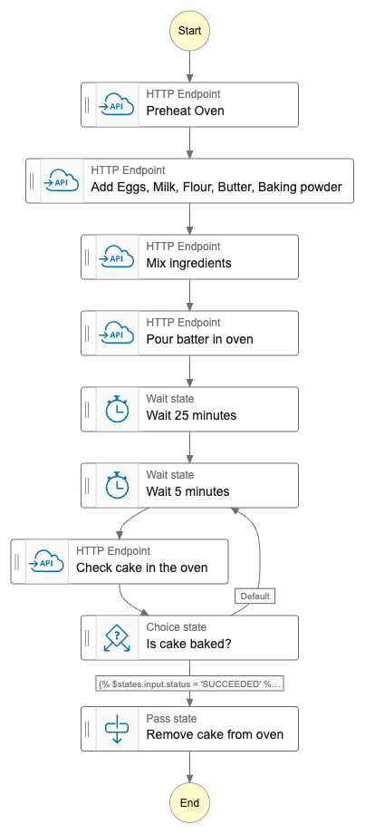

Every state machine can be executed with an input event, that can be (and most of the time is) relevant to coordinate the flow or introduce data into the workflow. For example, in your cake state machine, we could have expected an input of the `flavor` of the cake. If it's a chocolate cake, we would add that ingredient to the batter.

When creating a state machine in AWS you must select what type the workflow will be: `Standard` or `Express`. They have different use cases and are completely different in a way that we can express their difference in a few points:
- **Execution**: Standard workflows are `exactly-once`, while express workflows are `at-least-once`.
- **Execution rate**: Standard workflows have a 2,000 executions per second rate (and 4000 per state transition, i.e. going from one state to another), while express workflows can run 100,000 executions per second (and unlimited transition rate).
- **Duration**: Your workflow can run up to one year in the standard mode, while the express is up to five minutes.
- **Billing**: Standard workflows are billed based on the number of transitions, while in express machines you pay based on the duration and memory of executions (behind the scenes Express workflows use Lambda - that's why the billing is like a Lambda!).
- **Debugging**: Visual and history execution is available when using standard workflows, while express workflows use CloudWatch.

Express workflows are intended to be used for high-volume, short-duration, low-latency workflows where the `at-least-once` execution strategy is not a problem, such as real-time events and microservices coordination. In every other scenario, you will be using the standard workflow type.

### States
As mentioned, there are two types of states:
- `Flow`: There are only seven flow states (at the time that I'm writing this blog post) that are used to manipulate the flow of execution of the state machine. You can, for example, use the `Choice` block to add a conditional block (if-else logic), add a `Parallel` block to execute actions in parallel, or use the `Pass` block to perform data manipulation in the events that triggered the Step Function.

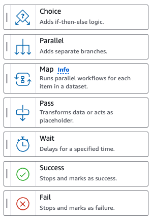

- `Actions`: Hundreds of API calls to AWS services are available in the action states. Several services offer blocks to perform actions, such as invoking Lambda Functions, manipulating objects in S3, modifying data in the DynamoDB table, configuring Route53 records, using Bedrock models, executing Athena queries, running Glue jobs... The list of available actions is huge! It is important to mention that when you create a state machine you need to define an IAM Role that will be assumed by this state machine to run all the state actions and make sure the permissions are set correctly. Please do not confuse this role with the role used by the execution of some state actions, e.g. imagine you would like to trigger a Lambda using the state machine; for that, you will need to grant `lambda:Invoke` permission to the IAM Role associated with the state machine, but the Lambda will run using it's configured IAM Role!

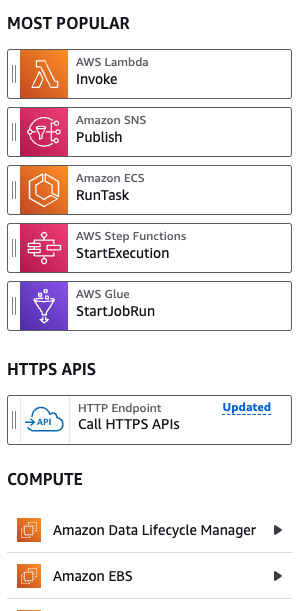

### Data Flow and JSON Query Languages
Data is passed from the previous state to the following state and can be modified, transformed, and filtered during runtime using JSON data languages: `JSONata` or `JSONPath`.

#### JSONPath
When using `JSONPath` there are 5 fields that you could pass to the state:

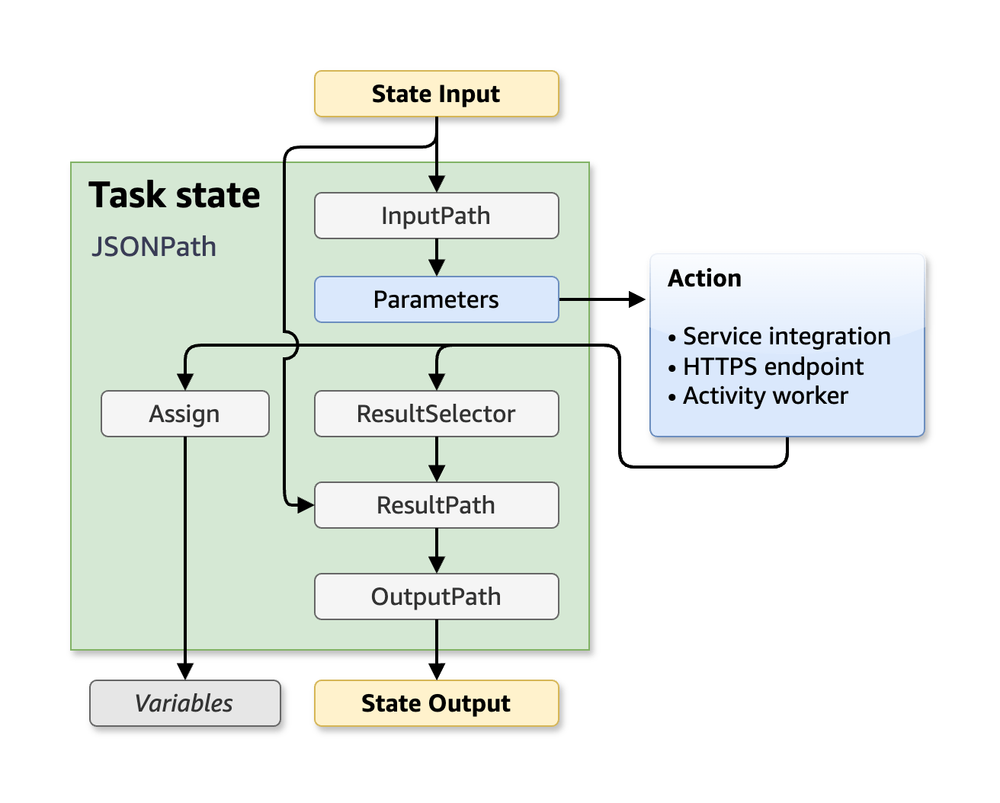

- **InputPath**: Filters the JSON input from the previous task.
- **Parameters**: Argument of the state itself. Notice that this is different than the `InputPath`. Think of `Parameters` as the input to the API call (e.g. payload of the [S3 PutObject](https://docs.aws.amazon.com/AmazonS3/latest/API/API_PutObject.html) state), while the `InputPath` is all the JSON data available that can or can not be used to create the `Parameters`.
- **ResultSelector**: Here you can select part of the result of the state that you would like to carry forward.
- **ResultPath**: You can combine the initial state input and the `ResultSelector` to build a new JSON and pass forward.
- **OutputPath**: Finally you will build the end JSON, filtering the `ResultPath` JSON data, that will be passed to the next state.

JSONPath allows the usage of some intrinsic functions to manipulate the JSON data. The functions are very limited but handful and can sometimes substitute the need to develop a Lambda Function only to manipulate the data, such as:
- **Array operations**: Select array item, check array length...
- **String operations**: Split by delimiter
- **Math operations**: Generate random numbers, sum numbers...
- **Generic operations**: String concat/template

and much more... Please check the official [documentation](https://docs.aws.amazon.com/step-functions/latest/dg/intrinsic-functions.html) to get to know the complete set of available functions. Due to the limitations of JSONPath and the fact that it's not the recommended query language anymore, I will prefer to use JSONata (although in the final exercise I will provide the code for JSONata and JSONPath).

When using JSONPath there are two syntaxes that you need to know:
- For accessing the data using JSON path you will use the `$.` operator to access the data. For accessing the context object (information about the state machine, state, execution, and task) you will use the `$$.` operator.
- For using the intrinsic functions you will use the `States.<FunctionName>(arguments)`.

Let's use an example for easy understanding. Let's suppose the following input for your state:
```json
{
  "name": "Felipe",
  "occupation": {
    "title": "DevOps Engineer"
  },
  "hobbies": ["cooking", "hiking"]
}
```

We can access the job title with `$.occupation.title` and get the first hobby (cooking) with `State.ArrayGetItem($.hobbies, 0)`.

Every JSON key that will access a JSON data using JSONPath or that will use an intrinsic function should end with `.$` so AWS can be aware that it needs to apply JSONPath logic there.

JSONPath also offers usage of `Variables`, i.e. values that you can store to use later in future states!

#### JSONata
The `JSONata` is the new supported way to query JSON data in Step Functions and it was introduced in the re:Invent 2024. Before that only `JSONPath` was available and used, that's why you may still see more content using JSONPath out there.

The `JSONata` format also simplifies the fields of the States. Instead of five fields to configure, we have only two:


- **Arguments**: Represents the inputs parameter for task state, it's equivalent to the `Parameters` of JSONPath.
- **Outputs**: Corresponds to the JSON data that will be passed to the following state, it's similar to the `OutputPath`.

Differently from the JSONPath, the JSONata offers more complex and rich query transformations that can be fully checked in their [documentation](https://docs.jsonata.org/overview.html).

There is a single syntax when using JSONata: ``. The expression can be any valid JSONata expression or a special and reserved keyword: `states`. With `$states` you can access four data:
- `input`: Original input to the state
- `result`: API result
- `errorOutput`: Error Output in a Catch
- `context`: Context object

### Exercise 01: Should I Deploy? (JSONata)
Let's put into action all the theory that was just explained! This will be the first exercise of this blog post! All the Terraform code for deploying this is in the [GitHub Repository](https://github.com/felipelaptrin/step-functions/tree/main/iac/modules/should-i-deploy).

If you are a DevOps Engineer or even a Software Engineer you probably hear about people saying that you should not deploy on Fridays, the end of the working day, before a holiday... For this exercise we will use [Should I Deploy](https://shouldideploy.today/) API to the deployment of the infrastructure via the AWS keys of an IAM User. The idea is to check the response of the API: if we get a red light we will attach [AWS Deny All Policy](https://docs.aws.amazon.com/aws-managed-policy/latest/reference/AWSDenyAll.html) to the user, otherwise, we will remove this permission. Imagine that the AWS Access Keys of this IAM User will be used in a CI/CD to deploy Terraform code.

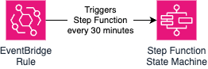

The state machine has the following graph:

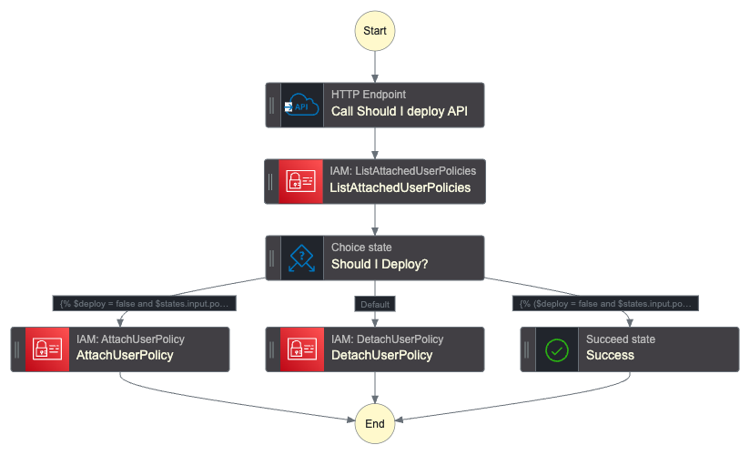

Notice that it performs exactly what we discussed above. It is also checking two important cases: if it's allowed to deploy and the deny policy is already not attached, and if it should not deploy and the policy is already attached. This is needed because the detach user policy action will raise an error if it tries to detach a policy that is not attached to the user!

For this case, the input of the Step Function is not relevant, it's just a cron-based trigger. The state machine starts with the `HTTP Endpoint` state with the following configuration:

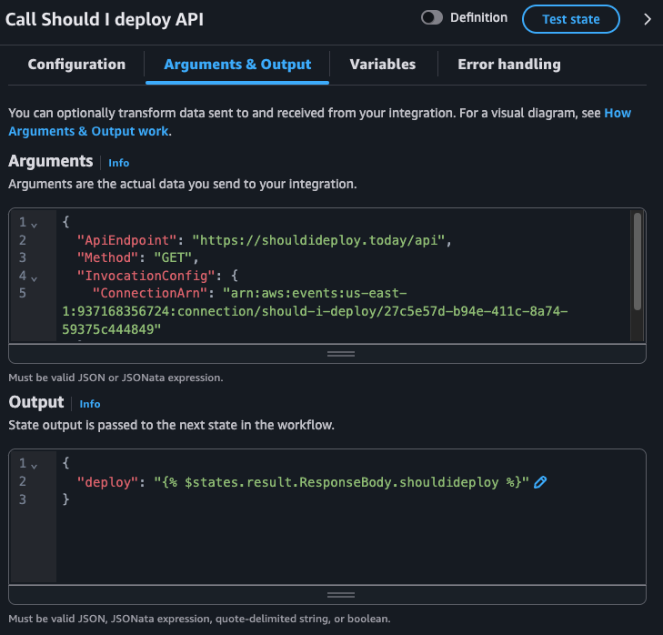

The [HTTP Endpoint](https://docs.aws.amazon.com/step-functions/latest/dg/call-https-apis.html) state requires us to pass an [EventBridge Connection](https://docs.aws.amazon.com/eventbridge/latest/APIReference/API_Connection.html) that contains the credentials (we are using a public API that does not need credential but we still need to create this resource).

We are also specifying the API Endpoint (`https://shouldideploy.today/api`) and the HTTP method (`GET`). The only relevant information from the JSON response of the API is the `shouldideploy` key: a boolean that says if we should deploy or not. Notice how I'm passing this as the following JSON:

```json
{
  "deploy": ""
}
```

I'm using JSONata to extrat the response of the API (`$states.result`) the desired key. This becomes clear when we check an execution of this State Machine. Let's check the entire output of this state.

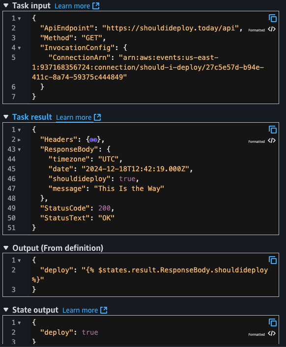

I'm also exporting the `deploy` as a variable since I plan to use this in the future states (choice).

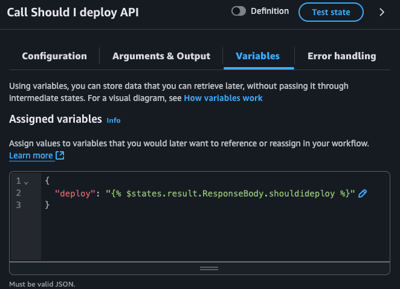

By default, the entire task output is passed to the following state but I wanted to pass only the `ResponseBody.shouldideploy` value.

Moving to the next state: ListAttachedUserPolicies. We will check all the IAM policies attached to this user.

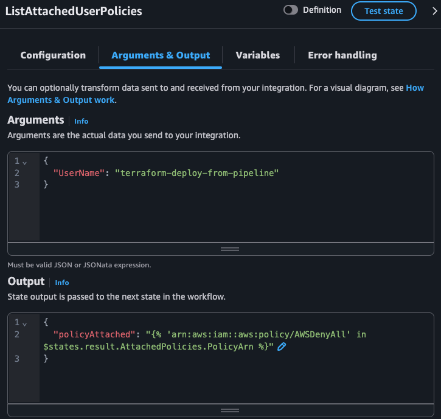

The [ListAttachedUserPolicies](https://docs.aws.amazon.com/IAM/latest/APIReference/API_ListAttachedUserPolicies.html#API_ListAttachedUserPolicies_ResponseElements) API call returns a JSON that the only relevant field is `AttachedPolicies`: an array of objects, where each object is composed of `PolicyArn` and `PolicyName`. JSONata allows us to extract values from a key of an array of objects and return this as a list of values. Then we can use the [in](https://docs.jsonata.org/comparison-operators#in-inclusion) comparison to check if a given value is in that list:

```json
{
  "policyAttached": ""
}
```

Notice how `$states.result.AttachedPolicies.PolicyArn` is powerful! This would be a pain to do using JSONPath, since the JSONPath in Step Functions [do not allow some operators](https://docs.aws.amazon.com/step-functions/latest/dg/amazon-states-language-paths.html) that could help us in this case. Check the state input/output during execution:


Now, with the two relevant pieces of information in our hands (`deploy` and `policyAttached`) we can define what action will be executed:
- If we can not deploy and the policy is not attached -> We would like to attach the deny policy
- If we can deploy and the policy is attached -> We would like to detach the deny policy
- If we can deploy and policy is not attached OR if we can not deploy and policy is attached -> We are already done and nothing should be done

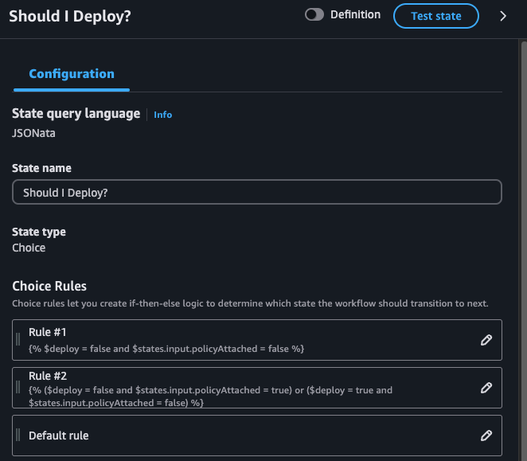

Notice how we are using the variable previously created (`$deploy`) and also using the ListAttachedUserPolicies output which is now the input of our choice state (`$states.input.policyAttached`). I also could have exported the `policyAttached` as a variable and used it in the choice state!

Both [AttachUserPolicy](https://docs.aws.amazon.com/IAM/latest/APIReference/API_AttachUserPolicy.html) and [DetachUserPolicy](https://docs.aws.amazon.com/IAM/latest/APIReference/API_DetachUserPolicy.html) accept the exact same input: the ARN of the policy and the IAM User name.

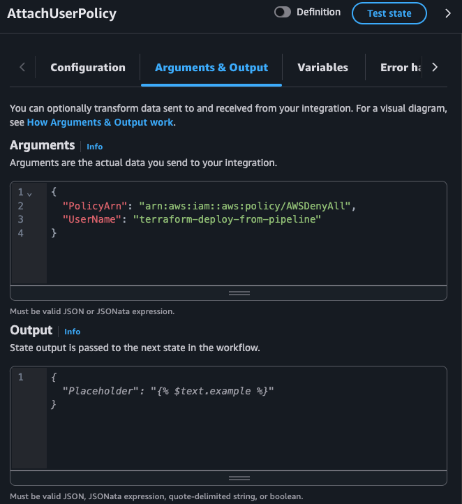

Here is a final workflow execution in a case where the IAM User was blocked from deploying but now it's allowed to deploy (i.e. the state machine should detach the deny policy):

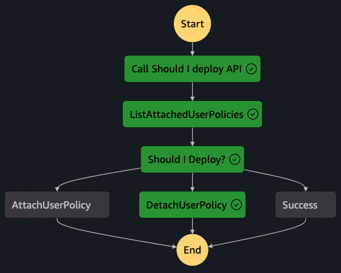

### Sync jobs, callback, and pooling pattern
By default, Step Functions execute states and move to the following state when it gets a response. Sometimes this behavior is not desired, such as:
- You would like to wait for an execution of an ECS Task or Batch Job
- You would like to treat some asynchronous jobs as synchronous
- You would like to continue the execution only after a manual approval/action

#### Sync Jobs
Some job execution in AWS is asynchronous, i.e. the API to start the job (e.g. Glue [StartJobRun](https://docs.aws.amazon.com/glue/latest/webapi/API_StartJobRun.html), Batch [SubmitJob](https://docs.aws.amazon.com/batch/latest/APIReference/API_SubmitJob.html), ECS [RunTask](https://docs.aws.amazon.com/AmazonECS/latest/APIReference/API_RunTask.html)) and return a successful response, which means that the action to initiate the job was successful, but does not monitor the job itself (i.e. if the job execution will fail or succeed).

When adding these types of states in the state machine, you can optionally mark these jobs as synchronous and AWS will internally use pooling (EventBridge events and polls APIs) to monitor the job status. This is as simple as marking a checkbox in the Step Functions Console or as simple as adding `.sync` at the end of the resource name (note that not all Jobs accept this - please check the [documentation](https://docs.aws.amazon.com/step-functions/latest/dg/integrate-services.html)) in the JSON definition, e.g.:

```json
"Glue StartJobRun": {
  "Type": "Task",
  "Resource": "arn:aws:states:::glue:startJobRun.sync",
  "Arguments": {
    "JobName": "myJobName"
  },
  "Next": "Batch SubmitJob"
}
```

You could consider the Lambda [Invoke](https://docs.aws.amazon.com/pt_br/lambda/latest/api/API_Invoke.html) as a job, but in reality, AWS treats this synchronous by default, so if you run the `aws lambda invoke` command, the command will be pending until the Lambda finishes (success or error). So this is the reason why Lambdas are not considered as an async job.

This feature is only available for Standard Step Functions.

#### Task Token Callback
Some states allow you to pause the execution of the workflow and wait for a token to be returned (up to 1 year!). When this feature is enabled, the state can pass a token (available in the context JSON), e.g. if it's an SQS message it can pass this token in the message, if it's an SQS topic it can pass in the message of the topic, if it's a Lambda invoke state it can pass the Lambda in the Payload.

The step function execution will wait until it receives a `SendTaskSuccess` or `SendTaskFailure` API action (via AWS CLI or SDK) passing the token as input. This becomes very handy when you need manual approval or wait for external events!

This feature is only available for Standard Step Functions.

#### Pooling Pattern
Some services can not be turned into sync jobs (e.g. AWS Transcribe) and task token callback can be overkill or unnecessary for your use case, so a common pattern is to create a pooling system using wait state, choice state, and an AWS API state to check the status of a job.
The pooling pattern uses `Choice`, a `Wait`, and an API Action to check the status of the job:
Wait X seconds
Check status using the API call
If the status is ready, move to another state to deal with a success response. If it's not ready, go to Wait step again. If the status is a failure, move to another state to deal with the failure.


### Exercise 02: Manual approval for creating a new IAM User
This is the second exercise of this blog post! All the Terraform code for deploying this is in the [GitHub Repository](https://github.com/felipelaptrin/step-functions/tree/main/iac/modules/create-new-user). From now on, I won't comment on every detail about the workflow, I highly encourage you to deploy the code in your AWS account and check, test, and explore. If I explain in deep detail every exercise this post will be tedious and extremely long (more than it already is).

Imagine a company that is constantly growing and would like to create AWS users (IAM users) fast but only if the manager approves it. Also, the manager can select if that person will be assigned with admin permissions or developer permission. Here is the proposed Step Function diagram:

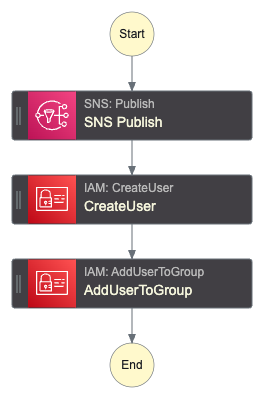

When the Step Function gets triggered with the `username` (string) to create an email is forwarded (via SNS topic) to the manager.

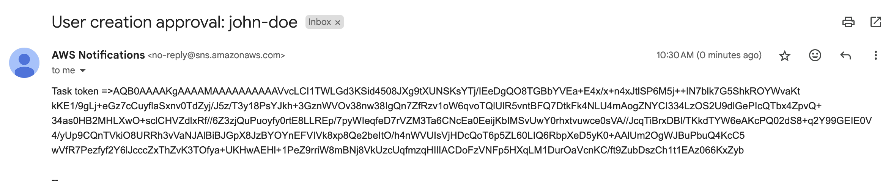

The manager will use AWS CLI to approve or deny the creation of the new user and decide if the user will be an admin or not.

```sh
# Deny
aws stepfunctions send-task-failure --task-token $TASK_TOKEN

# Approve as admin
aws stepfunctions send-task-success \
 --task-output '{"admin": true}' \
    --task-token $TASK_TOKEN

# Approve as developer
aws stepfunctions send-task-success \
 --task-output '{"admin": false}' \
    --task-token $TASK_TOKEN
```

Running the `send-task-success` action with admin set to true we will have the user created as expected!

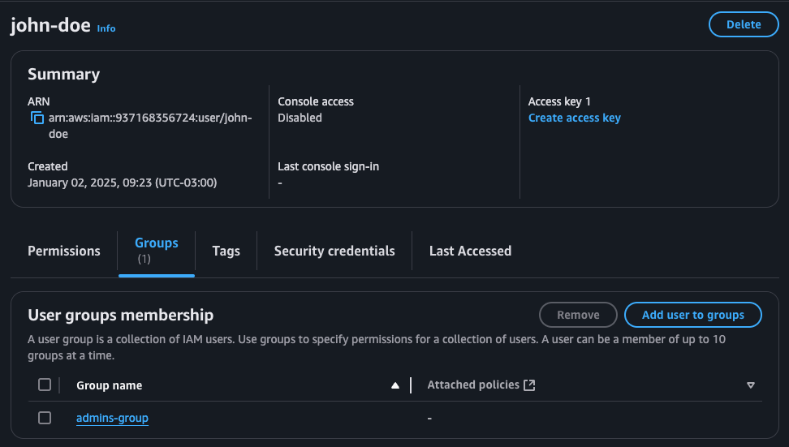

In a real-world scenario, you would create something more sophisticated (e.g. send only the URL to approve/deny integrating with another system that will perform the Step Functions send-task-success or send-task-failure). For learning purposes the example above works great!

### Exercise 03: Bucket replication with pooling system
This is the third exercise of this blog post! All the Terraform code for deploying this is in the [GitHub Repository](https://github.com/felipelaptrin/step-functions/tree/main/iac/modules/bucket-replication).

As commented earlier, some AWS actions can not be turned into synchronous jobs. In this case, the solution is to implement a pooling system which is a loop that after the run job action you will:
- Get the status of the job
- Check the status of the job
- If the job is still running sleep for X seconds
- If the job finished with success/error you will handle these cases

Imagine you would like to manually trigger a bucket replication using Data Sync. Since the DataSync `StartTaskExecution` action does not allow synchronous jobs we will implement the pool system to wait until it finishes with success/error. For simplicity, we will simply exit the step function execution with success or error but you could implement additional logic that makes sense in your use case.


Here is the Step Function graph:

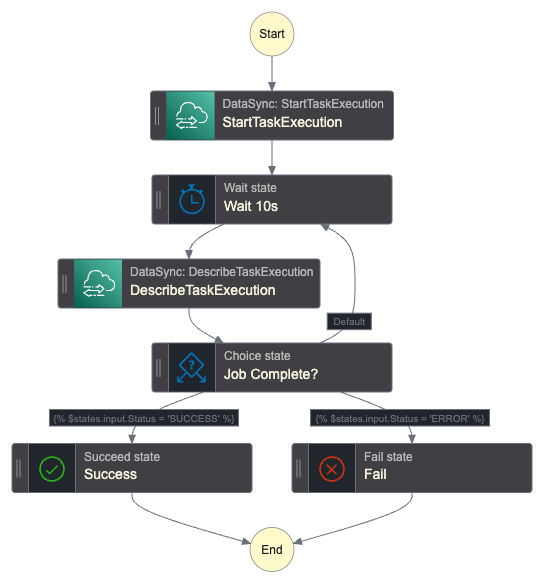

Once the step function gets triggered the DataSync task will start and the workflow will check the task execution state every 10s. The easiest way to visualize that the pooling system is working is by checking the state view.

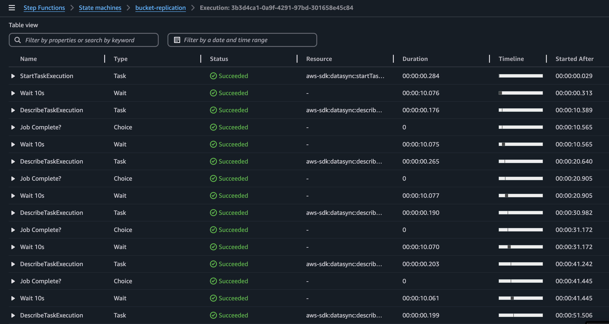

Notice the loop: `Wait 10s` -> `DescribeTaskExecution` -> `Job Complete?`.

### Exercise 04: Profile picture resize
This is the second exercise of this blog post! All the Terraform code for deploying this is in the [GitHub Repository](https://github.com/felipelaptrin/step-functions/tree/main/iac/modules/resize-image). This will be the only exercise which I've created two definitions: one in JSONata and another in JSONPath, so you can deploy as you wish and check the differences. The goal of this exercise is to show you how to deploy with Terraform.

Imagine the following scenario: your platform accepts profile pictures of the users but you need to standardize the profile picture size to use in two cases: small pictures (128x128 px) and big pictures (512x512 px). You would like the user to upload it's profile picture (PNG file) and then resize the image of the profile picture automatically. We could automate that using the following infrastructure.


When the bucket receives new profile pictures it will send this information to the SQS Queue via S3 events notification. The Step Function will consume the queue using EventBridge Pipe (since there is no direct integration between SQS and Step Function directly).

The following Step Function will be used:

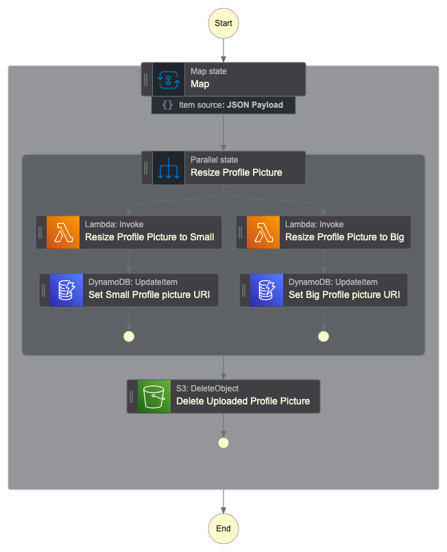

Notice that the Step Function will consume the SQS Queue in batches, i.e. the input of the Step Function workflow can be more than one event about the image uploaded, that's why we are using the `Map` flow state. For every profile picture uploaded in the input event of the workflow we would like to (in parallel) execute the lambda that will resize the profile picture to the desired size. We store in the DynamoDB the S3 key of the resized profile picture, this will be used in the backend application (out of scope of this project). Finally, when the images are resized we can delete the original profile picture, since it's not helpful anymore.

The main entry file of the Terraform code is available below:

```hcl
// main.tf
locals {
  project = "resize-profile-picture"
}

##############################
##### S3 + SQS
##############################
resource "aws_s3_bucket" "this" {
  bucket_prefix = "profile-pictures"
}

resource "aws_sqs_queue" "this" {
  name = "profile-pictures"
}

resource "aws_sqs_queue_policy" "this" {
  queue_url = aws_sqs_queue.this.id
  policy = jsonencode({
    "Version" : "2012-10-17",
    "Id" : "AllowS3Notification",
    "Statement" : [
      {
        "Effect" : "Allow",
        "Principal" : {
          "Service" : "s3.amazonaws.com"
        },
        "Action" : [
          "SQS:SendMessage"
        ],
        "Resource" : aws_sqs_queue.this.arn,
        "Condition" : {
          "ArnLike" : {
            "aws:SourceArn" : aws_s3_bucket.this.arn
          }
        }
      }
    ]
  })
}

resource "aws_s3_bucket_notification" "this" {
  bucket = aws_s3_bucket.this.id

  queue {
    queue_arn     = aws_sqs_queue.this.arn
    events        = ["s3:ObjectCreated:*"]
    filter_prefix = "uploaded/"
  }
}

##############################
##### DYNAMODB TABLE
##############################
resource "aws_dynamodb_table" "this" {
  name         = "user"
  billing_mode = "PAY_PER_REQUEST"
  hash_key     = "userId"

  attribute {
    name = "userId"
    type = "S"
  }
}

##############################
##### LAMBDA & ECR
##############################
resource "aws_ecr_repository" "this" {
  name                 = "${local.project}"
  image_tag_mutability = "MUTABLE"
}

resource "docker_image" "this" {
  name = "${aws_ecr_repository.this.repository_url}:latest"

  build {
    context  = "${path.cwd}/../lambda/resize-image"
    platform = var.lambda_architecture == "arm64" ? "linux/arm64" : "linux/amd64"
  }
  force_remove = true
}

resource "docker_registry_image" "this" {
  name          = docker_image.this.name
  keep_remotely = false
}

resource "aws_lambda_function" "this" {
  depends_on = [docker_registry_image.this]

  function_name = local.project
  role          = aws_iam_role.lambda.arn
  package_type  = "Image"
  image_uri     = "${aws_ecr_repository.this.repository_url}:latest"
  architectures = [var.lambda_architecture]
  timeout       = 10

  environment {
    variables = {
      BUCKET_NAME = aws_s3_bucket.this.id
    }
  }
}

resource "aws_iam_role" "lambda" {
  name = "lambda-${local.project}"
  assume_role_policy = jsonencode({
    Version = "2012-10-17"
    Statement = [
      {
        Action = "sts:AssumeRole"
        Effect = "Allow"
        Sid    = ""
        Principal = {
          Service = "lambda.amazonaws.com"
        }
      },
    ]
  })
}

resource "aws_cloudwatch_log_group" "lambda" {
  name = "/aws/lambda/${local.project}"
}

resource "aws_iam_policy" "lambda" {
  name = "lambda-${local.project}"
  path = "/"
  policy = jsonencode({
    Version = "2012-10-17"
    Statement = [
      {
        Sid = "S3Actions",
        Action = [
          "s3:List*",
          "s3:Get*",
          "s3:Put*",
        ]
        Effect = "Allow"
        Resource = [
          "${aws_s3_bucket.this.arn}",
          "${aws_s3_bucket.this.arn}/*"
        ]
      },
      {
        Sid = "CloudWatchActions"
        Effect = "Allow",
        Action = [
        "logs:CreateLogStream",
        "logs:PutLogEvents"
      ],
        Resource = "${aws_cloudwatch_log_group.lambda.arn}:*"
    }
    ]
  })
}

resource "aws_iam_role_policy_attachment" "lambda" {
  role       = aws_iam_role.lambda.name
  policy_arn = aws_iam_policy.lambda.arn
}

##############################
##### STEP FUNCTIONS
##############################
resource "aws_iam_role" "sfn" {
  name = "sfn-${local.project}"
  assume_role_policy = jsonencode({
    Version = "2012-10-17"
    Statement = [
      {
        Action = "sts:AssumeRole"
        Effect = "Allow"
        Sid    = ""
        Principal = {
          Service = "states.amazonaws.com"
        }
      },
    ]
  })
}

resource "aws_iam_policy" "sfn" {
  name = "sfn-${local.project}"
  path = "/"
  policy = jsonencode({
    Version = "2012-10-17"
    Statement = [
      {
        Sid = "S3Actions",
        Action = [
          "s3:List*",
          "s3:Get*",
          "s3:Put*",
          "s3:Delete*",
        ]
        Effect = "Allow"
        Resource = [
          "${aws_s3_bucket.this.arn}",
          "${aws_s3_bucket.this.arn}/*"
        ]
      },
      {
        Sid = "LambdaActions",
        Action = [
          "lambda:InvokeFunction",
        ]
        Effect   = "Allow"
        Resource = [
          "${aws_lambda_function.this.arn}",
          "${aws_lambda_function.this.arn}*"
        ]
      },
      {
        Sid = "DynamoDBActions",
        Action = [
          "dynamodb:UpdateItem",
        ]
        Effect   = "Allow"
        Resource = "${aws_dynamodb_table.this.arn}"
      },
    ]
  })
}

resource "aws_iam_role_policy_attachment" "sfn" {
  role       = aws_iam_role.sfn.name
  policy_arn = aws_iam_policy.sfn.arn
}

resource "aws_sfn_state_machine" "this" {
  name     = "${local.project}"
  role_arn = aws_iam_role.sfn.arn
  definition = templatefile(
    "machine-definition/resize-image/${var.query_language}.json",
    {
      LAMBDA_NAME         = aws_lambda_function.this.id
      DYNAMODB_TABLE_NAME = aws_dynamodb_table.this.id
    }
  )
}

##############################
##### EVENTBRIDGE PIPE
##############################
resource "aws_iam_role" "pipe" {
  name = "pipe-${local.project}"
  assume_role_policy = jsonencode({
    Version = "2012-10-17"
    Statement = [
      {
        Action = "sts:AssumeRole"
        Effect = "Allow"
        Principal = {
          Service = "pipes.amazonaws.com"
        }
      },
    ]
  })
}

resource "aws_iam_policy" "pipe" {
  name = "pipe-${local.project}"
  path = "/"
  policy = jsonencode({
    Version = "2012-10-17"
    Statement = [
      {
        Sid = "SqsAccess",
        Action = [
          "sqs:ReceiveMessage",
          "sqs:DeleteMessage",
          "sqs:GetQueueAttributes"
        ]
        Effect   = "Allow"
        Resource = "${aws_sqs_queue.this.arn}"
      },
      {
        Sid = "StepFunctionsAccess",
        Action = [
          "states:StartExecution",
          "states:StartSyncExecution"
        ]
        Effect   = "Allow"
        Resource = "${aws_sfn_state_machine.this.arn}"
      },
    ]
  })
}

resource "aws_iam_role_policy_attachment" "pipe" {
  role       = aws_iam_role.pipe.name
  policy_arn = aws_iam_policy.pipe.arn
}

resource "aws_pipes_pipe" "this" {
  name     = "trigger-${local.project}-sfn"
  role_arn = aws_iam_role.pipe.arn
  source   = aws_sqs_queue.this.arn
  target   = aws_sfn_state_machine.this.arn

  source_parameters {
    sqs_queue_parameters {
      batch_size = 5
      maximum_batching_window_in_seconds = 5
    }
  }

  target_parameters {
    step_function_state_machine_parameters {
      invocation_type = "FIRE_AND_FORGET"
    }
  }
}
```

Let's break down this code into pieces. We created the:
- S3 bucket to upload the profile pictures and store the small and big sizes.
- SQS Queue that will receive the S3 events when new profile pictures get uploaded. We also make sure that the Queue Policy allows the `SQS:SendMessage` action from the S3 bucket.
- DynamoDB table that contains metadata about the resized profile picture
- ECR repository and Lambda Function to run the resize profile picture code (more on that later). The `kreuzwerker/docker` provider was used to build and push the Lambda code from the IaC code. The Lambda Function was granted write permissions to the S3 bucket and CloudWatch (for logging).
- Step Function was created and used the JSON definition as a template (i.e. the JSON code contains placeholders that are substituted during IaC deployment: `LAMBDA_NAME` and `DYNAMODB_TABLE_NAME`). The reason why this was done is that it allowed us to reference resources created by IaC with IaC code reference instead of hardcoding them (ARNs, resource names...) in the JSON definition, which allows us to use a single JSON definition for all environments, instead of creating a hardcoded JSON definition per environment (Dev/Staging/Production). The Step Function was granted the needed permissions to interact with the S3 bucket, Lambda Function, and DynamoDB Table.
- EventBridge Pipe to trigger Step Functions from SQS Queue.

The code used some variables:

```hcl
// variables.tf
variable "aws_region" {
  description = "AWS region to deploy the resources"
  type        = string
  default     = "us-east-1"
}

variable "lambda_architecture" {
  description = "Instruction set architecture for your Lambda function. Valid values are 'x86_64' 'arm64'. Since we are also deploying the image via local deployemnt this should correspond to your computer architecture"
  type        = string
  default     = "arm64"
}

variable "query_language" {
  description = "Query Language to use in the Step Functions"
  type        = string
  default     = "jsonpath"

  validation {
    condition     = contains(["jsonata", "jsonpath"], var.query_language)
    error_message = "Valid values for var: test_variable are: 'jsonata', 'jsonpath'"
  }
}
```

I also mentioned about the Lambda Code. Let's take a look.

```python
import io
import os

import boto3
from PIL import Image

s3 = boto3.client('s3', region_name=os.getenv("AWS_REGION", "us-east-1"))

def resize_image_s3(
    bucket_name: str,
    input_key: str,
    output_key: str,
    size: int
) -> None:
    print("Downloading uploaded profile picture...")
    response = s3.get_object(Bucket=bucket_name, Key=input_key)
    image_data = response['Body'].read()

    print(f"Resizing image to {size}x{size}...")
    image = Image.open(io.BytesIO(image_data))
    image_resized = image.resize((size, size))
    buffer = io.BytesIO()
    image_resized.save(buffer, format=image.format)
    buffer.seek(0)

    print("Uploading resized profile picture to S3...")
    s3.put_object(
        Bucket=bucket_name,
        Key=output_key,
        Body=buffer,
        ContentType=response['ContentType']
    )

def lambda_handler(event, context):
    print(f"{event = }")
    print(f"{context = }")

    try:
        bucket_name = event["body"]["s3"]["bucket"]["name"]
        size = event["size"]
        uploaded_profile_picture_key = event["body"]["s3"]["object"]["key"]
        picture_name = uploaded_profile_picture_key.split("/")[-1]
        user_id = picture_name.split(".png")[0]
        resized_profile_picture_key = f"{user_id}/{size}.png"

        resize_image_s3(
            bucket_name,
            uploaded_profile_picture_key,
            resized_profile_picture_key,
            size
        )
        return {
            "statusCode": 200,
            "data": {
                "message": "Image resized!",
                "userId": user_id,
                "bucket": bucket_name,
                "uploadedKey" : uploaded_profile_picture_key,
                "resizedKey": resized_profile_picture_key
            }
        }
    except Exception as e:
        print(e)
        raise Exception(f"Something went wrong: {e}")
```

It is a simple code that resizes the image using PIL library.


## Cya!
I hope you've liked it and that this demo and explanation was helpful! Remember that reading this blog post is not enough, I highly encourage you to deploy the examples mentioned here and also create your own workflow!

See you around! 👋
