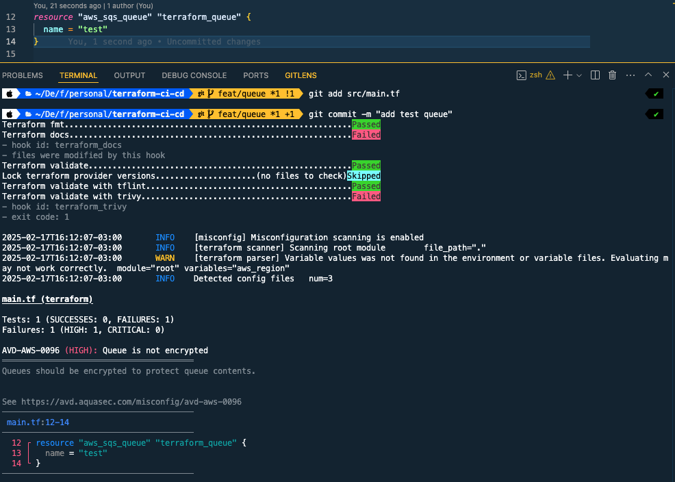
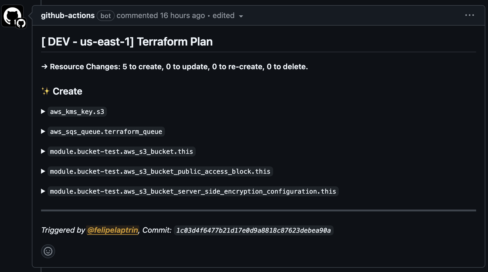
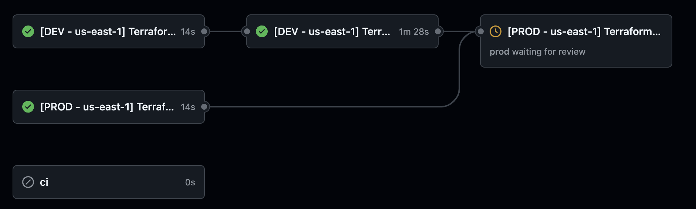

In today's blog post, I would like to propose a simple, yet powerful, CI/CD pipeline to be used in Terraform projects. From my experience, I've been in several projects with no automated deployment for terraform, lack of code standards, and use of bad practices. Setting up a good CI/CD for Terraform is not difficult but has some important parts that most don't see. Let's deep dive into a great CI/CD pipeline that goes beyond `terraform plan` and `terraform apply` actions.

## What makes a good CI/CD?
As you probably know CI/CD stands for `Continuous Improvement` (allow developer to always improve/fix the source code) and `Continuous Deployment` (allow developers to deploy the changes with ease).

During our Terraform CI, you would like to:
- **Lint the code**: We would like to run checks to make sure the code is valid and can be built/deployed with no issues, i.e. check syntax errors, and common bugs...
- **Run security/compliance checks**: We should shift security left as much as we can to avoid adding security issues to our code.
- **Format the code**: Developers have different preferences when it comes to formatting the code, which can make the code look inconsistent. Adding a code formatter standardizes the way the code looks and improves readability.
- **Run tests**: Make sure that what is being added won't break the current code.
- **Plan changes**: We would like to see what actions will be performed by the code, i.e. the `terraform plan`

During the Terraform CD other actions are performed:
- **Deploy the infrastructure**: The source code gets deployed into the environments. It's a common practice to not deploy to all environments (Development, Staging, Production) all at once. Some companies use a manual approach (validate staging is working before manually approving production deployment) while others use an automatic approach based on metrics (latency, availability...).
- **Run Post-Deployment Tests**: Load tests or E2E tests after the infrastructure is deployed guarantee that everything is working as expected.
- **Notify the team** Send messages via Slack, MS Teams, and Email to notify important people about the deployment.

Do not treat these actions as a source of truth, since they vary depending on the company, but this serves as a good baseline.

## Local development
When possible it's interesting to shift to the left the CI checks, i.e. run checks before pushing the code to the remote repository. If CI checks are simple and easy to run locally on the developing machine they should run on the developer machine too (not only during the CI pipeline) because:
1) It removes frustration from the developer that needs to push code and wait for CI to run and check if it passed
2) Speed up the development process
3) Reduce CI costs

Sometimes the checks take long and it's better to run checks in the CI, but if it's not CPU/Memory/Time consuming they should also run in the developer machine.

A great tool to automate the CI checks in the developer machine is [Pre-Commit](https://pre-commit.com/). We basically define a manifest with the hooks that are going to run before the `git commit` is executed and if it fails it will give the reasons and try to remediate, otherwise if it passes the commit is made, so you also end up with a better Git history too!

Another common problem when contributing to a project as a developer is to make sure our local environment contains all the needed tools/binaries to run the project. Actually, not only having the tools/binaries are needed, but it's very common to also enforce specific versions. If you follow my blog you know that I'm a bit fan of [Devbox](https://www.jetify.com/devbox) and [mise-en-place](https://mise.jdx.dev/). For this blog post, I will use mise-en-place. With these tools, you can define a manifest with needed tools and versions needed and install all these tools with a simple bash command.

## Helper Tools

#### During CI and Local Development
Our development environment and CI will rely on running the `pre-commit` check in the repo, this guarantees that even if the developer bypasses the pre-commit check, the CI will guarantee that the code is compliant with the best practices created for the repo. Several tools and commands will be used during the CI:
- `terraform fmt`: Make sure the code is formatted and easy to read.
- `terraform validate`:  Validate runs checks that verify whether a configuration is syntactically valid and internally consistent, regardless of any provided variables or existing state.
- `terraform-docs`: Automatically updates the README markdown that contains the documentation of the terraform code auto-generated using [terraform-docs](https://terraform-docs.io/)
- `terraform providers lock`: Consults registries to write provider dependency information into the dependency lock file (`.terraform.lock.hcl`).
- `tflint`: [tflint](https://github.com/terraform-linters/tflint) allows us to find possible errors and enforce best practices.
- `trivy`: Find vulnerabilities, misconfigurations, and exposed secrets using [trivy](https://github.com/aquasecurity/trivy)

For simplicity, I won't be running Tests in terraform but you can use [Terratest](https://terratest.gruntwork.io/).

#### During CD
Our CD will be simple and will simply run `terraform apply`. Since I won't deploy any real application I didn't load tests or send notifications but you can use some great actions, such as [Slack action](https://github.com/slackapi/slack-github-action).

## Hands-on!
Finally, it's time to check how to implement the proposed CI/CD! Once again, you can check the full code on my [GitHub Repository](http://github.com/felipelaptrin/terraform-ci-cd).

```
├── config/     # Backend configuration per AWS environment
├── modules/    # Custom Terraform modules
├── src/        # Main Terraform code to deploy infrastructure
└── vars/       # Variables values specific for every environment
```

Then let's check the tools needed to run the project.

```toml
# .mise.toml
[tools]
terraform = "1.10.5"
pre-commit = "4.0.1"
terraform-docs = "0.19.0"
tflint = "0.55.1"
trivy = "0.59.1"
jq = "1.7.1"
```

Installing these tools is as easy as running `mise install`.

Now, let's check our pre-commit file.

```yaml
# .pre-commit-config.yaml
repos:
  - repo: https://github.com/antonbabenko/pre-commit-terraform
    rev: v1.97.3
    hooks:
      - id: terraform_fmt
      - id: terraform_docs
        args:
          - --hook-config=--create-file-if-not-exist=true
          - "--args=--lockfile=false"
      - id: terraform_validate
        args:
          - --hook-config=--retry-once-with-cleanup=true
      - id: terraform_providers_lock
        args:
          - --args=-platform=linux_amd64
          - --args=-platform=linux_arm64
          - --args=-platform=darwin_arm64
          - --args=-platform=darwin_amd64
          - --hook-config=--mode=always-regenerate-lockfile
      - id: terraform_tflint
      - id: terraform_trivy
        args:
          - --hook-config=--parallelism-limit=1
          - --args=--severity HIGH,CRITICAL
```

The repository that contains the hooks is owned by Anton Babenko: a huge Terraform hero! Notice that our pre-commit uses all the tools mentioned previously.

It's important to mention that the developer needs to run `pre-commit install` in order to use pre-commit.

With everything set, let's try to create a simple SQS queue and commit in the Git repository!



Notice that it failed because:
- Documentation was not updated, so it updated and is waiting for us to add to the commit
- SQS should be deployed with [SSE enabled](https://avd.aquasec.com/misconfig/aws/sqs/avd-aws-0096/) to increase security, here is the fix (that needs to be manually performed):

```hcl
// src/main.tf
resource "aws_sqs_queue" "terraform_queue" {
 name                    = "test"
 sqs_managed_sse_enabled = true
}
```

Great! Now we have a local environment that applies best practices! Let's move to GitHub Actions. Since we have multiple environments (in my demo I will use two environments: development and production) you can imagine that repetitive actions will be performed (e.g. terraform plan will be executed in every environment), because of that we can create a composite action to simplify our CI/CD code.

```yaml
# .github/actions/terraform/action.yaml
name: Terraform Action
description: Run Terraform Plan or Apply

inputs:
  action:
    description: "Terraform action to perform. Allowed values: plan, apply"
    required: true
  environment:
    description: "Account name that is being deployed. Allowed values: DEV, PROD"
    required: true
  working_directory:
    description: Path to the directory containing the terraform files
    default: src
  aws_region:
    type: string
    description: AWS region to use
    required: true
  tfconfig_path:
    type: string
    description: Path to the HCL file that configured Terraform backend
    required: true
  tfvars_path:
    type: string
    description: Path to the TFVARS file that contains the values for variables
    required: true
  aws_role_arn:
    type: string
    description: AWS IAM Role that will be used to assume a role using OIDC
  github_token:
    type: string
    description: GitHub Token generated during GitHub Workflow runs used to comment the plan in the Pull Request. Only needed if 'action' is 'plan'
    required: false

runs:
  using: "composite"
  steps:
    - name: Install Mise
      uses: jdx/mise-action@v2

    - name: Configure AWS Credentials
      uses: aws-actions/configure-aws-credentials@v4
      with:
        role-to-assume: ${{ inputs.aws_role_arn }}
        role-session-name: Github-Actions
        aws-region: ${{ inputs.aws_region }}

    - name: Initialize terraform
      shell: bash
      working-directory: ${{ inputs.working_directory }}
      run: terraform init -backend-config=$GITHUB_WORKSPACE/${{ inputs.tfconfig_path }}

    - name: Terraform Plan
      if: ${{ inputs.action == 'plan' && github.ref != 'refs/heads/main' }}
      shell: bash
      working-directory: ${{ inputs.working_directory }}
      run: terraform plan -var-file=$GITHUB_WORKSPACE/${{ inputs.tfvars_path }} -out .planfile

    - name: Comment Terraform plan in PR
      if: ${{ inputs.action == 'plan' && github.ref != 'refs/heads/main' }}
      uses: borchero/terraform-plan-comment@v2
      with:
        working-directory: ${{ inputs.working_directory }}
        token: ${{ inputs.github_token }}
        planfile: .planfile
        header: "[ ${{ inputs.environment }} - ${{ inputs.aws_region }}] Terraform Plan"

    - name: Terraform Apply
      if: ${{ inputs.action == 'apply' }}
      shell: bash
      working-directory: ${{ inputs.working_directory }}
      run: terraform apply -auto-approve -var-file=$GITHUB_WORKSPACE/${{ inputs.tfvars_path }}
```

The terraform plan will be displayed as a comment on the Pull Request like that:



And here is our main workflow

```yaml
# .github/workflows/main.yaml
name: "Terraform"

on:
  push:
    branches:
      - main
  pull_request:

permissions:
  contents: write
  pull-requests: write
  id-token: write

jobs:
  ci:
    if: github.event_name == 'pull_request' && github.ref != 'refs/heads/main'
    runs-on: ubuntu-latest
    steps:
      - name: Checkout
        uses: actions/checkout@v4

      - name: Install Mise
        uses: jdx/mise-action@v2

      - name: Run Pre-Commit
        run: pre-commit run --all-files

  plan-dev-us-east-1:
    name: "[DEV - us-east-1] Terraform Plan"
    runs-on: ubuntu-latest

    steps:
      - name: Checkout
        uses: actions/checkout@v4

      - name: Terraform Plan
        uses: ./.github/actions/terraform
        with:
          action: plan
          environment: DEV
          aws_region: us-east-1
          tfconfig_path: config/dev.hcl
          tfvars_path: vars/dev/us-east-1.tfvars
          aws_role_arn: ${{ vars.DEV_TERRAFORM_ROLE }}
          github_token: ${{ github.token }}

  apply-dev-us-east-1:
    needs:
      - plan-dev-us-east-1
    name: "[DEV - us-east-1] Terraform Apply"
    runs-on: ubuntu-latest
    if: github.event_name == 'push' && github.ref == 'refs/heads/main'
    environment:
      name: dev

    steps:
      - name: Checkout
        uses: actions/checkout@v4

      - name: Terraform Apply
        uses: ./.github/actions/terraform
        with:
          action: apply
          environment: DEV
          aws_region: us-east-1
          tfconfig_path: config/dev.hcl
          tfvars_path: vars/dev/us-east-1.tfvars
          aws_role_arn: ${{ vars.DEV_TERRAFORM_ROLE }}
          github_token: ${{ github.token }}

  plan-prod-us-east-1:
    name: "[PROD - us-east-1] Terraform Plan"
    runs-on: ubuntu-latest

    steps:
      - name: Checkout
        uses: actions/checkout@v4

      - name: Terraform Plan
        uses: ./.github/actions/terraform
        with:
          action: plan
          environment: PROD
          aws_region: us-east-1
          tfconfig_path: config/prod.hcl
          tfvars_path: vars/prod/us-east-1.tfvars
          aws_role_arn: ${{ vars.PROD_TERRAFORM_ROLE }}
          github_token: ${{ github.token }}

  apply-prod-us-east-1:
    needs:
      - apply-dev-us-east-1
      - plan-prod-us-east-1
    name: "[PROD - us-east-1] Terraform Apply"
    runs-on: ubuntu-latest
    if: github.event_name == 'push' && github.ref == 'refs/heads/main'
    environment:
      name: prod

    steps:
      - name: Checkout
        uses: actions/checkout@v4

      - name: Terraform Apply
        uses: ./.github/actions/terraform
        with:
          action: apply
          environment: PROD
          aws_region: us-east-1
          tfconfig_path: config/prod.hcl
          tfvars_path: vars/prod/us-east-1.tfvars
          aws_role_arn: ${{ vars.PROD_TERRAFORM_ROLE }}
          github_token: ${{ github.token }}
```

If you are a visual person, like me, here is the workflow that we just created in the GitHub console:



Please notice that I'm using GitHub Environment and the `prod` requires manual approval to deploy to production!

## Cya!
I hope you've liked it and the explanation was helpful!

See you around! 👋
