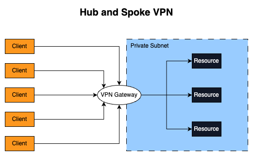
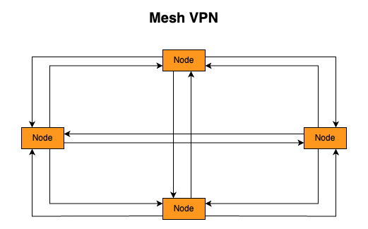
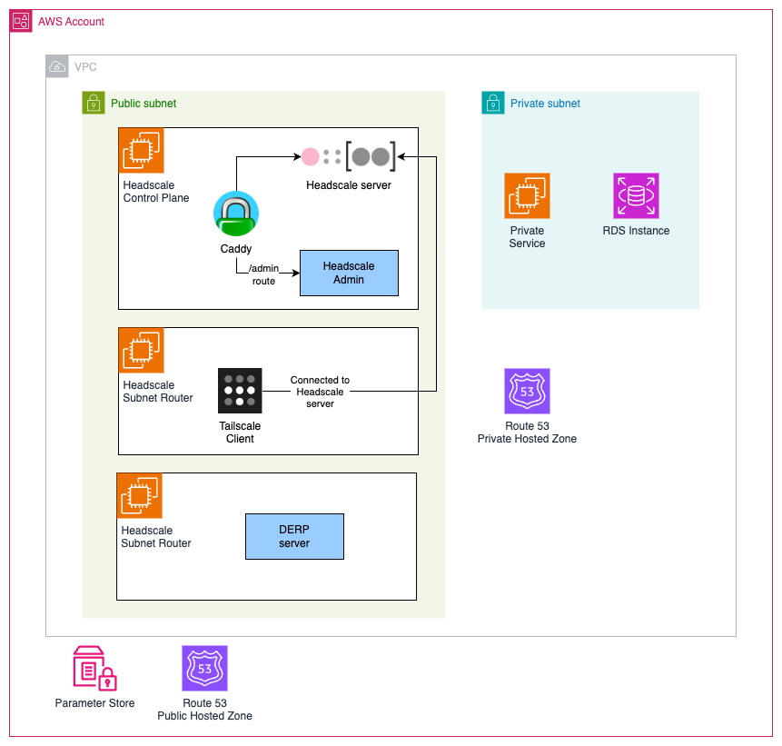
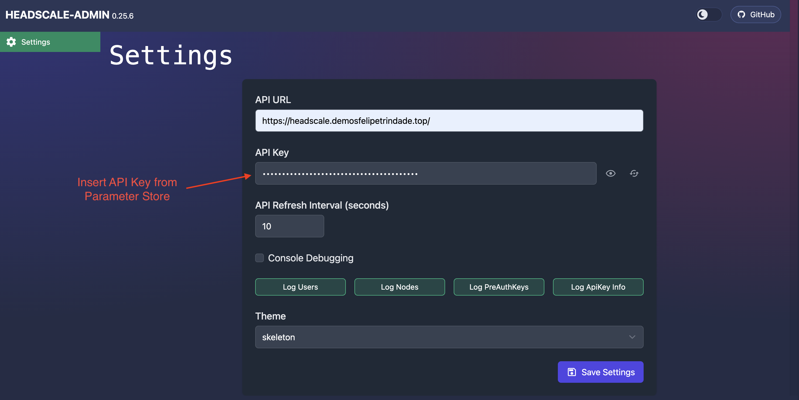
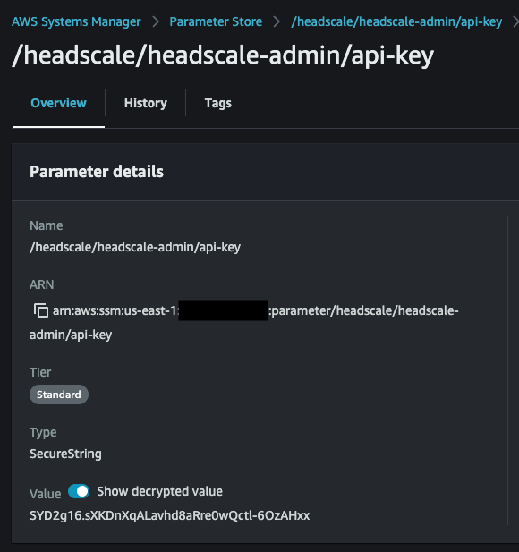
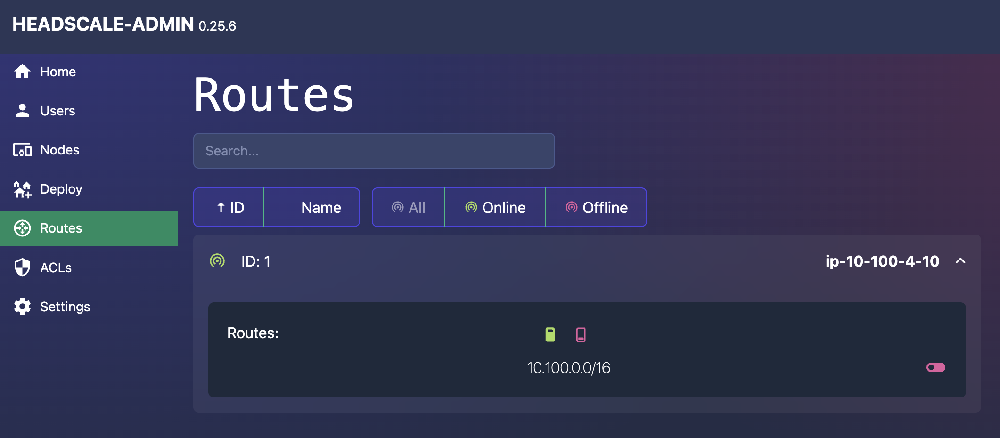
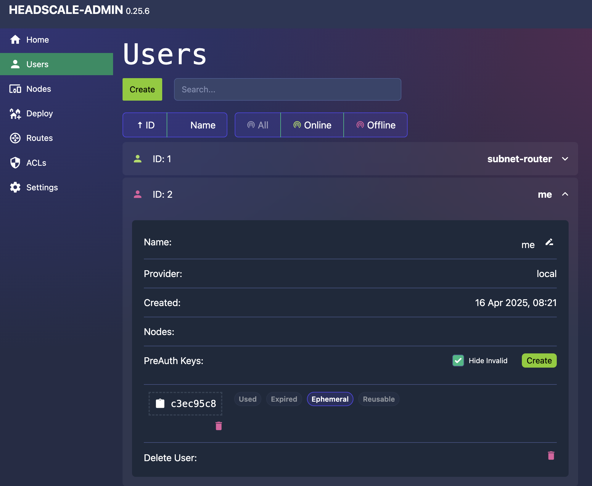
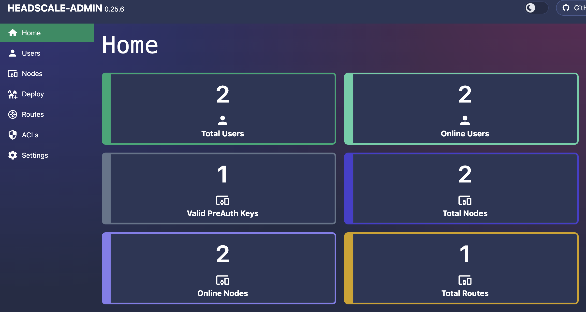
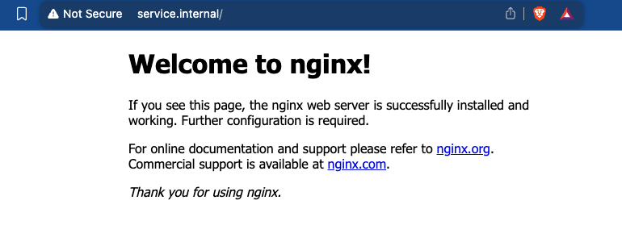
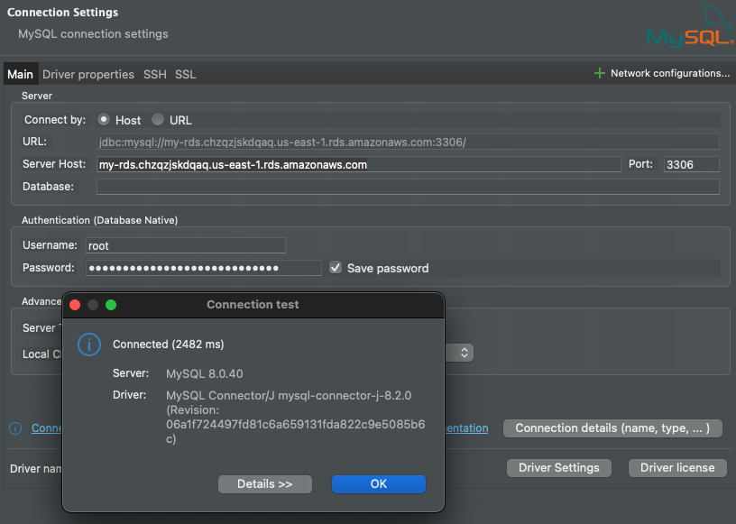

Some blog posts ago I talked about [bastion host](https://felipetrindade.com/bastion/) and [private resources](https://felipetrindade.com/public-private-apps/). I always mentioned VPN but never wrote a blog post about how to deploy one. Today I'm finally doing that. The goal of this blog post is to deploy a VPN (Headscale) and access private resources deployed in AWS.

## Hub-Spoke and Mesh VPN
A VPN (Virtual Private Network) server is a mechanism to allow secure connection to public or private resources (such as corporate network, internal systems) using a public network.

Traditional VPNs follow the "hub-and-spoke" model, i.e. all clients connect to a central gateway and this gateway forwards the traffic to the target destination. This model works well and it's still heavily used today but it has some downsides:
- **Multiple locations**: Modern and big companies have way more than a single place/location of interest. They usually have multiple offices, cloud providers (AWS, Azure, GCP...), and deployment in several regions/AZ. This means that several tunnels will need to be created among these locations which can be a pain to maintain and configure.
- **Latency**: If all the traffic needs to go through a central gateway server it will increase latency and affect the user experience when trying to connect to the resources. Maybe the user is physically located close to the resource it wants to access but the traffic will still need to go to the VPN gateway (that might be far from the client).
- **Single point of failure**: If the VPN gateway goes down, the traffic also goes down and this means no connection to the resources.



What if we implement a peer-to-peer design? Where every node could directly reach each other? That's the Mesh VPN! This concept is not new but lately, it's becoming more popular. It was not a preferred approach of the IT team due to the difficulty to deploy/configure/maintain, resource-intensive (especially for devices with limited CPU/RAM) but lately Mesh VPNs (such as Tailscale, Nebula, Zerotier) started to grow and become popular. In a mesh network, every node would need to create several tunnels and know how to reach other nodes (i.e. their IP in a world where devices rarely have static IP addresses). The first problem can be solved by using a fast, modern, and lightweight VPN tunnel, such as [WireGuard](https://www.wireguard.com/) (the big brain behind Tailscale/Headscale). The second is solvable by adding a new component: **control plane**. The control plane (also known as the coordinator server) is the main contact point of every node in the mesh VPN. The control plane is responsible for gathering all public keys of every node in the mesh network and sharing them with all the other nodes. Please notice that the control plane does not forward traffic or act as a main gateway. The control plane only provides information/metadata about the network!



The client in the mesh VPN can connect with its peers by using several advanced network techniques such as [NAT Traversal](https://tailscale.com/blog/how-nat-traversal-works) (basically the VPN client will perform a [Hole Punch](https://github.com/felipelaptrin/hole-punching))  and [DERP servers](https://tailscale.com/kb/1232/derp-servers) (when NAT traversal is not possible to be done the traffic goes through a public server called DERP - the connection is slower than doing a NAT Traversal but it's better than not having the connection!).

## Headscale
In this demo we are going to deploy the following infrastructure:



Notice the following components:
- **Headscale Control Plane**: Tailscale control plane is not open-source and is a hosted service run by Tailscale Inc. The open-source version of it is called [Headscale](https://headscale.net/stable/). We are going to deploy the Headscale in an EC2 server exposed by a [Caddy](https://caddyserver.com/) web server that is going to automatically manage and issue a public certificate using [Let's Encrypt](https://letsencrypt.org/). Because we don't want to keep connecting to this EC2 to have access to the terminal to run the Headscale CLI to add/remove clients to the VPN we are also going to install [Headscale Admin](https://github.com/GoodiesHQ/headscale-admin) a simple GUI to interact with Headscale via an API Key. Please notice that the Tailscale client is in fact [open-source](https://github.com/tailscale/tailscale) and used to connect to a Tailnet (Tailscale Network).
- **Subnet Router**: The subnet router is a Tailscale client that will serve as a router to private networks when you can not install a Tailscale client in the private resources. A good example of that is an RDS instance. We do not have access to the operational system of the RDS, so we can not install Tailscale there. So the solution to this is to deploy a Tailscale client that has access to the RDS and route traffic to the RDS. The best practice is to deploy the subnet router in a [public subnet with a public IP address](https://tailscale.com/kb/1296/aws-reference-architecture#production-best-practices) to ensure direct connection and optimal performance. If you deploy the subnet router in a private subnet it will need to use the AWS NAT Gateway which is a [Hard NAT](https://tailscale.com/kb/1296/aws-reference-architecture#aws-nat-gateway) that will prevent direct connections (forcing it to use the DERP server - which is slow).
- **DERP Server**: Ideally you should deploy one DERP server per region to have multiple DERP servers available and minimize latency to the clients. In reality, the DERP server is not required in this setup but it's highly recommended to deploy your own DERP server. If you do not use your own DERP server, it will use a Tailscale DERP servers, which means the traffic will go through the Tailscale infrastructure. The traffic is encrypted, and Tailscale won't be able to read the packages but if you came to the point of deploying your own control plane, then you probably want to keep everything on your side and control all the traffic.
- **Private Hosted Zone**: As we already discussed in previous blog posts, it's not recommended to expose dev tools (e.g. ArgoCD, Grafana...) and ideally your developers should access them via VPN. To be one step extra in the best practices, we can deploy our own internal hosted zone, i.e. a DNS that will only work for the hosts that are within the internal AWS VPC. In other words, a hostname like `grafana.internal` will only be resolved by those that are within the VPC. A common alternative scenario is to have a public hosted zone that points to a private IP, i.e. anyone will be able to resolve the domain (e.g. `grafana.mydomain.tld` but only does that are internal to the VPC will be able to have network access to it). Here we are doing an extra security step by deploying our own private hosted zone.
- **Private Service**: To simulate a private service that should only be accessed by those devices inside the VPC, I will deploy an NGINX server in a private EC2 instance.
- **RDS Instance**: A database will also be deployed in a private subnet.

## Hands-On

There is one thing that you should have in place before the hands-on: make sure you have a hosted zone configured in Route 53.

Since the code for this demo is very big I won't be copying and pasting it here, please check it in my [GitHub Repository](https://github.com/felipelaptrin/headscale).

1) Install dependencies of the repository

```sh
devbox shell
```

2) Initialize Terraform

```sh
cd infrastructure
terraform init
```

3) Create a file to define variables
You can check the README of the repo to see the required variables (or check variables.tf file directly).

Here is one example of a valid file (modify it for your use case)

```hcl
# vars.tfvars
aws_region = "us-east-1"
domain = "mydomain.tld"
headscale_acme_email = "me@mydomain.tld"
headscale_hostname = "headscale.mydomain.tld"
```

Once again: make sure the domain is already deployed as a public hosted zone in Route 53.

4) Apply Terraform and create the infrastructure

Remember to have valid AWS credentials in your terminal!

```sh
terraform apply --var-file=vars.tfvars
```

5) Wait until Headscale gets deployed
The user_data script will run in all EC2. You should wait for the user_data of the headscale control plane gets ready. You can check if the admin (headscale community console) is available. It is available in the `/admin` route, i.e. if you defined `headscale_hostname` as `headscale.mydomain.tld`, then you will need to wait `https://headscale.mydomain.tld/admin` to be available.

6) Access Headscale Admin
Use the API Key generated by the Headscale server. You can get the API Key value in Parameter Store via AWS Console or via AWS CLI running the command `aws ssm get-parameter --with-decryption --name "/headscale/headscale-admin/api-key" --query "Parameter.Value" --output text`. Refresh the page when you save the API Key value.



You can also get the API Key from the AWS Console.



7) Authorize Subnet Router route

Go to the `Routes` session and authorize the route created by the Subnet Router.



8) Create a new user for yourself

Give it a name and issue a PreAuth Key, we will use it in the next step.



9) Connect to Tailnet (Tailscale network)

Now that you have the PreAuth Key for your user, let's connect using the CLI. Substitute the `<PRE_AUTH_KEY>` with the one you generated in the previous step and `<HEADSCALE_HOSTNAME>` with what you defined on the Terraform vars.

```sh
tailscale up --accept-dns --accept-routes \
 --login-server=https://<HEADSCALE_HOSTNAME> \
  --auth-key=<PRE_AUTH_KEY>
```

PS: You need to have Tailscale client installed!

Run `tailscale status`. You will see the `subnet-router` there!

If you check the Headscale Admin dashboard it should look like this:



10) Reach private server

We deployed an EC2 with an NGINX installed (pretend it's a real application). The internal Route53 Hosted zone has a DNS record called `service.internal` that points to this service. Open your browser and try to reach `http://service.internal/`.

The Subnet Router is being configured as the DNS server of the Tailnet in the Headscale configuration. Because of that, we are also installing `dnsmasq` to resolve all ".internal" domains, that's why you are able to resolve `service.internal`.



11) Access Database

I'm using DBeaver to connect to the MySQL database. Check AWS Secrets Manager for the secret that contains the root credential.



12) Disconnect from the Tailnet

```sh
tailscale down
```

Try to reach the private server or the database! You won't be able to reach, us as we expected!

## Cya!
I hope you've like it and that this demo and explanation was helpful!

See you around! 👋